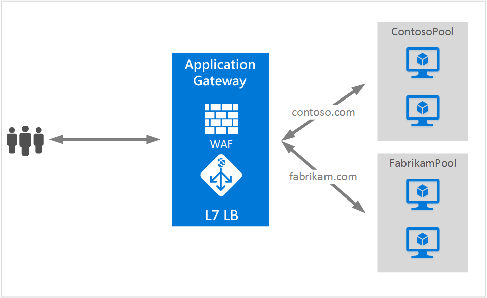

<properties
   pageTitle="在应用程序网关上托管多个站点 | Azure"
   description="此页概述了应用程序网关的多站点支持。"
   documentationCenter="na"
   services="application-gateway"
   authors="amsriva"
   manager="rossort"
   editor="amsriva"/>
<tags
   ms.service="application-gateway"
   ms.devlang="na"
   ms.topic="hero-article"
   ms.tgt_pltfrm="na"
   ms.workload="infrastructure-services"
   ms.date="10/04/2016"
   wacn.date="09/12/2016"
   ms.author="amsriva"/>

# 应用程序网关的多站点托管功能

托管多个站点可以让你在同一应用程序网关实例上配置多个 Web 应用程序。这样可以将多达 20 个网站集中托管到一个应用程序网关中，为部署配置更有效的拓扑。每个网站都可以定向到自己的后端池。在以下示例中，应用程序网关通过两个名为 ContosoServerPool 和 FabrikamServerPool 的后端服务器池来为 contoso.com 和 fabrikam.com 提供流量。

对 http://contoso.com 的请求将路由到 ContosoServerPool，对 http://fabrikam.com 的请求将路由到 FabrikamServerPool。

同样可以将同一父域的两个子域托管到同一应用程序网关部署。此方面的示例可能包括 http://blog.contoso.com 和 http://app.contoso.com，托管在单个应用程序网关部署上。

## 主机标头和服务器名称指示 (SNI)
可以通过三种常用机制在同一基础结构上启用多站点托管功能。

1. 托管多个 Web 应用程序时，每个唯一的 IP 地址可以托管一个应用程序。
2. 使用主机名在同一 IP 地址上托管多个 Web 应用程序。
3. 使用不同的端口在同一 IP 地址上托管多个 Web 应用程序。

目前，应用程序网关通过单个公共 IP 地址来侦听流量。因此，目前不支持使用多个自带 IP 地址的应用程序。应用程序网关支持托管多个应用程序，每个应用程序在不同的端口上进行侦听，但这要求应用程序接受非标准端口上的流量，通常情况下这不是所需的配置。应用程序网关需要使用 HTTP 1.1 主机标头才能在相同的公共 IP 地址和端口上托管多个网站。在应用程序网关上托管的站点也可以通过服务器名称指示 (SNI) TLS 扩展来支持 SSL 卸载。这意味着，客户端浏览器和后端 Web 场必须支持 RFC 6066 中定义的 HTTP/1.1 和 TLS 扩展。

  

## 侦听器配置元素

现有的 HTTPListener 配置元素得到了增强，因此可以支持主机名称和服务器名称指示元素，方便应用程序网关将流量路由到相应的后端池。这是模板文件中 HttpListeners 元素的代码片段。

 		"httpListeners": [
                    {
                        "name": "appGatewayHttpsListener1",
                        "properties": {
                            "FrontendIPConfiguration": {
                                "Id": "/subscriptions/<subid>/resourceGroups/<rgName>/providers/Microsoft.Network/applicationGateways/applicationGateway1/frontendIPConfigurations/DefaultFrontendPublicIP"
                            },
                            "FrontendPort": {
                                "Id": "/subscriptions/<subid>/resourceGroups/<rgName>/providers/Microsoft.Network/applicationGateways/applicationGateway1/frontendPorts/appGatewayFrontendPort443'"
                            },
                            "Protocol": "Https",
                            "SslCertificate": {
                                "Id": "/subscriptions/<subid>/resourceGroups/<rgName>/providers/Microsoft.Network/applicationGateways/applicationGateway1/sslCertificates/appGatewaySslCert1'"
                            },
                            "HostName": "contoso.com",
                            "RequireServerNameIndication": "true"
                        }
                    },
                    {
                        "name": "appGatewayHttpListener2",
                        "properties": {
                            "FrontendIPConfiguration": {
                                "Id": "/subscriptions/<subid>/resourceGroups/<rgName>/providers/Microsoft.Network/applicationGateways/applicationGateway1/frontendIPConfigurations/appGatewayFrontendIP'"
                            },
                            "FrontendPort": {
                                "Id": "/subscriptions/<subid>/resourceGroups/<rgName>/providers/Microsoft.Network/applicationGateways/applicationGateway1/frontendPorts/appGatewayFrontendPort80'"
                            },
                            "Protocol": "Http",
                            "HostName": "fabrikam.com",
                            "RequireServerNameIndication": "false"
                        }
                    }
                ],

	

你可以查看 [ARM template using multiple site hosting](https://github.com/Azure/azure-quickstart-templates/blob/master/201-application-gateway-multihosting)（使用多站点托管的 ARM 模板），了解如何进行端到端的基于模板的部署。

## 路由规则

不需更改路由规则。应继续选择“基本”路由规则，以便将适当的站点侦听器绑定到相应的后端地址池。

	"requestRoutingRules": [
	{
		"name": "<ruleName1>",
		"properties": {
			"RuleType": "Basic",
			"httpListener": {
				"id": "/subscriptions/<subid>/resourceGroups/<rgName>/providers/Microsoft.Network/applicationGateways/applicationGateway1/httpListeners/appGatewayHttpsListener1')]"
			},
			"backendAddressPool": {
				"id": "/subscriptions/<subid>/resourceGroups/<rgName>/providers/Microsoft.Network/applicationGateways/applicationGateway1/backendAddressPools/ContosoServerPool')]"
			},
			"backendHttpSettings": {
				"id": "/subscriptions/<subid>/resourceGroups/<rgName>/providers/Microsoft.Network/applicationGateways/applicationGateway1/backendHttpSettingsCollection/appGatewayBackendHttpSettings')]"
			}
		}

	},
	{
		"name": "<ruleName2>",
		"properties": {
			"RuleType": "Basic",
			"httpListener": {
				"id": "/subscriptions/<subid>/resourceGroups/<rgName>/providers/Microsoft.Network/applicationGateways/applicationGateway1/httpListeners/appGatewayHttpListener2')]"
			},
			"backendAddressPool": {
				"id": "/subscriptions/<subid>/resourceGroups/<rgName>/providers/Microsoft.Network/applicationGateways/applicationGateway1/backendAddressPools/FabrikamServerPool')]"
			},
			"backendHttpSettings": {
				"id": "/subscriptions/<subid>/resourceGroups/<rgName>/providers/Microsoft.Network/applicationGateways/applicationGateway1/backendHttpSettingsCollection/appGatewayBackendHttpSettings')]"
			}
		}

	}
	]
	
## 后续步骤 

了解多站点托管以后，请转到[创建使用多站点托管的应用程序网关](/documentation/articles/application-gateway-create-multisite-azureresourcemanager-powershell/)，以便创建能够支持多个 Web 应用程序的应用程序网关。

<!---HONumber=Mooncake_0905_2016-->