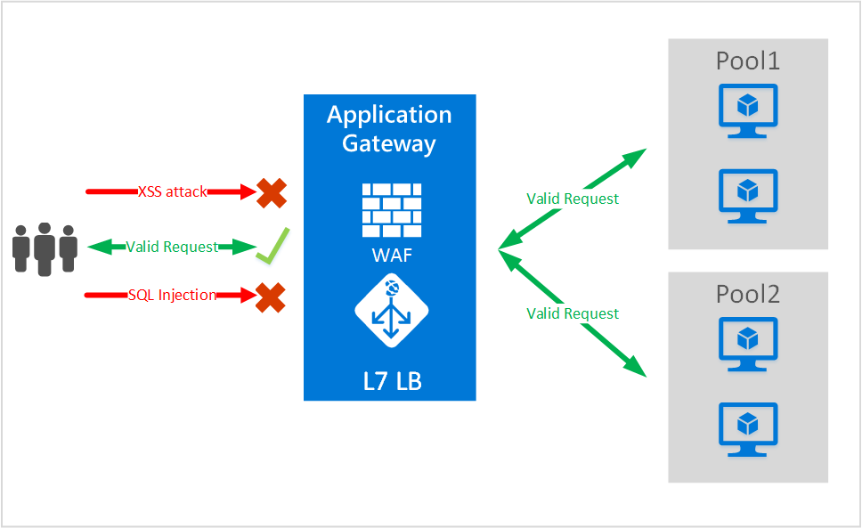

<properties
    pageTitle="适用于应用程序网关的 Web 应用程序防火墙 (WAF) 简介 | Azure"
    description="此页概述适用于应用程序网关的 Web 应用程序防火墙 (WAF) "
    documentationcenter="na"
    services="application-gateway"
    author="amsriva"
    manager="rossort"
    editor="amsriva" />  

<tags
    ms.assetid="04b362bc-6653-4765-86f6-55ee8ec2a0ff"
    ms.service="application-gateway"
    ms.devlang="na"
    ms.topic="hero-article"
    ms.tgt_pltfrm="na"
    ms.workload="infrastructure-services"
    ms.date="12/16/2016"
    wacn.date="01/03/2017"
    ms.author="amsriva" />  

# 应用程序网关 Web 应用程序防火墙（预览版）

Web 应用程序防火墙 (WAF) 是 Azure 应用程序网关的功能，用于保护 Web 应用程序，以便充分利用应用程序网关的应用程序传送控制 (ADC) 标准功能。Web 应用程序防火墙的此功能可以保护 Web 应用程序免受 OWASP 十大常见 Web 漏洞中的大部分漏洞的威胁。Web 应用程序已逐渐成为利用常见已知漏洞的恶意攻击的目标。这些攻击中最常见的攻击包括 SQL 注入攻击、跨站点脚本攻击等。防止应用程序代码遭受此类攻击颇具挑战性，并且可能需要对应用程序拓扑的多个层进行严格的维护、修补和监视。集中式 Web 应用程序防火墙可以防止 Web 攻击，简化安全管理，并可针对入侵威胁为应用程序提供更好的保障。相较保护每个单独的 Web 应用程序，WAF 解决方案还可通过在中央位置修补已知漏洞，更快地响应安全威胁。现有应用程序网关可以轻松地转换为带 Web 应用程序防火墙的应用程序网关。

  

应用程序网关可作为应用程序传送控制器运行，并提供 SSL 终止、基于 cookie 的会话相关性、轮循负载分发、基于内容的路由，以及托管多个网站和安全增强功能的能力。应用程序网关提供的安全增强功能包括 SSL 策略管理、端到端 SSL 支持。我们正在通过引入直接集成到 ADC 产品的 WAF（Web 应用程序防火墙）来加强服务的应用程序安全功能。这提供了易于配置的中央位置，可用于管理和保护 Web 应用程序，使其免受常见 Web 漏洞的威胁。

在应用程序网关配置 WAF 可提供以下好处：

* 无需修改后端代码即可保护 Web 应用程序免受 Web 漏洞和攻击的威胁。
* 在应用程序网关背后同时保护多个 Web 应用程序。应用程序网关支持在单个网关背后托管最多 20 个网站，并保护所有这些网站免受 Web 攻击的威胁。
* 使用应用程序网关 WAF 日志生成的实时报告，针对攻击监视 Web 应用程序。
* 某些合规性控件要求 WAF 解决方案保护所有面向 Internet 的终结点。使用已启用 WAF 的应用程序网关，可以满足这些合规性要求。

## 概述

应用程序网关 WAF 在新的 SKU (WAF SKU) 中提供，已预先配置 ModSecurity 和 OWASP 核心规则集，提供可对抗 OWASP 十大常见 Web 漏洞中的大部分漏洞的基准保护。

* SQL 注入保护
* 跨站点脚本保护
* 常见 Web 攻击保护，例如命令注入、HTTP 请求走私、HTTP 响应拆分和远程文件包含攻击
* 防止 HTTP 协议违反行为
* 防止 HTTP 协议异常行为，例如缺少主机用户代理和接受标头
* 防止自动程序、爬网程序和扫描程序
* 检测常见应用程序配置错误（即 Apache、IIS 等）

## WAF 模式

应用程序网关 WAF 可配置为在以下两种模式中运行：

* **检测模式** - 配置为在检测模式中运行时，应用程序网关 WAF 监视所有威胁警报并记录到日志文件中。需要确保通过“诊断”部分打开应用程序网关的日志记录诊断。还需要确保已选择并打开 WAF 日志。
* **阻止模式** - 配置为在阻止模式中运行时，应用程序网关主动阻止其规则检测到的入侵和攻击。攻击者会收到 403 未授权访问异常，且连接会终止。阻止模式会继续在 WAF 日志中记录此类攻击。

## 应用程序网关 WAF 报告

应用程序网关 WAF 提供有关检测到的每个威胁的详细报告。日志记录与 Azure 诊断日志集成，警报以 JSON 格式记录。

  

    {
        "resourceId": "/SUBSCRIPTIONS/<subscriptionId>/RESOURCEGROUPS/<resourceGroupName>/PROVIDERS/MICROSOFT.NETWORK/APPLICATIONGATEWAYS/<applicationGatewayName>",
        "operationName": "ApplicationGatewayFirewall",
        "time": "2016-09-20T00:40:04.9138513Z",
        "category": "ApplicationGatewayFirewallLog",
        "properties":     {
            "instanceId":"ApplicationGatewayRole_IN_0",
            "clientIp":"108.41.16.164",
            "clientPort":1815,
            "requestUri":"/wavsep/active/RXSS-Detection-Evaluation-POST/",
            "ruleId":"OWASP_973336",
            "message":"XSS Filter - Category 1: Script Tag Vector",
            "action":"Logged",
            "site":"Global",
            "message":"XSS Filter - Category 1: Script Tag Vector",
            "details":{"message":" Warning. Pattern match "(?i)(<script","file":"/owasp_crs/base_rules/modsecurity_crs_41_xss_attacks.conf","line":"14"}}
    }

## 应用程序网关 WAF SKU 定价

在预览期间，使用应用程序网关 WAF 无需支付其他费用。我们会继续按现有基本 SKU 费用收费。公开上市时，我们会告知 WAF SKU 的收费信息。已选择在 WAF SKU 中部署应用程序网关的客户，在公开上市公告后才会开始承担 WAF SKU 费用。

## 后续步骤

深入了解 WAF 的功能后，请参阅[如何在应用程序网关上配置 Web 应用程序防火墙](/documentation/articles/application-gateway-web-application-firewall-portal/)。

<!---HONumber=Mooncake_1226_2016-->