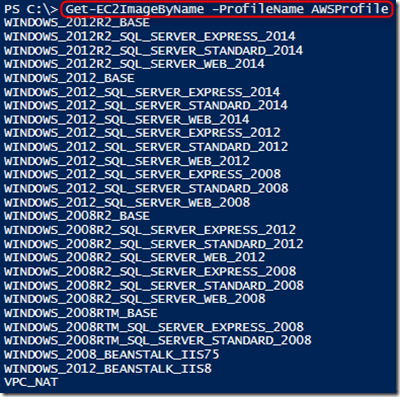

<properties
   pageTitle="Azure 自动化和混合云管理：在 Amazon Web Services 中自动部署 VM"
   description="Azure 自动化和混合云管理：在 Amazon Web Services 中自动部署 VM"
   services="automation"
   documentationCenter=""
   authors="tiander"
   manager="stevenka"
   editor="" />
<tags
   ms.service="automation"
   ms.date="02/01/2016"
   wacn.date="03/22/2016" />

# Azure 自动化和混合云管理：在 Amazon Web Services 中自动部署 VM

在我们的[云巡展](https://microsoftcloudroadshow.com/cities)活动期间，我做了有关 Azure 自动化的演讲，听众提出了许多有关 Azure 自动化是否仅针对 Azure 的问题。幸好我准备了一个演示，这个演示我会在此博客文章中谈到。答案就是，**Azure 自动化不只是针对 Azure 的，它还可以用于本地资源*以及*用于管理混合云环境！** 因此，举例来说，如果你是 Amazon Web Services (AWS) 客户，那么 Azure 自动化也适合你！

## 目标

在本文中，我将介绍如何利用 Azure 自动化来预配 AWS 中的 VM，并为该 VM 提供一个具体的名称 – 这在 AWS 中叫做为 VM“做标记”。

## 假设

在本文中，我假定你已经设置好 Azure 自动化帐户，并且已经有了 AWS 订阅。

有关如何设置 Azure 自动化帐户的详细信息，请查看我们的[文档页面](/documentation/articles/automation-configuring)。

## 准备：存储 AWS 凭据

若要让 Azure 自动化与 AWS 通信，你需要检索 AWS 凭据并在 Azure 自动化中将其存储为资产。

登录 AWS 门户以后，可单击你名称下面的小三角形，然后单击“安全凭据”。

单击“访问密钥”。

复制你的访问密钥和机密访问密钥（也可以下载密钥文件，以便将其存储在某个安全的位置）。

## Azure 自动化中的 AWS 资产

在上一步中，你已复制并保存 AWS **访问密钥 ID** 和**机密访问密钥**。现在，我们需要将其存储在 Azure 自动化中。

导航到你的自动化帐户并选择“资产”>“凭据”，然后添加新凭据并将其命名为“AWScred”。

提供可选性描述，确保在“用户名”字段中输入“访问 ID”，在标为“密码”的字段中输入“机密访问密钥”。保存 AWS 凭据。

## Amazon Web Services PowerShell 模块

我们的 VM 预配 Runbook 将利用 AWS PowerShell 模块来执行其功能。AWS PowerShell 模块随 [PowerShell 库](http://www.powershellgallery.com/packages/AWSPowerShell)一起提供，可以轻松地通过“部署到 Azure 自动化”按钮添加到自动化帐户中。

单击“部署到 Azure 自动化”后，将转到 Azure 登录页。提供凭据后，你会看到以下屏幕。

选择新的或现有的自动化帐户。请注意，现有帐户没有下拉框，因此请确保没有拼写错误，且自动化帐户的区域和资源组是正确的。执行其他步骤以完成配置，然后单击“创建”。

如果你导航到所选自动化帐户，然后导航到“资产”>“模块”，则会看到包含 1427 个活动的 AWS 模块，太棒了！

>[AZURE.NOTE] 将 PowerShell 模块导入 Azure 自动化中包含两个步骤：
>
> 1.  导入模块
> 2.  提取 cmdlet
>
>在模块全部完成 cmdlet 的导入和提取操作（可能需要数分钟）之前，不会显示活动。

## 预配 AWS VM Runbook

现在，我们已满足所有先决条件，因此可以创作 Runbook，以便在 AWS 中预配 VM。我们还会展示如何在 Azure 自动化而非 PowerShell 工作流中利用本机 PowerShell 脚本。

有关本机 PowerShell 和 PowerShell 工作流之间差异的详细信息，可在[此处](https://azure.microsoft.com/blog/announcing-powershell-script-support-azure-automation-2)查找。有关图形 Runbook 创作的信息，可在[此处](https://azure.microsoft.com/blog/azure-automation-graphical-and-textual-runbook-authoring)查找。

我们的 Runbook 的 PowerShell 脚本可以从 [PowerShell 库](https://www.powershellgallery.com/packages/New-AwsVM/DisplayScript)下载。

你可以下载该脚本，只需打开一个 PowerShell 会话，然后键入 **Save-Script -Name New-AwsVM -Path <path>** 即可

保存 PowerShell 脚本以后，即可将其作为 Runbook 添加到 Azure 自动化中，只需执行以下操作即可：

在你的“自动化帐户”下，单击“Runbook”，然后选择“添加 Runbook”。选择“快速创建”（创建新的 Runbook），为 Runbook 提供一个名称，然后在“Runbook 类型”下选择“PowerShell”。然后单击“创建”。

当 Runbook 编辑器打开时，将 PowerShell 脚本复制和粘贴到 Runbook 创作区域。

使用下载的 PowerShell 脚本时，请注意：

-   Runbook 包含许多默认的参数值，如 #ToDo 部分所述。请评估所有默认值，并根据需要进行更新。
-   确保将你的 AWS 凭据保存在名为“AWScred”的“资产”下。
-   你所要使用的区域取决于你的 AWS 订阅。在 AWS 门户（你还在其中查看了安全凭据）中，单击帐户旁边的箭头以验证你的区域。

-   确定需在 Runbook 中提供的[具体区域](http://docs.aws.amazon.com/powershell/latest/userguide/pstools-installing-specifying-region.html)。例如，我的区域是“中国北部(俄勒冈州)”，可转换为 us-west-2。

-   你可以在使用 PowerShell ISE、导入模块、针对 AWS 进行身份验证时获取映像名称的列表，只需将 ISE 环境中的 **Get-AutomationPSCredential** 替换为 **$AwsCred = Get-Credential** 即可。 此时系统会提示你输入凭据，你可以提供“访问密钥 ID”和“机密访问密钥”作为用户名和密码。请查看以下示例：

		#Sample to get the AWS VM available images
		#Please provide the path where you have downloaded the AWS PowerShell module
		Import-Module AWSPowerShell
		$AWSRegion = "us-west-2"
		$AwsCred = Get-Credential
		$AwsAccessKeyId = $AwsCred.UserName
		$AwsSecretKey = $AwsCred.GetNetworkCredential().Password
		
		# Set up the environment to access AWS
		Set-AWSCredentials -AccessKey $AwsAccessKeyId -SecretKey $AwsSecretKey -StoreAs AWSProfile
		Set-DefaultAWSRegion -Region $AWSRegion
		
		Get-EC2ImageByName -ProfileName AWSProfile 

该示例的输出如下：

复制和粘贴自动化变量中你所喜欢的映像名称，正如 Runbook 中作为 **$InstanceType** 变量所引用的那样。由于我使用的是免费的 AWS 层，因此我选择了 Runbook 中的 **t2.micro**。

单击[此处](https://aws.amazon.com/ec2/instance-types)了解有关 Amazon EC2 实例类型的详细信息。

## 测试预配 AWS VM Runbook

预检清单：

-   已创建针对 AWS 进行身份验证的资产并将其命名为 **AWScred**
-   已在 Azure 自动化中导入 AWS PowerShell 模块
-   已创建新的 Runbook 并根据需要验证和更新了参数值
-   已将 Runbook 设置下的“记录详细记录”和“记录进度记录”（后者为可选）设置为“启用”。

请先为新 Runbook 提供 **VMname**。

 

由于已启用“记录详细记录”和“记录进度记录”，因此可以在“所有日志”项下查看输出“流”。

 
让我们登入 AWS：
太棒了！

在本文中，我举例说明了如何使用 Azure 自动化来管理混合云。例如，你可以在 Amazon Web Services 中创建一个 VM，然后通过应用自定义标记为其命名。

很好，终于可以自动执行了，下次再见！

Tiander。

<!---HONumber=Mooncake_0307_2016-->
