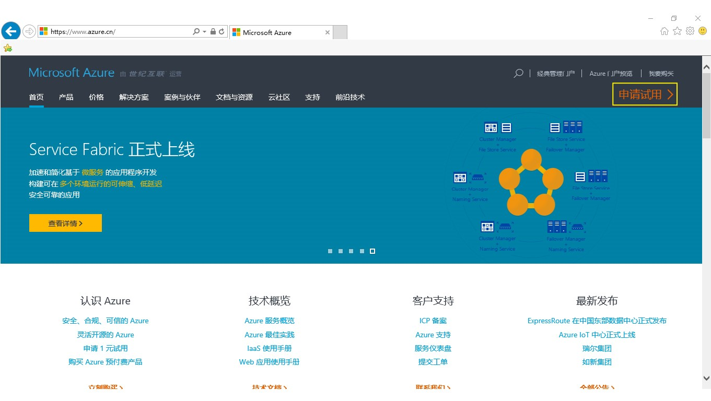
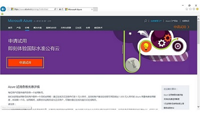
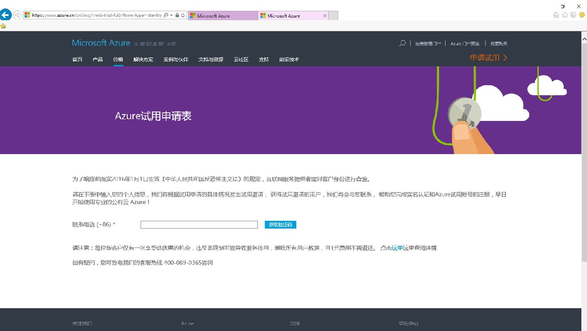
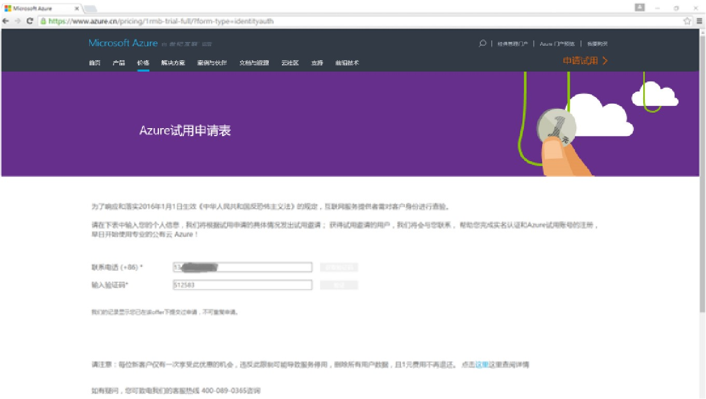
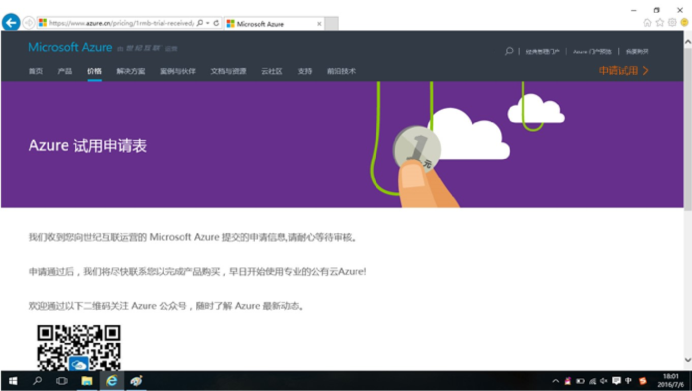
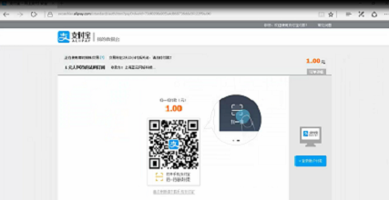
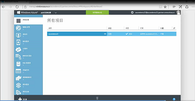
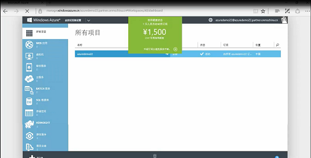
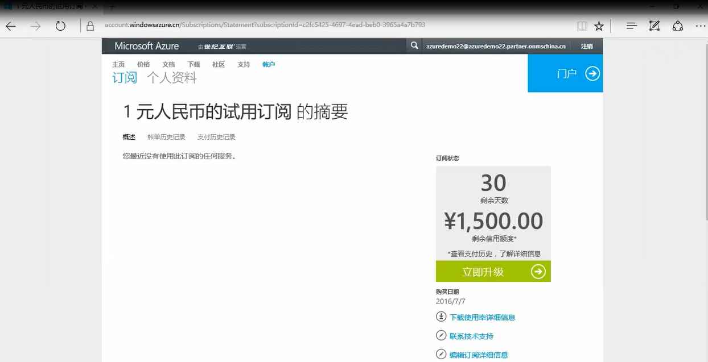
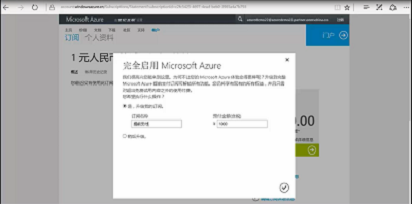

<properties
	pageTitle="Azure 1元试用申请和注册指南"
    description=""
    services=""
    documentationCenter=""
    authors=""
    manager=""
    editor=""
    tags=""/>

<tags ms.service="multiple" ms.date="" wacn.date="07/14/2016" wacn.lang="cn"/>

#Azure 1 元试用申请和注册指南

##流程导航

1. **在 Azure 官网 www.azure.cn ，点击”申请试用“，我们就可以开始申请了。**
 
	  
	

2. **来到 Azure 试用申请表页面，进行简单的手机验证即可进入下一步。**

	  
	
 
	>[AZURE.NOTE]：每位新客户仅有一次享受本优惠的机会。比如同一个付费账户（包括银联及支付宝账户）只能购买一次。

3. **然后来到身份查验页面，你可以根据需要选择“个人申请“或”企业申请”。**

	

4. **快速填写好信息后，就可以“提交”了。**

	  
	

5. **到这里，申请流程已经完成一半，收到世纪互联的邮件通知后快速注册在线支付就可完成了。**

	

6. **恭喜你收到世纪互联的通知邮件，我们来快速完成后续步骤。**

	

7. **通过邮件进入注册页面，填写信息、完成手机验证，然后去付款。**

	

8. **登录账户，输入刚才注册设定的密码。**
 
	

9. **到最后一步了，你可以选择支付宝或银联在线支付。**
 
	

	

10. **支付成功后，系统自动带你来到账户管理页面，通过“查看信用额度状态”可以看到账户的信用额度为 1500 元人民币，现在可以开始使用喽。**

	
	

	试用期间随时可以为账户进行充值续航。
	
	
	
	
 
 
