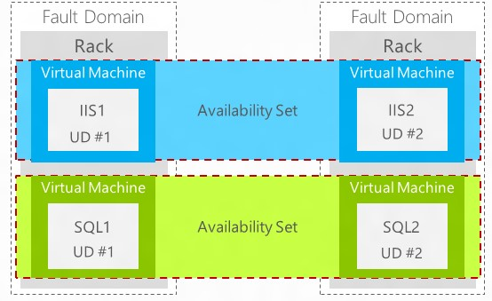

<properties
	pageTitle="Azure IaaS 用户手册 - 第一部分 | Azure"
	description="详细介绍如何创建和管理 Azure 虚拟机。"
	services="virtual-machines-windows"
	documentationCenter=""
	authors="Lei Zhang"
	manager=""
	editor=""/>

<tags
	ms.service="virtual-machines-windows"
	ms.date=""
	wacn.date="07/05/2016"/>

# Azure IaaS 用户手册 - 第一部分

- [Azure IaaS 用户手册 - 第二部分](/documentation/articles/azure-Iaas-user-manual-part2/)
- [Azure IaaS 用户手册 - 第三部分](/documentation/articles/azure-Iaas-user-manual-part3/)

## 

## 

## 1.	Azure IaaS 相关技术
1.	**Azure 底层是否由 System Center 和Hyper-V 构成?**

	Azure 虽然支持 Hyper-V 的 VHD 直接上传至 Azure 云端进行管理，但是 Azure 底层技术是微软自己研发的、独有的技术。如果客户想构建属于自己的私有云平台，可以使用 Azure Stack，采用微软的 System Center + Windows Server 产品，构建自己的私有云平台。

2.	**我是否可以在 Azure 虚拟机中再创建虚拟机呢？**

	Azure 数据中心是由成千上万台 RACK 组成的，每个 RACK 都安装了 Windows Server 2012 的操作系统，称为 Host OS，即物理服务器的操作系统。

	这些 Windows Server 2012 采用特殊版本的 Hyper-V 虚拟化技术，虚拟出了若干虚拟机，称为 Guest OS。

	Host OS 内含一个 Fabric Agent 中控软件，以监控目前虚拟机各项信息给 Fabric Controller。

	Azure 的最终用户只能接触到 Guest OS，而无法接触到 Host OS。用户无法在 Guest OS 中再创建虚拟机。

3.	**如果 Azure 所在的服务器宕机了，Azure 虚拟机怎么恢复？**

	在传统 IDC 机房托管中，如果物理服务器发生了宕机，那所有的虚拟机都会宕机，需要人工或者监控软件来进行重新部署。

	从文件高可用来说，Azure 虚拟机是以 VHD 格式保存的，并且在同一个数据中心做了三重冗余(支持跨数据中心的异地冗余)，保证 Azure 虚拟机底层 VHD 文件的99.9% 服务级别协议。

	从数据中心架构来说，Azure 具有自我管理的功能。Azure Fabric Controller 是管理 Azure 数据中心的中控管理系统，你可以认为他是Azure 数据中心的大脑。Azure Fabric Controller 本身是融合了很多微软系统管理技术的集成，包含对虚拟机的管理 (System Center Virtual Machine Manager)，对作业环境的管理 (System Center Operation Manager)等，在 Fabric Controller 中被发挥得淋漓尽致。

	Azure Fabric Controller 负责自动化的管理数据中心内所有的实体服务器，包含由用户要求的 Azure Guest OS 的部署工作，定时的 Hotfix 修补，机器状态的监控，以及管理不同版本的VM镜像等重要核心工作。Fabric Controller 本身也具有高可用性。

	Fabric Controller 也处理虚拟机的健康管理 (Health Management) 工作，当 Azure Guest OS 发生死机时，会由 Fabric Controller 自动选择不同的实体机器重新部署与启动。

	在单台 Guest OS的 情况下，当 Guest OS 宕机的时候，重新部署与启动 Guest OS 会需要花费一定的时间，会引起客户应用的短暂离线，所以 Azure 没有单个实例的 服务级别协议。

4.	**Azure 有没有单个实例的服务级别协议?**

	Azure 没有单个实例的服务级别协议。例如，客户有一个应用部署在传统 IDC 机房中，一台 AD Server，一台 Web Server，一台 SQL Server。

	在 Azure 虚拟机中，用户也可以选择使用一台 Azure 虚拟机部署 AD Server，一台 Azure 虚拟机部署 Web 应用程序，使用另一台虚拟机部署 SQL Server。但是这样的场景是没有服务级别协议保障的。

	Azure 虚拟机承诺的 99.95% 的服务级别协议是需要 2 台或者 2 台以上的 Azure 虚拟机同时运行，且所有的虚拟机都需要在同一个可用性集中。对于上面实例，用户如果想在 Azure 中实现 99.95% 的服务级别协议，需要同时部署：

	-	两台 AD Server，放在同一个可用性集 A 中。
	-	两台虚拟机部署 Web 应用程序，且 Web 应用程序所在的虚拟机需要放在另外一个可用性集 B 中。
	-	两台虚拟机部署 SQL Server，采用 SQL Server 2012 Enterprise 提供的 Always-On 功能，实现 High Availability。且 SQL Server 所在的虚拟机需要在另外一个可用性集 C 中。

	Azure 没有单个实例的服务级别协议主要原因有以下两点：

	-	从基础设施角度来说，无法预测单台物理服务器的硬件在何时发生故障，即单台物理服务器的 CPU 故障、网络故障、电源故障等是无法预测的。
	-	从物理服务器的维护来说。世纪互联在每个月都会给 Azure 虚拟机做升级和维护，维护期一般是在周五凌晨和周六凌晨(北京、上海数据中心分别维护)。维护期窗口一般为 6-8 小时左右，在维护期内的虚拟机实例都会被重启，重启时间一般在 10 分钟左右。

		该维护期是由世纪互联定义的，用户没有办法拒绝维护过程，用户也没办法指定世纪互联在具体哪个时间点，维护哪些虚拟机。在维护期窗口内，任何一台 Azure 虚拟机都会被重启。但是只会影响单个实例的 Azure 虚拟机。不会影响两个或者两个以上的实例(需要正确配置可用性集)。

5.	**世纪互联在维护 Azure 虚拟机时会不会影响我的业务？世纪互联是如何来保证 99.95% 的服务级别协议的?**

	Azure 虚拟机承诺的 99.95% 的服务级别协议是需要 2 台或者 2 台以上的 Azure 虚拟机同时运行，且所有的虚拟机都需要在同一个可用性集中。

	在这种情况下，从基础设施角度来说，有机制可以保证同时运行的 2 台 Azure 虚拟机不会同时宕机。

	从物理服务器的维护来说。在给 Azure 虚拟机做维护的时候，会监控到这 2 台 Azure 虚拟机在同一个可用性集中，就知道客户需要这 2 台 Azure 虚拟机做高可用。在重启 Azure 虚拟机的时候，就不会同时重启。而是先重启其中的一台，等到这台虚拟机重启完毕后，再重启另外一台。这样保证在维护期窗口内，同一个时刻至少有一台虚拟机在线。

	如果客户部署了 2 台 Azure 虚拟机但是没有设置可用性集。在给 Azure 虚拟机做维护的时候，发现这 2 台 Azure 虚拟机没有关联，就会同时重启这 2 台 Azure 虚拟机，造成服务 off-line。

6.	**什么是可用性集?**

	这里有两个非常重要的概念：故障域 (Fault Domain) 和更新域 (Update Domain)。可以参考[这篇博客](https://blogs.technet.microsoft.com/yungchou/2013/05/14/window-azure-fault-domain-and-upgrade-domain-explained-explained-reprised/)了解详情。

	
 
	关于故障域，就如书房有一个插线板，插线板上接了笔记本电脑，手机充电器，电视机等电器。如果这个插线板断电了，那这个插线板上的所有电器都会断电。这个插线板和上面的电器组成了一个故障域。

	Azure 数据中心基础设施由很多的 RACK 组成，每一个 RACK 都被称为故障域。当 RACK 出现硬件故障时，在 RACK 上的服务，不管是 Azure 的计算服务、存储服务等都会发生问题。

	当客户部署了 2 台 Azure 虚拟机，但是没有设置可用性集的时候，Azure 可能会把这 2 个 Azure 虚拟机部署在同一个 RACK 上，这样就可能会出现单点故障。因为这 1 个 RACK 宕机了，上面运行的 2 个 Azure 虚拟机都会宕机。两个 Azure 虚拟机宕机的概率和一个 Azure 虚拟机的概率是一样的。

	而设置了可用性集的情况下，Azure 就会把这 2 台 Azure 虚拟机部署在 2 个不同的 RACK 上。Azure 从数据中心底层设计上，可以保证这 2 个不同的 RACK 不会同时宕机。

	关于更新域，比如有 2 台 Azure 虚拟机做了负载均衡，名称为 VM1 和 VM2，都部署了 Web Application，版本为1.0，并部署在不同的更新域 Update Domain 中。将来一旦软件版本做了更新，升级到了 2.0 版本，就有以下两种选择：

	- (1) 用户同时更新这 2 台 Azure 虚拟机的软件版本。这时如果有客户端发起请求，会造成服务器端的无法响应。
	- (2) Azure Fabric Controller 监控这 2 台 Azure 虚拟机。首先更新 Update Domain 0 中的虚拟机软件。更新完毕后再更新 Update Domain 1 中的虚拟机软件，一直到所有的 Azure 虚拟机中的 Web 应用程序更新完毕，这样保证在同一时刻至少有 1 台 Azure 虚拟机能够响应客户端的请求。

	以下是故障域 (Fault Domain) 和更新域 (Update Domain) 的截图：
 
	

	以下是虚拟机可用性集的截图：
	
	

7.	**Azure 如何保证 CPU、内存、硬盘的性能?**

	传统的 Hyper-V 技术，CPU 是共享的。比如您的 ThinkPad T430S 是 4Core/8GB，安装了 Windows Server 2012 R2 操作系统，并且使用 Hyper-V 虚拟出 3 台虚拟机。那该笔记本的物理操作系统 + 3 台虚拟机操作系统本质上都是共享 4Core CPU 的。

	在 Azure 提供的虚拟机分为 A 系列和，D 系列和 Dv2 系列。以 A 系列举例：

	<table border="1">
	<thead>
	<tr>
	<th>虚拟机类型</th>			<th>CPU</th>	<th>RAM</th>	<th>外挂磁盘数</th>	<th>MAX IOPS</th>
	</tr>
	</thead>
	<tbody>
	<tr>
	<td>Extra Small (A0)</td>	<td>共享</td>	<td>768MB</td>	<td>1</td>			<td>500</td>
	</tr>
	<tr>
	<td>Small (A1)</td>			<td>1</td>		<td>1.75GB</td>	<td>2</td>			<td>2 X 500</td>
	</tr>
	<tr>
	<td>Medium (A2)</td>		<td>2</td>		<td>3.5GB</td>	<td>4</td>			<td>4 X 500</td>
	</tr>
	<tr>
	<td>Large (A3)</td>			<td>4</td>		<td>7GB</td>	<td>8</td>			<td>8 X 500</td>
	</tr>
	<tr>
	<td>Extra Large (A4)</td>	<td>8</td>		<td>14GB</td>	<td>16</td>			<td>16 X 500</td>
	</tr>
	<tr>
	<td>A5</td>					<td>2</td>		<td>14GB</td>	<td>4</td>			<td>4 X 500</td>
	</tr>
	<tr>
	<td>A6</td>					<td>4</td>		<td>28GB</td>	<td>8</td>			<td>8 X 500</td>
	</tr>
	<tr>
	<td>A7</td>					<td>8</td>		<td>56GB</td>	<td>16</td>			<td>16 X 500</td>
	</tr>
	</tbody>
	</table>

	除了 A0 的虚拟机类型，CPU 是和别的用户共享的。其他类型的虚拟机，比如 A1-A7，CPU 是独占的，不是和别的用户共享的。比如物理服务器是 20Core，那这个物理服务器只能虚拟出 2 台 A7 的 Azure 虚拟机(8Core/56GB)，另外多余的 4Core 要预留给物理服务器。

	关于硬盘的性能保证，Azure 是保证磁盘的 IOPS。

	注意：Azure 虚拟机 CPU 和 RAM 是固定搭配的，不可以按照用户的想法随意更改。

## 2.	Azure IaaS 相关服务
### 2.1 Azure 虚拟机的带宽问题
Azure 虚拟机的带宽问题请参考[这篇博客](http://www.cnblogs.com/threestone/p/4497625.html)。

### 2.2 Azure 虚拟网络 (Azure Virtual Network)
Azure 虚拟网络，其主要作用有以下几点：

1.	**将多台 Azure 虚拟机整合在统一网段或者子网里**

	Azure 虚拟机具有两个 IP 地址，Public IP (VIP，其实是负载均衡器的 IP 地址，近似认为是公网 IP) 和 Private IP。
	
	Public IP 是公网 IP，Azure China 的公网 IP 段请参考[这里](http://www.microsoft.com/en-us/download/details.aspx?id=42064)。

	Private IP 是内网 IP，Azure 数据中心的基础架构是非常强大的，通过 Private IP 可以实现数据中心内网的快速通信。

	在没有 Azure 虚拟网络的情况下，多台 Azure 虚拟机想通过 Private IP 进行通信是不可能的，因为 Azure 从安全性考虑， VM 与 VM 之间的 VLAN 是做了隔离的。

	一般企业级的应用，都会有多台服务器来实现复杂的业务逻辑。比如一般 B/S 应用需要 Web Server，SQL Server 等。通过 Azure 虚拟机实现 Web Server 与 SQL Server，并且放在同一个虚拟网络里，就可以实现多台 Azure 虚拟机通过 Private IP 来互相通信。

2.	**固定内网 IP 地址 (Private IP)**

	在某些情况下，需要对 Azure 虚拟机固定内网IP地址，比如 AD 服务器，比如 Windows Server Cluster 集群，都需要依赖固定内网 IP 地址。这时候也需要使用 Azure 虚拟网络。

### 2.3 Azure 存储服务
Azure 存储服务是云端的文件存储服务，简单理解是用户可以将本地的文件、图片、照片、虚拟机的 VHD (虚拟磁盘)等二进制文件保存在云端的存储服务中。

在传统的 IDC 数据中心，存储是某个机器名、或者保存在某个服务器的某个磁盘下，或者是某个存储的网络位置。

在 Azure 存储服务，其实是一个 http / https 的网络路径，可以进行权限控制。Azure 存储服务并不依赖于任何一个 IP 地址或者主机。

#### 2.3.1 Azure 存储服务的冗余
在传统数据中心是通过使用 RAID 技术等来实现存储的冗余。

Azure 存储服务本身提供 99.9% 的服务级别协议，它提供三种高冗余方式:

1.	**本地数据中心的三重冗余 (Local Redundant Storage, LRS)。**客户可以选择将存储服务在同一个数据中心做三重冗余，比如在上海的数据中心做三重冗余。任意一个保存在上海存储服务的文件，都有一个主文件和二个子副本。

	比如客户上传了 10 GB 文件，其实 Azure 存储服务在同一个数据中心保存了 30GB。但是 Azure 收费只会收取用户实际上传的 10GB 费用。

	对于 LRS 来说，事务在同一个数据中心的三重冗余是同步执行的。

2.	**跨数据中心的三重冗余 (Geo Redundant Storage, GRS)。**Azure 在所有地区的数据中心建设都是成对的，比如北京数据中心和上海数据中心。这是因为 Auzre 充分考虑了异地冗余的能力。在北京和上海数据中心之间会有专线连接，这个专线是内网数据中心之前数据同步专用的。

	比如用户在上海数据中心 (主要位置) 创建了存储账号，并且开启了跨数据中心同步的能力。则上海数据中心是主节点，北京数据中心是备份节点。当用户往上海数据中心上传 10GB 文件，该文件不仅在上海数据中心做了三重冗余，在北京的数据中心 (辅助位置) 也会做三重冗余，文件一共做了六重冗余。即使上海数据中心因为地震、战争、洪水完全被摧毁了，用户的数据还是安全的保存在北京的数据中心，文件真正做到了万无一失。

	在 GRS 情况下，对于上海数据中心来说，事务在同一个数据中心的三重冗余是同步执行的。对于北京数据中心来说，事务是异步从上海发送到北京的数据中心。

	下表显示了当前的主要位置和辅助位置配对：

	<table border="1">
	<thead>
	<tr>
	<th>主要位置</th>	<th>辅助位置</th>
	</tr>
	</thead>
	<tbody>
	<tr>
	<td>中国东部</td>	<td>中国北部</td>
	</tr>
	<tr>
	<td>中国北部</td>	<td>中国东部</td>
	</tr>
	</tbody>
	</table>

3.	**读取访问地域冗余 (Read Access – Geo Redundant Storage, RA-GRS)**

	如果用户在上海数据中心 (主要位置) 创建了存储账号，并且开启了 RA-GRS，事务就会异步的复制到北京的数据中心。RA-GRS 提供了对复制到北京数据中心 (辅助位置) 的 "只读" 访问权，实现对存储账户的更高读取可用性。

	请注意：
	- **(1)	跨数据中心的三重冗余 (Geo Redundant Storage, GRS) 情况下，备份节点的数据是不可读的。**
	- **(2)	读取访问地域冗余 (Read Access – Geo Redundant Storage, RA-GRS) 情况下，备份节点的数据是可读的。**

	这样用户可以指定对于 Azure 存储的访问是指向上海数据中心 (主要位置），还是北京数据中心 (辅助位置) ，提高读取的高可用性。

	启用该功能后，在主要区域无法读取数据时，可使用辅助位置读取更高可用性。该功能为 "选择使用"，要求存储账户进行跨地域冗余复制。

	假设您在上海数据中心 (主要位置) 创建了 Azure Storage，Storage Name 为 leizhangstorage，并且开启了**读取访问地域冗余 (Read Access – Geo Redundant Storage, RA-GRS)。**
	- (1)	我就可以通过 http://<accountname>.blob.core.chinacloudapi.cn 访问主要位置的 Azure 存储帐户。
	- (2)	然后还可以通过 http://<accountname>-secondary.blob.core.chinacloudapi.cn 访问辅助位置的 Azure 存储帐户
	- (3)	在发生上海数据中心 (主要位置) 无法读取数据的时候，可以使用辅助位置的数据读取来提供高可用性。

#### 2.3.2 Azure存储服务的类型
Azure存储服务提供四种不同类型的存储服务: Blob, 表, 队列和文件。

##### 2.3.2.1 Blob
Blob 就是保存大型二进制对象，比如用来存储文件、图片、文档等二进制格式的文件。

Blob 分为两种类型:

1.	Block Blob （块 Blob）。这种类型适合存储二进制文件，支持断点续传，可以最大以 4M 为一个区块单位，单一文件最大可以存储 200GB，且区块不会连续存储，可能会在不同的存储服务器分块存放。为了适应文件的上传和下载而专门进行了优化。

	Block Blob 可以通过 2 种方式创建。不超过 64MB 的 Block Blobs 可以通过调用 PutBlob 操作进行上传。大于 64M 的 Block Blobs 必须分块上传，且每块的大小不能超过 4MB。

	Block Blob 可以近似理解为网盘。

2.	Page Blob （页 Blob)。这类存储优化了随机访问。它会在存储区中划分一个连续的区域供应用程序存放数据，可以用来存放 VHD，单一文件最大可以存储1TB。

Blob 服务由 Blob 本身以及其收纳容器 (Container) 构成，容器可以视为一般本机上的文件夹。

你可以通过 REST API 来访问 Blob

	http://<accountname>.blob.core.chinacloudapi.cn/<containername>/<blobname>

accountname 表示哪个 Azure 存储账号下的资源，是全局唯一的。

blob.core.chinacloudapi.cn 表示 azure china blob 存储资源，是固定的。

containername 表示容器的名字，可以认为是访问某一文件夹下的资源

blobname 表示要访问的资源名称，可以认为是一个 mp3 文件，或者是一个 jpg 文件。

举例说明：

保存在 leizhangstorage 存储账号下，containername 为 photo，blobname 为 myphoto.jpg。则这个 URL 地址为：

	http://leizhangstorage.blob.core.chinacloudapi.cn/photo/myphoto.jpg

保存在 leizhangstorage 存储账号下，containername 为 vhd，blobname 为 myvm.vhd。则这个 URL 地址为：

	http://leizhangstorage.blob.core.chinacloudapi.cn/vhd/myvm.vhd

Container 的命名规则:

1.	containername 只能是一级目录，没有办法在 containername 下再设置下一级别 containername
2.	必须以英文或数字开头，且名称内只能有英文、数字及 dash(-)
3.	不能以 dash(-) 开头或结尾，dash(-) 不能连续出现
4.	所有英文的字符必须是小写
5.	长度为 3-63 之间

Blob 的命名规则：

1.	除了 url 的保留字符以外，其他的字符组合都可以使用
2.	长度为 1-1024 个字符
3.	尽量避免以 dot(.) 或者是 forward slash(/) 结尾。否则会造成 Blob Service 误判。

##### 2.3.2.2 队列
队列，是一种先到先得的服务 (First-Come, First-Serve)，或者称为 FIFO (先入先出)的存储服务。队列可以是字符串或者是最长 64KB 的二进制数据。

在 Azure PaaS 中有一个非常重要的概念叫 Web Role/Worker Role。队列作为 Web Role/Worker Role 沟通的重要的桥梁。

有关 Azure PaaS 平台的 Web Role/Worker Role 的内容，请参考[这篇博客](http://www.cnblogs.com/threestone/p/4201065.html)。

##### 2.3.2.3 表
这里的 Azure 存储表是非关系型数据表，不能与 SQL Server 的表相混淆。用户可以近似认为 Azure 存储表是 NoSQL。

Azure 表中的每一行记录就是一个 Entity，单个 Entity 的最大容量是1M。

Azure 表中表的所有记录最大容量是 200TB，每个 Azure 表都必须有 Partition Key 和 Row Key。Azure 表属性最多有 255 个。

Partition Key 的值可以设置记录的物理位置。在 Azure 表中的 2 条数据，如果 Partition Key 值相同，则表示这 2 条数据存储的物理位置是相同的；如果 Partition Key 不同，则表示这 2 条数据可能存储在同一台物理介质上，或者不同的 2 台物理介质上。如下图:

表使用的场景，比较适合于日志文件存储，或者是需要非关系型数据库的场景。

##### 2.3.2.4 文件 
基于 SMB2.1 的 Azure 存储服务。可以在虚拟机里设置共享文件夹。

具体请参考[这篇博客](http://www.cnblogs.com/threestone/p/4441388.html)。

### 2.4 Azure 虚拟机
#### 2.4.1 Azure 虚拟机操作系统
Azure 虚拟机在创建的过程中，都需要用户选择操作系统的版本。创建完的虚拟机默认都安装好了操作系统。

Azure 官方支持的操作系统为：

1.	Windows : Server 2008 R2, Server 2012, Server 2012 R2
2.	SQL Server：SQL Server 2008 R2, SQL Server 2012 SP1, SQL Server 2014 RTM  (Web, Standard, Enterprise)
3.      Linux : 

   (1).	Ubuntu (12.04 LTS, 12.10, 13.10, 14.04 LTS),
   (2).	CentOS (6.5, 6.6, 7.0, 7.1), 
   (3).	SUSE (OpenSUSE 13.3, 13.2 SUSE Linux Enterprise Server 11 SP3, Server 12)

其他非 Azure 提供的虚拟机模板，比如 RedHat 或者红旗 Linux。客户可以自己在本地使用 Hyper-V 进行创建，然后上传至 Azure 云端，但是如果这个虚拟机出现问题，就没有办法获得官方的支持。

#### 2.4.2 Azure 虚拟机类型
Azure 提供不同大小的计算能力，Azure 目前支持的虚拟机类型为 A 系列， D 系列和 Dv2 系列。

注意：Azure 虚拟机 CPU 和 RAM 是固定搭配的，不可以按照用户的想法随意更改。

##### 2.4.2.1 A 系列虚拟机
A系列虚拟机的类型如下：

<table border="1">
<thead>
<tr>
<th>虚拟机类型</th>	<th>CPU</th>	<th>内存</th>		<th>外挂磁盘数</th>	<th>IOPS</th>
</tr>
</thead>
<tbody>
<tr>
<td>A0</td>			<td>共享</td>	<td>768 MB</td>		<td>1</td>			<td>500</td>
</tr>
<tr>
<td>A1</td>			<td>1</td>		<td>1.75 GB</td>	<td>2</td>			<td>2 * 500</td>
</tr>
<tr>
<td>A2</td>			<td>2</td>		<td>3.5GB</td>		<td>4</td>			<td>4 * 500</td>
</tr>
<tr>
<td>A3</td>			<td>4</td>		<td>7 GB</td>		<td>8</td>			<td>8 * 500</td>
</tr>
<tr>
<td>A4</td>			<td>8</td>		<td>14 GB</td>		<td>16</td>			<td>16 * 500</td>
</tr>
<tr>
<td>A5</td>			<td>2</td>		<td>14 GB</td>		<td>4</td>			<td>4 * 500</td>
</tr>
<tr>
<td>A6</td>			<td>4</td>		<td>28 GB</td>		<td>8</td>			<td>8 * 500</td>
</tr>
<tr>
<td>A7</td>			<td>8</td>		<td>56 GB</td>		<td>16</td>			<td>16 * 500</td>
</tr>
</tbody>
</table>

除了 A0 的虚拟机类型，CPU 是和别的用户共享的。其他类型的虚拟机，比如 A1-A7，CPU 是独占的，不是和别的用户共享的。

举例来说，A 系列虚拟机单个节点支持的最大计算能力为 A7，即 8Core/56GB 的计算能力。可以外挂 16 块磁盘，每块磁盘的最大容量为 1TB，即外挂 16TB 的存储。支持的最大的 IOPS 为 16*500=8000

##### 2.4.2.2 D 系列虚拟机
D 系列虚拟机的类型如下：

<table border="1">
<thead>
<tr>
<th>虚拟机类型</th>	<th>CPU</th>	<th>内存</th>	<th>临时磁盘</th>	<th>外挂磁盘数</th>	<th>IOPS</th>
</tr>
</thead>
<tbody>
<tr>
<td>D1</td>			<td>1</td>		<td>3.5 GB</td>	<td>50 GB</td>		<td>2</td>			<td>2 * 500</td>
</tr>
<tr>
<td>D2</td>			<td>2</td>		<td>7 GB</td>	<td>100 GB</td>		<td>4</td>			<td>4 * 500</td>
</tr>
<tr>
<td>D3</td>			<td>4</td>		<td>14 GB</td>	<td>200 GB</td>		<td>8</td>			<td>8 * 500</td>
</tr>
<tr>
<td>D4</td>			<td>8</td>		<td>28 GB</td>	<td>400 GB</td>		<td>16</td>			<td>16 * 500</td>
</tr>
<tr>
<td>D11</td>		<td>2</td>		<td>14 GB</td>	<td>100 GB</td>		<td>4</td>			<td>4 * 500</td>
</tr>
<tr>
<td>D12</td>		<td>4</td>		<td>28 GB</td>	<td>200 GB</td>		<td>8</td>			<td>8 * 500</td>
</tr>
<tr>
<td>D13</td>		<td>8</td>		<td>56 GB</td>	<td>400 GB</td>		<td>16</td>			<td>16 * 500</td>
</tr>
<tr>
<td>D14</td>		<td>16</td>		<td>112 GB</td>	<td>800 GB</td>		<td>32</td>			<td>32 * 500</td>
</tr>
</tbody>
</table>

相比 A 系列的 Azure 虚拟机，D 系列的优势在于：

1.	**单台 VM 的 CPU Core 更多**

	相比 A 系列单台 VM 最大 8Core/56GB RAM 的配置，D 系列虚拟机单台最大的配置为 16Core/112GB RAM

2.	**D 系列的 CPU 性能比 A 系列提升约 60%**

	Azure A 系列的虚拟机，Intel E5 的 CPU 是经过调试的，性能是人为降低的。

	因为 Azure 数据中心在建设的时候，有 AMD 的 CPU 和 Intel 的 CPU，为了让 Intel CPU 性能和 AMD CPU 性能接近，保证运算能力的一致性，人为降低了 Intel CPU 的计算能力。

	所以各位如果用 Super PI 等测试 A 系列的虚拟机，会发现性能与物理机是有差距的。

	D 系列虚拟机，是 100% 体现 Intel E5 的处理能力，CPU 性能比 A 系列提升 60%。

3.	**新增本地临时 SSD 存储**

	注意是临时存储，这个存储在 Windows 里显示为 D 盘，在 Linux 系统里是 /dev/sdb1

	优点: IOPS 高；缺点：非持久化存储，文件会有丢失的风险，不能保留重要的文件。

4.	**更大的本地临时磁盘**

	如上面的表格所示，本地的临时磁盘最大为 800G。

##### 2.4.2.3 DS 系列虚拟机
不管是 A 系列 VM 还是 D 系列的 VM。本地持久化磁盘都是 SAS 盘，IOPS 是每块盘 500。

如果对于磁盘的性能要求更高，可以使用 DS 系列的 VM，DS 系列虚拟机的 CPU/RAM 配置和 D 系列虚拟机一致，不同之处在于 DS 系列虚拟机 的本地持久化磁盘是 SSD 的，可以提供更高的磁盘 IOPS 性能。

<table border="1">
<thead>
<tr>
<th>虚拟机类型</th>		<th>CPU</th>	<th>内存</th>	<th>最大IOPS</th>	<th>最大磁盘吞吐量</th>
</tr>
</thead>
<tbody>
<tr>
<td>Standard_DS1</td>	<td>1</td>		<td>3.5 GB</td>	<td>3200</td>		<td>32 MB/S</td>
</tr>
<tr>
<td>Standard_DS2</td>	<td>2</td>		<td>7 GB</td>	<td>6400</td>		<td>64 MB/S</td>
</tr>
<tr>
<td>Standard_DS3</td>	<td>4</td>		<td>14 GB</td>	<td>12800</td>		<td>128 MB/S</td>
</tr>
<tr>
<td>Standard_DS4</td>	<td>8</td>		<td>28 GB</td>	<td>25600</td>		<td>256 MB/S</td>
</tr>
<tr>
<td>Standard_DS11</td>	<td>2</td>		<td>14 GB</td>	<td>6400</td>		<td>64 MB/S</td>
</tr>
<tr>
<td>Standard_DS12</td>	<td>4</td>		<td>28 GB</td>	<td>12800</td>		<td>128 MB/S</td>
</tr>
<tr>
<td>Standard_DS13</td>	<td>8</td>		<td>56 GB</td>	<td>25600</td>		<td>256 MB/S</td>
</tr>
<tr>
<td>Standard_DS14</td>	<td>16</td>		<td>112 GB</td>	<td>50000</td>		<td>512 MB/S</td>
</tr>
</tbody>
</table>

##### 2.4.2.4 修改 Azure 虚拟机配置
用户可以根据实际需求，设置 Azure 虚拟机的配置，比如对于 Web Server 设置为 A7(8Core/56GB)；MySQL VM 设置为 DS14 VM，本地的 SSD 磁盘吞吐量更高。

同时 Azure VM 配置是可以动态调整的，比如在开发测试阶段，可以按照最高标准的 Azure VM 来进行配置。

等待项目上线以后，如果业务需求并没有预期的那么高，可以将单台 Azure VM 的配置向下调整。这样每台 Azure VM 的每分钟单价会更加便宜，价格是动态调整的。

> [AZURE.NOTE]
> Azure 的数据中心建设是有先后顺序的，最早落地的是 A 系列的虚拟机，然后是 D 系列和 DS 系列的虚拟机。在一般情况下，客户在修改虚拟机配置大小的时候，会出现以下情况：

> - 已经创建的 A 系列的虚拟机，无法升级到 D 系列的虚拟机

> 这是由于在创建 A 系列的虚拟机的时候，虚拟机创建在老的 Compute Cluster 上，而不是新的 Compute Cluster 上。

> 遇到这种情况，只能把 DNS 删除，保留虚拟机的 VHD 并重新创建 Azure VM。这会产生虚拟机的临时下线。

> 从可配置的角度来说，建议用户在刚开始创建 Azure 虚拟机的时候，直接设置虚拟机配置为 D 系列。这样可以在 D 系列 VM 和 A 系列 VM 来回切换。

##### 2.4.2.5 标准类型 vs 基本类型
在创建 Azure 虚拟机的时候，虚拟机类型分为两种：基本和标准。如下图：

基本类型的虚拟机有以下特点：

1.	减少了部分功能：新的基本类型的虚拟机不包含负载均衡和自动扩展功能
2.	比较适合不需要上述功能的，单实例的应用程序，比如：开发用虚拟机、测试服务器等等
3.	价格比标准类型的虚拟机要便宜。

如果用户需要使用多台虚拟机，设置负载均衡器，请使用标准类型的虚拟机。

如果用户需要用一台机器做开发测试，请使用基本类型的虚拟机。

### 2.5 Azure 成本分析

除了在 [Azure 中国官网](https://www.azure.cn/)上直接购买[预付费产品](https://www.azure.cn/pricing/pia/)外，我们还有面向企业级的销售方式，需要客户预付费人民币 15 万元 (不含税) 。**这并不是指客户预付费后，可以任意使用 Azure 云计算平台上的任意资源。**

例如，客户购买 Azure 服务，类似于购买了电话费套餐。在承诺每年最低消费 15 万元的基础上，根据用户使用 Azure 提供的不同的服务(比如话费按分钟计费，流量按 GB 收费，短信按每条收费等)，从客户预付费的 15 万元里进行扣费。

如果客户实际使用的费用，接近或超过了预付的 15 万元。世纪互联会提前通知客户，进行充值。

客户要承诺每年至少消费 15 万元，且余额在年底不会返还给客户。

#### 2.5.1 虚拟网络成本分析
虚拟网络默认是不收费的

如果客户需要使用虚拟网路的 VPN 网关，则 VPN 网关需要按照小时收取费用。

#### 2.5.2 存储服务成本
##### 2.5.2.1 普通存储
对于 A 系列和 D 系列的虚拟机来说，使用的是普通存储。

普通存储的存储资源，是按照每 GB 每月计费的。Azure 普通存储资源是用多少算多少，且按照平均使用计算。

可参考[这篇博客](http://blogs.msdn.com/b/windowsazurestorage/archive/2010/07/09/understanding-windows-azure-storage-billing-bandwidth-transactions-and-capacity.aspx?PageIndex=2#comments)。

"关于容量。目前我们每天对每个储存账户至少进行一次取样，在下次取样前，本次取样所得的容量值将代表其每小时的容量。我们将这些样本进行汇总并得出每月平均值，以计算收费容量。"

如果用户在 1 月 1 日使用了 10GB 存储，在 1 月 2 日完全删除了该存储。整个 1 月，Azure 实际需要支付的费用 = 10GB * 每月单价/31 天。

例如某客户使用的 A2 虚拟机 (2Core/3.5GB)，可以挂载 4 块磁盘 (按上面的表格，每块磁盘最大 1TB，总计 4TB)。则收取的存储总费用有以下几点:

1.	虚拟机操作系统的文件，对于 Windows 平台，C 盘系统盘容量 127GB，操作系统实际使用 30GB。只收取实际使用的 30GB 存储。这部分费用是必须支付的，因为虚拟机必须有操作系统文件才可以运行。
2.	挂载的 4 块磁盘，每块磁盘最大容量为 1TB，总计为 4TB。假设客户只使用 4TB 其中的 500GB。则只收取客户实际使用的 500GB存储。
3.	每月总的存储费用 = C 盘实际使用的存储的费用 (10GB)+ 挂载磁盘的实际存储费用 (500G)，即 510GB * 每 GB/月费用

##### 2.5.2.2 高级存储
对于 DS 系列的虚拟机来说，使用的是高级存储。

#### 2.5.3 虚拟机成本
虚拟机是按照分钟计费的，计费的单价为每小时。从单价来说，价格如下：

1.	Linux 操作系统最便宜
2.	Windows Server 操作系统比 Linux 操作系统要贵一些

	在同样操作系统情况下，虚拟机计算能力越强，小时价格越贵。比如虚拟机类型为 A7 一定比 A1 贵。(具体的单价请联系 Azure 销售代表或参考 Azure [官方文档](/pricing/overview)。

3.	预装了 SQL Server 数据库的 Windows Server 虚拟机最贵 (因为需要 Windows Server License + SQL Server License)，Azure 把一次性购买 SQL Server License 的费用平摊到 Azure 计算的小时费用中了。

	* a)	根据 SQL Server 数据库的不同版本，价格依次递增 (Web版, 标准版, 企业版)，企业版价格最贵。
	* b)	预装了 SQL Server 2012 数据库的 Windows Server 虚拟机价格因素由以下几方面构成：
	* c)	虚拟机类型：A0 - A7，计算能力越强越贵，A7 最贵。
	* d)	数据库版本：Web版, 标准版, 企业版
	* e)	例如，虚拟机类型为 A7，且安装了 SQL Server 企业版的虚拟机价格最贵。
	* f)	如果客户已经采购了 on-premise 的 SQL Server 的 SA 服务，客户可以选择只使用 Windows Server VM，然后在 VM 安装 SQL Server License，可以把本地的 License 移动到云端，即 License Mobility。这样 Azure 只会收取 Windows Server 的小时费用，而不会收取 SQL Server License 的小时费用。

虚拟机运行的时候就收费计算费用。关闭虚拟机后，不收取计算费用。

举例来说，某个券商采用了 Azure 的公有云服务，在 9：30 开市的高峰期时使用 300 台虚拟机进行运算，一直运行到下午 15：30 休市。休市后的非高峰期关闭其中的280台，使用剩余的 20 台虚拟机进行运算。那么这个券商**每天**需要支付的**计算总费用 = 300 (高峰期虚拟机数量) X 每台小时费用 X 6 小时(高峰期时间) + 20 (非高峰期虚拟机数量) X 每台小时费用 X 18 小时(非高峰期时间)。**

**注意：无论虚拟机是开机还是关机，虚拟机的 VHD 都是需要收取存储费用的。**

**直到用户把虚拟机的 VHD 删除了，就不再收取存储费用。(当然计算费用也不会收取，因为虚拟机没有了)**

#### 2.5.4 流量成本
数据流量包括上行/入站流量 (从客户端到 Azure 公有云) 和下行/出站流量 (从 Azure 公有云到客户端) 。对于数据流量，针对每个客户的付费情况，是不同的。

1.	对于企业级用户 (OSPA)，Azure 每个月提供 20TB 的免费入站数据流量 (所有订阅一共 20TB)。而对于入站数据流量的使用量超过 20TB 的部分，以及使用的所有出站数据流量，收取的费用仅仅是 0.67RMB/GB，上行和下行的费率一样。
2.	对于在线直付客户 (OSSA)，Azure 每个月提供 1TB 的免费入站数据流量。而对于入站数据流量的使用量超过 1TB 的部分，以及使用的所有出站数据流量，收取的费用仅仅是 0.67RMB/GB，上行和下行的费率一样。

#### 2.5.5 存储事务
读、写云端存储是需要收费的，比如虚拟机本地的 C 盘，外挂的 E 盘，F 盘，是需要支付存储事务的费用的。针对每个客户，我们每个月提供 100 亿次免费的存储事务。超过 100 亿次的部分，每 10 万个存储事务为 2.2 元。存储事务包括对存储区的读操作和写操作。这部分的费用非常小，可以忽略不计。

关于存储事务的深层次研究，请参考[MSDN文章](http://blogs.msdn.com/b/windowsazurestorage/archive/2010/07/09/understanding-windows-azure-storage-billing-bandwidth-transactions-and-capacity.aspx?PageIndex=2#comments)。

"IaaS 虚拟机磁盘是按照存储事务收费吗？鉴于每个虚拟机磁盘在blob 存储中是一个VHD文件，每次访问驱动器都会收取存储事务费用吗？
由于OS磁盘和数据磁盘实际上是页 blobs，因此需要收费。其容量和事务的收费标准与普通页blobs一样。临时盘是本地磁盘，它的价格包含在虚拟机价格内，其容量和事务都是免费的。"

#### 2.5.6 其他成本
如果用户使用 Azure 其他服务，比如 CDN，SQL 数据库等，也会按照一定的费率进行计费。

#### 2.5.7 成本分析案例
最后举个完整的例子 (只考虑计算费用 + 存储费用)，不考虑数据传输和存储事务的费用

某个客户的 Azure 使用情况是这样的:

<table border="1">
<thead>
<tr>
<th>时间</th>	<th>描述</th>	<th>计算费用</th>	<th>存储费用</th>
</tr>
</thead>
<tbody>
<tr>
<td>May 1</td>	<td>使用1台Azure A2虚拟机，C盘总容量127GB，操作系统使用10GB，运行24小时。同时挂载4块1TB磁盘，实际使用其中500GB容量。</td>	<td>A2虚拟机单价*24小时运行时间</td>	<td>510GB*每月单价/31天</td>
</tr>
<tr>
<td>May 2</td>	<td>关闭A2虚拟机，但不删除虚拟机的磁盘。</td>	<td>0</td>	<td>510GB*每月单价/31天</td>
</tr>
<tr>
<td>May 3</td>	<td>将虚拟机类型改为A3，重新开启虚拟机，运行24小时。</td>	<td>A3虚拟机单价*24小时运行时间</td>	<td>510GB*每月单价/31天</td>
</tr>
<tr>
<td>May 4</td>	<td>关闭虚拟机并且删除相关的磁盘文件。</td>	<td>0</td>	<td>0</td>
</tr>
<tr>
<td>总计	</td>	<td></td>	<td>以上合计</td>	<td>以上合计</td>
</tr>
</tbody>
</table>

