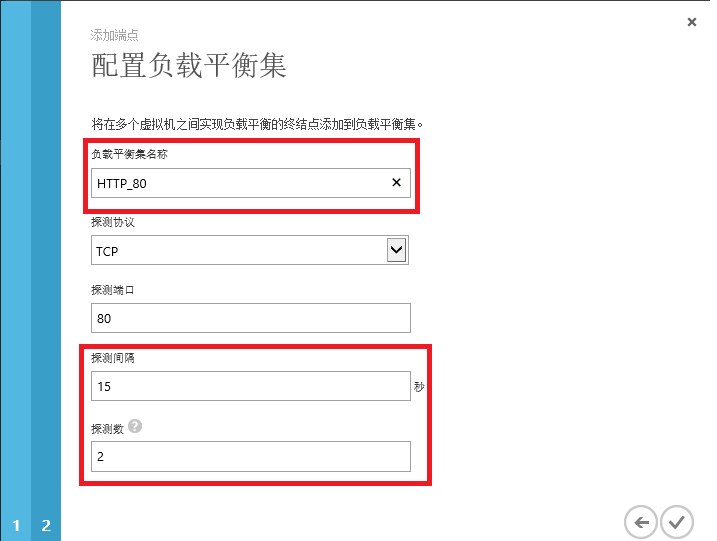
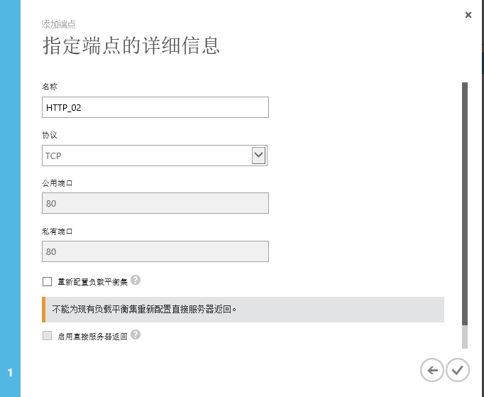

<properties
	pageTitle="Azure IaaS 用户手册 - 第三部分 | Azure"
	description="详细介绍如何创建和管理 Azure 虚拟机。"
	services="virtual-machines-windows"
	documentationCenter=""
	authors="Lei Zhang"
	manager=""
	editor=""/>

<tags
	ms.service="virtual-machines-windows"
	ms.date=""
	wacn.date="07/07/2016"/>

# Azure IaaS 用户手册 - 第三部分

- [Azure IaaS 用户手册 - 第一部分](/documentation/articles/azure-Iaas-user-manual-part1/)
- [Azure IaaS 用户手册 - 第二部分](/documentation/articles/azure-Iaas-user-manual-part2/)

## 4.	高级内容
### 4.1 设置虚拟机端口映射
Azure 端口 (Endpoint) 分为 Public Port 和 Private Port 两种。

1.	Public Port。表示这个 Endpoint 是对 Internet 开放的。所有从外部发起的访问，都是通过 Public Port 来进行的。
2.	Private Port。这个 Endpoint 不对 Internet 开放，只对 Azure 内部开放。如果 Azure 包含多个实例 (multi instance) 并行计算，那么实例与实例 (instance to instance) 的内部访问是通过 Private Port 来实现的。

上图中，Public Port 是 57500，Private Port 是 1433。

1.	当外部的资源想访问 Azure 服务时，是通过端口号为 57500 来访问的。
2.	然后 Azure 的 Load Balance 会将这个请求转发到内部 1433 端口号，来实现访问。
3.	这样的好处是：Private Port 可以实现内部消息的相互通信。Public Port 可以开放 Internet 到 Azure 的访问。两者互不冲突。

另外对于 Remote Desktop 使用的 3389 和 SSH 使用的 22 端口来说，这些端口暴露到 Internet 上，可能会被不怀好意的黑客探测到，通过将这些常用的端口设置端口映射，从低端口号映射到高端口号，可以降低被黑的概率。

选择某一台 Azure 虚拟机，然后页面跳转。点击终结点。如下图：

上图中，公用端口为 Public Port，私有端口为 Private Port。

对于远程桌面连接 (RemoteDesktop) 来说，用户通过 DNS:Public Port，也就是 contosoadcs.chinacloudapp.cn:50161，通过将 Public Port 50161 映射到 Private Port 3389，实现了对于 ContosoAD01 这台虚拟机的远程桌面连接访问。

注意：同一个云服务下的不同虚拟机，RemoteDesktop 的公用端口是不同的，但是私有端口都相同，为 3389。

### 4.2 设置虚拟机端口负载均衡
当需要对同一个云服务下的不同虚拟机实现负载均衡，可以将 Public Port 的消息通过负载均衡路由到每个虚拟机，实现请求的自动负载均衡。具体架构如下图：

Azure 虚拟机在默认情况下，只开启了 RDP 的端口和 PowerShell 的端口，其他的端口都是关闭的。这就意味着，默认情况下，在客户端想访问 Azure VM 的其他端口，比如 IIS 80 是不可能的。

只有 Azure 管理员开启了相应的端口号，即 Public Port，才可以正常访问 Azure VM 的 IIS。

在此次模拟场景中，可以对之前创建的 ContosoWeb01 和 ContosoWeb02 这两台虚拟机，设置 80 端口的负载均衡。

>[AZURE.NOTE]
>Azure 的负载均衡目前只支持四层，不能保留 Session。

负载均衡的算法是 Azure 设置好的，不能修改。算法主要依赖于五要素 (source IP, source port, destination IP, destination port, protocol type)。具体内容可以参考[这篇博客](http://azure.microsoft.com/blog/2014/04/08/microsoft-azure-load-balancing-services/)

接下来介绍详细内容。

1.	在虚拟机列表中，选择 ContosoWeb01，然后页面跳转。

	选择终结点选项。如下图：

	

2.	点击上图中的添加按钮。选择添加独立终结点。如下图：

	

3.	然后输入名称，协议选择 TCP，公用端口和私有端口都设置为 80。同时勾选 ”创建负载平衡集”，如下图：

	

4.	在配置负载平衡集中，设置负载平衡的名称。根据需求，设置探测间隔时间和探测数量。设置完毕后，点击完成。

	

5.	这样，第一台 Azure VM 的 80 端口负载均衡器就设置完毕了。如下图：

	

6.	然后设置第 2 台 Azure VM。选择 ContosoWeb02 这台虚拟机，点击添加终结点。图略。
7.	在弹出的添加端口中，选择将终结点添加到现有负载平衡集。如下图：

	

8.	然后设置 ContosoWeb02 的端点名称。如下图：

	

9.	这样第  2台 ContosoWeb02 的虚拟机 80 端口的负载均衡器负载均衡器也设置好了

	

10.	这样就可以通过访问 DNS: http://contosowebcs.chinacloudapp.cn:80， 访问到 ContosoWeb01 和 ContosoWeb02 的 80 端口了。架构图如下：

	

### 4.3 设置负载均衡器规则
Azure Load Balancer (负载均衡器)的规则，是由五要素组成 source IP, source port, destination IP, destination port, protocol type

具体可以参考[这篇博客](http://azure.microsoft.com/blog/2014/04/08/microsoft-azure-load-balancing-services/)。

这样 Azure Load Balancer 可以保证绝对的负载均衡，如下图：

但是这样的负载均衡器会有缺陷，是无法保留 Session 的。

当企业用户的应用程序需要保留会话 (Session) 的时候，不得不要修改应用程序代码，将 Session 保存到 Redis 缓存 (Redis Cache) 或者 SQL Server 中去。

最新的 Azure Load Balancer 可以将规则进行修改，改为 二要素 sourceIP，(Source IP，Destination IP) 或 三要素 sourceIPProtocol，(Source IP, Destination IP, Protocol)。这样由同一个客户端发起的请求，会指向同一个 Azure 目标服务器。通过这种方式，就可以保留 Session。如下图所示：

### 4.4 设置 Web 服务器固定 IP
注意：默认情况下，客户通过管理界面 Management Portal 创建的虚拟机的 Virtual IP，其实是从数据中心的 IP 池中随机获得的。当客户关闭虚拟机，虚拟机状态为 Stop (Deallocate) 的时候，Virtual IP 会被释放，DNS 会绑定到另外一个 IP 地址。

国内由世纪互联运营的 Microsoft Azure 的 IP Range 信息，可以参考[这里](http://www.microsoft.com/en-us/download/details.aspx?id=42064)。

如果您需要固定 IP 的情况下，需要通过 Azure PowerShell 向数据中心申请一个或者多个 IP 地址，这些 IP 地址就只会被您使用。

除非您将申请的 IP 释放，否则其他用户是无法使用到您申请的公网 IP 地址。

### 4.5 超过 1TB 容量的磁盘
Azure 挂载的磁盘，单块最大容量为 1023GB。如果需要磁盘分区超过 1TB 的情况，请使用 Azure Storage Space。
参考：http://www.cnblogs.com/threestone/p/3618113.html 

### 4.6 高 IOPS 的 Azure VM
当需要更高的 IOPS 的时候，比如某些场景需要更高性能的磁盘读写，这时候就需要用到高级存储 Premium Storage。

## 5.	后续运维
假设 Contoso 公司购买了 Azure 资源，建议：

1.	Azure 企业管理员账户 (拥有查看 Azure 账单的权限)。 Contoso 公司的财务管理员维护。
2.	Azure 账户管理员 (拥有管理订阅的权限)。 Contoso 公司的 IT 管理员维护。
3.	软件供应商 (Software Vendor)。不需要提供 Azure 的账户，而是把虚拟机的远程桌面连接或者 SSH 提供给 Vendor，让 Vendor 通过远程桌面连接来部署相应的软件。Azure 虚拟机的端口需要在 IT 管理员的协助下进行配置。

## 6.	注意事项
1.	修改虚拟机配置大小

	Azure 的数据中心建设是有先后顺序的，最早是落地了 A 系列的虚拟机，然后是 D 系列和 DS 系列的虚拟机。在一般情况下，客户在修改虚拟机配置大小的时候，会出现以下情况：

	-	已经创建的 A0-A4 虚拟机，无法升级到 A5-A7 系列的虚拟机
	-	已经创建的 A 系列的虚拟机，无法升级到 D 系列的虚拟机

	这是由于在创建 A 系列的虚拟机的时候，虚拟机创建在老的 Compute Cluster 上，而不是新的 Compute Cluster 上。

	遇到这种情况，只能把 DNS 删除，保留虚拟机的 VHD 并重新创建 Azure VM。这会产生虚拟机的临时下线。

	从可配置的角度来说，建议用户在刚开始创建 Azure 虚拟机的时候，直接设置虚拟机配置为 D 系列。这样可以在 D 系列 VM 和 A 系列 VM 中来回切换。

2.	虚拟机维护

	在 Azure 上的虚拟机，操作系统、中间件和运行时都需要用户自己来维护。比如给操作系统安装补丁、操作系统升级、安装杀毒软件等。 Azure 不会帮助客户进行虚拟机维护和升级。

3.	Windows Update

	默认情况下，Windows Server 虚拟机创建完毕后，会自动打开 Windows Update，这样会导致在同一个可用性集的多台 Azure 虚拟机在更新操作系统补丁的时候重启，请 IT 管理员谨慎使用 Windows Update，防止不必要的服务器重启。

4.	时区

	使用 Azure [管理门户](https://manage.windowsazure.cn)创建的 Azure 虚拟机，默认的时区都是 UTC 时区。我们需要通过 Remote Desktop 或者 SSH，在操作系统中，将时区修改为 UTC+8 时区，对应北京时间。

5.	Ping 命令

	Azure 数据中心禁用了 ICMP 协议。用户无法通过 ping 命令从外部监测 Azure 上的虚拟机。也无法从 Azure 虚拟机监测外部延时。我们建议使用 psping 工具，来代替 ping 命令。

6.	虚拟机关机

	通过远程桌面连接或者是 SSH，关闭 Azure 虚拟机，是会继续收取 Azure 计算费用的。

	只有通过 Azure [经典管理门户](https://manage.windowsazure.cn)，选中相应的 Azure 虚拟机，并点击关闭按钮。这样 Azure 虚拟机才不会继续收取计算费用。

7.	Public Port 连接安全性

	当创建完 Azure 虚拟机后，默认会打开远程桌面连接 (Remote Desktop) 和 SSH 连接，并且通过端口映射，将端口映射为高端口号。但是在互联网上还是有不怀好意的黑客会去扫描虚拟机端口，并且频繁尝试访问，试图攻破虚拟机。

	建议：
	* (1)	当使用完 Remote Desktop，请在 Azure 管理界面删除相应的 Public Port。阻止任何人通过 Public Port 访问远程桌面连接。
	* (2)	如果需要长期开启 Remote Desktop，则需要设置 ACL，即允许一个或者多个客户端 IP 地址来访问 Azure 虚拟机的 Remote Desktop。在 ACL 访问列表以外的其他 IP 地址均不能访问。使用该功能需要客户有固定公网 IPv4 地址。

8.	临时盘

	Azure 虚拟机磁盘中包含一个临时盘， D:磁盘 (Windows) 或者 /dev/sdb1 (Linux)。他们仅提供临时存储，所以可能会有丢失数据的风险且数据无法恢复。

9.	Azure 存储的 IOPS

	建议用户在创建 Azure 虚拟机的时候，不要把所有的虚拟机磁盘都保存在同一个存储账号里。因为 1 个存储账号是有 IOPS 上限 20000。

	建议每 3 台虚拟机使用同一个存储账号，第 4 台虚拟机使用另外一个存储账号。

10.	将文件、图片、照片等二进制文件保存到 Azure 存储中，降低虚拟机的互联网带宽压力。

11.	备案

	* (1)	默认情况下，我们在创建的 Azure 服务，默认使用的 DNS 地址为: http://xxx.chinacloudapi.cn，这个 DNS 的根域名是世纪互联备案过的，如果客户只使用这个根域名，是不需要备案的

		不过一般情况下，客户不会用 Azure 默认的 DNS 地址对外提供服务

	* (2)	如果客户不想使用 Azure 默认提供的 DNS 地址 http://xxx.chinacloudapi.cn，想使用自己的二级域名 (e.g. http://azure.contoso.com.cn) 做 A 记录解析到 Azure 的公网 IP 地址，则需要用户把自己的域名所在的根域名 (e.g. contoso.com.cn) 进行 ICP 备案。用户可以通过各种域名备案组织/代理，对自己的根域名 (contoso.com) 进行注册（国内的国外的）。

		但如果指向国内 Azure 的 IP 地址，需要用户到世纪互联备案网站 (http://icp.cloud.21vianet.com/) 提交备案信息

	* (3)	如果客户的根域名 (contoso.com.cn) 在没有备案的情况下，做了 A 记录解析到 Azure 的公网 IP 上，(即 http://azure.contoso.com.cn 的 A 记录，指向到 Azure 的公网 IP 43.192.xxx.xxx)

		工信部在进行审查的时候，如果根域名没有进行备案，会要求世纪互联尽快关闭该网站。

		世纪互联目前的流程是，先通知用户在规定时间内按要求对网站进行关闭。如用户不能在规定时间内按要求完成，或世纪互联无法联系到用户时，会采取暂停用户部署或订阅服务。

	* (4)	如果客户之前在 IDC 托管机房，或者其他网络接入商 (如万网等) 注册过顶级域名 (contoso.com.cn)，且该域名指向的公网 IP 地址不在 Azure 云平台。

		现在需要将 IP 指向到 Azure 云平台，根据现有的备案要求，需要用户到世纪互联提交备案信息，做新增接入操作。具体请联系世纪互联。

