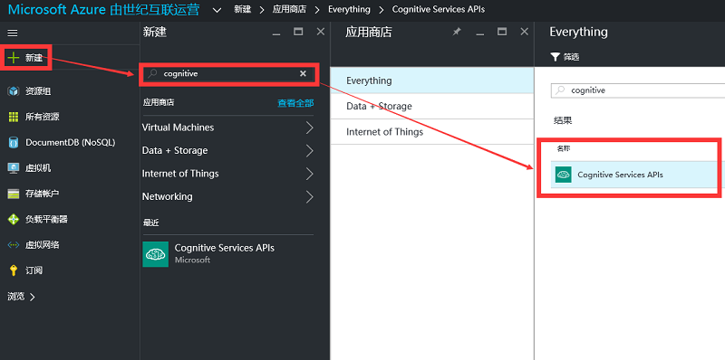
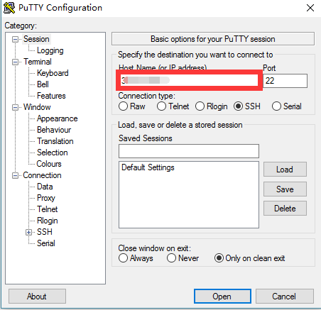

<properties
	pageTitle="人脸识别API+微信应用开发操作手册"
    description=""
    services=""
    documentationCenter=""
    authors=""
    manager=""
    editor=""
    tags=""/>

<tags ms.service="multiple" ms.date="" wacn.date="" wacn.lang="cn"/>

#人脸识别 API + 微信应用开发操作手册
 
  
##软件版本说明：
1. Mongo DB 2.6.12
2. Visual Studio 2015
 
 
##先决条件说明：

1. 公网 Web 服务器
2. 公网 MongoDB 服务器
3. 个人微信测试账号和手机端登录

##Step1： 通过 Azure 订阅人脸识别 API

1. 登录 [Azure 门户预览](https://portal.azure.cn/)。

	
	
2. 登录后，单击**所有资源**按钮，查看仪表板中的服务状态显示信息。
	 
	
	
3. 单击**新建**按钮，输入 “cognitive” 关键词进行搜索。

	
	
4. 单击搜索到的认知服务 APIs 名称，在出现的信息左下角单击**创建**。

	
	
5. 进入 API 账号创建界面，添加账户名称，单击 **API type** 选择 **Face API(preview)** 。

	
	
6. 单击 **Pricing tier**，根据需要来选择一种价格层级，在本演示中，选择 **F0 Free**。

	
	
7. Resource group 单击 **新建**，添加新建资源组名称，如果您之前有新建资源组，则可以单击**使用现有项**，**Resource group location** 是数据中心所在地，本演示中选择**中国北部**，单击 **Legal terms**，单击预览信息窗口左下角的 **I Agree** 按钮，单击**创建**，选中**固定到仪表板**。

	
	
8. 创建过程持续几分钟，完成后会自动弹出配置信息页，单击**所有设置**中的 **Keys**, 系统会显示 2 个 Key 值，分别记录当前页面中  **Endpoint** 地址和 **Keys** 处显示的任意一个 key 值。

	
	
##Step2： 通过[微信测试账号](http://mp.weixin.qq.com/debug/cgi-bin/sandboxinfo?action=showinfo&t=sandbox/index)创建所需的 AppID 和 Appsecret

1. 单击[微信测试账号](http://mp.weixin.qq.com/debug/cgi-bin/sandboxinfo?action=showinfo&t=sandbox/index)打开测试账号申请页面，单击页面中的**登录**按钮，手机微信扫描页面中的二维码。

	
	
2. 在打开的页面中，找到 **AppID** 和 **appsecret**，记录 **AppID** 和 **Appsecret** 信息。

	
	 
3. 在 **JS 接口安全域名**处输入应用服务端域名，程序会发布到该域名所在的服务器上，该程序所使用的服务器端口必须为 80 端口，**测试号二维码**是测试该程序的公众号。

	
	
	>[AZURE.NOTE]在本文档所展示的全部内容中，后续需要将修改后的应用代码作为 web service 发布到某个 web 站点，并在 JS 接口安全域名处输入发布代码的 web 站点域名。在实际操作时，您可以先通过 Azure Web App 创建一个空白的 web 站点，并在此处填入该 web 站点的域名，在后续步骤中将完成修改的代码上传到该站点。
	
##Step3： 确认现有非关系型数据库可用性：MongoDB

1. 登陆到现有的已连接到 Internet 的 Mongo DB 服务器，本演示中使用的 MongoDB 部署在 Azure VM 中。红框中填写的是虚拟机的公共 IP 地址，端口号默认 22。

	>[AZURE.NOTE]如果您没有已存在的适用的 Mongo DB 服务器，您可以直接在 Azure 订阅中创建一台 Linux VM 并进行 MongoDB 部署。

	
	
2. 进入 MongoDB 默认 test 数据库：

	
	
3. 查看现有集合信息：

	
	

##Step4： 从 [Github 下载项目](https://github.com/WaitSun/Cognitive)并修改 Web.config 配置文件

1. 通过 Visual Studio 2015 编辑 **Web.config** 文件，找到 AppID 和 AppSecret 字段，将字段值修改为微信公众号测试页面（ [Step 2-> 2](#step2-2) ）中显示的AppID和Appsecret。

	
	
2. 找到 **Web.config** 文件中 **mongoConnection** 字段，按照格式 “Linux 公网 IP 地址:端口号/数据库名”进行修改；检查是否存在 **<add key=”mongoDb”>** 字段，如果没有则添加该字段，设置 value 值为所建 MongoDB 数据库名。如下图所示：

	
	 
##Step5： 修改 Controller 类文件

1. 修改项目中 **Controllers** 文件夹下的 **WeixinController.cs** 文件，分别修改 **AppID** 和 **AppSecret** 为微信公众号测试页面（[Step 2-> 2](#step2-2) ）中显示的 AppID 和 AppSecret。

	
    
	
2. 修改项目中 **Controllers** 文件夹下的 **ProjecToxfordClientHelper.cs** 文件，修改 **serviceHost** 值与 **Ocp-Apim-Subscription-Key** 值分别为  [Step 1-> 8](#step1-8) 中所记录的 Endpoint（接口地址）地址和 Key 值。

	
	
##Step6： 把程序发布到 Web 服务器

1. 右键单击项目，选择**发布**。
	
	
2. 选择发布方式为：**File System (文件系统)**，**Target location** 指定一个本地文件夹路径，单击**下一步**。

	
	
3. 将 **Configuration** 选项选择为 **Release**，单击下一步。

	
	
4. 查看发布进度，完成本地发布。

	
	 
5. 将本地发布好的应用程序上传到公网 Web 服务器中，本演示中的 Web 服务器使用 Azure Web App 服务。

	>[AZURE.NOTE]应用程序上传的目标服务器，要求必须与本演示中 [Step2->3](#step2-3) 中设置的 “JS 接口安全域名” 地址一致。
	 
##Step7： 结果验证

1. 返回微信测试公众号页面，用手机微信扫描页面中的二维码并关注，成功关注后的公众号会在用户列表中。

	
	
2. 在手机端打开此微信公众号消息窗口，输入并发送 **JS 接口安全域名**处的域名，点击此域名链接以启动该程序进行测试。

3. 程序会根据 Web.config 中的数据库配置来创建 4 个运行所需的集合，可通过以下命令查看集合创建结果。
	
	查看已创建的集合命令：`db.getCollectionNames()`
	
		

	>[AZURE.NOTE]本演示中使用的数据库是 test 数据库，test 数据库是 MongoDB 的默认数据库，也是配置在 web.config 中的数据库。

##扩展服务

###Web 应用
	
Web 应用服务是由 Azure 提供的 PaaS 网站托管服务，通过该服务您可以将您的网站应用托管至 Azure，您也可以使用 Web 应用服务来发布您的微信应用。关于 Web 应用服务更多信息请参考 [Web 应用介绍](/home/features/web-site/)。
 
###虚拟机

虚拟机服务是 Azure 提供的通用型计算服务。您可以通过虚拟机来运行您的数据库、中间件等。本演示中通过虚拟机来运行 Mongo DB 数据库。关于虚拟机更多信息请参考[虚拟机服务介绍](/home/features/virtual-machines/)。
 
###Document DB
Document DB 是由 Azure 提供的 PaaS NoSQL 数据库服务，您可以使用该服务来满足您应用的 NoSQL 存储需求。本演示中通过虚拟机来运行 MongoDB，在您的环境中您可以尝试使用 Document DB 来运行，降低您的部署和维护工作量。更多关于 Document DB 的信息请参考 [Document DB 服务介绍](/home/features/documentdb/)。

##常见问题与相关文档：

- [Microsoft 认知服务](/cognitive-services/zh-cn/face-api/)
- [Microsoft 认知服务 API 参考](https://dev.cognitive.azure.cn/docs/services/563879b61984550e40cbbe8d/)
- 了解微信公众平台开发相关信息，请点击[这里](https://mp.weixin.qq.com/wiki/home/index.html)

 
 
