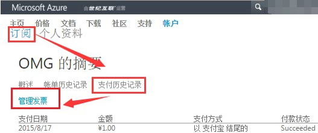
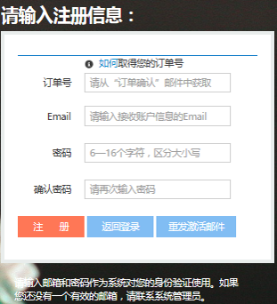
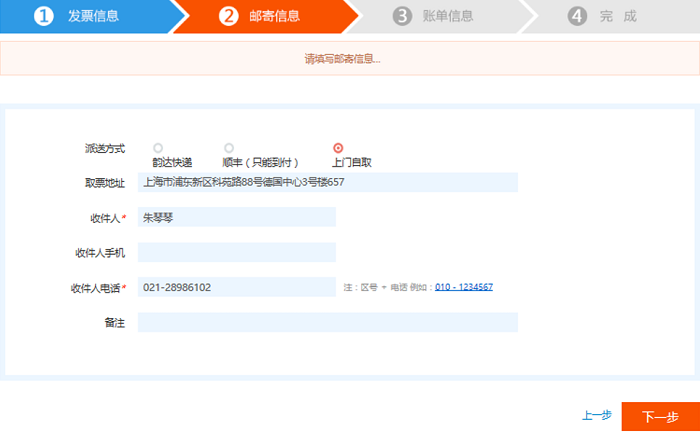
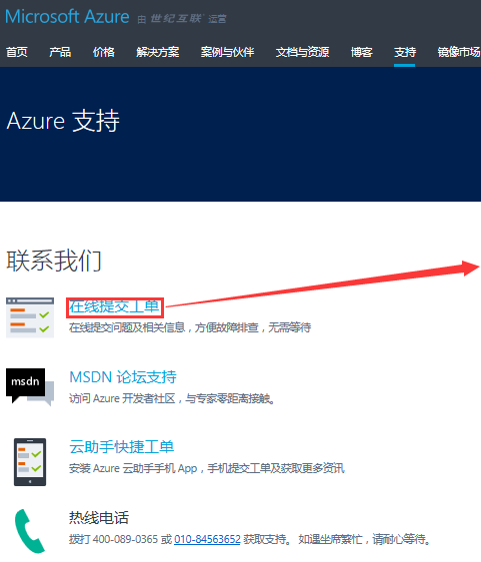
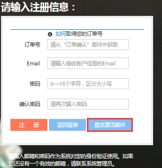

<properties
	pageTitle="发票申请操作解析 - Azure在线业务 | Azure"
    description="介绍发票申请操作流程及常见问题"
    services=""
    documentationCenter=""
    authors=""
    manager=""
    editor=""
    tags=""/>

<tags ms.service="multiple" ms.date="" wacn.date="11/03/2016" wacn.lang="cn"/>

#发票申请操作解析 - Azure在线业务

## 申请流程：

## 第一步：如何申请发票

- 您在网站成功付款后，会收到一封 “**订单确认**” 邮件，此邮件里包含有发票申请界面的链接，用户的 order ID 和您自己的邮箱，请您根据链接到[世纪互联发票信息管理系统](http://fapiao.cloud.21vianet.com/EmailAcount/Register)进行注册。

- 您也可以在您的 Portal 直接点击链接：

	

## 第二步：发票系统注册

当您进入世纪互联发票信息管理系统时，请填写以下信息进行注册。

注册完账户后，系统会发送激活邮件给您的注册邮箱，请点击邮件中的激活链接以激活该账户。

## 第三步：开发票具体操作

恭喜您成功注册，等您登录系统之后，在我的账单下选择并勾选上需要开具发票的批次，点击申请账单：

- 支付系统是搭建在第三方平台，订单资料和支付结果需要3天的时间同步，请您耐心等待。
	
	

请您先选择发票类型，然后继续完成“**发票信息**”，请完成 * 标记的待填项:

- 增值税普通发票只需要填写**购货单位名称**
- 您可以根据需求，申请开具不同公司抬头的发票，但一笔充值/付款只能申请一家公司抬头发票，如果您需要一笔充值开具不同抬头或者拆分不同金额的发票，可以通过链接 [https://support.windowsazure.cn/support](https://support.windowsazure.cn/support) 网页提交申请；或者拨打售后服务电话 4000890365。
- 当您第二次要开发票时，系统自动为您呈现上次开票信息。
- 请注意当您需要购买证明或者办理退款，收款单位要和发票开具的公司一致。

请填写邮寄信息，快递小哥可选韵达，顺丰（只能到付），您也可以到世纪互联上海分公司自取。

- 世纪互联上海分公司地址： 

	上海市浦东新区科苑路88号德国中心 3 号楼 657

- 联系方式： 

	朱琴琴    021-28986102

请您再次确认填写的信息，核对无误点击“**确认**”。

## 第四步：开票和寄出

您填写的信息自动传送到世纪互联服务中心，您的申请将在 2 个工作日完成操作。

- 您的工单完成后，可以随时查看进度，我们会及时更新进度，例如“**已打印**”，“**已寄出**”。
- 当票源紧张时，系统会发出公告并告知预计寄票时间，请您提交申请之后耐心等待。

	

## 热点问题：

### 问题一：您可以通过在线支持得到哪些服务

- 查询开票进度，及未收到发票的问题查询
- 更改发票抬头。请您寄回已开发票，我们会即刻给您更换新发票。

<table width="100%" border="0" cellspacing="0" cellpadding="0" style="table-layout:fixed;">
  <tr>
    <td></td>
	<td></td>
  </tr>
</table>

Azure 用户可以通过链接 [https://support.windowsazure.cn/support](https://support.windowsazure.cn/support) 提交工单。

### 问题二：自助修改登邮箱录，密码

- 登录发票管理系统 ([http://fapiao.cloud.21vianet.com/EmailAcount/LoginView](http://fapiao.cloud.21vianet.com/EmailAcount/LoginView))，直接修改邮箱和密码。

	

- 如果您忘记了登录密码，请您使用登录邮箱重置密码。系统将新密码发送到您的邮箱，请您收到后用新密码登录。

	<table width="100%" border="0" cellspacing="0" cellpadding="0" style="table-layout:fixed;">
  		<tr>
    		<td></td>
			<td></td>
    		<td></td>
			<td></td>
  		</tr>
	</table>

- 如果您忘记了登录邮箱，请致电 4000890365，我们的客服会帮助您解决问题。

### 问题三：查看订单 ID

- 登录到 [https://account.windowsazure.cn](https://account.windowsazure.cn)
- 依次点击“**订阅**”>要开具发票的订阅名称。
- 右侧会显示订单 ID

### 问题四：注册时填错邮箱地址怎么办

如果注册时填错邮箱，将无法收到激活邮件，24 小时之后注册链接会自动失效，您可以使用正确邮箱重新注册。

### 问题五：没有收到账号激活邮件怎么办

如果您在注册成功后的 24 小时内没有收到账号激活邮件，可以到发票申请界面点击”**重发激活邮件**“，系统将再次发送账号激活邮件到您的注册邮箱。若您尝试“**重发激活邮件**”后还是无法收到激活邮件，请联系世纪互联客户服务中心， 电话：4000890365. 

