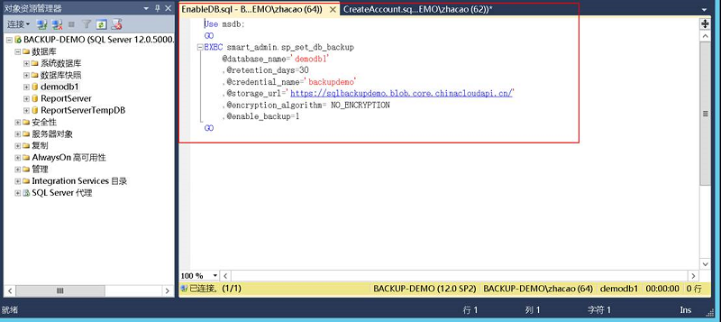
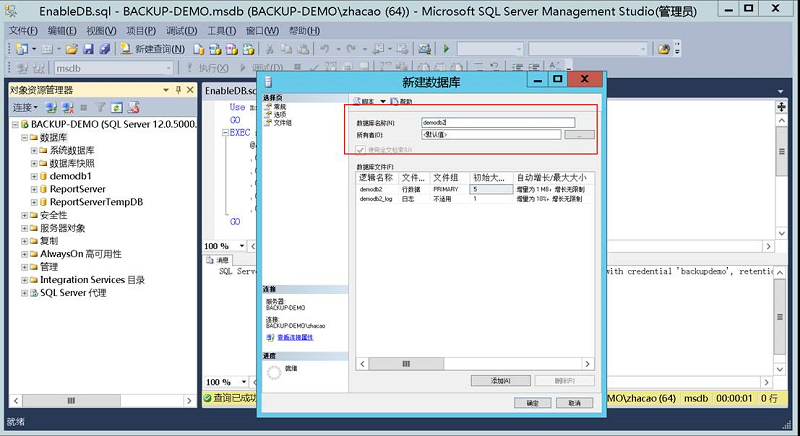

<properties
	pageTitle="SQL 数据库 + Blob 存储实现托管备份操作手册"
    description="SQL 数据库 + Blob 存储实现托管备份操作手册"
    services=""
    documentationCenter=""
    authors=""
    manager=""
    editor=""
    tags=""/>

<tags ms.service="multiple" ms.date="" wacn.date="08/24/2016"/>

#SQL 数据库 + Blob 存储实现托管备份操作手册  

SQL 版本支持说明：本文档基于 SQL Server 2014 编写，适用于 SQL Server 2014 及 SQL Server 2016. 较低版本的 SQL Server（如 SQL Server 2012）需安装最新的累积更新方可支持文档中描述的功能。

我们将为您具体呈现如何通过 SQL 数据库与 Blob 存储服务实现数据自动托管与备份，具体操作如下：

 
##Part1：单个数据库托管备份配置

###Step 1：在 Azure 上创建一个存储新的存储账户。

1. 通过 [Azure 经典管理门户](https://manage.windowsazure.cn/)创建存储账户。

	

2. 登录后，浏览到存储空间页面。

	

3. 单击**创建存储账户**按钮。

	

4. 输入存储账户名称。

	

5. 设置**复制**选项为**本地冗余**。

	

6. 单击**创建存储账户**。

	

###Step2：记录存储账户访问信息

1. 存储账户创建完成，点击存储账户上向右的箭头进入存储账户配置界面。

	

2. 选择**仪表盘**选项卡。

	

3. 记录 **Blob 服务终结点** URL。

	

4. 单击**管理访问密钥**按钮。

	

5. 分别记录**存储账户名称**和**主访问密钥**信息：

	

###Step3：配置 SQL 数据库

1. 登录到现有的 **SQL Server 服务器**，本文档中使用的是 **SQL Server 2014** 。

	

2. 展开**数据库**目录，找到需要进行托管备份的数据库，本示例中数据库名称为 demodb1， 单击右键选择**新建查询**。

	

3. 在查询窗口中粘贴以下 SQL 语句，并根据之前创建的存储账户信息进行修改。

	

4. 查询语句为：

		CREATE CREDENTIAL 凭据名称            
		WITH IDENTITY= '存储账户名称'          
		, SECRET = '存储账户主密钥'   

5. 单击**执行**按钮运行查询语句，获得以下执行结果。

	

6. 再次新建一个查询，粘贴以下 SQL 语句，并根据实际情况进行修改。

	

7. SQL 语句如下：

		Use msdb; 
		GO 
		EXEC smart_admin.sp_set_db_backup 
			@database_name='需要进行托管备份的数据库名称'
			,@retention_days=30 
			,@credential_name='凭据名称，与上个脚本中的一致'
			,@storage_url='blob服务访问终结点URL'
			,@encryption_algorithm= NO_ENCRYPTION 
			,@enable_backup=1 
		GO

8. 上述语句中，设置备份保存时间为 30 天，如需调整，只需修改 @retention_days 参数即可，范围为 1-30.

9. 单击**执行**按钮，运行 SQL 语句，获得以下执行结果。

	

###Step4：结果验证
1. SQL 托管备份服务会自动根据指定数据库的负载情况进行备份，15 分钟后浏览 sqlbackupdemo 存储账户，选择**容器**选项。

	

2. SQL 会自动创建备份容器，单击向右箭头浏览该容器。

	

3. 容器中已经出现 demodb1 的备份文件。

	

	以上配置过程，只针对指定数据库生效，如需在实例级别进行配置，请继续参考 Part2 部分内容。
 
 
##Part2：实例托管备份配置

###Step1：为实例启用托管备份

1. 连接到 SQL Server，展开**管理**目录。

	

2. 右键单击**托管备份**，选择**属性**。

	

	>[AZURE.NOTE]初次配置时选择**配置**选项。

3. 勾选**启用托管备份**。

	

4. 设置备份文件保存期，最长为 30 天。

	

5. 选择 Part1 中创建的 **SQL 凭据**。

	

6. 设置**存储 URL** ，路径为 Part1 中所创建的**存储账户中 Blob 服务终结点**。

	

7. 单击**确定**，对配置进行保存。

	

###Step2：结果验证

实例级别托管备份配置，不会对现有的数据库产生影响，仅仅针对在配置完成后创建的数据库生效。

1. 创建一个新的数据库，用于进行配置测试。

	

2. 数据库创建完成 15 分钟后，浏览 sqlbackupdemo 存储账户，点击**容器**选项卡。

	

3. 单击向右箭头进入容器，能够查看到文件列表中有测试数据库的备份文件。

	

4. 结果验证完成。
 

在对 SQL Server 启用托管备份功能后，SQL Server 会自动对指定的实例或数据库进行备份，其备份周期和备份计划并不需要人工参与，具体的备份触发条件如下：

**完整数据库备份**：如果以下任意条件成立，SQL Server 托管备份到 Azure 代理便会安排一次完整数据库备份。

- 初次为数据库启动 SQL Server 托管备份到 Azure，或在实例级使用默认设置启用 SQL Server 托管备份到 Azure 时。
- 自上次完备数据库备份以来的日志增长等于或超过 1 GB。
- 距上次完整数据库备份以来已超过一周的最大时间间隔。
- 日志链中断。SQL Server 托管备份到 Azure 会定期进行检查，通过比较备份文件的第一个和最后一个 LSN 确定日志链是否完整。如果日志链因为任何原因而存在中断，则 SQL Server 托管备份到 Azure 会安排一次完整数据库备份。日志链断裂的最常见原因可能是使用 Transact-SQL 或通过 SQL Server Management Studio 中的备份任务发出了备份命令。其他常见的情况包括意外删除了备份文件或意外的备份覆盖。

**事务日志备份**：如果以下任何情况属实，则 SQL Server 托管备份到 Azure 将安排一次日志备份：
	
- 找不到日志备份历史记录。在首次启动 SQL Server 托管备份到 Azure 时通常存在这种情况。
- 使用的事务日志空间为 5 MB 或更大。
- 距上次日志备份达到 2 小时的最大时间间隔。
- 事务日志备份滞后于完整备份数据库时。目标是使日志链保持在完整备份之前。
 
##扩展服务：
###StorSimple

如果您本地数据中心需要备份的 SQL 数据库较多，且总数据量较大时，您可以在本地部署 StorSimple，先将 SQL 备份至 StorSimple，由 StorSimple 压缩、去重后，再由 StorSimple 上传至 Azure。关于 StorSimple 更多信息请参考 [StorSimple 产品介绍](/solutions/storsimple/)。 
 
###常见问题与相关文档

- [如何对 Azure 上的 SQL 托管备份进行恢复](https://msdn.microsoft.com/zh-cn/library/dn449492(v=sql.120).aspx)
- [将 SQL Server 数据库迁移到云中的 SQL 数据库](/documentation/articles/sql-database-cloud-migrate/)
- [Azure SQL 数据库 Transact-SQL 的差异](/documentation/articles/sql-database-transact-sql-information/)
- [为可用性组设置 SQL Server 托管备份到 Azure](https://msdn.microsoft.com/zh-cn/library/dn449488(v=sql.120).aspx)
