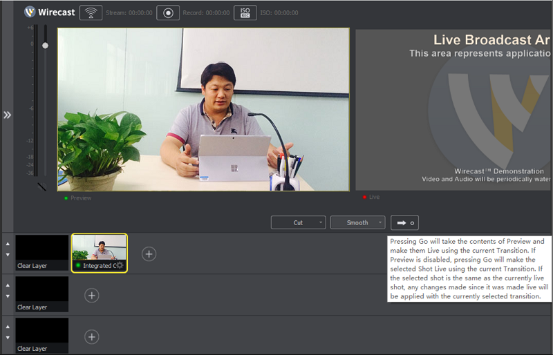
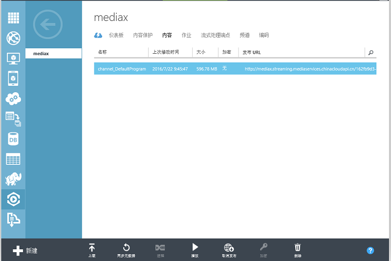

<properties
	pageTitle="Azure媒体服务实现视频直播操作手册"
    description=""
    services=""
    documentationCenter=""
    authors=""
    manager=""
    editor=""
    tags=""/>

<tags ms.service="multiple" ms.date="" wacn.date="08/10/2016"/>

#Azure 媒体服务实现视频直播操作手册
我们将为您具体呈现如何通过 Azure 媒体服务实现公开课直播场景。直播前期的准备工作需要大约 1 小时，您需要在开播前提前做好准备工作。具体操作步骤如下：

##Step 1：直播基础配置

1. 首先登录 [Azure 经典管理门户](https://manage.windowsazure.cn/)，在管理页面左侧的服务列表中点击**媒体服务**，然后选择**创建媒体服务账户**即可。
	
	

	

2. 在**新建**页面，我们可以自定义一个**名称**，可以**使用现有的存储账户**或者**新建存储账户**，这里我们选择**新建存储账户**。 

	

3. 确保在运行流式处理终结点时，至少为其分配了一个流式处理单元。（也可以在添加频道时同时创建流式处理单元）

	

4. 安装视频采集程序。

	在 Azure Media Service 进行直播需要一个本地实时编码器的配合。从 Azure 官方文档可以了解到 Elemental Live、FMLE、Telestream Wirecast、NewTek TriCaster [四种编码器的配置方法](/documentation/articles/media-services-live-encoders-overview/)。

	本例中使用 Telestream Wirecast 7.0.1 软件。 Wirecast 是一款知名的 RTMP 编码器，可实现直播流媒体的捕捉、实时制作和编码，以进行广播。我们将从 USB 摄像头采集的影像发送至 Azure 媒体服务并进行实时直播。[下载 Telestream Wirecast 7.0.1](http://www.telestream.net/wirecast/overview.htm)

##Step 2：使用 Azure 媒体服务进行在线直播

1. 创建频道

	选择新建的媒体服务，然后点击**频道**， 点击**添加新频道**

	

 
	输入频道名称及说明，选择**标准**表示租户使用 azure 媒体服务的功能以生成自适应码率的流媒体，然后点击对话框右下角的下一步按钮。

	

	根据需要选择插入协议，本例中选择 RTPM。

	

	广告配置（在**广告配置**页面，根据需要选择是否在广告信号中插入盖板）

	

	根据需要选择编码预设（目前媒体服务的直播只支持 720P 编码）

	

	根据需要配置采集限制，本例中选择**无 IP 限制**，勾选**立即开播新频道**

		

2. 检查频道配置

	创建完成后，点击频道进入配置页面，设置**插入 URL 允许的 IP 地址**和**预览 URL 允许的 IP 地址**， 确保当前计算机的 IP 地址被允许。 

	
 
	在频道页面，点击插入 URL 右侧的**复制**按钮。将 URL 保存至剪贴板。

	

3. 配置 Wirecast

	打开 Wirecast，点击 + 号按钮，选择摄像头为视频源。

	

	点击 ”→” 使其显示在右边界面。

	

	点击左上角的无线图标，弹出 “Select an Output Destination”,选择 “RTMP Server”。

	

	在弹出的 “Output Settings” 页面，输入上一步拷贝的**插入 URL**，并点击编码右侧的配置按钮

	

	配置编码

	

	配置完成后，再次点击左上角的无线按钮，开启上传。

	

4. 开播流媒体

	在媒体服务的频道页面，选择需要开播的频道，点击下方的**开播流媒体**，本例选择**未加密**。

	

	在弹出的确认对话框中，选择是。

	

5. 测试直播

	点击**播放**，再点击**播放预览 URL**。

	

	在弹出的预览窗口观看直播，以确认直播是否正常工作。

	

	在**媒体服务**、**频道**复制用于直播的 **URL（发布 URL）**。为保证直播效果，可以先对**发布 URL** 进行内部测试。

	

	内部测试方法：在 Azure Media Player 页面的 URL 框中输入复制的发布 URL，并点击 Update Player 按钮。即可实现在线公开课直播。

	

	[下载 Azure Media Player](http://ampdemo.azureedge.net/azuremediaplayer.html)

如果不是很快进行直播，可以参照下面 Step 3 先关闭直播频道及流式处理端点，以避免不必要的花费。直播开始前半小时前再开启。

##Step 3：直播完毕

建议您及时停播频道以避免不必要的花费。在经典管理门户停播流媒体，然后停播频道。下次直播前再开启此频道即可。

停播频道后，租户依然可以浏览之前的直播。

根据需要关闭流式处理端点，以节省费用。

>[AZURE.NOTE]后续的公开课都可以在已创建的频道直播，只需要再按照 Step 2 的 3、4 操作即可。

##Step4: 使用 CDN 为视频直播加速

如果公开课邀请的学员分布地域比较广，并且为了满足不同网络环境的学员都能流畅观看，建议使用 Azure CDN 服务加速您的视频直播， Azure CDN 服务可以将用户请求分配到最优的 CDN 节点，为用户提供高速网络访问的体验。 如何创建并使用 CDN 详见：[流媒体直播加速 CDN 节点创建](/documentation/articles/cdn-how-to-create-LiveStreaming-CDN-endpoint/)和[使用 Azure CDN](/documentation/articles/cdn-how-to-use/)。

##常见问题与相关文档

[如何使用AMS进行实时编码](/documentation/articles/media-services-portal-creating-live-encoder-enabled-channel/)

