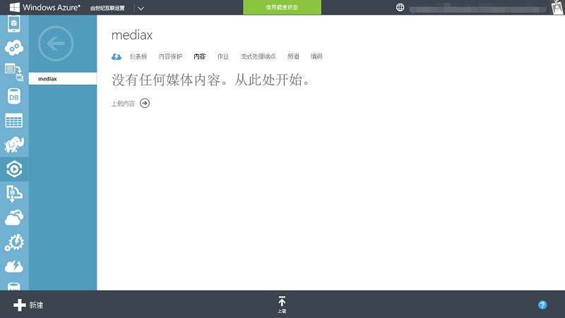

<properties
	pageTitle="Azure 媒体服务实现视频点播操作手册"
    description="Azure 媒体服务实现视频点播操作手册"
    services=""
    documentationCenter=""
    authors=""
    manager=""
    editor=""
    tags=""/>

<tags ms.service="multiple" ms.date="" wacn.date="08/10/2016"/>

#Azure 媒体服务实现视频点播操作手册

我们将为您具体呈现如何通过 Azure 媒体服务搭建视频 App 点播场景。通过创建 Azure 媒体服务、上传视频、视频编码、添加流式处理端点及发布几个步骤，即可实现，操作如下：

##Step 1: 创建 Azure 媒体服务

1. 首先登录 [Azure 经典管理门户](https://manage.windowsazure.cn/)，在管理页面左侧的服务列表中点击**媒体服务**，然后选择**创建媒体服务账户**即可。

	

	

2. 在新建界面，我们可以自定义一个名称，可以使用现有的存储账户或者新建存储账户，这里我们新建一个存储账户。 

	

3. 点击**创建媒体服务**按钮，Azure 会在一分钟内完成媒体服务的创建。

	

##Step 2: 上传视频
1. 点击进入 Step 1 中创建的媒体服务，选择**内容**选项卡，然后点击**上载内容**或者页面底部的**上载**按钮将我们要在视屏 App 上播放的视频传输至 Azure 的存储账户。

	

2. 选择要播放的视频进行上传。

	

3. 上传完成之后，我们可以在媒体服务中看到该视频。

	

##Step 3: 对视频进行编码

1. 我们利用 Azure 媒体服务将刚才上传好的视频进行编码，以满足不同客户端和播放器的需求。选中视频，然后点击页面底部工具栏上的**进程**按钮

	

2. 在**进程**对话框中，我们可以在**编码配置**中选择所需的目标格式，并为输出的视频自定义名称。
我们的 App 需支持播放高清或标清视频，所以推荐选择 **H264 多比特率 720P** 对视频进行编码，通过自适应比特率流，用户观看视频时，可根据当前网络带宽、CPU 利用率和其他因素，切换至高清或标清观看。

	

3. 点击√，Azure 媒体服务会很快完成编码工作。

	

##Step 4: 添加流式处理端点

媒体服务需要借助**流式处理端点**将自适应比特率流传送至观看者客户端。  

点击**流式处理端点**，再点击 **default**

点击**缩放**，**流单元**数量选择 1，点击**保存**。(1 个流单元可满足 130 人同时观看高清视频，可根据实际并发用户进行流单元选择）

>[AZURE.NOTE]开启流式处理端点需要 20 分钟左右的时间。

##Step 5: 发布视频

1. 基本配置完成后，我们就可以发布视频了。在媒体服务内容中选择要发布的视频，点击页面底部工具栏上的**发布**按钮进行发布。

	

2. 选中已发布的视频，点击页面底部工具栏上的**播放**按钮进行预览。

	

3. 我们可以直接通过浏览器在 Azure 经典管理门户上播放该视频。

	

4. 选中已经发布的视频，在发布 URL 中点击“复制”按钮，将发布 URL 复制下来。

	

5. 把视频链接添加到视频 App 上，用户就可以在 App 上挑选并观看了。

	

	

>[AZURE.NOTE]您也可以使用 Azure Media Player 模拟视频 APP，测试已编码视频是否可正常播放，打开 Azure Media Player 页面，在 URL 框中输入 Azure 媒体服务生成的**发布 URL**，并点击 **Update Player** 按钮。即可实现自适应码率视频的播放。 [下载　Azure Media Player](http://ampdemo.azureedge.net/azuremediaplayer.html)

如需上传并编码多个视频，按照 Step2、3 的操作即可。

##Step6: 使用 CDN 为视频点播加速

如果视频 APP 的用户分布地域比较广，并且为了满足不同网络环境的用户都能流畅观看，建议使用 Azure CDN 服务加速您的视频点播， Azure CDN 服务可以将用户请求分配到最优的 CDN 节点，为用户提供高速网络访问的体验。如何创建并使用 CDN 详见：[VOD 视频点播加速 CDN 节点创建](/documentation/articles/cdn-how-to-create-VOD-CDN-endpoint/)和[使用 Azure CDN](/documentation/articles/cdn-how-to-use/)。

##常见问题与相关文档

- [Azure 按需媒体编码器](/documentation/articles/media-services-encode-asset/)
- [媒体编码器标准格式和编解码器](/documentation/articles/media-services-media-encoder-standard-formats/)
