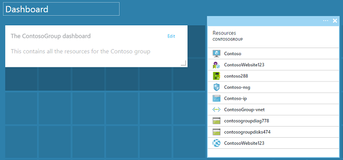
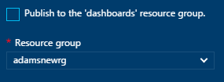
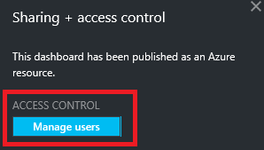

<properties
   pageTitle="Azure 门户仪表板 |Azure"
   description="本文介绍如何在 Azure 门户中创建和编辑仪表板。"
   services="azure-portal"
   documentationCenter=""
   authors="sewatson"
   manager="timlt"
   editor="tysonn"/>  

<tags
   ms.service="multiple"
   ms.devlang="NA"
   ms.topic="article"
   ms.tgt_pltfrm="NA"
   ms.workload="na"
   ms.date="09/06/2016"
   wacn.date="10/17/2016"
   ms.author="sewatson"/>  

# 在 Azure 门户中创建和共享仪表板

可以创建多个仪表板，并与对你的 Azure 订阅有访问权限的其他用户共享。本文介绍创建/编辑、发布和管理仪表板访问权限的基础知识。

## 自定义仪表板与边栏选项卡

自几个月前推出仪表板以来，边栏选项卡自定义项的数量便稳步下降，而仪表板自定义项的数量则快速增长。这种强劲的使用趋势表明，相较边栏选项卡，用户更喜欢自定义仪表板。为了支持该趋势，我们将删除自定义边栏选项卡的功能，并致力于增强仪表板的功能。如果之前自定了边栏选项卡，自定义项将很快删除。若要保留该自定义项，请将自定义磁贴固定到仪表板。只需右键单击该磁贴，然后选择“固定到仪表板”，如下图所示。

  

## 创建仪表板

若要创建仪表板，请选择当前仪表板名称旁边的“新建仪表板”按钮。

  

此操作会创建全新的专用空仪表板，并进入自定义模式，可在此模式下命名仪表板以及添加或重新排列磁贴。处于此模式下时，可折叠的磁贴库会接管左侧的导航菜单。通过磁贴库，可以通过各种方式查找 Azure 资源的磁贴：可以按[资源组](/documentation/articles/resource-group-overview/#resource-groups)、按资源类型或按[标记](/documentation/articles/resource-group-using-tags/)浏览，也可以按名称搜索资源。

  

通过将磁贴拖放到仪表板表面上想要的位置进行添加。

未与特定资源关联的磁贴有一个名为**常规**的新类别。在此示例中，我们固定 Markdown 磁贴。使用此磁贴将自定义内容添加到仪表板。该磁贴支持纯文本、[Markdown 语法](https://daringfireball.net/projects/markdown/syntax)和一组有限的 HTML。（出于安全考量，不能执行插入 `<script>` 标记或使用可能会干扰门户的特定 CSS 样式元素等操作。）

  

## 编辑仪表板

创建仪表板后，可以固定来自磁贴库的磁贴或以磁贴形式表示的边栏选项卡。让我们来固定资源组的表示形式。可以在浏览项时固定，也可以从资源组边栏选项卡固定。这两种方法都可以固定以磁贴形式表示的资源组。

  

固定项后，它们会在仪表板中显示。

  

我们现在已将 Markdown 磁贴和资源组固定到仪表板，接下来，我们可以调整磁贴的大小并将其重新排列为合适的布局。

悬停鼠标并选择“...”，或右键单击磁贴，即可看到该磁贴的所有上下文命令。默认情况下，有两个项：

1. **从仪表板取消固定** - 从仪表板删除磁贴
2.	**自定义** - 进入自定义模式

  

选择自定义后，可以调整磁贴的大小并对其进行重新排列。若要调整磁贴的小大，请从上下文菜单中选择新的大小，如下图所示。

  

或者，如果磁贴支持任意大小，则可以将右下角拖到所需的大小。

  

调整磁贴的大小后，查看仪表板。

  

完成自定义仪表板后，只需选择“自定义完成”即可退出自定义模式，或右键单击并从上下文菜单中选择“自定义完成”。

## 发布仪表板和管理访问控制

创建仪表板时，默认该仪表板是专用的，这意味着只有你才可以看到它。若要让其对其他人可见，请使用与其他仪表板命令一起出现的“共享”按钮。

  

系统会要求选择可将仪表板发布到的订阅和资源组。为了将仪表板无缝集成到生态系统，我们已将共享仪表板作为 Azure 资源实现（因此，无法通过键入电子邮件地址进行共享）。对门户中大多数磁贴显示的信息的访问由 [Azure 基于角色的访问控制](/documentation/articles/role-based-access-control-configure/)管理。从访问控制角度来看，共享仪表板与虚拟机或存储帐户没有什么不同。

假设拥有 Azure 订阅，并且团队中的成员都分配了订阅的**所有者**、**参与者**或**读取者**角色。作为所有者或参与者的用户能够列出、查看、创建、修改或删除该订阅中的仪表板。作为读取者的用户能够列出并查看仪表板，但不能修改或删除它们。具有读取者访问权限的用户能够对共享仪表板进行本地编辑，但不能将这些更改发布回服务器。但是，他们可以制作仪表板的专用副本供自己使用。与往常一样，仪表板中的各个磁贴将根据其对应的资源强制实施自己的访问控制规则。

为方便起见，门户的发布体验会引导完成将仪表板放在名为**仪表板**的资源组中的模式。

  

还可以选择将仪表板发布到特定资源组。该仪表板的访问控制与资源组的访问控制一致。可以管理该资源组中的资源的用户也可以访问仪表板。

  

仪表板发布后，“共享 + 访问”控制窗格将刷新，并显示有关已发布仪表板的信息，其中包含用于管理仪表板用户访问权限的链接。此链接将启动用于管理任何 Azure 资源访问权限的基于角色的标准访问控制边栏选项卡。随时可以通过选择“共享”返回此视图。

  

## 后续步骤

- 若要管理资源，请参阅[通过门户管理 Azure 资源](/documentation/articles/resource-group-portal/)。
- 若要部署资源，请参阅[使用 Resource Manager 模板和 Azure 门户部署资源](/documentation/articles/resource-group-template-deploy-portal/)。

<!---HONumber=Mooncake_1010_2016-->