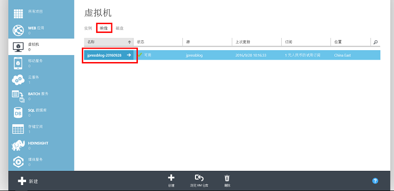
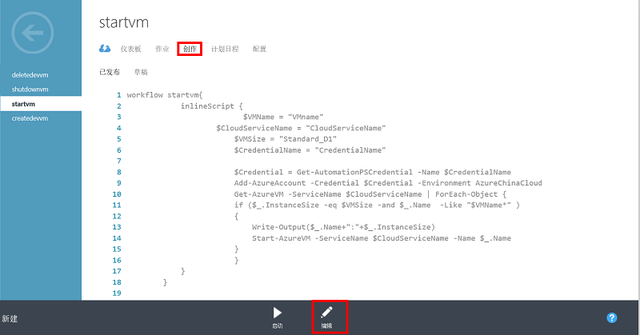

<properties
	pageTitle="远程开发测试环境自动化管理解决方案配置手册"
    description="远程开发测试环境自动化管理解决方案配置手册"
    services="multiple"
    documentationCenter=""
    authors=""
    manager=""
    editor=""
    tags=""/>

<tags ms.service="multiple" ms.date="" wacn.date="10/14/2016"/>

# 远程开发测试环境自动化管理解决方案配置手册

## 先决条件：
	
在开始本文档中的操作前，需先完成以下准备工作：
		
1. 有一个 1 元试用 Azure 订阅账户。	
2. 在 1 元试用订阅中已完成在同一位置的虚拟网络、云服务、存储账户创建。
3. 在 1 元试用订阅中已创建一台 Windows 虚拟机，该虚拟机为模板虚拟机，将用于 OS 映像捕获，需要在该虚拟机中事先完成开发测试工作所需相关工具安装，同时虚拟机所使用存储账户必须与准备工作 2 中所创建的存储账户一致。	
4. 已经记录所创建的虚拟网络、云服务、存储账户相关信息，如：云服务名称、虚拟网络名称、存储账户名称、子网名称等。

## Step1：基础环境配置

1. 登录 [Azure 经典管理门户](https://manage.windowsazure.cn/)。
	
	

2. 登录后，单击 **Active Directory** 。

	
	
3. 单击现有目录名称处 **向右的箭头** 。

	
	
4. 单击 **用户** 选项。

	
	
5. 单击 **添加用户** 按钮。

	
	
6. 设置一个 **用户名** ，其他选项保持默认状态，单击 **下一步** 按钮。

	
	
7. 分别为新 Azure AD 用户设置一个 **名字** ， **显示名称** ，角色设置为 **全局管理员** ，并指定一个 **备用电子邮件地址** ，单击 **下一步** 按钮。

	
	
8. 单击 **创建** 按钮，为该用户创建一个 **临时密码** 。

	

	
9. 记录该用户的 **用户名称** 和 **临时密码**，单击 **完成** 按钮关闭该页面，完成新 Azure AD 用户创建 。

	
	
10. 在 IE 浏览器中打开一个新的 **InPrivate** 窗口.

	
	
11. 再次浏览 [Azure 经典管理门户](https://manage.windowsazure.cn/) , 并使用 [Step1->9](#step1-9) 中创建的新用户和临时密码进行登录。

	
	
12. 根据页面中的提升完成密码修改操作，修改成功后关闭该页面。

	
	
13. 返回 [Step1->1](#step1-1) 中登录的 Azure 管理门户页面，单击 **设置** 。

	
	
14. 单击 **管理员** 按钮，在管理员页面中单击 **添加** 按钮。

	
	
15. 在 **电子邮件地址** 处输入在 [Step1->9](#step1-9) 处所添加的 **用户名称** ，订阅选中 “**1元人民币的试用订阅**”，单击 **确定** 按钮。

	
	
	
## Step2：捕获虚拟机映像
	
1. 在管理门户虚拟机页面，选中准备步骤中所创建的模板虚拟机，单击 **连接** 按钮连接到虚拟机。

	
	
2. 确认所有开发工具已完成部署。

	
	
3. 浏览到模板虚拟机的 **C:\Windows\System32\Sysprep** ，运行 **sysprep.exe**  程序。

	
	
4. 对 Sysprep 程序做如下图所示设置后，单击 **确定** 按钮。

	
	
5. Sysprep 结束后，该模板 VM 会自动关机，此时返回 Azure 管理门户，选中该虚拟机，单击 **关闭** 按钮，选择 **是** 。

	
	
6. 当虚拟机由 **正在停止** 变为 **已取消分配** 状态后，单击 **捕获** 按钮。

	
	
7. 在 **捕获**  窗口中，为映像设置一个 **映像名称** 和 **标签** ，选中 **我已在虚拟机上运行 Sysprep** 选项，单击确定按钮。

	
	
8. Azure 将开始捕获映像，捕获结束后，能够在 **映像** 选项卡下查看到刚才所创建的开发测试映像。

	
	

## Step3：配置自动化服务

1. 在 Azure 管理门户中，单击 **自动化** ，单击 **创建自动管理账户**。

	
	
2. 设置一个 **账户名称** ，单击 **确定** 按钮。

	
	
3. 创建完成后，单击自动化账户名称 **右侧箭头**，打开该自动化账户。

	
	
4. 单击 **资产** 选项卡，在资产选项卡中单击 **添加设置** 按钮。

	
	
5. 单击 **添加凭据**。

	
	
6. 在定义凭据页面，设置 **凭据类型** 为 **Windows PowerShell 凭据** ，在 **名称** 位置设置一个凭据名称，该名称将在后续步骤的 runbook 中被调用，单击 **下一步** 按钮。

	
	
7. 在 **用户名** 处输入 [Step1->9](#step1-9) 处所添加的用户，**密码** 和 **确认密码** 为 [Step1->12](#step1-12) 处所修改后的密码，单击 **确认** 按钮。

	 

9. 创建完成后，在 **资产** 页面中能够找到刚才创建的用户凭据。 

	 
	
10. 单击 Azure 管理门户中的 **新建** 按钮，选择 **应用程序服务->自动化->RUNBOOK->快速创建**，设置一个 **RUNBOOK 名称**，在本示例中本次所创建的 RUNBOOK 用于进行开发测试环境部署，RUNBOOK 名称为 createdevvm， **自动化账户** 选择 [**Step3->2**](#step3-2) 中所创建的自动化账户，单击 **创建** 按钮。

	 
	
11. 创建完成后，单击页面底部的 **编辑 RUNBOOK** 按钮。

	 
	
12. **删除**现有编辑页面中的所有内容，**粘贴**以下 RUNBOOK 内容到编辑页面。

		workflow createdevvm
		{
		    param (
		             [Parameter(Mandatory = $true)] [String] $VMName,         
		             [Parameter(Mandatory = $true)] [String] $VNetName,              	
		             [Parameter(Mandatory = $true)] [String] $CloudServiceName,
		             [Parameter(Mandatory = $true)] [String] $VMAdminUserName,            
		             [Parameter(Mandatory = $true)] [String] $VMPassword,            
		             [Parameter(Mandatory = $true)] [String] $VMSize,           
		             [Parameter(Mandatory = $true)] [String] $ImageName,                                
		             [Parameter(Mandatory = $true)] [String] $StorageAccount,           
		             [Parameter(Mandatory = $true)] [String] $SubnetName,
		             [Parameter(Mandatory = $true)] [String] $CredentialName,
		             [Parameter(Mandatory = $true)] [Sum] $VMNumber                      
		    )
		    inlineScript {
		             $VMNames = $using:VMName
		             $StorageAccount = $using:StorageAccount
		             $ImageName = $using:ImageName
		             $VMPassword = $using:VMpassword
		             $VMAdminUserName = $using:VMadminusername
		             $CloudServiceName = $using:Cloudservicename
		             $VMSize = $using:VMsize
		             $VMs = $using:VMNumber
		             $SubnetName = $using:subnetname
		             $VnetName = $using:vnetname
		             $CredentialName = $using:CredentialName
		             $Credential = Get-AutomationPSCredential -Name $CredentialName
		             Add-AzureAccount -Credential $Credential -Environment AzureChinaCloud
		             Set-AzureSubscription -SubscriptionName "1 元人民币的试用订阅" -CurrentStorageAccountName $StorageAccount
			       $i = 0
			       do {
				        $i++                   
				        $VMname = ("$Vmnames" + "-" + "$i")   
				        write-output $VMname 
				        New-AzureVMConfig -Name $VMName -InstanceSize $VMSize -ImageName $ImageName| Add-AzureProvisioningConfig -Windows -Password $vmpassword -AdminUsername $VMAdminusername |Set-AzureSubnet –SubnetName $SubnetName | New-AzureVM -ServiceName $CloudServiceName -VnetName $VNetName              
			       }while($i -lt $VMs)	
		      }      
		}
	
13. 粘贴完 RUNBOOK 的编辑页面如下图所示，单击 **发布** 按钮，选择 **是** 。

	 
	
	
14. 参考 Step3->11 至 13 步，在同一自动化账户中再创建并发布三个名称分别为 deletedevvm、startvm、shutdownvm  的 RUNBOOK，其代码部分如下：

	以下是deletedevvm runbook代码：

		workflow deletedevvm 
		{
		     param  (
			    [Parameter(Mandatory = $true)] [String] $VMName,                 		
			    [Parameter(Mandatory = $true)] [String] $CloudServiceName,  	
			    [Parameter(Mandatory = $true)] [String] $VMSize,
			    [Parameter(Mandatory = $true)] [String] $CredentialName	
		     )
		     inlineScript {
			    $VMName = $using:VMName
			    $CloudServiceName = $using:CloudServiceName
			    $VMSize = $using:VMSize
			    $CredentialName = $using:CredentialName
			    $Credential = Get-AutomationPSCredential -Name $CredentialName
			    Add-AzureAccount -Credential $Credential -Environment AzureChinaCloud
			    Get-AzureVM -ServiceName $CloudServiceName | ForEach-Object { 
			            if ($_.InstanceSize -eq $VMSize -and $_.Name  -Like "$VMName*" )
			            {
			       	  Write-Output($_.Name+":"+$_.InstanceSize)
			       	  Remove-AzureVM -ServiceName $CloudServiceName -Name $_.Name
			            }
			     }
		     }
		}
	
	以下是startvm runbook代码：

		workflow startvm{
		     inlineScript {
			    $VMName = "VMname"                		
			    $CloudServiceName = "CloudServiceName"          	
			    $VMSize = "Standard_D1"
			    $CredentialName = "CredentialName"   	
			    $Credential = Get-AutomationPSCredential -Name $CredentialName
			    Add-AzureAccount -Credential $Credential -Environment AzureChinaCloud
			    Get-AzureVM -ServiceName $CloudServiceName | ForEach-Object { 
			            if ($_.InstanceSize -eq $VMSize -and $_.Name  -Like "$VMName*" )
			            {
			       	 Write-Output($_.Name+":"+$_.InstanceSize)
			       	 Start-AzureVM -ServiceName $CloudServiceName -Name $_.Name 
			             }
			     }
		     }
		}
		
	以下是shutdownvm runbook代码：

		workflow shutdownvm{
		     inlineScript {
			    $VMName = "VMname"                		
			    $CloudServiceName = "CloudServiceName"          	
			    $VMSize = "Standard_D1"
			    $CredentialName = "CredentialName"   	
			    $Credential = Get-AutomationPSCredential -Name $CredentialName
			    Add-AzureAccount -Credential $Credential -Environment AzureChinaCloud
			    Get-AzureVM -ServiceName $CloudServiceName | ForEach-Object { 
			            if ($_.InstanceSize -eq $VMSize -and $_.Name  -Like "$VMName*" )
			            {
			       	 Write-Output($_.Name+":"+$_.InstanceSize)
			       	 stop-AzureVM -ServiceName $CloudServiceName -Name $_.Name  -Force
			             }
			     }
		     }
		}
	
15. 发布完成后 RUNBOOK 列表页面如下图所示。

	 
	

## Step4：开发测试环境自动化部署测试

1. 记录本指南开篇处准备工作部分所要求的存储账户名称、云服务名称、虚拟网络名称、子网名称等信息。

2. 找到自动化账户中的 createvm RUNBOOK，单击 **启动** 按钮。

	 
	
3. 在页面中出现的交互窗口中，分别输入以下信息：

	名称 | 值
	---|---
	CLOUDSERVICENAME | VM部署目标云服务名称
	CREDENTIALNAME | Step3->6 中所设置的凭据名称
	IMAGENAME | Step2->7 中所设置的 OS 映像名称
	STORAGEACCOUNT | VM 部署目标存储账户，需与 OS 映像所在存储账户为同一存储账户
	SUBNETNAME | VM 部署目标子网，需是本表 VNETNAME 参数所指定虚拟网络中的子网
	VMADMINUSERNAME | VM 创建后操作系统管理员用户名
	VMNAME | VM 名称前缀，可使用 -v1.0 等方式对 VM 版本进行标识
	VMNUMBER | 需要创建的 VM 数量，此处只可填入一个不小于 1 的整数
	VMPASSWORD | VM 操作系统管理员密码
	VMSIZE | VM 实例大小，本演示使用 Standard_D1
	VNETNAME | VM 部署目标虚拟网络，需与存储账户和云服务在同一个数据中心位置
	
	>[AZURE.NOTE]1 元试用订阅中的资源使用上限为 4 CPU，因此在按照本文档演示内容操作时，应提前检查是否存在足够数量的 CPU 空闲资源。
	
4. 设置完部署参数的交互窗口如下图所示，单击 **确定** 按钮。

	 
	
5. RUNBOOK 启动后，可单击界面中的 **查看作业** 按钮，检查 RUNBOOK 执行情况和结果输出。

	 
	
6. 等待一段时间后，即可在 RUNBOOK 的 **摘要** 选项卡中查看到执行结果。

	 
	
7. 返回管理门户，刷新页面并浏览到虚拟机页面，可以看到 RUNBOOK 执行后已经成功创建出了多台自动编号的虚拟机，如下图。

	 
	

## Step5：开发测试环境自动化成本优化

1. 在自动化账户页面，单击 **RUNBOOK** 选项卡，找到 **StartVM** RUNBOOK，单击其名称右侧的箭头。

	 
	
2. 单击 **创作** 选项卡，在选项卡中单击 **编辑** 按钮。

	 
	
3. 在编辑页面中，找到下图所示的 4 个字段。

	 
	
4. 根据下表中的提示，对这 4 个字段中的值进行修改：

	字段名称 | 值  
	---|---  
	$VMName | Step4->3 和 4 中所指定的 VM 名称  
	$CloudServiceName | Step4->3 和 4 中所指定的云服务名称  
	$VMSize | Step4->3 和 4 中所指定的实例大小  
	$CredentialName | Step4->3 和 4 中所指定的凭据名称

5. 修改后的结果如下图所示，单击 **发布** 按钮，选择 **是**。

	 
	
	
6. 参考以上 Step5->1 至 5 步骤对 **shutdownvm** RUNBOOK 进行编辑并重新发布。

	 
	
7. 单击 shutdownvm RUNBOOK 的 **计划日程** 选项卡，单击 **链接到新计划** 。

	 
	
8. 定义一个 **日程名称** ，本示例中名称为 leaveoffice ，单击 **下一步** 按钮。

	 
	
9. 设置一个教近的时间进行计划测试，本示例中设置时间为 10 分钟后，单击 **确定** 按钮。

	 
	
10. 10 分钟后指定云服务中，虚拟机大小和名称相匹配的虚拟机将会自动关闭，如下图：

	 
	
	 
	
11. 参考以上 Step5->7 至 10 步骤对 **startvm** RUNBOOK 进行计划日程设置，如执行时间为每天上午 9 点。

	 
	
12. 通过以上步骤设置，指定的 VM 将能够根据计划进行自动开关机，从而降低开发测试环境整体拥有成本。

## Step6：开发测试环境删除与更新

1. 在需要对现有的开发测试环境进行删除时，可在自动化账户中执行 **deletedevvm** RUNBOOK。

	
	
2. 为避免误删，在交互界面中输入相应的参数信息对虚拟机进行过滤。所需信息如下表：

	字段名称 | 值  
	---|---
	$VMName | Step4->3 和 4 中所指定的 VM 名称  
	$CloudServiceName | Step4->3 和 4 中所指定的云服务名称  
	$VMSize | Step4->3 和 4 中所指定的实例大小  
	$CredentialName | Step4->3 和 4 中所指定的凭据名称  

	>[AZURE.NOTE]上表为本演示环境中所使用参数，生产环境使用时需根据实际情况进行参数修改。
	
3. 指定参数后的交互界面如下图所示，单击 **确定** 按钮。

	
	
	>[AZURE.NOTE]本脚本将强制删除指定的VM，在执行前请确认目标虚拟机业务方面的可删除性。
	
4. 当需要对现有开发测试环境进行迭代更新时，只需参考本演示中相关步骤，对模板进行更新后，删除现有虚拟机并重新使用新模板创建即可。

## 扩展服务

### 虚拟机
		
虚拟机服务是 Azure 提供的通用型计算服务。您可以通过虚拟机来运行您的数据库、中间件等。本演示中通过虚拟机来运行 Mongo DB 数据库。关于虚拟机更多信息请参考 [虚拟机服务介绍](/home/features/virtual-machines/)。
	
### 虚拟网络
		
虚拟网络 (VNet) 是 Azure 上提供的一种云端网络部署形式。通过虚拟网络企业可以在云端搭建自己的私有网络，并在该网络上设计应用部署架构，进行流量管理等。同时虚拟网络还允许企业将云端与本地数据中心进行联通，形成混合云环境。 关于虚拟网络更多信息请参考 [虚拟网络服务介绍](/home/features/networking/) 。
	
### 计划程序
		
Azure 计划程序可让您在云中创建可靠调用 Azure 内部和外部服务的作业 - 例如，调用 HTTP/S 终结点，或者将消息发布到 Azure 存储空间队列。您可以选择立即运行、按照定期计划日程运行或者在将来的某个时间点运行作业。更多关于计划程序信息请参考 [计划程序服务介绍](/home/features/scheduler/) 。

## 常见问题与相关文档
	
- [Windows 虚拟机镜像捕获介绍](/documentation/articles/virtual-machines-windows-classic-capture-image/)
- [自动化服务介绍](/home/features/automation/)
- [RUNBOOK下载社区](https://gallery.technet.microsoft.com/scriptcenter/site/search?f%5B0%5D.Type=RootCategory&f%5B0%5D.Value=WindowsAzure&f%5B0%5D.Text=Windows%20Azure&f%5B1%5D.Type=SubCategory&f%5B1%5D.Value=WindowsAzure_automation&f%5B1%5D.Text=Automation)
