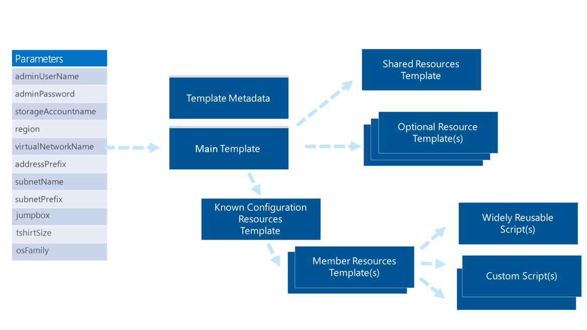
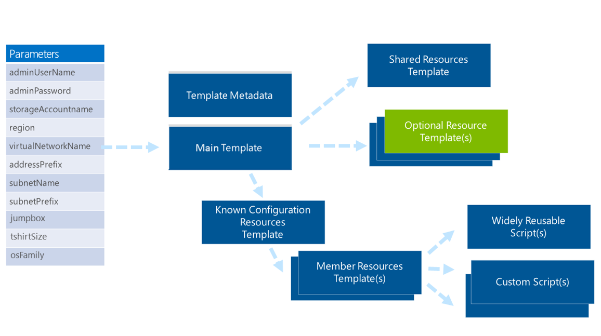

<properties
    pageTitle="Resource Manager 模板中的模式 | Azure"
    description="演示 Azure 资源管理器模板的设计模式"
    services="azure-resource-manager"
    documentationcenter=""
    author="tfitzmac"
    manager="timlt"
    editor="tysonn" />
<tags
    ms.assetid="ce1141d6-ece7-4976-acea-1db1f775409e"
    ms.service="azure-resource-manager"
    ms.workload="multiple"
    ms.tgt_pltfrm="na"
    ms.devlang="na"
    ms.topic="article"
    ms.date="12/19/2016"
    wacn.date="01/06/2017"
    ms.author="tomfitz" />  

# 用于设计 Azure Resource Manager 模板的模式
使用基于 Azure Resource Manager 模板的灵活方法，可以快速、一致地部署复杂的拓扑。随着核心产品的发展，你可以轻松地调整这些部署或适应外来方案或客户的变化。

本主题是包含更多内容的白皮书的一部分。若要阅读完整的白皮书，请下载[一流的 Azure Resource Manager 模板注意事项和成熟的做法]（http://download.microsoft.com/download/8/E/1/8E1DBEFA-CECE-4DC9-A813-93520A5D7CFE/World%20Class%20ARM%20Templates%20-%20Considerations%20and%20Proven%20Practices.pdf）。

模板结合了底层 Azure 资源管理器的优点，以及 JavaScript 对象表示法 (JSON) 的自适应性和易读性。使用模板可以：

* 以一致的方式部署拓扑及其工作负荷。
* 使用资源组统一管理应用程序中的所有资源。
* 应用基于角色的访问控制 (RBAC)，以授予用户、组和服务适当的访问权限。
* 使用标记关联来简化任务，例如累积计费。

本文提供有关在设计会话以及真实世界中与 Azure 客户咨询团队 (AzureCAT) 客户进行模板实施过程中所确定的使用方案、体系结构和实施模式的详细信息。姑且不论学术理论是什么，这些方法已经实践实证，建立在针对 12 个基于 Linux 的顶级 OSS 技术开发的模板基础之上，这些技术包括：Apache Kafka、Apache Spark、Cloudera、Couchbase、Hortonworks HDP、Apache Cassandra 提供的 DataStax Enterprise、Elasticsearch、Jenkins、MongoDB、Nagios、PostgreSQL、Redis 和 Nagios。

本文将分享这些经过实证的最佳实践，以帮助你设计一流的 Azure 资源管理器模板。

通过与客户合作，我们已在企业、系统集成商 (SI) 和 CSV 之间确定了多个 Resource Manager 模板使用体验。以下部分提供了适用于不同客户类型的常见方案和模式的整体概述。

## 企业和系统集成商
在大型组织中，我们常看到 Resource Manager 模板的两类使用者：内部软件开发团队和企业 IT 部门。我们发现 SI 方案可对应到企业方案，因此相同的考虑因素同样适用。

### 内部软件开发团队
如果团队要开发软件来支持业务，使用模板可以快速轻松地部署可用于业务特定解决方案的技术。你也可以使用模板快速创建培训环境，让团队成员能够获得所需的技巧。

你可以按原样使用模板，或者根据你的需要进行扩展或改编。通过在模板中使用标记，可以利用各种不同的视图（例如团队、项目、个人和教育）来提供帐单摘要。

企业通常希望软件开发团队创建用于一致部署解决方案的模板。模板便于约束，可使相应环境中的特定项固定不变、不能重写。例如，银行可能需要使用模板来包含 RBAC，使程序员无法修订银行解决方案来将数据发送到个人存储帐户。

### 企业 IT
企业 IT 组织通常使用模板来传送云容量和云托管功能。

#### 云容量
企业 IT 小组为团队提供云容量的方式通常是使用“T 恤尺寸”，也就是标准产品的尺寸（例如，小、中和大）。T 恤尺寸的产品可以混合不同的资源类型和数量，同时提供标准化级别让你使用模板。模板以一致的方式提供容量，强制实施企业策略，并使用标记来为使用方组织提供分摊。

例如，你可能需要提供开发、测试或生产环境，使软件开发团队可以在其中部署解决方案。环境具有软件开发团队无法更改的预定义网络拓扑和元素，例如，用于管理公共 Internet 访问权限以及数据包检查的规则。你还可以对这些环境使用不同的环境访问权限来配置组织特定的角色。

#### 云托管功能
你可以使用模板来支持云托管的功能，包括各个软件包，或者提供给内部业务线的复合产品。复合产品的一个示例是在预定义的网络拓扑上利用优化、连接的配置提供的“分析即为服务”（分析、可视化和其他技术）。

云托管功能受到构建它们的云容量产品所创建的安全性和角色考虑因素所影响。这些功能按原样提供，或者作为托管服务提供。对于后者，需要使用访问受限的角色才能出于管理目的启用对环境的访问。

## 云服务供应商
在与许多 CSV 沟通之后，我们找到了了许多方案让你为客户和针对相关要求部署服务。

### CSV 托管产品
如果你在自己的 Azure 订阅中托管产品，有两种常见的托管方法：对不同的客户使用不同的部署，或者部署缩放单位，建立所有客户使用的共享基础结构。

* **对每位客户使用不同的部署。** 对每位客户使用不同的部署需有不同已知配置的固定拓扑。这些部署可能有不同的虚拟机 (VM) 大小、不同的节点数，以及不同的关联存储量。部署的标记可用于累积每位客户的帐单。可以启用 RBAC 来允许客户访问其云环境的各个层面。
* **共享多租户环境中的缩放单位。** 模板可以代表多租户环境的缩放单位。在此情况下，同一基础结构可用于支持所有客户。部署代表一组可针对所托管产品提供容量级别（例如，用户数和事务数）的资源。这些缩放单位可按需增大或减小。

### 将 CSV 产品注入客户订阅
可能想要将软件部署到客户拥有的订阅。可以使用模板将不同的部署产品部署到客户的 Azure 帐户中。

这些部署使用 RBAC，因此，你可以在客户的帐户中更新和管理部署。

### Azure 应用商店
若要通过应用商店（例如 Azure 应用商店）宣传和销售产品，可以开发模板来提供不同类型的、在客户的 Azure 帐户中运行的部署。这些不同的部署通常可描述为 T 恤尺寸（小、中、大）、产品/受众类型（社区、开发人员、企业）或功能类型（基本、高可用性）。在某些情况下，这些类型允许指定某些部署属性，例如 VM 类型或磁盘数。

## OSS 项目
在开放源代码项目中，资源管理器模板可让社区使用经过证实的做法快速部署解决方案。你可以在 GitHub 存储库中存储模板，使社区可在一段时间之后修改它们。用户可在自己的 Azure 订阅中部署这些模板。

以下部分描述了在设计解决方案之前需要考虑的事项。

## 识别 VM 内部和外部的项
设计模板时，最好考虑虚拟机 (VM) 内部与外部的相关项要求：

* 外部表示部署的 VM 和其他资源，例如，网络拓扑、标记、对证书/机密的引用，以及基于角色的访问控制。所有这些资源都是模板的一部分。
* 内部表示已安装的软件和整体所需的状态配置。其他机制（例如 VM 扩展或脚本）可以完全使用或部分使用。模板也许能够识别和执行这些机制，但这些机制并不在模板中。

可以在“箱内”执行的常见活动示例包括：

* 安装或删除服务器角色和功能
* 在节点或群集级别安装和配置软件
* 在 Web 服务器上部署网站
* 部署数据库架构
* 管理注册表或其他类型的配置设置
* 管理文件和目录
* 启动、停止和管理进程与服务
* 管理本地组和用户帐户
* 安装和管理包（.msi、.exe、yum 等）
* 管理环境变量
* 运行本机脚本（Windows PowerShell、bash 等）

### 所需状态配置 (DSC)
在部署范畴以外考虑 VM 的内部状态，需要确保这种部署不会从定义并签入源代码管理的配置中“漂移”。该方法可以确保开发人员或操作人员不会对环境做出尚未在源代码管理中检查、测试或记录的即席更改。这种控制很重要，因为手动更改不是在源代码管理中进行的。手动更改也不是标准部署的一部分，会影响将来的软件自动化部署。

从安全的立场来看，除了内部员工，所需状态配置也很重要。黑客总会试图泄漏和利用软件系统。如果得手，则他们往往会安装文件，或者更改已遭入侵的系统的状态。使用所需状态配置，可以识别所需状态与实际状态之间的差异，并还原已知的配置。

DSC 可以使用最热门机制的一些资源扩展 - PowerShell DSC、Chef 和 Puppet。其中的每个扩展都能部署 VM 的初始状态，还可用于确保维持所需的状态。

## 通用模板范围
根据经验，我们发现了三个主要的解决方案模板范围。稍后各节将对这三个范围（容量、功能和端到端解决方案）进行介绍。

### 容量范围
容量范围可在标准拓扑中提供一组经过预先配置、可遵循法规和策略的资源。最常见的示例是在企业 IT 或 SI 方案中部署标准开发环境。

### 功能范围
功能范围侧重于部署和配置给定技术的拓扑。常见的方案包括 SQL Server、Cassandra、Hadoop 等技术。

### 端到端解决方案范围
端到端解决方案范围的目标不只是单项功能，而是注重于提供由多个功能组成的端到端解决方案。

划归到解决方案的模板范围将其本身列为一个或多个已划分功能的模板的集，其中包含解决方案特定的资源、逻辑和所需状态。解决方案范围内的模板的一个示例是端到端数据管道解决方案模板。模板可能与多个功能范围解决方案模板（例如 Kafka、Storm 和 Hadoop）混合解决方案特定拓扑和状态。

## 选择自由格式配置与已知配置
最初你可能认为模板应该为使用者提供最大的弹性，但有许多考虑因素影响到自由格式配置与已知配置的选择。本部分将列出重要的客户要求，以及构成本文档所分享方案的技术考虑因素。

### 自由格式配置
表面上，自由格式配置听起来很实用。模板允许选择 VM 类型，并提供任意数目的节点以及这些节点的附加磁盘作为模板参数。但是，有些方案不适合使用此方法。

[虚拟机大小](/documentation/articles/virtual-machines-windows-sizes/)介绍了不同的 VM 类型和可用大小，以及每种可附加的持久性磁盘数目（2、4、8、16 或 32）。每个附加的磁盘提供 500 IOPS，可将这些磁盘的倍数组建成池，以成倍提高 IOPS 数目。例如，可将 16 个磁盘组建成池，以提供 8,000 IOPS。可以使用 Microsoft Windows 存储空间或者在 Linux 使用价格便宜的磁盘冗余阵列 (RAID)，使用操作系统中的配置来实现池的组建。

自由格式配置允许选择多个 VM 实例，并为这些实例选择多个 VM 类型和大小，每个 VM 类型可选择多个磁盘，还可选择一个或多个脚本来配置 VM 内容。

通常，部署可能有多种类型的节点（例如主节点和数据节点），因此，经常对每个节点类型提供此弹性。

开始部署具有任何重要性的群集，就要开始处理这些复杂方案。例如，如果你在部署 Hadoop 群集，其中有 8 个主节点和 200 个数据节点，并且每个主节点上组建了包含 4 个附加磁盘的池，每个数据节点上共享了 16 个附加磁盘，那么，有 208 个 VM 和 3,232 个磁盘需要管理。

存储帐户将根据它所识别出的每秒 20,000 个事务限制上调节请求，因此，应该查看存储帐户的分区，并使用计算来确定适当数的存储帐户以配合此拓扑。假设自由格式的方法支持多种组合，则需要动态计算来确定适当的分区。Azure 资源管理器模板语言当前不提供数学函数，因此必须在代码中执行这些计算，生成唯一的硬编码模板以及适当的详细信息。

在企业 IT 和 SI 方案中，必须有人维护模板，并支持为一个或多个组织部署的拓扑。这种额外的开销（每位客户有不同的配置和模板）远不够理想。

你可以使用这些模板在客户的 Azure 订阅中部署环境，但是企业 IT 团队和 CSV 通常将它们部署到自己的订阅，使用分摊功能向客户收费。在这种情况下，目标是要跨订阅池部署适用于多个客户的容量，并让部署密集填入订阅中，以便将订阅的扩展最小化，也就是能够管理更多订阅。使用真正的动态部署大小，达到这种类型的密度需要仔细规划，并代表组织基架工作执行其他开发。

此外，无法通过 API 调用来创建订阅，而是必须通过门户手动执行此操作。随着订阅数的增加，任何产生的订阅扩展都必须人为介入，而无法自动化。由于部署的大小如此多变，因此必须手动预先设置一些订阅，以确保有订阅可供使用。

考虑所有这些因素，真正的自由格式配置乍看之下不是那么有吸引力。

### 已知配置 - T 恤尺寸法
根据我们的经验，与其给予模板来提供整体弹性和无数种差异，不如采用一种常用模式，就是提供选择已知配置的功能 - 实际上，是诸如沙箱、小、中和大之类的标准 T 恤尺寸。T 恤尺寸的其他示例包括产品，例如社区版本或企业版本。在其他情况下，这可能是某种技术的工作负荷特定配置，例如，映射化简或 No SQL。

许多企业 IT 组织、OSS 供应商和 SI 当前都能在本地虚拟化环境（企业）中或作为“软件即为服务”(SaaS) 产品（CSV 和 OSV）使用这种方式来使他们的产品可供使用。

这种方法可对于预先为客户配置好的各种大小提供正常且已知的配置。如果没有已知配置，客户就必须自行确定群集大小、整合平台资源约束，以及执行数学运算来识别存储帐户的生成分区和其他资源（因群集大小和资源约束而导致）。已知配置使客户能够轻松选择正确的 T 恤尺寸，也就是给定的部署。除了为客户提供更好的体验，少量的已知配置可让你更轻松地提供支持，并帮助你提供较高的密度级别。

着重于 T 恤尺寸的已知配置方法在某个尺寸内可能还拥有各种节点数。例如，小型 T 恤尺寸可能介于 3 和 10 个节点之间。T 恤尺寸在设计上最多可容纳 10 个节点，并可让使用者进行任意形式的选择（最多可达已识别出的大小上限）。

在可部署的节点数方面，基于工作负荷类型的 T 恤尺寸在性质上可能更自由，但是对节点上的软件生成工作负荷完全不同的节点大小与配置。

基于产品的 T 恤尺寸（例如社区或企业）可能有不同的资源类型和可部署的节点数上限，通常受到不同产品的授权考虑因素或功能可用性的影响。

你还可以使用基于 JSON 的模板，通过独特的变体来配合客户。处理离群值时，你可以纳入有关开发、支持和成本的相应规划与考虑。

根据客户模板使用方案以及本文档开头所述的要求，我们确定了模板分解的模式。

## 划归容量和功能的解决方案模板
分解可以提供模板开发的模块化方法，支持重复使用、可扩展性、测试和工具。本部分详细说明如何将分解方法应用到具有容量或功能范围的模板。

在这种方法中，主模板接收来自模板使用者的参数值，然后链接到下游的多种类型的模板和脚本，如下所示。参数、静态变量和生成的变量用于提供进出链接模板的值。

**参数传递给主模板，然后传递给链接的模板**

后面的部分重点介绍模板类型和单个模板分解成的脚本。这些部分介绍用于在模板之间传递状态信息的方法。此图中的每个模板和脚本类型都配合了示例来说明。有关上下文示例，请参阅本文档后面的“整合在一起：示例实现”。

### 模板元数据
模板元数据（metadata.json 文件）包含使用 JSON 描述模板的键/值对，使用户和软件系统可以读取该模板。

**模板元数据在 metadata.json 文件中描述**

软件代理可以检索 metadata.json 文件，并在网页或目录中发布信息以及模板的链接。元素包括 *itemDisplayName* 、 *description* 、 *summary* 、 *githubUsername* 和 *dateUpdated* 。

下面显示了完整的示例文件。

    {
        "itemDisplayName": "PostgreSQL 9.3 on Ubuntu VMs",
        "description": "This template creates a PostgreSQL streaming-replication between a master and one or more slave servers each with 2 striped data disks. The database servers are deployed into a private-only subnet with one publicly accessible jumpbox VM in a DMZ subnet with public IP.",
        "summary": "PostgreSQL stream-replication with multiple slave servers and a publicly accessible jumpbox VM",
        "githubUsername": "arsenvlad",
        "dateUpdated": "2015-04-24"
    }

### 主模板
主模板从用户接收参数，使用该信息来填充复杂对象变量并执行链接的模板。

  

**主模板接收来自用户的参数**

提供的一个参数是已知配置类型，因为它使用标准化值（例如，小、中或大），因此也称为 T 恤尺寸参数。在实践中，可以多种方式使用此参数。有关详细信息，请参阅本文档后面的“已知配置资源模板”。

无论用户参数指定的已知配置为何，都会部署某些资源。这些资源使用单个共享资源模板进行设置，并与其他模板共享，因此可以先运行共享的资源模板。

无论指定的已知配置为何，都会选择性地部署某些资源。

### 共享的资源模板
此模板提供所有已知配置公用的资源。其中包含虚拟网络、可用性集和所需的其他资源，无论部署的已知配置模板为何。

  

**共享的资源模板**

资源名称（例如虚拟网络名称）基于主模板。你可以根据组织的需要，将资源名称指定为该模板中的变量，或者以参数形式从用户处接收资源名称。

### 可选资源模板
可选资源模板包含基于参数或变量值且以编程方式部署的资源。

  

**可选资源模板**

例如，可以使用可选资源模板来配置 Jumpbox，以便从公共 Internet 间接访问部署的环境。使用参数或变量来识别是否应启用 Jumpbox，并使用 *concat* 函数来构建模板的目标名称，例如 *jumpbox\_enabled.json* 。模板链接将使用生成的变量来安装 Jumpbox。

可以从多个位置链接可选资源模板：

* 如果适用于每种部署，可以从共享的资源模板创建参数驱动的链接。
* 如果适合选择已知配置（例如，仅安装在大型部署上），可以从已知配置模板创建参数驱动或变量驱动的链接。

给定的资源是否为可选不是由模板使用者决定，而是由模板提供者决定。例如，你可能需要满足特定的产品要求或产品附加组件（对于 CSV 而言很常见）或强制实施策略（对于 SI 和企业 IT 小组而言很常见）。在这种情况下，你可以使用变量来确定是否应该部署资源。

### 已知配置资源模板
在主模板中，可以公开参数，以允许模板使用者指定要部署的所需已知配置。通常这种已知配置使用具有一组固定配置大小（例如，沙箱、小、中和大）的 T 恤尺寸方法。

  

**已知配置资源模板**

通常会使用 T 恤尺寸方法，但参数可以代表任何已知配置的集。例如，你可以为企业应用程序指定一组环境，例如，开发、测试和生产。或者，可以针对云服务使用它来代表不同的缩放单位、产品版本或产品配置，例如，社区、开发人员或企业。

与共享的资源模板一样，变量将从以下任一处传递给已知配置模板：

* 最终用户 - 也就是说，将参数发送到主模板。
* 组织 - 也就是说，主模板中代表内部要求或策略的变量。

### 成员资源模板
在已知配置中，经常会包含一个或多个成员节点类型。例如，使用 Hadoop 时，会有主节点和数据节点。如果要安装 MongoDB，则会有数据节点和仲裁器。如果要部署 DataStax，则会有数据节点，以及装有 OpsCenter 的 VM。

  

**成员资源模板**

每种类型的节点可能具有不同大小的 VM、附加的磁盘数、用于安装和设置节点的脚本、VM 的端口配置、实例数和其他详细信息。因此，每个节点类型都有自身的成员资源模板，其中包含有关部署和配置基础结构，以及执行脚本以在 VM 中部署和配置软件的详细信息。

对于 VM，通常会使用两种类型的脚本：广泛可重复使用和自定义的脚本。

### 广泛可重复使用的脚本
广泛可重复使用的脚本可以在多种类型的模板上使用。这些广泛可重复使用脚本的一个较好示例是在 Linux 上配置 RAID 以组建磁盘池，并获得更大的 IOPS 数量。无论 VM 中安装了哪种软件，此脚本都能让你针对常见方案运用经过证实的重复使用体验。

  

**成员资源模板可以调用广泛可重复使用的脚本**

### 自定义脚本
模板通常会调用一个或多个脚本，用于在 VM 中安装和配置软件。在部署了一个或多个成员类型的多个实例的大型拓扑中经常会使用一种模式。将对每个可并行运行的 VM 启动安装脚本，接着会在部署所有 VM（或给定成员类型的所有 VM）之后调用设置脚本。

  

**成员资源模板可出于特定目的（例如 VM 配置）调用脚本**

## 划归功能的解决方案模板示例 - Redis
为了演示实施的可能工作原理，让我们来看一个有关构建模板的实践示例，该模板将以标准 T 恤尺寸法来简化 Redis 的部署和配置。

为部署提供了一组共享资源（虚拟网络、存储帐户、可用性集）和一个可选资源 (Jumpbox)。有多个以 T 恤尺寸（小、中、大）表示的已知配置，但每个配置使用单一节点类型。此外，还有两个具有特定用途的脚本（安装、配置）。

### 创建模板文件
创建名为 azuredeploy.json 的主模板。

创建名为 shared-resources.json 的共享资源模板

创建用于启用 Jumpbox 部署的可选资源模板，其名为 jumpbox\_enabled.json

Redis 只使用单一节点类型，因此要创建名为 node-resources.json 的单个成员资源模板。

借助 Redis，你会安装每个节点，然后设置群集。可以使用脚本 (redis-cluster-install.sh 和 redis-cluster-setup.sh) 来完成安装和设置。

### 链接模板
主模板使用模板链接向外链接到共享资源模板，以建立虚拟网络。

在主模板中添加逻辑，使模板使用者能够指定是否应部署 Jumpbox。 *EnableJumpbox* 参数的 *enabled* 值指示客户想要部署 Jumpbox。如果提供了此值，模板将串联 *\_enabled* 作为 Jumpbox 功能的基本模板名称后缀。

主模板应用 *large* 参数值作为 T 恤尺寸的基本模板名称后缀，然后使用模板中的该值向外链接到 *technology\_on\_os\_large.json*。

拓扑类似于下图。

**Redis 模板的模板结构**

### 配置状态
对于群集中的节点，有两个步骤可用于配置状态，这两个步骤通过具有特定用途的脚本来表示。“redis-cluster-install.sh” 安装 Redis，“redis-cluster-setup.sh”设置群集。

### 支持不同大小的部署
在变量内部，T 恤尺寸模板针对特定大小 ( *large* ) 指定每个要部署类型的节点数。然后，该模板通过从 *copyIndex()* 附加包含数字序号的节点名称提供资源的唯一名称，使用资源循环来部署该数目的 VM 实例。将根据 T 恤名称模板中的定义，对热区和暖区 VM 执行这些步骤

## 分解和划归到端到端解决方案的模板
具有端到端解决方案范围的解决方案模板侧重于提供端到端解决方案。该方法通常是多个已划归功能的模板及其他资源、逻辑和状态的组合。

如下图中突出显示部分所示，用于已划归功能的模板的同一模型，已针对具有端到端解决方案范围的模板进行扩展。

共享资源模板和可选资源模板提供的功能与已划归容量和功能的模板方法中一样，但已划归到端到端解决方案。

由于已划归到端到端解决方案的模板通常还有 T 恤尺寸，因此，已知配置资源模板反映了解决方案的给定已知配置所需的项。

已知配置资源模板链接到一个或多个与端到端解决方案相关的划归功能的解决方案模板，以及端到端解决方案所需的成员资源模板。

当解决方案的 T 恤尺寸可能与划归功能的单个模板不同时，已知配置资源模板中的变量可用于针对下游已划归功能的解决方案模板提供适当值，以部署适当的 T 恤尺寸。

  

**随时可以针对端到端解决方案模板范围扩展用于已划归容量或功能的解决方案模板的模型**

## 准备应用商店的模板
使用前面的方法随时可以适应企业、SI 和 CSV 自行部署模板，或者客户自行部署项目的方案。

另一个所需的方案是通过应用商店部署模板。此分解方法也适用于应用商店，不过略有差异。

如前所述，模板可用于提供不同的部署类型，以便在应用商店中进行销售。不同的部署类型可以是 T 恤尺寸（小、中、大）、产品/受众类型（社区、开发人员、企业）或功能类型（基本、高可用性）。

如下所示，你随时可以使用现有的端到端解决方案或已划归功能的模板，在应用商店中列出不同的已知配置。

先修改主模板的参数，以删除名为 tshirtSize 的入站参数。

将不同的部署类型映射到已知配置资源模板时，这些类型还需要共享资源模板中的通用资源和配置，并且还可能需要可选资源模板中的这些资源和配置。

如果想要将模板发布到应用商店，请创建主模板的不同副本，并将以前提供的 tshirtSize 入站参数替换为嵌入在模板中的变量。

  

**为应用商店改编划归解决方案的模板**

## 后续步骤
* 至于如何在 Azure 资源管理器中处理安全事项，请参阅 [Azure 资源管理器的安全注意事项](/documentation/articles/best-practices-resource-manager-security/)以获取相关建议
* 若要了解进出模板的状态，请参阅[共享 Azure 资源管理器模板中的状态](/documentation/articles/best-practices-resource-manager-state/)。
* 如需了解企业如何使用 Resource Manager 对订阅进行有效管理，请参阅 [Azure 企业机架 - 规范性订阅管理](/documentation/articles/resource-manager-subscription-governance/)。

<!---HONumber=Mooncake_0103_2017-->