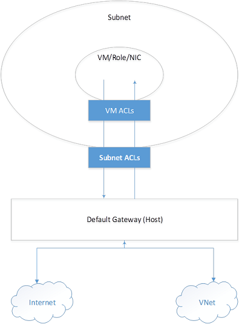
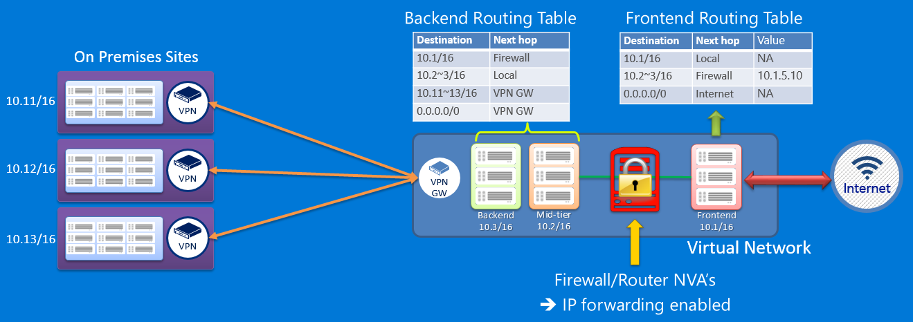

<properties
    pageTitle="Resource Manager 的安全注意事项 | Azure"
    description="显示了在 Azure 资源管理器中如何使用建议的方法通过密钥和机密、基于角色的访问控制以及网络安全组来确保资源的安全。"
    services="azure-resource-manager"
    documentationcenter=""
    author="george-moore"
    manager="georgem"
    editor="tysonn" />  

<tags
    ms.assetid="c862e9c7-276b-46bf-bc0a-11868ac11459"
    ms.service="azure-resource-manager"
    ms.workload="multiple"
    ms.tgt_pltfrm="na"
    ms.devlang="na"
    ms.topic="article"
    ms.date="08/01/2016"
    wacn.date="12/26/2016"
    ms.author="georgem;tomfitz" />  

# Azure 资源管理器的安全注意事项
关于 Azure 资源管理器模板的安全事项，有几个方面需要考虑，即密钥和机密、基于角色的访问控制，以及网络安全组。

本主题假定用户熟悉 Azure Resource Manager 中基于角色的访问控制 (RBAC)。有关详细信息，请参阅 [Azure 基于角色的访问控制](/documentation/articles/role-based-access-control-configure/)。

本主题是包含更多内容的白皮书的一部分。若要阅读完整的白皮书，请下载 [一流的 ARM 模板注意事项和成熟的做法](http://download.microsoft.com/download/8/E/1/8E1DBEFA-CECE-4DC9-A813-93520A5D7CFE/World%20Class%20ARM%20Templates%20-%20Considerations%20and%20Proven%20Practices.pdf)。

## 机密和证书
将 Azure 虚拟机、Azure 资源管理器和 Azure 密钥保管库完全集成后，即可提供相关支持，以便安全地处理将要在 VM 中部署的证书。最好是将 Azure 密钥保管库与资源管理器一起使用，以便管理和存储 VM 机密和证书。这样做有以下好处：

* 模板只包含机密的 URI 引用，这意味着实际机密不在代码、配置或源代码存储库中。这样可防止他人对内部或外部存储库（例如 GitHub 中的 harvest-bot）进行密钥钓鱼攻击。
* 受信任的操作员可以通过 RBAC 来完全控制密钥保管库中存储的机密。如果这个受信任的操作员离开了公司或者转到了公司内部的新组中，该操作员将无法继续访问该保管库中创建的密钥。
* 对所有资产进行完全的区室化：
  * 用于部署密钥的模板
  * 用于部署带密钥引用的 VM 的模板
  * 保管库中实际的密钥材料。可以为每个模板（和操作）分配不同的 RBAC 角色，以便将不同职责完全分开。
* 在部署时将机密加载到 VM 需通过 Azure 结构和密钥保管库（位于 Microsoft 数据中心）之间的直接通道进行。一旦将密钥置于密钥保管库中，将无法通过数据中心外不受信任的管道来查看这些密钥。
* 密钥保管库始终是区域性的，因此 VM 的机密始终具有地区性（和自主性）。没有全局密钥保管库。

### 将密钥与部署分开
遇到以下情况时，最好是使用单独的模板：

1. 创建保管库（将包含密钥材料）
2. 部署 VM（带保管库中所含密钥的 URI 引用）

一个典型的企业方案是，允许一小组受信任的操作员访问已部署工作负载中的关键机密，同时允许范围更广的一组开发/运营人员可以创建或更新 VM 部署。下面是一个示例性的 ARM 模板，可在 Azure Active Directory 中使用当前经过身份验证的用户的标识来创建和配置新的保管库。该用户可以使用其默认权限，在这个新的密钥保管库中创建、删除、列出、更新、备份、还原和获取公共密钥。

虽然此模板中的大多数字段都很直观明了，但 **enableVaultForDeployment** 设置还是需要解释一下：保管库通常并不默认允许其他 Azure 基础结构组件进行访问。设置此值之后，Azure 计算基础结构组件即可对这个特定的保管库进行只读访问。因此还需指出的是，最好不要将公司的敏感数据与虚拟机机密置于同一保管库中。

    {
        "$schema": "https://schema.management.azure.com/schemas/2015-01-01/deploymentTemplate.json#",
        "contentVersion": "1.0.0.0",
        "parameters": {
            "keyVaultName": {
                "type": "string",
                "metadata": {
                    "description": "Name of the Vault"
                }
            },
            "location": {
                "type": "string",
                "allowedValues": ["China East", "China North"],
                "metadata": {
                    "description": "Location of the Vault"
                }
            },
            "tenantId": {
                "type": "string",
                "metadata": {
                    "description": "Tenant Id of the subscription. Get using Get-AzureSubscription cmdlet or Get Subscription API"
                }
            },
            "objectId": {
                "type": "string",
                "metadata": {
                    "description": "Object Id of the AD user. Get using Get-AzureADUser cmdlet"
                }
            },
            "skuName": {
                "type": "string",
                "allowedValues": ["Standard", "Premium"],
                "metadata": {
                    "description": "SKU for the vault"
                }
            },
            "enableVaultForDeployment": {
                "type": "bool",
                "allowedValues": [true, false],
                "metadata": {
                    "description": "Specifies if the vault is enabled for a VM deployment"
                }
            }
        },
        "resources": [{
            "type": "Microsoft.KeyVault/vaults",
            "name": "[parameters('keyVaultName')]",
            "apiVersion": "2014-12-19-preview",
            "location": "[parameters('location')]",
            "properties": {
                "enabledForDeployment": "[parameters('enableVaultForDeployment')]",
                "tenantid": "[parameters('tenantId')]",
                "accessPolicies": [{
                    "tenantId": "[parameters('tenantId')]",
                    "objectId": "[parameters('objectId')]",
                    "permissions": {
                        "secrets": ["all"],
                        "keys": ["all"]
                    }
                }],
                "sku": {
                    "name": "[parameters('skuName')]",
                    "family": "A"
                }
            }
        }]
    }

创建保管库后，下一步就是在新 VM 的部署模板中引用该保管库。如上所述，最佳做法是让其他开发/运营小组来管理 VM 部署，该小组不能直接访问保管库中存储的密钥。

以下模板片段将整合到更高级的部署构造中，每种构造都可以安全且稳定地引用高度敏感的机密，这些机密不在操作员的直接控制之下。

    "vaultName": {
        "type": "string",
        "metadata": {
            "description": "Name of Key Vault that has a secret"
        }
    },
    {
        "apiVersion": "2015-05-01-preview",
        "type": "Microsoft.Compute/virtualMachines",
        "name": "[parameters('vmName')]",
        "location": "[parameters('location')]",
        "properties": {
            "osProfile": {
                "secrets": [{
                    "sourceVault": {
                        "id": "[resourceId('vaultrg', 'Microsoft.KeyVault/vaults', 'kayvault')]"
                    },
                    "vaultCertificates": [{
                        "certificateUrl": "[parameters('secretUrlWithVersion')]",
                        "certificateStore": "My"
                    }]
                }]
            }
        }
    }

在部署模板的过程中，若要以参数形式传递密钥保管库中的值，请参阅[在部署期间传递安全值](/documentation/articles/resource-manager-keyvault-parameter/)。

## 负责跨订阅交互的服务主体
服务标识由 Active Directory 中的服务主体表示。将由服务主体主要负责为企业 IT 组织、系统集成商 (SI) 和云服务供应商 (CSV) 启用密钥方案。具体说来，将会存在这样的用例：一家这样的组织需要与一位客户的订阅进行交互。

用户的组织可以提供一种产品/服务来监视部署在客户的环境和订阅中的解决方案。在这种情况下，你需要访问客户帐户中的日志和其他数据，以便将其用在监视解决方案中。如果用户是一家企业 IT 组织或系统集成商，则可能需要向客户提供一种产品/服务，在其中部署和管理一种功能，例如数据分析平台，通过该平台让产品/服务驻留在客户自己的订阅中。

在这些用例中，你的组织需要通过一个标识进行相关访问，以便在使用客户订阅的情况下执行这些操作。

这些方案带给他们一些针对客户的思考：

* 出于安全原因，需要将访问时所能执行的操作进行限制，只允许执行特定类型的操作（例如只读访问）。
* 就像部署资源需要成本一样，出于财务方面的考虑，也可以对所需访问权限进行类似的限制。
* 出于安全原因，可能需要将访问局限于特定的一项资源（存储帐户）或多项资源（包含环境或解决方案的资源组）
* 由于与供应商的关系可能会变化，因此客户希望能够启用/禁用对 SI 或 CSV 的访问权限
* 由于针对该帐户的操作需要付费，因此客户希望能够获得计费审核和会计方面的支持。
* 客户希望能够从合规性的角度对你在其环境中的行为进行审核

为了满足这些要求，可以将服务主体和 RBAC 结合起来。

## 网络安全组
许多方案都会有特定的要求，要求指定具体的控制方法来控制流向你的虚拟网络中一个或多个 VM 实例的流量。你可以使用网络安全组 (NSG) 在 ARM 模板部署过程中这样做。

网络安全组是与你的订阅相关联的顶层对象。NSG 包含特定的访问控制规则，可以通过这些规则来允许或拒绝流向 VM 实例的流量。可以随时更改 NSG 的规则，所做的更改适用于所有关联的实例。若要使用 NSG，你必须有一个与某区域（位置）关联的虚拟网络。NSG 不兼容与地缘组关联的虚拟网络。如果你没有区域性虚拟网络却又希望控制流向终结点的流量，请参阅[关于网络访问控制列表 (ACL)](/documentation/articles/virtual-networks-acl/)。

你可以将 NSG 与 VM 相关联，也可以将其与虚拟网络中的子网相关联。与 VM 关联后，NSG 适用于 VM 实例所发送和接收的所有通信。应用到虚拟网络中的子网以后，它将适用于子网中所有 VM 实例发送和接收的所有通信。一个 VM 或子网只能与 1 个 NSG 相关联，但每个 NSG 都可以包含多达 200 条规则。每个订阅可以有 100 个 NSG。

> [AZURE.NOTE]
不支持将基于终结点的 ACL 和网络安全组置于相同 VM 实例上。如果你想要使用 NSG，但已有了终结点 ACL，则请先删除该终结点 ACL。有关如何执行此操作的信息，请参阅[使用 PowerShell 管理终结点的访问控制列表 (ACL)](/documentation/articles/virtual-networks-acl-powershell/)。

### 网络安全组工作原理
网络安全组不同于基于终结点的 ACL。终结点 ACL 只适用于通过输入终结点公开的公共端口。NSG 适用于一个或多个 VM 实例，并可控制 VM 上的所有入站和出站流量。

网络安全组有一个 *名称* ，与一个 *区域* （所支持的 Azure 位置之一）相关联，并且有一个描述性标签。它包含两种类型的规则，分为入站规则和出站规则。入站规则适用于传入到 VM 的传入数据包，出站规则适用于从 VM 传出的传出数据包。这些规则将应用到 VM 所在的服务器。传入或传出数据包必须符合“允许”规则才能传入或传出，否则会被丢弃。

规则将按优先级顺序处理。例如，优先级编号较低的规则（如优先级编号为 100）在处理时将先于优先级编号较高的规则（如优先级编号为 200）。找到匹配项之后，将不再对规则进行处理。

规则会指定以下内容：

* Name：规则的唯一标识符
* Type：Inbound/Outbound
* Priority：从 100 到 4096 的整数（规则将按此数字从低到高进行处理）
* Source IP Address：源 IP 范围的 CIDR
* Source Port Range：0 到 65536 之间的整数或范围
* Destination IP Range：目标 IP 范围的 CIDR
* Destination Port Range：0 到 65536 之间的整数或范围
* Protocol：TCP、UDP 或“\*”
* Access：Allow/Deny

### 默认规则
NSG 包含默认规则。默认规则无法删除，但由于给它们分配的优先级最低，可以用创建的规则来重写它们。默认规则描述平台所推荐的默认设置。正如以下默认规则所阐述的那样，从方向上来说，在虚拟网络中发起和结束的通信可以是入站通信，也可以是出站通信。

虽然出站方向的通信允许连接到 Internet，但默认情况下，入站方向的通信在连接到 Internet 时会被阻止。默认规则允许 Azure Load Balancer 查看 VM 的运行状况。如果 NSG 节点下的 VM 或 VM 集不参与负载均衡集，你可以重写此规则。

默认规则显示在下面的表中。

**入站默认规则**

| 名称 | 优先级 | 源 IP | 源端口 | 目标 IP | 目标端口 | 协议 | 访问 |
| --- | --- | --- | --- | --- | --- | --- | --- |
| 允许 VNET 入站 |65000 |VIRTUAL\_NETWORK |* |VIRTUAL\_NETWORK |* |* |允许 |
| 允许 AZURE LOAD BALANCER 入站 |65001 |AZURE\_LOADBALANCER |* |* |* |* |允许 |
| 拒绝所有入站 |65500 |* |* |* |* |* |拒绝 |

**出站默认规则**

| 名称 | 优先级 | 源 IP | 源端口 | 目标 IP | 目标端口 | 协议 | 访问 |
| --- | --- | --- | --- | --- | --- | --- | --- |
| 允许 VNET 出站 |65000 |VIRTUAL\_NETWORK |* |VIRTUAL\_NETWORK |* |* |允许 |
| 允许 INTERNET 出站 |65001 |* |* |INTERNET |* |* |允许 |
| 拒绝所有出站 |65500 |* |* |* |* |* |拒绝 |

### 特殊的基础结构规则
NSG 规则是显式的。除了 NSG 规则中指定的情况，不会对流量进行允许或拒绝操作。不过，不管网络安全组的规范如何，两类流量是始终允许的。进行这些预配是为了支持基础结构：

* **主机节点的虚拟 IP**：基础结构服务（如 DHCP、DNS 和运行状况监视）是通过虚拟化的主机 IP 地址 168.63.129.16 提供的。此公用 IP 地址属于 Microsoft，并将是唯一的用于所有区域的虚拟化 IP 地址，而且没有其他用途。此 IP 地址映射到托管 VM 的服务器计算机（主机节点）的物理 IP 地址。主机节点充当 DHCP 中继、DNS 递归解析器，以及进行负载均衡器运行状况探测和计算机运行状况探测的探测源。不应将针对此 IP 地址的通信视为一种攻击。
* **许可（密钥管理服务）**：在 VM 中运行的 Windows 映像应该获得许可。因此，将会向处理此类查询的密钥管理服务主机服务器发送许可请求。这将始终在出站端口 1688 上进行。

### 默认标记
默认标记是系统提供的针对某类 IP 地址的标识符。可以在用户定义的规则中指定默认标记。

**NSG 的默认标记**

| 标记 | 说明 |
| --- | --- |
| VIRTUAL\_NETWORK |表示你的所有网络地址空间。它包括虚拟网络地址空间（Azure 中的 IP CIDR）以及所有连接的本地地址空间（本地网络）。另外还包括虚拟网络到虚拟网络的地址空间。 |
| AZURE\_LOADBALANCER |表示 Azure 基础结构负载均衡器，将转换为 Azure 数据中心 IP，从中进行 Azure 运行状况探测。仅当与 NSG 关联的 VM 或 VM 集参与负载均衡集的情况下，才需要此项。 |
| INTERNET |表示虚拟网络外部的 IP 地址空间，可以通过公共 Internet 进行访问。此范围还包括 Azure 拥有的公共 IP 空间。 |

### 端口和端口范围
可以针对单个源或目标端口指定 NSG 规则，也可以针对端口范围来指定。当你需要为某个应用程序（如 FTP）打开一大系列的端口时，此方法特别有用。此范围必须是连续的，不能在其中指定单个端口。若要指定端口范围，请使用连字符 (-)。例如，**100-500**。

### ICMP 通信
根据当前的 NSG 规则，你可以指定 TCP 或 UDP 作为协议，但不能指定 ICMP 作为协议。但默认情况下，根据入站规则，虚拟网络中允许进行 ICMP 通信，因为该规则支持虚拟网络中任何端口的传入和传出通信，并支持 (*) 协议。

### 将 NSG 与 VM 相关联
当 NSG 与 VM 直接关联时，NSG 中的网络访问规则直接应用到目标为 VM 的所有通信。每当因为规则更改而更新 NSG 时，更新内容数分钟内就会体现在通信处理操作中。当 NSG 与 VM 不再关联时，状态将回到 NSG 之前的状态，即回到引入 NSG 之前的系统默认状态。

### 将 NSG 与子网相关联
当 NSG 与子网相关联时，NSG 中的网络访问规则将应用到子网中的所有 VM。每当更新 NSG 中的访问规则时，所做的更改将数分钟内应用到子网中的所有 VM。

### 将 NSG 与子网和 VM 相关联
你可以将一个 NSG 与 VM 相关联，将另一个 NSG 与 VM 所在的子网相关联。此方案可以为 VM 提供两层保护。对于入站流量，数据包先遵循子网中指定的访问规则，然后再遵循 VM 中的规则。当流量为出站流量时，数据包先遵循 VM 中指定的规则，然后再遵循子网中指定的规则，如下所示。

  

当 NSG 与 VM 或子网关联时，网络访问控制规则变得很明确。该平台不会插入任何允许流量流向特定端口的隐式规则。在这种情况下，如果你在 VM 中创建一个终结点，则还必须创建一项规则以允许来自 Internet 的流量。如果不执行该操作，则不能从外部访问 *VIP:{Port}* 。

例如，你可以创建新的 VM 和新的 NSG。你将 NSG 与 VM 相关联。该 VM 可以通过 ALLOW VNET INBOUND 规则与虚拟网络中的其他 VM 通信。该 VM 还可通过 ALLOW INTERNET OUTBOUND 规则进行连接到 Internet 的出站连接。随后，你可以在端口 80 上创建一个终结点以接收流到在 VM 中运行的网站的流量。除非你向 NSG 添加与下表类似的规则，否则从 Internet 流向 VIP（公用虚拟 IP 地址）上端口 80 的数据包将不会到达 VM。

**允许流量流向特定端口的显式规则**

| 名称 | Priority | Source IP | Source Port | Destination IP | Destination Port | 协议 | Access |
| --- | --- | --- | --- | --- | --- | --- | --- |
| Web |100 |INTERNET |* |* |80 |TCP |ALLOW |

## 用户定义路由
Azure 使用路由表来决定如何根据每个数据包的目标来转发 IP 通信。虽然 Azure 会根据你的虚拟网络设置提供默认的路由表，不过你可能需要向该表添加自定义路由。

在路由表中添加自定义条目时，最常见的需要是在 Azure 环境中使用虚拟设备。考虑一下下图中显示的方案。假设你想要确保所有从前端子网发出并流向中间层和后端子网的流量都经过一个虚拟防火墙设备。直接将设备添加到虚拟网络中并将其连接到不同的子网并不会启用此功能。你还需更改应用到子网的路由表，确保将数据包转发到虚拟防火墙设备。

如果你实现了一个虚拟 NAT 设备来控制 Azure 虚拟网络和 Internet 之间的流量，则也是这种情况。若要确保使用虚拟设备，必须创建一个路由，指定流向 Internet 的所有流量必须转发到虚拟设备。

### 路由
数据包将根据在物理网络的每个节点上定义的路由表经 TCP/IP 网络进行路由。路由表是各个路由的集合，用于确定如何根据目标 IP 地址来转发数据包。路由由以下项组成：

* 地址前缀。将路由应用到的目标 CIDR，例如 10.1.0.0/16。
* 下一跃点类型。数据包应发送到的 Azure 跃点的类型。可能的值包括：
  * Local。表示本地虚拟网络。例如，如果你在同一虚拟网络中有两个子网 10.1.0.0/16 和 10.2.0.0/16，则路由表中每个子网的路由的下一跃点值将为 Local。
  * VPN Gateway。表示 Azure S2S VPN 网关。
  * Internet。表示由 Azure 基础结构提供的默认 Internet 网关
  * Virtual Appliance。表示已添加到 Azure 虚拟网络的虚拟设备。
  * NULL。表示黑洞。转发到黑洞的数据包根本就不会进行转发。
* 下一跃点值。下一跃点值包含应将数据包转发到的 IP 地址。下一跃点值只允许在下一跃点类型为 *虚拟设备* 的路由中使用。下一跃点需要位于该子网（虚拟设备的本地接口，具体取决于网络 ID）上，不能位于远程子网上。

  

### 默认路由
在虚拟网络中创建的每个子网都会自动与其中包含以下默认路由规则的路由表关联：

* 本地 VNet 规则：将为虚拟网络中的每个子网自动创建此规则。它指定 VNet 中的 VM 之间存在直接链接，其间没有下一个跃点。这样一来，不管 VM 存在时使用什么网络 ID，都可以让这些 VM 位于同一子网中，因此在互相通信时不需要默认的网关地址。
* 本地规则：此规则适用于要发送到本地地址范围的所有流量，并使用 VPN 网关作为下一跃点目标。
* Internet 规则：此规则处理要发送到公共 Internet 的所有流量，并使用基础结构 Internet 网关作为要发送到 Internet 的所有流量的下一跃点。

### BGP 路由
在撰写本文时，[ExpressRoute](/documentation/articles/expressroute-introduction/) 在 Azure 资源管理器的[网络资源提供程序](/documentation/articles/resource-groups-networking/)中并不受支持。如果在本地网络和 Azure 之间存在 ExpressRoute 连接，则一旦 NRP 支持 ExpressRoute，即可通过 BGP 将路由从本地网络传播到 Azure。在每个 Azure 子网中，这些 BGP 路由的使用方式与默认路由和用户定义路由相同。有关详细信息，请参阅 [ExpressRoute 简介](/documentation/articles/expressroute-introduction/)。

> [AZURE.NOTE]
NRP 上支持 ExpressRoute 时，你就可以将 Azure 环境配置为使用强制方式通过隧道来连接你的本地网络，即为子网 0.0.0.0/0 创建一个用户定义路由，而该子网则使用 VPN 网关作为下一跃点。但是，仅在使用 VPN 网关而非 ExpressRoute 的情况下，此方法才起作用。对于 ExpressRoute，强制隧道是通过 BGP 配置的。
> 
> 

### 用户定义路由
你不能查看在上述 Azure 环境中指定的默认路由，大多数环境只需要这些路由。不过，你可能需要创建路由表并在特定情况下创建一个或多个路由，例如：

* 强制通过本地网络以隧道方式连接到 Internet。
* 在 Azure 环境中使用虚拟设备。

在上面的方案中，你需要创建一个路由表并向其添加用户定义的路由。你可以有多个路由表，而同一个路由表则可与一个或多个子网相关联。每个子网只能与一个路由表相关联。子网中的所有 VM 和云服务都使用与该子网关联的路由表。

在将路由表关联到子网之前，子网依赖于默认路由。建立关联以后，将根据[最长前缀匹配 (LPM)](https://zh.wikipedia.org/wiki/Longest_prefix_match) 在用户定义的路由和默认路由之间进行路由。如果有多个路由的 LPM 匹配情况相同，则按以下顺序根据路由源来选择路由：

1. 用户定义的路由
2. BGP 路由（当使用 ExpressRoute 时）
3. 默认路由

> [AZURE.NOTE]
用户定义路由仅适用于 Azure VM 和云服务。例如，如果你想要在本地网络和 Azure 之间添加防火墙虚拟设备，则需为 Azure 路由表创建用户定义路由，以便将目标为本地地址空间的所有流量转发到虚拟设备。但是，来自本地地址空间的传入流量将流经你的 VPN 网关或 ExpressRoute 线路，绕过虚拟设备直接进入 Azure 环境中。

### IP 转发
如上所述，之所以要创建用户定义路由，其中一个主要原因是为了将流量转发到虚拟设备。虚拟设备只是一个 VM，其上运行的应用程序用于通过某种方式（例如防火墙或 NAT 设备）处理网络流量。

此虚拟设备 VM 必须能够接收不以其自身为目标的传入流量。若要允许 VM 接收发送到其他目标的流量，必须在 VM 中启用 IP 转发。

## 后续步骤
* 若要了解如何设置安全主体，以便通过正确的访问权限来使用组织中的资源，请参阅[通过 Azure 资源管理器对服务主体进行身份验证](/documentation/articles/resource-group-authenticate-service-principal/)
* 如果你需要锁定对资源的访问，则可使用管理锁。请参阅[使用 Azure 资源管理器锁定资源](/documentation/articles/resource-group-lock-resources/)
* 若要配置路由和 IP 转发，请参阅[在 Resource Manager 中使用模板创建用户定义的路由 (UDR)](/documentation/articles/virtual-network-create-udr-arm-template/)
* 有关基于角色的访问控制的概述，请参阅 [Azure 门户中基于角色的访问控制](/documentation/articles/role-based-access-control-configure/)

<!---HONumber=Mooncake_1219_2016-->