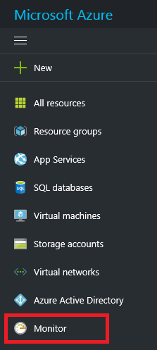
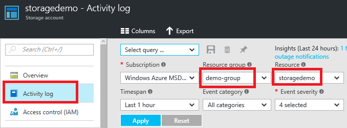
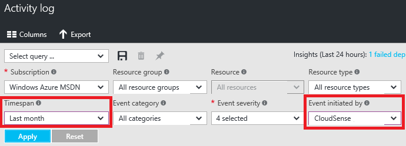
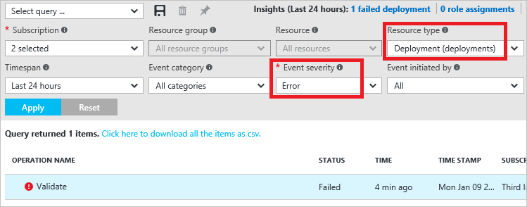
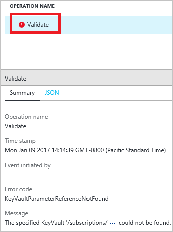

<properties
    pageTitle="用于管理 Azure 资源的活动日志 | Azure"
    description="使用 Resource Manager 中的活动日志查看用户操作和错误。显示 Azure 门户预览版、PowerShell、Azure CLI 和 REST。"
    services="azure-resource-manager"
    documentationcenter=""
    author="tfitzmac"
    manager="timlt"
    editor="tysonn" />
<tags
    ms.assetid="fcdb3125-13ce-4c3b-9087-f514c5e41e73"
    ms.service="azure-resource-manager"
    ms.workload="multiple"
    ms.tgt_pltfrm="na"
    ms.devlang="na"
    ms.topic="article"
    ms.date="01/09/2017"
    wacn.date="01/25/2017"
    ms.author="tomfitz" />  

# 通过查看活动日志管理 Azure 资源
通过活动日志，可以确定：

* 对订阅中的资源执行了什么操作
* 谁启动的操作（虽然由后端服务启动的操作不返回用户作为调用方）
* 操作何时发生
* 操作的状态
* 其他可能有助于你研究操作的属性的值

[AZURE.INCLUDE [resource-manager-audit-limitations](../../includes/resource-manager-audit-limitations.md)]

可以通过门户、PowerShell、Azure CLI、Insights REST API 或 [Insights .NET 库](https://www.nuget.org/packages/Microsoft.Azure.Insights/)检索活动日志中的信息。

## 门户
1. 若要通过门户查看活动日志，请选择“监视”。
   
      

    或者，若要自动筛选特定资源或资源组的活动日志，请从该资源边栏选项卡中选择“活动日志”。请注意，将通过所选资源对活动日志进行自动筛选。
   
      

2. 在“活动日志”边栏选项卡中，可以看到最近操作的摘要。
   
      

3. 若要限制显示的操作的数量，请选择不同条件。例如，下图显示更改“时间跨度”和“事件发起者”字段，以查看过去一个月内由特定用户或应用程序执行的操作。选择“应用”，查看查询结果。
   
      

4. 如果稍后需要重新运行查询，请选择“保存”，并为该查询命名。
   
      

5. 若要快速运行查询，可以选择一个内置的查询，例如失败的部署。

      

    所选查询会自动设置所需的筛选器值。

      

6. 选择其中一个操作以查看事件的摘要。

      

## PowerShell
1. 若要检索日志条目，请运行 **Get-AzureRmLog** 命令。你可以提供附加参数来筛选条目列表。如果未指定开始和结束时间，将返回最后一个小时的条目。例如，若要检索过去一小时针对某个资源组的操作，请运行：
   
        Get-AzureRmLog -ResourceGroup ExampleGroup
   
    以下示例演示了如何使用活动日志来调查在指定时间内执行的操作。开始日期和结束日期以日期格式指定。
   
        Get-AzureRmLog -ResourceGroup ExampleGroup -StartTime 2015-08-28T06:00 -EndTime 2015-09-10T06:00
   
    或者，可以使用 date 函数来指定日期范围，例如过去 14 天。
   
        Get-AzureRmLog -ResourceGroup ExampleGroup -StartTime (Get-Date).AddDays(-14)

2. 根据指定的开始时间，前面的命令可能会返回对该资源组执行的一长串操作。你可以提供搜索条件，以筛选所要查找的结果。例如，若要调查 Web 应用的停止方式，可运行以下命令：

      Get-AzureRmLog -ResourceGroup ExampleGroup -StartTime (Get-Date).AddDays(-14) | Where-Object OperationName -eq Microsoft.Web/sites/stop/action

    就此示例来说，该命令显示 someone@contoso.com 执行了停止操作。
   
        Authorization     :
        Scope     : /subscriptions/xxxxx/resourcegroups/ExampleGroup/providers/Microsoft.Web/sites/ExampleSite
        Action    : Microsoft.Web/sites/stop/action
        Role      : Subscription Admin
        Condition :
        Caller            : someone@contoso.com
        CorrelationId     : 84beae59-92aa-4662-a6fc-b6fecc0ff8da
        EventSource       : Administrative
        EventTimestamp    : 8/28/2015 4:08:18 PM
        OperationName     : Microsoft.Web/sites/stop/action
        ResourceGroupName : ExampleGroup
        ResourceId        : /subscriptions/xxxxx/resourcegroups/ExampleGroup/providers/Microsoft.Web/sites/ExampleSite
        Status            : Succeeded
        SubscriptionId    : xxxxx
        SubStatus         : OK

3. 你可以查看特定用户针对某个资源组执行的操作，即使该资源组不再存在。
   
        Get-AzureRmLog -ResourceGroup deletedgroup -StartTime (Get-Date).AddDays(-14) -Caller someone@contoso.com

4. 可以筛选失败的操作。

        Get-AzureRmLog -ResourceGroup ExampleGroup -Status Failed

5. 可以专注于一个错误，只需查看该条目的状态消息即可。
   
        ((Get-AzureRmLog -Status Failed -ResourceGroup ExampleGroup -DetailedOutput).Properties[1].Content["statusMessage"] | ConvertFrom-Json).error
   
    将返回：
   
        code           message                                                                        
        ----           -------                                                                        
        DnsRecordInUse DNS record dns.chinanorth.chinacloudapp.cn is already used by another public IP. 

## Azure CLI
* 若要检索日志条目，请运行 **azure group log show** 命令。

        azure group log show ExampleGroup --json

## REST API
用于处理活动日志的 REST 操作是 [Insights REST API](https://msdn.microsoft.com/zh-cn/library/azure/dn931943.aspx) 的一部分。若要检索活动日志事件，请参阅[列出订阅中的管理事件](https://msdn.microsoft.com/zh-cn/library/azure/dn931934.aspx)。

## 后续步骤
* Azure 活动日志可以与 Power BI 一起使用，以便更深入地了解在你的订阅中执行的操作。请参阅 [View and analyze Azure Activity Logs in Power BI and more](https://azure.microsoft.com/blog/analyze-azure-audit-logs-in-powerbi-more/)（在 Power BI 和其他组件中查看和分析 Azure 活动日志）。
* 若要了解如何设置安全策略，请参阅 [Azure 基于角色的访问控制](/documentation/articles/role-based-access-control-configure/)。
* 若要了解查看部署操作的命令，请参阅[查看部署操作](/documentation/articles/resource-manager-deployment-operations/)。
* 若要了解如何防止对所有用户的资源执行删除操作，请参阅[使用 Azure Resource Manager 锁定资源](/documentation/articles/resource-group-lock-resources/)。

<!---HONumber=Mooncake_0120_2017-->
<!-- Update_Description: update meta properties ; wording update ; update link references ; add quick review feature via built-in query , e.g. fail deployment. -->
