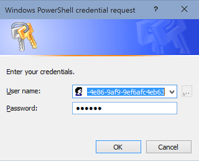

<properties
    pageTitle="使用 PowerShell 创建 Azure 服务主体 | Azure"
    description="描述如何使用 Azure PowerShell 创建 Active Directory 应用程序和服务主体，并通过基于角色的访问控制授予其对资源的访问权限。它演示如何使用密码或证书对应用程序进行身份验证。"
    services="azure-resource-manager"
    documentationcenter="na"
    author="tfitzmac"
    manager="timlt"
    editor="tysonn" />
<tags
    ms.assetid="d2caf121-9fbe-4f00-bf9d-8f3d1f00a6ff"
    ms.service="azure-resource-manager"
    ms.devlang="na"
    ms.topic="article"
    ms.tgt_pltfrm="multiple"
    ms.workload="na"
    ms.date="01/13/2017"
    wacn.date="01/25/2017"
    ms.author="tomfitz" />  

# 使用 Azure PowerShell 创建服务主体来访问资源
> [AZURE.SELECTOR]
- [PowerShell](/documentation/articles/resource-group-authenticate-service-principal/)
- [Azure CLI](/documentation/articles/resource-group-authenticate-service-principal-cli/)
- [门户](/documentation/articles/resource-group-create-service-principal-portal/)

当应用或脚本需访问资源时，可以为应用设置一个标识，然后使用其自己的凭据进行身份验证。与使用用户自己的凭据运行应用相比，此方法更优，原因在于：

* 可以将权限分配给应用标识，这些权限不同于你自己的权限。通常情况下，这些权限仅限于应用需执行的操作。
* 你的职责变化时，无需更改应用的凭据。

本主题介绍如何通过 [Azure PowerShell](https://docs.microsoft.com/powershell/azureps-cmdlets-docs) 为应用程序进行一切所需设置，使之能够使用自己的凭据和标识运行。

使用 PowerShell 时，可以通过两个选项进行 AD 应用程序身份验证：

* password
* 证书

本主题演示如何在 PowerShell 中使用这两个选项。如果想从一个编程框架（例如 Python、Ruby 或 Node.js）登录 Azure，则最好是使用密码身份验证。在确定是使用密码还是证书之前，请参阅[示例应用程序](#sample-applications)部分，获取在不同框架中进行身份验证的示例。

## Active Directory 概念
在本文中，用户将创建两个对象 - Active Directory (AD) 应用程序和服务主体。AD 应用程序是应用程序的全局表示形式。它包含凭据（应用程序 ID 和密码或证书）。服务主体是应用程序在 Active Directory 中的本地表示形式。它包含角色分配。本主题重点介绍单租户应用程序，即应用程序只会在一个组织中运行。通常会将单租户应用程序作为在组织中运行的业务线应用程序使用。在单租户应用程序中，有一个 AD 应用和一个服务主体。

你可能会疑惑 - 为什么需要这两个对象？ 在考虑多租户应用程序时，此方法会更合理。通常对软件即服务 (SaaS) 应用程序使用多租户应用程序，其中应用程序在许多不同订阅中运行。对于多租户应用程序，有一个 AD 应用和多个服务主体（授予应用访问权限的每个 Active Directory 中有一个）。若要设置多租户应用程序，请参阅[使用 Azure Resource Manager API 进行授权的开发人员指南](/documentation/articles/resource-manager-api-authentication/)。

##  所需的权限
若要完成本主题，必须在 Azure Active Directory 和 Azure 订阅中均具有足够的权限。具体而言，必须能够在 Active Directory 中创建应用并向角色分配服务主体。

检查帐户是否有足够权限的最简方法是使用门户。请参阅[检查要求的权限](/documentation/articles/resource-group-create-service-principal-portal/#required-permissions)。

现在转到[密码](#create-service-principal-with-password)或[证书](#create-service-principal-with-certificate)身份验证部分。

##  使用密码创建服务主体
在本部分中，将执行步骤以：

* 创建使用密码的 AD 应用程序
* 创建服务主体
* 向服务主体分配“读取者”角色

若要快速执行这些步骤，请参阅以下 cmdlet：

    $app = New-AzureRmADApplication -DisplayName "{app-name}" -HomePage "https://{your-domain}/{app-name}" -IdentifierUris "https://{your-domain}/{app-name}" -Password "{your-password}"
    New-AzureRmADServicePrincipal -ApplicationId $app.ApplicationId
    Start-Sleep 15
    New-AzureRmRoleAssignment -RoleDefinitionName Reader -ServicePrincipalName $app.ApplicationId

该脚本休眠 15 秒，让新的服务主体有时间传遍 Active Directory。如果脚本等待时长不足，将显示错误，称“PrincipalNotFound: 主体 {id} 不存在于目录中”。 如果收到此错误，可以重新运行该 cmdlet，将其分配给一个角色。

仔细浏览这些步骤以确保理解该过程。

1. 登录到你的帐户。

        Add-AzureRmAccount -EnvironmentName AzureChinaCloud

2. 通过提供显示名称、用于描述应用程序的 URI、用于标识应用程序的 URI，以及应用程序标识的密码来创建新的 Active Directory 应用程序。

        $app = New-AzureRmADApplication -DisplayName "exampleapp" -HomePage "https://www.contoso.org/exampleapp" -IdentifierUris "https://www.contoso.org/exampleapp" -Password "{Your_Password}"

    对于单租户应用程序，不会验证 URI。

    如果帐户在 Active Directory 上不具有[所需的权限](#required-permissions)，将看到指示“Authentication\_Unauthorized”或“上下文中找不到订阅”的错误消息。
3. 检查新的应用程序对象。

        $app

    请特别注意 `ApplicationId` 属性，需要使用该属性创建服务主体、进行角色分配以及获取访问令牌。

        DisplayName             : exampleapp
        ObjectId                : c95e67a3-403c-40ac-9377-115fa48f8f39
        IdentifierUris          : {https://www.contoso.org/example}
        HomePage                : https://www.contoso.org
        Type                    : Application
        ApplicationId           : 8bc80782-a916-47c8-a47e-4d76ed755275
        AvailableToOtherTenants : False
        AppPermissions          : 
        ReplyUrls               : {}

4. 通过传入 Active Directory 应用程序的应用程序 ID 创建应用程序的服务主体。

        New-AzureRmADServicePrincipal -ApplicationId $app.ApplicationId

5. 向服务主体授予对订阅的权限。在此示例中，向“读取者”角色（授予读取订阅中所有资源的权限）添加服务主体。对于其他角色，请参阅 [RBAC：内置角色](/documentation/articles/role-based-access-built-in-roles/)。对于 `ServicePrincipalName` 参数，请提供创建应用程序时使用的 `ApplicationId`。运行此 cmdlet 之前，必须留出一些时间让新服务主体传遍 Active Directory。手动运行这些 cmdlet 时，cmdlet 之间通常已经过足够的时间。在脚本中，应在 cmdlet 之间添加休眠步骤（如 `Start-Sleep 15`）。如果看到错误称“PrincipalNotFound: 主体 {id} 不存在于目录中”，请重新运行该 cmdlet。

        New-AzureRmRoleAssignment -RoleDefinitionName Reader -ServicePrincipalName $app.ApplicationId

如果帐户没有足够权限来分配角色，将看到一条错误消息。该消息声明用户的帐户“无权在作用域 '/subscriptions/{guid}' 执行操作 'Microsoft.Authorization/roleAssignments/write'”。

就这么简单！ AD 应用程序和服务主体设置完毕。下一部分演示如何通过 PowerShell 使用凭据进行登录。如果要在代码应用程序中使用凭据，可以跳到[示例应用程序](#sample-applications)。

###  通过 PowerShell 提供凭据
现在，需要以应用程序方式登录以执行相应操作。

1. 运行 `Get-Credential` 命令，以创建包含你的凭据的 `PSCredential` 对象。运行此命令之前需要 `ApplicationId`，所以请确保可以使用它进行粘贴。

        $creds = Get-Credential

2. 系统会提示你输入凭据。对于用户名，请使用在创建应用程序时使用的 `ApplicationId`。对于密码，请使用你在创建帐户时指定的密码。
   
       

3. 以服务主体方式登录时，需提供 AD 应用所在目录的租户 ID。租户是 Active Directory 的实例。如果只有一个订阅，可以使用：

        $tenant = (Get-AzureRmSubscription).TenantId

    如果有多个订阅，请指定 Active Directory 所在的订阅。有关详细信息，请参阅 [Azure 订阅与 Azure Active Directory 的关联方式](/documentation/articles/active-directory-how-subscriptions-associated-directory/)。

        $tenant = (Get-AzureRmSubscription -SubscriptionName "Contoso Default").TenantId

4. 通过指定此帐户为服务主体并提供凭据对象来以服务主体身份登录。

        Add-AzureRmAccount -EnvironmentName AzureChinaCloud -Credential $creds -ServicePrincipal -TenantId $tenant

现在，你已作为所创建 Active Directory 应用程序的服务主体进行身份验证。

### 保存访问令牌来简化登录
若要避免每次登录时都需要提供服务主体凭据，可保存访问令牌。

1. 若要在以后的会话中使用当前访问令牌，请保存该配置文件。

        Save-AzureRmProfile -Path c:\Users\exampleuser\profile\exampleSP.json

    打开该配置文件，并检查其内容。请注意，它包含访问令牌。
2. 无需再次手动登录，只需加载配置文件。

        Select-AzureRmProfile -Path c:\Users\exampleuser\profile\exampleSP.json

> [AZURE.NOTE]
> 访问令牌会过期，因此使用保存的配置文件仅适合在令牌有效期间使用。
> 

也可从要登录的 PowerShell 调用 REST 操作。可以从身份验证响应中检索访问令牌，将其用于其他操作。若要通过示例来了解如何通过调用 REST 操作来检索访问令牌，请参阅[生成访问令牌](/documentation/articles/resource-manager-rest-api/#generating-an-access-token)。

##  使用证书创建服务主体
在本部分中，将执行步骤以：

* 创建自签名证书
* 创建使用证书的 AD 应用程序
* 创建服务主体
* 向服务主体分配“读取者”角色

若要在 Windows 10 或 Windows Server 2016 Technical Preview 上使用 Azure PowerShell 2.0 快速执行这些步骤，请参阅以下 cmdlet：

    $cert = New-SelfSignedCertificate -CertStoreLocation "cert:\CurrentUser\My" -Subject "CN=exampleapp" -KeySpec KeyExchange
    $keyValue = [System.Convert]::ToBase64String($cert.GetRawCertData())
    $app = New-AzureRmADApplication -DisplayName "exampleapp" -HomePage "https://www.contoso.org" -IdentifierUris "https://www.contoso.org/example" -CertValue $keyValue -EndDate $cert.NotAfter -StartDate $cert.NotBefore
    New-AzureRmADServicePrincipal -ApplicationId $app.ApplicationId
    Start-Sleep 15
    New-AzureRmRoleAssignment -RoleDefinitionName Reader -ServicePrincipalName $app.ApplicationId

该脚本休眠 15 秒，让新的服务主体有时间传遍 Active Directory。如果脚本等待时长不足，将显示错误，称“PrincipalNotFound: 主体 {id} 不存在于目录中”。 如果收到此错误，可以重新运行该 cmdlet，将其分配给一个角色。

仔细浏览这些步骤以确保理解该过程。本文还将演示如何在使用早期版本的 Azure PowerShell 或操作系统的情况下完成任务。

### 创建自签名证书
可用于 Windows 10 和 Windows Server 2016 Technical Preview 的 PowerShell 版本具有更新的 `New-SelfSignedCertificate` cmdlet，可生成自签名证书。早期版本的操作系统具有 New-SelfSignedCertificate cmdlet，但它不提供本主题需要的参数。相反，你需要导入一个模块以生成证书。本主题将演示两种基于所具有的操作系统生成证书的方法。

* 如果使用 **Windows 10 或 Windows Server 2016 Technical Preview**，请运行以下命令以创建自签名证书：

        $cert = New-SelfSignedCertificate -CertStoreLocation "cert:\CurrentUser\My" -Subject "CN=exampleapp" -KeySpec KeyExchange

* 如果未使用 **Windows 10 或 Windows Server 2016 Technical Preview**，需要从 Microsoft 脚本中心下载[自签名证书生成器](https://gallery.technet.microsoft.com/scriptcenter/Self-signed-certificate-5920a7c6/)。解压其内容，并导入所需的 cmdlet。

        # Only run if you could not use New-SelfSignedCertificate
        Import-Module -Name c:\ExtractedModule\New-SelfSignedCertificateEx.ps1

    然后，生成证书。

        $cert = New-SelfSignedCertificateEx -Subject "CN=exampleapp" -KeySpec "Exchange" -FriendlyName "exampleapp"

有了证书，可以继续创建 AD 应用。

### 创建 Active Directory 应用和服务主体
1. 从证书检索密钥值。

        $keyValue = [System.Convert]::ToBase64String($cert.GetRawCertData())

2. 登录到你的 Azure 帐户。

        Add-AzureRmAccount -EnvironmentName AzureChinaCloud

3. 通过提供显示名称、用于描述应用程序的 URI、用于标识应用程序的 URI，以及应用程序标识的密码来创建新的 Active Directory 应用程序。
   
     如果有 Azure PowerShell 2.0（2016 年 8 月或之后发布），请使用以下 cmdlet：

        $app = New-AzureRmADApplication -DisplayName "exampleapp" -HomePage "https://www.contoso.org" -IdentifierUris "https://www.contoso.org/example" -CertValue $keyValue -EndDate $cert.NotAfter -StartDate $cert.NotBefore      

    如果有 Azure PowerShell 1.0，请使用以下 cmdlet：

        $app = New-AzureRmADApplication -DisplayName "exampleapp" -HomePage "https://www.contoso.org" -IdentifierUris "https://www.contoso.org/example" -KeyValue $keyValue -KeyType AsymmetricX509Cert  -EndDate $cert.NotAfter -StartDate $cert.NotBefore

    对于单租户应用程序，不会验证 URI。
   
    如果帐户在 Active Directory 上不具有[所需的权限](#required-permissions)，将看到指示“Authentication\_Unauthorized”或“上下文中找不到订阅”的错误消息。
   
    检查新的应用程序对象。

        $app

    请注意 **ApplicationId** 属性，需要使用该属性来创建服务主体、进行角色分配以及获取访问令牌。

        DisplayName             : exampleapp
        ObjectId                : c95e67a3-403c-40ac-9377-115fa48f8f39
        IdentifierUris          : {https://www.contoso.org/example}
        HomePage                : https://www.contoso.org
        Type                    : Application
        ApplicationId           : 8bc80782-a916-47c8-a47e-4d76ed755275
        AvailableToOtherTenants : False
        AppPermissions          : 
        ReplyUrls               : {}

4. 通过传入 Active Directory 应用程序的应用程序 ID 创建应用程序的服务主体。

        New-AzureRmADServicePrincipal -ApplicationId $app.ApplicationId

5. 向服务主体授予对订阅的权限。在此示例中，向“读取者”角色（授予读取订阅中所有资源的权限）添加服务主体。对于其他角色，请参阅 [RBAC：内置角色](/documentation/articles/role-based-access-built-in-roles/)。对于 `ServicePrincipalName` 参数，请提供创建应用程序时使用的 `ApplicationId`。运行此 cmdlet 之前，必须留出一些时间让新服务主体传遍 Active Directory。手动运行这些 cmdlet 时，cmdlet 之间通常已经过足够的时间。在脚本中，应在 cmdlet 之间添加休眠步骤（如 `Start-Sleep 15`）。如果看到错误称“PrincipalNotFound: 主体 {id} 不存在于目录中”，请重新运行该 cmdlet。

        New-AzureRmRoleAssignment -RoleDefinitionName Reader -ServicePrincipalName $app.ApplicationId

    如果帐户没有足够权限来分配角色，将看到一条错误消息。该消息声明用户的帐户“无权在作用域 '/subscriptions/{guid}' 执行操作 'Microsoft.Authorization/roleAssignments/write'”。

就这么简单！ AD 应用程序和服务主体设置完毕。下一部分演示如何通过 PowerShell 使用证书进行登录。

### 通过自动执行的 PowerShell 脚本提供证书
以服务主体方式登录时，需提供 AD 应用所在目录的租户 ID。租户是 Active Directory 的实例。如果只有一个订阅，可以使用：

    $tenant = (Get-AzureRmSubscription).TenantId

如果有多个订阅，请指定 Active Directory 所在的订阅。有关详细信息，请参阅[管理 Azure AD 目录](/documentation/articles/active-directory-administer/)。

    $tenant = (Get-AzureRmSubscription -SubscriptionName "Contoso Default").TenantId

若要在脚本中进行身份验证，请指定帐户为服务主体，并提供证书指纹、应用程序 ID 和租户 ID。若要使脚本自动化，可以将这些值存储为环境变量并在执行操作期间检索它们，或者可以将其包含在脚本中。

    Add-AzureRmAccount -EnvironmentName AzureChinaCloud -ServicePrincipal -CertificateThumbprint $cert.Thumbprint -ApplicationId $app.ApplicationId -TenantId $tenant

现在，你已作为所创建 Active Directory 应用程序的服务主体进行身份验证。

## 更改凭据

若要更改 AD 应用的凭据（为了保障安全或由于凭据过期的缘故），请使用 [Remove-AzureRmADAppCredential](https://docs.microsoft.com/powershell/resourcemanager/azurerm.resources/v3.3.0/remove-azurermadappcredential) 和 [New-AzureRmADAppCredential](https://docs.microsoft.com/powershell/resourcemanager/azurerm.resources/v3.3.0/new-azurermadappcredential) cmdlet。

若要删除应用程序的所有凭据，请使用：

    Remove-AzureRmADAppCredential -ApplicationId 8bc80782-a916-47c8-a47e-4d76ed755275 -All

若要添加密码，请使用：

    New-AzureRmADAppCredential -ApplicationId 8bc80782-a916-47c8-a47e-4d76ed755275 -Password p@ssword!

若要添加证书值，请按本主题所示创建自签名证书。然后，使用：

    New-AzureRmADAppCredential -ApplicationId 8bc80782-a916-47c8-a47e-4d76ed755275 -CertValue $keyValue -EndDate $cert.NotAfter -StartDate $cert.NotBefore

##  示例应用程序
以下示例应用程序演示如何以服务主体身份登录。

**.NET**

* [在 .NET 中使用模板部署启用 SSH 的 VM](https://github.com/Azure-Samples/resource-manager-dotnet-template-deployment/)
* [使用 .NET 管理 Azure 资源和资源组](https://github.com/Azure-Samples/resource-manager-dotnet-resources-and-groups/)

**Java**

* [资源入门 - 在 Java 中使用 Azure Resource Manager 模板部署资源](https://github.com/Azure-Samples/resources-java-deploy-using-arm-template/)
* [资源入门 - 在 Java 中管理资源组](https://github.com/Azure-Samples/resources-java-manage-resource-group//)

**Python**

* [在 Python 中使用模板部署启用 SSH 的 VM](https://github.com/Azure-Samples/resource-manager-python-template-deployment/)
* [使用 Python 管理 Azure 资源和资源组](https://github.com/Azure-Samples/resource-manager-python-resources-and-groups/)

**Node.js**

* [在 Node.js 中使用模板部署启用 SSH 的 VM](https://github.com/Azure-Samples/resource-manager-node-template-deployment/)
* [使用 Node.js 管理 Azure 资源和资源组](https://github.com/Azure-Samples/resource-manager-node-resources-and-groups/)

**Ruby**

* [在 Ruby 中使用模板部署启用 SSH 的 VM](https://github.com/Azure-Samples/resource-manager-ruby-template-deployment/)
* [使用 Ruby 管理 Azure 资源和资源组](https://github.com/Azure-Samples/resource-manager-ruby-resources-and-groups/)

## 后续步骤
* 有关将应用程序集成到 Azure 以管理资源的详细步骤，请参阅 [Developer's guide to authorization with the Azure Resource Manager API](/documentation/articles/resource-manager-api-authentication/)（使用 Azure Resource Manager API 进行授权的开发人员指南）。
* 有关应用程序和服务主体的详细说明，请参阅[应用程序对象和服务主体对象](/documentation/articles/active-directory-application-objects/)。
* 有关 Active Directory 身份验证的详细信息，请参阅 [Azure AD 的身份验证方案](/documentation/articles/active-directory-authentication-scenarios/)。

<!---HONumber=Mooncake_0120_2017-->
<!-- Update_Description: update meta properties -->
<!-- Update_Description: wording update -->
<!-- Update_Description: update link references -->
