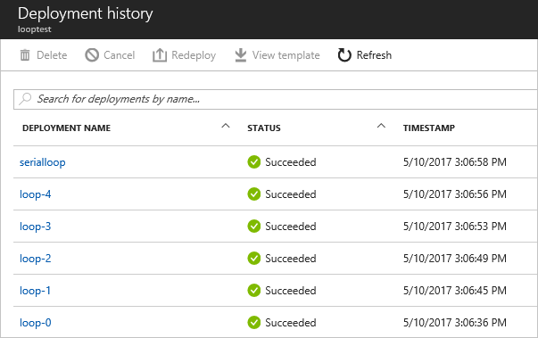

<properties
    pageTitle="部署多个 Azure 资源实例 | Azure"
    description="在部署资源时使用 Azure Resource Manager 模板中的复制操作和数组执行多次迭代。"
    services="azure-resource-manager"
    documentationcenter="na"
    author="tfitzmac"
    manager="timlt"
    editor="" />
<tags
    ms.assetid="94d95810-a87b-460f-8e82-c69d462ac3ca"
    ms.service="azure-resource-manager"
    ms.devlang="na"
    ms.topic="article"
    ms.tgt_pltfrm="na"
    ms.workload="na"
    ms.date="05/12/2017"
    wacn.date="06/05/2017"
    ms.author="v-yeche"
    ms.translationtype="Human Translation"
    ms.sourcegitcommit="08618ee31568db24eba7a7d9a5fc3b079cf34577"
    ms.openlocfilehash="1d3e15aec90696698d71054c8e0805282c1c0504"
    ms.contentlocale="zh-cn"
    ms.lasthandoff="05/26/2017" />

# 在 Azure Resource Manager 模板中部署资源或属性的多个实例
本主题演示如何在您的 Azure Resource Manager 模板中进行迭代操作，以创建多个资源实例。

## 资源迭代
若要创建某个资源类型的多个实例，请向该资源类型添加 `copy` 元素。 在 copy 元素中，为此循环指定迭代次数和名称。 计数值必须是不超过 800 的正整数。 Resource Manager 将并行创建资源。 因此，创建顺序是不确定的。 若要在序列中创建迭代的资源，请参阅[串行复制](#serial-copy)。 

要多次创建的资源将采用以下格式：

    {
        "$schema": "https://schema.management.azure.com/schemas/2015-01-01/deploymentTemplate.json#",
        "contentVersion": "1.0.0.0",
        "resources": [
            {
                "apiVersion": "2016-01-01",
                "type": "Microsoft.Storage/storageAccounts",
                "name": "[concat(copyIndex(),'storage', uniqueString(resourceGroup().id))]",
                "location": "[resourceGroup().location]",
                "sku": {
                    "name": "Standard_LRS"
                },
                "kind": "Storage",
                "properties": {},
                "copy": {
                    "name": "storagecopy",
                    "count": 3
                }
            }
        ],
        "outputs": {}
    }

请注意，每个资源的名称都包括 `copyIndex()` 函数，用于返回循环中的当前迭代。 `copyIndex()` 从零开始。 因此，以下示例：

    "name": "[concat('storage', copyIndex())]",

将创建以下名称：

* storage0
* storage1
* storage2。

若要偏移索引值，可以在 copyIndex() 函数中传递一个值。 要执行的迭代次数仍被指定在 copy 元素中，但 copyIndex 的值已按指定的值发生了偏移。 因此，以下示例：

    "name": "[concat('storage', copyIndex(1))]",

将创建以下名称：

* storage1
* storage2
* storage3

处理数组时可以使用复制操作，因为可对数组中的每个元素执行迭代操作。 可以对数组使用 `length` 函数来指定迭代计数，并使用 `copyIndex` 来检索数组中的当前索引。 因此，以下示例：

    "parameters": { 
      "org": { 
         "type": "array", 
         "defaultValue": [ 
             "contoso", 
             "fabrikam", 
             "coho" 
          ] 
      }
    }, 
    "resources": [ 
      { 
          "name": "[concat('storage', parameters('org')[copyIndex()])]", 
          "copy": { 
             "name": "storagecopy", 
             "count": "[length(parameters('org'))]" 
          }, 
          ...
      } 
    ]

将创建以下名称：

* storagecontoso
* storagefabrikam
* storagecoho

## 串行复制

使用 copy 元素创建某种资源类型的多个实例时，默认情况下，Resource Manager 并行部署这些实例。 但是，你可能希望将资源指定为按顺序部署。 例如，在更新生产环境时，可能需要错开更新，使任何一次仅更新一定数量。

Resource Manager 在 copy 元素上提供了相关的属性，使用这些属性可以按顺序部署多个实例。 在 copy 元素中，将 `mode` 设置为 **serial**，将 `batchSize` 设置为一次要部署的实例数。 在串行模式下，Resource Manager 将在循环中创建早前实例的依赖项，以便在前一个批处理完成之前它不会启动一个批处理。

    "copy": {
        "name": "iterator",
        "count": "[parameters('numberToDeploy')]",
        "mode": "serial",
        "batchSize": 2
    },

mode 属性也接受 **parallel**（它是默认值）。

若要在不创建实际资源的情况下测试串行复制，请使用以下模板部署空的嵌套模板：

    {
      "$schema": "https://schema.management.azure.com/schemas/2015-01-01/deploymentTemplate.json#",
      "contentVersion": "1.0.0.0",
      "parameters": {
        "numberToDeploy": {
          "type": "int",
          "minValue": 2,
          "defaultValue": 5
        }
      },
      "resources": [
        {
          "apiVersion": "2015-01-01",
          "type": "Microsoft.Resources/deployments",
          "name": "[concat('loop-', copyIndex())]",
          "copy": {
            "name": "iterator",
            "count": "[parameters('numberToDeploy')]",
            "mode": "serial",
            "batchSize": 1
          },
          "properties": {
            "mode": "Incremental",
            "template": {
              "$schema": "http://schema.management.azure.com/schemas/2015-01-01/deploymentTemplate.json#",
              "contentVersion": "1.0.0.0",
              "parameters": {},
              "variables": {},
              "resources": [],
              "outputs": {
              }
            }
          }
        }
      ],
      "outputs": {
      }
    }

在部署历史记录中，请注意，嵌套部署将按顺序处理。

对于更现实的方案，以下示例将从嵌套模板一次部署 Linux VM 的两个实例：

    {
        "$schema": "https://schema.management.azure.com/schemas/2015-01-01/deploymentTemplate.json#",
        "contentVersion": "1.0.0.0",
        "parameters": {
            "adminUsername": {
                "type": "string",
                "metadata": {
                    "description": "User name for the Virtual Machine."
                }
            },
            "adminPassword": {
                "type": "securestring",
                "metadata": {
                    "description": "Password for the Virtual Machine."
                }
            },
            "dnsLabelPrefix": {
                "type": "string",
                "metadata": {
                    "description": "Unique DNS Name for the Public IP used to access the Virtual Machine."
                }
            },
            "ubuntuOSVersion": {
                "type": "string",
                "defaultValue": "16.04.0-LTS",
                "allowedValues": [
                    "12.04.5-LTS",
                    "14.04.5-LTS",
                    "15.10",
                    "16.04.0-LTS"
                ],
                "metadata": {
                    "description": "The Ubuntu version for the VM. This will pick a fully patched image of this given Ubuntu version."
                }
            }
        },
        "variables": {
            "templatelink": "https://raw.githubusercontent.com/rjmax/Build2017/master/Act1.TemplateEnhancements/Chapter03.LinuxVM.json"
        },
        "resources": [
            {
                "apiVersion": "2015-01-01",
                "name": "[concat('nestedDeployment',copyIndex())]",
                "type": "Microsoft.Resources/deployments",
                "copy": {
                    "name": "myCopySet",
                    "count": 4,
                    "mode": "serial",
                    "batchSize": 2
                },
                "properties": {
                    "mode": "Incremental",
                    "templateLink": {
                        "uri": "[variables('templatelink')]",
                        "contentVersion": "1.0.0.0"
                    },
                    "parameters": {
                        "adminUsername": {
                            "value": "[parameters('adminUsername')]"
                        },
                        "adminPassword": {
                            "value": "[parameters('adminPassword')]"
                        },
                        "dnsLabelPrefix": {
                            "value": "[parameters('dnsLabelPrefix')]"
                        },
                        "ubuntuOSVersion": {
                            "value": "[parameters('ubuntuOSVersion')]"
                        },
                        "index":{
                            "value": "[copyIndex()]"
                        }
                    }
                }
            }
        ]
    }

## 依赖于循环中的资源
可以使用 `dependsOn` 元素指定一个资源在另一个资源之后部署。 若要部署的资源依赖于循环中的资源集合，请在 dependsOn 元素中提供 copy 循环的名称。 以下示例演示了如何在部署虚拟机之前部署三个存储帐户。 此处并未显示完整的虚拟机定义。 请注意，copy 元素的名称设置为 `storagecopy`，而虚拟机的 dependsOn 元素也设置为 `storagecopy`。

    {
        "$schema": "https://schema.management.azure.com/schemas/2015-01-01/deploymentTemplate.json#",
        "contentVersion": "1.0.0.0",
        "parameters": {},
        "resources": [
            {
                "apiVersion": "2016-01-01",
                "type": "Microsoft.Storage/storageAccounts",
                "name": "[concat(copyIndex(),'storage', uniqueString(resourceGroup().id))]",
                "location": "[resourceGroup().location]",
                "sku": {
                    "name": "Standard_LRS"
                },
                "kind": "Storage",
                "properties": {},
                "copy": {
                    "name": "storagecopy",
                    "count": 3
                }
            },
            {
                "apiVersion": "2015-06-15", 
                "type": "Microsoft.Compute/virtualMachines", 
                "name": "[concat('VM', uniqueString(resourceGroup().id))]",  
                "dependsOn": ["storagecopy"],
                ...
            }
        ],
        "outputs": {}
    }

## 创建子资源的多个实例
不能对子资源使用 copy 循环。 若要创建子资源的多个实例，而该子资源通常在其他资源中定义为嵌套资源，则必须将该资源创建为顶级资源。 可以通过 type 和 name 属性定义与父资源的关系。

例如，假设用户通常会将某个数据集定义为数据工厂中的子资源。

    "resources": [
    {
        "type": "Microsoft.DataFactory/datafactories",
        "name": "exampleDataFactory",
        ...
        "resources": [
        {
            "type": "datasets",
            "name": "exampleDataSet",
            "dependsOn": [
                "exampleDataFactory"
            ],
            ...
        }
    }]

若要创建数据集的多个实例，请将数据集移出数据工厂。 数据集必须与数据工厂位于同一层级，但仍属数据工厂的子资源。 可以通过 type 和 name 属性保留数据集和数据工厂之间的关系。 由于类型不再可以从其在模板中的位置推断，因此必须按以下格式提供完全限定的类型： `{resource-provider-namespace}/{parent-resource-type}/{child-resource-type}`。

若要与数据工厂的实例建立父/子关系，提供的数据集的名称应包含父资源名称。 使用以下格式： `{parent-resource-name}/{child-resource-name}`。  

以下示例演示实现过程：

    "resources": [
    {
        "type": "Microsoft.DataFactory/datafactories",
        "name": "exampleDataFactory",
        ...
    },
    {
        "type": "Microsoft.DataFactory/datafactories/datasets",
        "name": "[concat('exampleDataFactory', '/', 'exampleDataSet', copyIndex())]",
        "dependsOn": [
            "exampleDataFactory"
        ],
        "copy": { 
            "name": "datasetcopy", 
            "count": "3" 
        } 
        ...
    }]

## 后续步骤
* 若要了解有关模板区段的信息，请参阅[创作 Azure Resource Manager 模板](/documentation/articles/resource-group-authoring-templates/)。
* 若要了解如何部署模板，请参阅 [使用 Azure Resource Manager 模板部署应用程序](/documentation/articles/resource-group-template-deploy/)。

<!-- Update_Description: update meta description; wording update; update the sample code of serial copy and so on. -->