<properties
    pageTitle="在门户中创建服务主体 | Azure"
    description="介绍如何创建新的 Active Directory 应用程序和服务主体，在 Azure 资源管理器中将此服务主体与基于角色的访问控制配合使用可以管理对资源的访问权限。"
    services="azure-resource-manager"
    documentationcenter="na"
    author="tfitzmac"
    manager="timlt"
    editor="tysonn" />
<tags
    ms.assetid="7068617b-ac5e-47b3-a1de-a18c918297b6"
    ms.service="azure-resource-manager"
    ms.devlang="na"
    ms.topic="article"
    ms.tgt_pltfrm="na"
    ms.workload="na"
    ms.date="11/30/2016"
    wacn.date="01/06/2017"
    ms.author="tomfitz" />  

# 使用门户创建可访问资源的 Active Directory 应用程序和服务主体
> [AZURE.SELECTOR]
- [PowerShell](/documentation/articles/resource-group-authenticate-service-principal/)
- [Azure CLI](/documentation/articles/resource-group-authenticate-service-principal-cli/)
- [门户](/documentation/articles/resource-group-create-service-principal-portal/)

当应用程序需要访问或修改资源时，必须设置 Active Directory (AD) 应用程序，并为其分配所需的权限。本主题演示如何通过门户执行这些步骤。重点介绍单租户应用程序，其中应用程序只应在一个组织内运行。通常会将单租户应用程序作为在组织中运行的业务线应用程序使用。
 
##  所需的权限
为完成本主题，必须具有足够的权限向 Active Directory 注册应用程序，并将应用程序分配到 Azure 订阅中的角色。请确保你拥有适当的权限来执行这些步骤。

### 检查 Active Directory 权限
1. 通过 [Azure 门户预览](https://portal.azure.cn)登录 Azure 帐户。
2. 选择“Azure Active Directory”。

     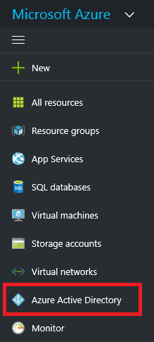  

3. 在 Active Directory 中，选择“用户设置”。

     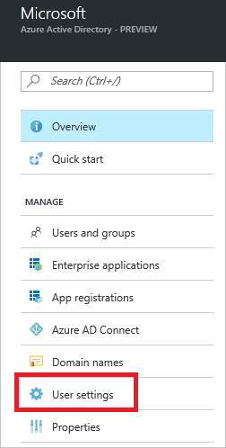  

4. 检查“应用注册”设置。如果设置为“是”，则非管理员用户可以注册 AD 应用。此设置意味着 Active Directory 中的任何用户都可以注册应用。可继续转到[检查 Azure 订阅权限](#check-azure-subscription-permissions)。

     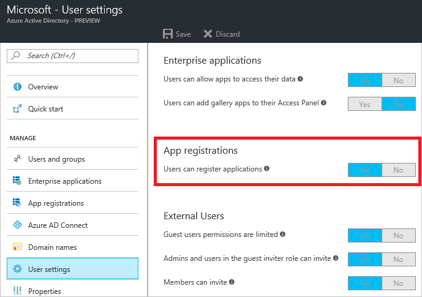  

5. 如果应用注册设置已设置为“否”，则只有管理员用户可以注册应用。需要检查你的帐户是否为 Active Directory 管理员。从快速任务中选择“概述”和“查找用户”。

     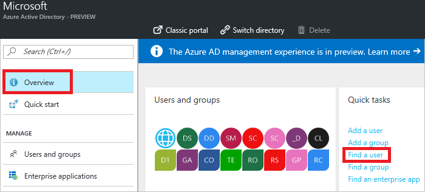  

6. 搜索你的帐户，在找到帐户后选择它。

     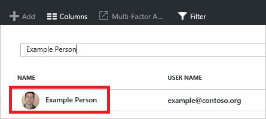  

7. 对于你的帐户，选择“目录角色”。

     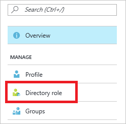  

8. 查看你分配到的 Active Directory 角色。如果你的帐户分配到“用户”角色，但（前面的步骤中设置的）应用注册设置仅限于管理员用户，请要求管理员为你分配管理员角色或允许用户注册应用。

     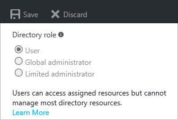  

###  检查 Azure 订阅权限
在 Azure 订阅中，帐户必须具有 `Microsoft.Authorization/*/Write` 访问权限才能向角色分配 AD 应用。通过[所有者](/documentation/articles/role-based-access-built-in-roles/#owner)角色或[用户访问管理员](/documentation/articles/role-based-access-built-in-roles/#user-access-administrator)角色授权此操作。如果帐户分配到“参与者”角色，则权限不足。尝试将服务主体分配到角色时，将收到错误。

检查订阅权限的方法如下：

1. 如果尚未按前述步骤检查 Active Directory 帐户，请从左窗格选择“Azure Active Directory”。

2. 查找 Active Directory 帐户。从快速任务选择“概述”和“查找用户”。

       

2. 搜索你的帐户，在找到帐户后选择它。

       

     
3. 选择“Azure 资源”。

     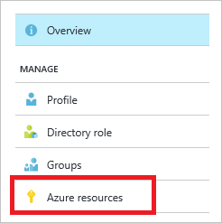  

3. 查看分配到的角色，确定你是否拥有足够的权限来向角色分配 AD 应用。如果没有，请要求订阅管理员将你添加到用户访问管理员角色。在下图中，用户分配到了两个订阅的“所有者”角色，这意味着该用户具有足够的权限。

     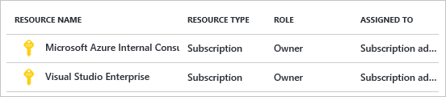  

## 创建 Active Directory 应用程序
1. 通过 [Azure 门户预览](https://portal.azure.cn)登录 Azure 帐户。
2. 选择“Azure Active Directory”。

       

4. 选择“应用注册”。

     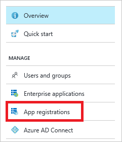  

5. 选择“添加”。

       

6. 为应用提供名称和 URL。选择“Web 应用/API”或“本机”作为要创建的应用程序的类型。设置值后，选择“创建”。

     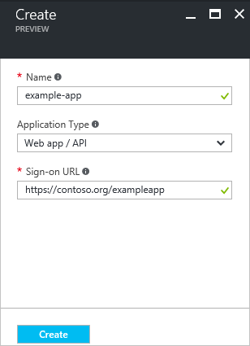  

你已创建应用程序。

## 获取应用程序 ID 和身份验证密钥
以编程方式登录时，需要使用应用程序的 ID 和身份验证密钥。若要获取这些值，请使用以下步骤：

1. 从 Active Directory 中的“应用注册”，选择你的应用程序。

     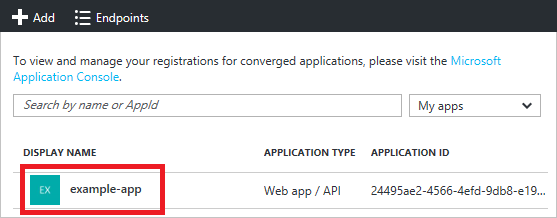  

2. 复制“应用程序 ID”并将其存储在应用程序代码中。[示例应用程序](#sample-applications)部分的应用程序引用此值作为客户端 ID。

     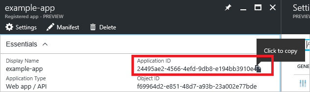  

3. 若要生成身份验证密钥，请选择“密钥”。

     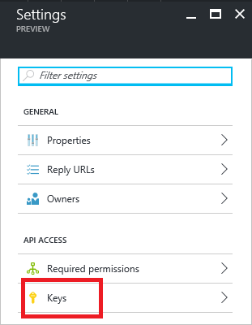  

4. 提供密钥说明和密钥持续时间。完成后，选择“保存”。

     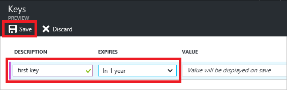  

     保存密钥后, 将显示密钥的值。复制此值，因为稍后不能检索密钥。提供密钥值及应用程序 ID 登录为该应用程序。将密钥值存储在应用程序可检索的位置。

     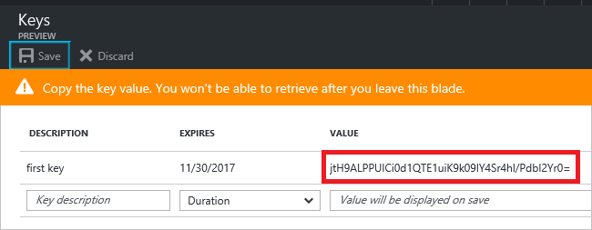  

## 获取租户 ID
以编程方式登录时，需要随身份验证请求传递租户 ID。

1. 若要获取租户 ID，请选择 Active directory 的“属性”。

     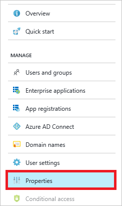  

2. 复制“目录 ID”。此值即为租户 ID。

     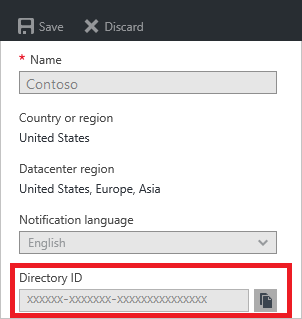  

## 将应用程序分配到角色
若要访问订阅中的资源，必须将应用程序分配到角色。决定哪个角色表示应用程序的相应权限。若要了解有关可用角色的信息，请参阅 [RBAC：内置角色](/documentation/articles/role-based-access-built-in-roles/)。

可将作用域设置为订阅、资源组或资源级别。较低级别的作用域将继承权限。例如，将某个应用程序添加到资源组的“读取者”角色意味着该应用程序可以读取该资源组及其包含的所有资源。

1. 导航到要将应用程序分配到的作用域级别。例如，若要在订阅范围内分配角色，选择“订阅”。可改为选择资源组或资源。

     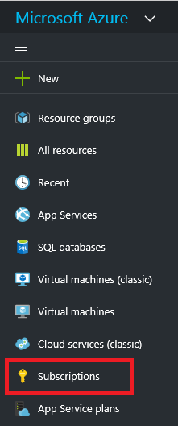  

2. 选择特定订阅（资源组或资源），向其中分配应用程序。

     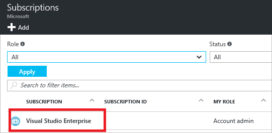  

3. 选择“访问控制 (IAM)”。

     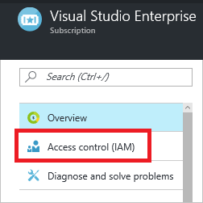  

4. 选择“添加”。

     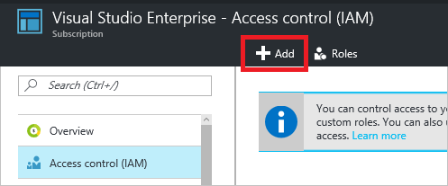  

6. 选择要分配到应用程序的角色。下图显示“读者”角色。

     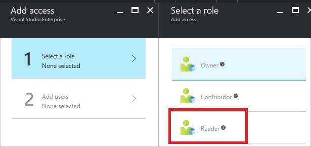  

8. 搜索你的应用程序，然后选择它。

     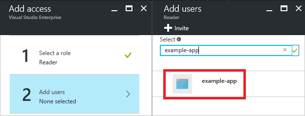  

9. 选择“确定”完成角色分配。该应用程序将显示在分配到该范围角色的用户列表中。

现已在 Active Directory 设置你的应用程序。可使用 ID 和密钥登录为该应用程序。应用程序分配到角色，可以改角色身份对其执行特定操作。可以查看示例应用程序，详细了解如何通过应用程序代码完成任务。

##  示例应用程序
以下示例应用程序显示如何登录为 AD 应用程序。

**.NET**

* [在 .NET 中使用模板部署启用 SSH 的 VM](https://github.com/Azure-Samples/resource-manager-dotnet-template-deployment/)
* [使用 .NET 管理 Azure 资源和资源组](https://github.com/Azure-Samples/resource-manager-dotnet-resources-and-groups/)

**Java**

* [资源入门 - 在 Java 中使用 Azure Resource Manager 模板部署资源](https://github.com/Azure-Samples/resources-java-deploy-using-arm-template/)
* [资源入门 - 在 Java 中管理资源组](https://github.com/Azure-Samples/resources-java-manage-resource-group//)

**Python**

* [在 Python 中使用模板部署启用 SSH 的 VM](https://github.com/Azure-Samples/resource-manager-python-template-deployment/)
* [使用 Python 管理 Azure 资源和资源组](https://github.com/Azure-Samples/resource-manager-python-resources-and-groups/)

**Node.js**

* [在 Node.js 中使用模板部署启用 SSH 的 VM](https://github.com/Azure-Samples/resource-manager-node-template-deployment/)
* [使用 Node.js 管理 Azure 资源和资源组](https://github.com/Azure-Samples/resource-manager-node-resources-and-groups/)

**Ruby**

* [在 Ruby 中使用模板部署启用 SSH 的 VM](https://github.com/Azure-Samples/resource-manager-ruby-template-deployment/)
* [使用 Ruby 管理 Azure 资源和资源组](https://github.com/Azure-Samples/resource-manager-ruby-resources-and-groups/)

## 后续步骤
* 若要设置多租户应用程序，请参阅[使用 Azure Resource Manager API 进行授权的开发人员指南](/documentation/articles/resource-manager-api-authentication/)。
* 若要了解如何指定安全策略，请参阅 [Azure 基于角色的访问控制](/documentation/articles/role-based-access-control-configure/)。

<!---HONumber=Mooncake_0103_2017-->