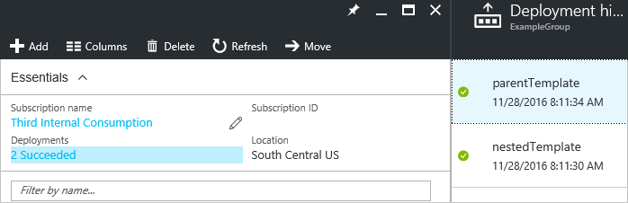

<properties
    pageTitle="用于 Azure 部署的链接模板 | Azure"
    description="介绍如何使用 Azure Resource Manager 模板中的链接模板创建一个模块化的模板的解决方案。 演示如何传递参数值、指定参数文件和动态创建的 URL。"
    services="azure-resource-manager"
    documentationcenter="na"
    author="tfitzmac"
    manager="timlt"
    editor="tysonn" />
<tags
    ms.assetid="27d8c4b2-1e24-45fe-88fd-8cf98a6bb2d2"
    ms.service="azure-resource-manager"
    ms.devlang="na"
    ms.topic="article"
    ms.tgt_pltfrm="na"
    ms.workload="na"
    ms.date="03/14/2017"
    wacn.date="06/05/2017"
    ms.author="v-yeche"
    ms.translationtype="Human Translation"
    ms.sourcegitcommit="08618ee31568db24eba7a7d9a5fc3b079cf34577"
    ms.openlocfilehash="1c42756c92edaef10809b96d790688afa7f53be1"
    ms.contentlocale="zh-cn"
    ms.lasthandoff="05/26/2017" />

# 部署 Azure 资源时使用链接模板
可在一个 Azure Resource Manager 模板中链接到另一个模板，将部署分解成一组有针对性并且有特定用途的模板。 如同将一个应用程序分解为多个代码类那样，分解可在测试、重用和可读性方面带来好处。  

可以将参数从主模板传递到链接的模板，并可以直接将这些参数映射到由调用模板公开提供的参数或变量。 链接模板还可以将输出变量传递回源模板中，启用模板之间的双向数据交换。

## 链接到模板
通过在主模板内添加部署源，从而在两个模板间创建指向链接模板的链接。 对链接模版的 URI 设置 **templateLink** 属性。 可以直接在模板中或参数文件中为链接模板提供参数值。 以下示例使用 **parameters** 属性直接指定参数值。

    "resources": [ 
      { 
          "apiVersion": "2015-01-01", 
          "name": "linkedTemplate", 
          "type": "Microsoft.Resources/deployments", 
          "properties": { 
            "mode": "incremental", 
            "templateLink": {
              "uri": "https://www.contoso.com/AzureTemplates/newStorageAccount.json",
              "contentVersion": "1.0.0.0"
            }, 
            "parameters": { 
              "StorageAccountName":{"value": "[parameters('StorageAccountName')]"} 
            } 
          } 
      } 
    ] 

链接模板与其他资源类型相似，也可在它与其他资源之间设置依赖关系。 因此，如有其他资源需要来自链接模板的输出值，你可以确保在部署这些资源之前部署链接模板。 如果链接模板依赖于其他资源，你也可以确保在部署链接模板前部署其他资源。 可使用以下语法检索链接模板中的值：

    "[reference('linkedTemplate').outputs.exampleProperty]"

Resource Manager 服务必须能够访问链接的模板。 无法为链接的模板指定本地文件或者只能在本地网络中访问的文件。 只能提供包含 **http** 或 **https** 的 URI 值。 一个选项是将链接模板置于存储帐户中，并使用该项目的 URI，如以下示例所示：

    "templateLink": {
        "uri": "http://mystorageaccount.blob.core.chinacloudapi.cn/templates/template.json",
        "contentVersion": "1.0.0.0",
    }

尽管链接模板必须可从外部使用，但它无需向公众正式发布。 可以将模板添加到只有存储帐户所有者可以访问的专用存储帐户。 然后，在部署期间创建共享访问签名 (SAS) 令牌来启用访问。 将该 SAS 令牌添加到链接模板的 URI。 有关在存储帐户中设置模板和生成 SAS 令牌的步骤，请参阅[使用 Resource Manager 模板和 Azure PowerShell 部署资源](/documentation/articles/resource-group-template-deploy/)或[使用 Resource Manager 模板和 Azure CLI 部署资源](/documentation/articles/resource-group-template-deploy-cli/)。 

下面的示例演示了链接到其他模板的父模板。 使用作为参数传入的 SAS 令牌访问链接模板。

    "parameters": {
        "sasToken": { "type": "securestring" }
    },
    "resources": [
        {
            "apiVersion": "2015-01-01",
            "name": "linkedTemplate",
            "type": "Microsoft.Resources/deployments",
            "properties": {
              "mode": "incremental",
              "templateLink": {
                "uri": "[concat('https://storagecontosotemplates.blob.core.chinacloudapi.cn/templates/helloworld.json', parameters('sasToken'))]",
                "contentVersion": "1.0.0.0"
              }
            }
        }
    ],

即使令牌作为安全字符串传入，链接模板的 URI（包括 SAS 令牌）也将记录在部署操作中。 若要限制公开，请设置令牌的到期时间。

Resource Manager 会将每个链接模板作为单独的部署来处理。 在资源组的部署历史记录中，可看到父模板和嵌套模板的分别部署。

## 链接到参数文件
以下示例使用 **parametersLink** 属性链接到参数文件。

    "resources": [ 
      { 
         "apiVersion": "2015-01-01", 
         "name": "linkedTemplate", 
         "type": "Microsoft.Resources/deployments", 
         "properties": { 
           "mode": "incremental", 
           "templateLink": {
              "uri":"https://www.contoso.com/AzureTemplates/newStorageAccount.json",
              "contentVersion":"1.0.0.0"
           }, 
           "parametersLink": { 
              "uri":"https://www.contoso.com/AzureTemplates/parameters.json",
              "contentVersion":"1.0.0.0"
           } 
         } 
      } 
    ] 

链接参数文件的 URI 值不能是本地文件，并且必须包含 **http** 或 **https**。 也可将参数文件限制为通过 SAS 令牌进行访问。

## 使用变量来链接模板
前面的示例演示了用于模板链接的硬编码 URL 值。 这种方法可能适用于简单的模板，但如果使用一组大型模块化模板时，将无法正常工作。 相反，可以创建一个存储主模板的基 URL 的静态变量，然后从基 URL 动态创建用于链接模板的 URL。 这种方法的好处是可以轻松地移动或派生模板，因为您只需在主模板中更改静态变量。 主模板将在整个分解后的模板中传递正确的 URI。

以下示例演示如何使用基 URL 来创建两个用于链接模板的 URL（**sharedTemplateUrl** 和 **vmTemplate**）。 

    "variables": {
        "templateBaseUrl": "https://raw.githubusercontent.com/Azure/azure-quickstart-templates/master/postgresql-on-ubuntu/",
        "sharedTemplateUrl": "[concat(variables('templateBaseUrl'), 'shared-resources.json')]",
        "vmTemplateUrl": "[concat(variables('templateBaseUrl'), 'database-2disk-resources.json')]"
    }

还可以使用 [deployment()](/documentation/articles/resource-group-template-functions-deployment/#deployment) 获取当前模板的基 URL，并使用该 URL 来获取同一位置其他模板的 URL。 如果模板位置发生变化（原因可能是版本控制）或者想要避免对模板文件中的 URL 进行硬编码，则此方法非常有用。 

    "variables": {
        "sharedTemplateUrl": "[uri(deployment().properties.templateLink.uri, 'shared-resources.json')]"
    }

## 按条件链接到模板
可以通过传入用于构造链接模板 URI 的参数值链接到不同的模板。 如需在部署过程中指定要使用的链接模板，此方法也适用。 例如，可为现有存储帐户指定一个要使用的模板，为新的存储帐户指定另一个要使用的模板。

以下示例显示了存储帐户名的参数，以及用于指定存储帐户是新帐户还是现有帐户的参数。

    "parameters": {
        "storageAccountName": {
            "type": "String"
        },
        "newOrExisting": {
            "type": "String",
            "allowedValues": [
                "new",
                "existing"
            ]
        }
    },

为模板 URI 创建变量，其中包含新参数或现有参数的值。

    "variables": {
        "templatelink": "[concat('https://raw.githubusercontent.com/exampleuser/templates/master/',parameters('newOrExisting'),'StorageAccount.json')]"
    },

将该变量值提供给部署资源。

    "resources": [
        {
            "apiVersion": "2015-01-01",
            "name": "linkedTemplate",
            "type": "Microsoft.Resources/deployments",
            "properties": {
                "mode": "incremental",
                "templateLink": {
                    "uri": "[variables('templatelink')]",
                    "contentVersion": "1.0.0.0"
                },
                "parameters": {
                    "StorageAccountName": {
                        "value": "[parameters('storageAccountName')]"
                    }
                }
            }
        }
    ],

URI 将解析成名为 **existingStorageAccount.json** 或 **newStorageAccount.json** 的模板。 为这些 URI 创建模板。

以下示例显示了 **existingStorageAccount.json** 模板。

    {
      "$schema": "https://schema.management.azure.com/schemas/2015-01-01/deploymentTemplate.json#",
      "contentVersion": "1.0.0.0",
      "parameters": {
        "storageAccountName": {
          "type": "String"
        }
      },
      "variables": {},
      "resources": [],
      "outputs": {
        "storageAccountInfo": {
          "value": "[reference(concat('Microsoft.Storage/storageAccounts/', parameters('storageAccountName')),providers('Microsoft.Storage', 'storageAccounts').apiVersions[0])]",
          "type" : "object"
        }
      }
    }

下一个示例显示了 **newStorageAccount.json** 模板。 可以看到，与现有存储帐户模板一样，存储帐户对象已在输出中返回。 主控模板能够与任一链接模板配合运行。

    {
      "$schema": "https://schema.management.azure.com/schemas/2015-01-01/deploymentTemplate.json#",
      "contentVersion": "1.0.0.0",
      "parameters": {
        "storageAccountName": {
          "type": "string"
        }
      },
      "resources": [
        {
          "type": "Microsoft.Storage/storageAccounts",
          "name": "[parameters('StorageAccountName')]",
          "apiVersion": "2016-01-01",
          "location": "[resourceGroup().location]",
          "sku": {
            "name": "Standard_LRS"
          },
          "kind": "Storage",
          "properties": {
          }
        }
      ],
      "outputs": {
        "storageAccountInfo": {
          "value": "[reference(concat('Microsoft.Storage/storageAccounts/', parameters('StorageAccountName')),providers('Microsoft.Storage', 'storageAccounts').apiVersions[0])]",
          "type" : "object"
        }
      }
    }

## 完整示例
下面的示例模板显示了简化布置的链接模板以说明本文中的几个概念。 它假定模板已添加到公共访问权限已关闭的存储帐户中的同一个容器。 链接模板将一个值传递回 **outputs** 节中的主模板。

**parent.json** 文件由以下部分组成：

    {
      "$schema": "https://schema.management.azure.com/schemas/2015-01-01/deploymentTemplate.json#",
      "contentVersion": "1.0.0.0",
      "parameters": {
        "containerSasToken": { "type": "string" }
      },
      "resources": [
        {
          "apiVersion": "2015-01-01",
          "name": "linkedTemplate",
          "type": "Microsoft.Resources/deployments",
          "properties": {
            "mode": "incremental",
            "templateLink": {
              "uri": "[concat(uri(deployment().properties.templateLink.uri, 'helloworld.json'), parameters('containerSasToken'))]",
              "contentVersion": "1.0.0.0"
            }
          }
        }
      ],
      "outputs": {
        "result": {
          "type": "object",
          "value": "[reference('linkedTemplate').outputs.result]"
        }
      }
    }

**helloworld.json** 文件由以下部分组成：

    {
      "$schema": "https://schema.management.azure.com/schemas/2015-01-01/deploymentTemplate.json#",
      "contentVersion": "1.0.0.0",
      "parameters": {},
      "variables": {},
      "resources": [],
      "outputs": {
        "result": {
            "value": "Hello World",
            "type" : "string"
        }
      }
    }

在 PowerShell 中，你使用以下命令获取容器的令牌并部署模板：

    Set-AzureRmCurrentStorageAccount -ResourceGroupName ManageGroup -Name storagecontosotemplates
    $token = New-AzureStorageContainerSASToken -Name templates -Permission r -ExpiryTime (Get-Date).AddMinutes(30.0)
    $url = (Get-AzureStorageBlob -Container templates -Blob parent.json).ICloudBlob.uri.AbsoluteUri
    New-AzureRmResourceGroupDeployment -ResourceGroupName ExampleGroup -TemplateUri ($url + $token) -containerSasToken $token

在 Azure CLI 2.0 中，使用以下代码获取容器的令牌并部署模板：

    seconds='@'$(( $(date +%s) + 1800 ))
    expiretime=$(date +%Y-%m-%dT%H:%MZ --date=$seconds)
    connection=$(az storage account show-connection-string \
        --resource-group ManageGroup \
        --name storagecontosotemplates \
        --query connectionString)
    token=$(az storage container generate-sas \
        --name templates \
        --expiry $expiretime \
        --permissions r \
        --output tsv \
        --connection-string $connection)
    url=$(az storage blob url \
        --container-name templates \
        --name parent.json \
        --output tsv \
        --connection-string $connection)
    parameter='{"containerSasToken":{"value":"?'$token'"}}'
    az group deployment create --resource-group ExampleGroup --template-uri $url?$token --parameters $parameter

## 后续步骤
* 若要了解如何为资源定义部署顺序，请参阅 [Defining dependencies in Azure Resource Manager templates](/documentation/articles/resource-group-define-dependencies/)（在 Azure Resource Manager 模板中定义依赖关系）
* 若要了解如何定义一个资源但创建其多个实例，请参阅 [Create multiple instances of resources in Azure Resource Manager](/documentation/articles/resource-group-create-multiple/)（在 Azure Resource Manager 中创建多个资源实例）

<!--Update_Description:update meta properties; wording update; update link reference-->