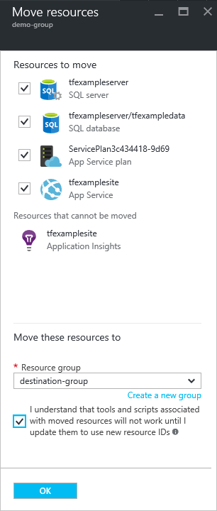
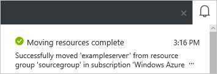

<properties
    pageTitle="将资源移到新的资源组 | Azure"
    description="使用 Azure Resource Manager 将资源移到新的资源组或订阅。"
    services="azure-resource-manager"
    documentationcenter=""
    author="tfitzmac"
    manager="timlt"
    editor="tysonn" />  

<tags
    ms.assetid="ab7d42bd-8434-4026-a892-df4a97b60a9b"
    ms.service="azure-resource-manager"
    ms.workload="multiple"
    ms.tgt_pltfrm="na"
    ms.devlang="na"
    ms.topic="article"
    ms.date="11/11/2016"
    wacn.date="12/26/2016"
    ms.author="tomfitz" />

# 将资源移到新资源组或订阅中
本主题说明如何将资源移到新订阅或同一订阅的新资源组中。可以使用门户、PowerShell、Azure CLI 或 REST API 移动资源。本主题中的移动操作无需任何 Azure 支持的协助即可供使用。

一般而言，可能会在以下情况中移动资源：

* 为便于计费，资源需在不同的订阅中。
* 某个资源不再与之前分组在一起的资源共享相同的生命周期。您想要将它移动到新的资源组以便您可以单独管理该资源，而不涉及其他资源。

移动资源时，源组和目标组将被锁定，直到移动操作完成。在完成移动之前，将阻止对资源组执行写入和删除操作。此锁意味着用户无法添加、更新或删除资源组中的资源，但并不意味着资源处于冻结状态。例如，如果将 SQL Server 及其数据库移到新的资源组中，使用数据库的应用程序体验不到停机，仍可读取和写入到数据库。

您不能更改该资源的位置。移动资源仅能够将其移动到新的资源组。新的资源组可能有不同的位置，但这不会更改该资源的位置。

> [AZURE.NOTE]
本文介绍如何在现有 Azure 帐户产品/服务中移动资源。如果确实想要更改 Azure 帐户产品/服务（如从即用即付升级到预付）并继续使用现有资源，请参阅 [Switch your Azure subscription to another offer](/documentation/articles/billing-how-to-switch-azure-offer/)（将 Azure 订阅切换到其他产品）。

## 移动资源前需查看的清单
移动资源之前需执行的一些重要步骤。验证这些条件可以避免错误。

1. 服务必须支持移动资源的功能。本主题列出了哪些服务允许移动资源，哪些服务不允许移动资源。
2. 源和目标订阅必须存在于同一 [Active Directory 租户](/documentation/articles/active-directory-howto-tenant/)中。若要移到新租户，请呼叫支持。
3. 必须针对要移动的资源的资源提供程序注册目标订阅。否则，会收到错误，指明**未针对资源类型注册订阅**。将资源移到新的订阅时，可能会遇到此问题，但该订阅从未配合该资源类型使用。若要了解如何检查注册状态和注册资源提供程序，请参阅 [Resource providers and types](/documentation/articles/resource-manager-supported-services#resource-providers-and-types)（资源提供程序和类型）。
4. 如果你要移动 App Service 应用，则你已查看 [App Service 限制](#app-service-limitations)。
5. 如果要移动与恢复服务关联的资源，则必须查看[恢复服务限制](#recovery-services-limitations)
6. 如果你要移动通过经典模型部署的资源，则你已查看[经典部署限制](#classic-deployment-limitations)。

## 致电支持人员的时机
可通过本主题所示的自助服务操作移动大部分资源。使用自助服务操作：

* 移动 Resource Manager 资源。
* 根据[经典部署限制](#classic-deployment-limitations)移动经典资源。

需要执行以下操作时，请致电支持人员：

* 将资源移动到新的 Azure 帐户（和 Active Directory 租户）。
* 移动经典资源，但遇到限制问题。

##  支持移动的服务
就目前而言，支持移动到新资源组和订阅的服务包括：

* API 管理
* 应用服务应用（Web 应用）- 请参阅[应用服务限制](#app-service-limitations)
* 自动化
* 批处理
* CDN
* 云服务 - 请参阅[经典部署限制](#classic-deployment-limitations)
* 认知服务
* DocumentDB
* 事件中心
* HDInsight 群集
* IoT 中心
* 密钥保管库
* 负载均衡器
* 媒体服务
* 通知中心
* Power BI
* Redis 缓存
* 计划程序
* 服务总线
* Service Fabric
* 存储
* 存储（经典）- 请参阅 [Classic deployment limitations](#classic-deployment-limitations)（经典部署限制）
* 流分析
* SQL 数据库服务器 - 数据库和服务器必须位于同一个资源组中。移动 SQL 服务器时，也会移动其所有数据库。
* 流量管理器
* 虚拟机 - 并不支持移到新的订阅（当其证书存储在密钥保管库中时）
* 虚拟机（经典）- 请参阅 [Classic deployment limitations](#classic-deployment-limitations)（经典部署限制）
* 虚拟网络

## 不支持移动的服务
目前不支持移动资源的服务包括：

* AD 混合运行状况服务
* 应用程序网关
* Application Insights
* Express Route
* 恢复服务保管库：也不会移动与恢复服务保管库关联的计算、网络和存储资源，请参阅[恢复服务限制](#recovery-services-limitations)。
* “安全”
* 证书存储在密钥保管库中的虚拟机
* 虚拟机规模集
* 虚拟网络（经典）- 请参阅 [Classic deployment limitations](#classic-deployment-limitations)（经典部署限制）
* VPN 网关

##  App Service 限制
使用 App Service 应用时，你不能只移动 App Service 计划。若要移动 App Service 应用，可以使用以下选项：

* 将该资源组中的 App Service 计划以及所有其他 App Service 资源移到尚无 App Service 资源的新资源组。这一要求意味着，与 App Service 计划不关联的 App Service 资源也必须移动。
* 将应用移到另一个资源组中，但保留原始资源组中的所有 App Service 计划。

如果原始资源组还包括 Application Insights 资源，则不能移动该资源，因为 Application Insights 目前不支持移动操作。如果在移动 App Service 应用时包括了 Application Insights 资源，则整个移动操作会失败。不过，即使 Application Insights 和 App Service 计划不与应用位于同一资源组中，应用也可以正常运行。

例如，如果你的资源组包含：

* **web-a**，与 **plan-a** 和 **app-insights-a** 相关联
* **web-b**，与 **plan-b** 和 **app-insights-b** 相关联

你的选项包括：

* 移动 **web-a**、**plan-a**、**web-b** 和 **plan-b**
* 移动 **web-a** 和 **web-b**
* 移动 **web-a**
* 移动 **web-b**

所有其他的组合都涉及移动不能移动的资源类型 (Application Insights)，或保留在移动 App Service 计划时不能保留的资源类型（任何 App Service 资源类型）。

如果你的 Web 应用与其 App Service 计划位于不同的资源组中，而你想要将二者都移到新的资源组，则必须分两步执行移动操作。例如：

* **web-a** 位于 **web-group** 中
* **plan-a** 位于 **plan-group** 中
* 想要让 **web-a** 和 **plan-a** 位于 **combined-group** 中

若要完成此移动操作，可按以下顺序执行两个独立的移动操作：

1. 将 **web-a** 移到 **plan-group** 中
2. 将 **web-a** 和 **plan-a** 移到 **combined-group** 中。

可以毫无问题地将应用服务证书移到新的资源组或订阅。但是，如果 Web 应用包含在外部购买并上传到应用的 SSL 证书，则必须在移动 Web 应用前删除该证书。例如，可以执行以下步骤：

1. 从 Web 应用删除上传的证书
2. 移动 Web 应用
3. 将证书上传到 Web 应用

##  恢复服务限制
不支持移动用于使用 Azure Site Recovery 设置灾难恢复的存储、网络或计算资源。

例如，假设已设置将本地计算机复制到存储帐户 (Storage1)，并且想要受保护的计算机在故障转移到 Azure 之后显示为连接到虚拟网络 (Network1) 的虚拟机 (VM1)。不能在同一订阅中的资源组之间或在订阅之间移动这些 Azure 资源 - Storage1、VM1 和 Network1。

##  经典部署限制
移动通过经典模型部署的资源时，其选项各不相同，具体取决于是在订阅内移动资源，还是将资源移到新的订阅。

### 同一订阅
在同一订阅内将资源从一个资源组移动到另一个资源组时，存在以下限制：

* 不能移动虚拟网络（经典）。
* 虚拟机（经典）必须与云服务一起移动。
* 移动云服务时，必须移动其所有虚拟机。
* 一次只能移动一项云服务。
* 一次只能移动一个存储帐户（经典）。
* 存储帐户（经典）与虚拟机或云服务不能在同一操作中移动。

若要将经典资源移动到同一订阅内的新资源组，请通过[门户](#use-portal)、[Azure PowerShell](#use-powershell)、[Azure CLI](#use-azure-cli) 或 [REST API](#use-rest-api) 执行标准移动操作。使用的操作与用于移动 Resource Manager 资源的操作一样。

### 新订阅
将资源移动到新订阅时，存在以下限制：

* 必须在同一操作中移动订阅中的所有经典资源。
* 目标订阅不得包含任何其他经典资源。
* 只能通过独立的适用于经典移动的 REST API 来请求移动。将经典资源移到新订阅时，不能使用标准的 Resource Manager 移动命令。

若要将经典资源移动到新订阅，必须使用特定于经典资源的 REST 操作。执行以下步骤，将经典资源移动到新订阅。

1. 检查源订阅是否可以参与跨订阅移动。使用以下操作：
   
         POST https://management.chinacloudapi.cn/subscriptions/{sourceSubscriptionId}/providers/Microsoft.ClassicCompute/validateSubscriptionMoveAvailability?api-version=2016-04-01
   
     在请求正文中包括：
   
         {
           "role": "source"
         }
   
     验证操作的响应格式如下：
   
         {
           "status": "{status}",
           "reasons": [
             "reason1",
             "reason2"
           ]
         }
2. 检查目标订阅是否可以参与跨订阅移动。使用以下操作：
   
         POST https://management.chinacloudapi.cn/subscriptions/{destinationSubscriptionId}/providers/Microsoft.ClassicCompute/validateSubscriptionMoveAvailability?api-version=2016-04-01
   
     在请求正文中包括：
   
         {
           "role": "target"
         }
   
     响应的格式与源订阅验证的响应格式相同。
3. 如果两个订阅都通过了验证，可使用以下操作将所有经典资源从一个订阅移动到另一个订阅：
   
         POST https://management.chinacloudapi.cn/subscriptions/{subscription-id}/providers/Microsoft.ClassicCompute/moveSubscriptionResources?api-version=2016-04-01
   
    在请求正文中包括：
   
         {
           "target": "/subscriptions/{target-subscription-id}"
         }

此操作可能需要运行几分钟。

##  使用门户
若要将资源移动到**同一订阅**中的新资源组，请选择包含这些资源的资源组，然后选择“移动”按钮。

  

或者，若要将资源移动到**新订阅**，请选择包含这些资源的资源组，然后选择“编辑订阅”图标。

  

选择要移动的资源和目标资源组。确认需要更新这些资源的脚本，选择“确定”。如果在上一步中已选择“编辑订阅”图标，则还必须选择目标订阅。

  

在“通知”中，可以看到移动操作正在运行。

  

操作完成后，你会获得结果通知。

  

##  使用 PowerShell
若要将现有资源移到另一个资源组或订阅，请使用 **Move-AzureRmResource** 命令。

第一个示例演示如何将一个资源移到新的资源组。

    $resource = Get-AzureRmResource -ResourceName ExampleApp -ResourceGroupName OldRG
    Move-AzureRmResource -DestinationResourceGroupName NewRG -ResourceId $resource.ResourceId

第二个示例演示如何将多个资源移到新的资源组。

    $webapp = Get-AzureRmResource -ResourceGroupName OldRG -ResourceName ExampleSite
    $plan = Get-AzureRmResource -ResourceGroupName OldRG -ResourceName ExamplePlan
    Move-AzureRmResource -DestinationResourceGroupName NewRG -ResourceId $webapp.ResourceId, $plan.ResourceId

若要移动到新的订阅，请包含 **DestinationSubscriptionId** 参数的值。

系统将要求确认是否想要移动指定的资源。

    Confirm
    Are you sure you want to move these resources to the resource group
    '/subscriptions/{guid}/resourceGroups/newRG' the resources:

    /subscriptions/{guid}/resourceGroups/destinationgroup/providers/Microsoft.Web/serverFarms/exampleplan
    /subscriptions/{guid}/resourceGroups/destinationgroup/providers/Microsoft.Web/sites/examplesite
    [Y] Yes  [N] No  [S] Suspend  [?] Help (default is "Y"): y

##  使用 Azure CLI
若要将现有资源移到另一个资源组或订阅，请使用 **azure resource move** 命令。提供要移动的资源的资源 ID。可以使用以下命令获取资源 ID：

    azure resource list -g sourceGroup --json

会返回以下格式：

    [
      {
        "id": "/subscriptions/{guid}/resourceGroups/sourceGroup/providers/Microsoft.Storage/storageAccounts/storagedemo",
        "name": "storagedemo",
        "type": "Microsoft.Storage/storageAccounts",
        "location": "chinaeast",
        "tags": {},
        "kind": "Storage",
        "sku": {
          "name": "Standard_RAGRS",
          "tier": "Standard"
        }
      }
    ]

以下示例说明如何将存储帐户移动到新的资源组。在 **-i** 参数中，提供要移动的资源 ID 的逗号分隔列表。

    azure resource move -i "/subscriptions/{guid}/resourceGroups/sourceGroup/providers/Microsoft.Storage/storageAccounts/storagedemo" -d "destinationGroup"

系统将要求确认是否想要移动指定的资源。

##  使用 REST API
若要将现有资源移到另一个资源组或订阅中，请运行：

    POST https://management.chinacloudapi.cn/subscriptions/{source-subscription-id}/resourcegroups/{source-resource-group-name}/moveResources?api-version={api-version} 

在请求正文中，指定目标资源组和要移动的资源。有关移动 REST 操作的详细信息，请参阅[移动资源](https://msdn.microsoft.com/zh-cn/library/azure/mt218710.aspx)。

## 后续步骤
* 若要了解管理订阅所需的 PowerShell cmdlet，请参阅 [Using Azure PowerShell with Resource Manager](/documentation/articles/powershell-azure-resource-manager/)（将 Azure PowerShell 与 Resource Manager 配合使用）。
* 若要了解管理订阅所需的 Azure CLI 命令，请参阅 [Using the Azure CLI with Resource Manager](/documentation/articles/xplat-cli-azure-resource-manager/)（将 Azure CLI 与 Resource Manager 配合使用）。
* 若要了解管理订阅所需的门户功能，请参阅[使用 Azure 门户预览管理资源](/documentation/articles/resource-group-portal/)。
* 若要了解如何对资源应用逻辑组织，请参阅 [Using tags to organize your resources](/documentation/articles/resource-group-using-tags/)（使用标记来组织资源）。

<!---HONumber=Mooncake_1219_2016-->