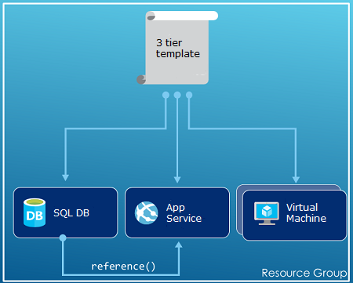
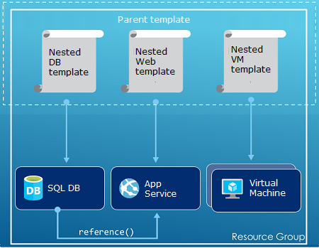

<properties
    pageTitle="Azure Resource Manager 概述 | Azure"
    description="介绍如何使用 Azure 资源管理器在 Azure 上部署和管理资源以及对其进行访问控制。"
    services="azure-resource-manager"
    documentationcenter="na"
    author="tfitzmac"
    manager="timlt"
    editor="tysonn" />  

<tags
    ms.assetid="76df7de1-1d3b-436e-9b44-e1b3766b3961"
    ms.service="azure-resource-manager"
    ms.devlang="na"
    ms.topic="get-started-article"
    ms.tgt_pltfrm="na"
    ms.workload="na"
    ms.date="11/14/2016"
    wacn.date="12/26/2016"
    ms.author="tomfitz" />

# Azure 资源管理器概述
应用程序的体系结构通常由许多组件构成 – 其中可能包括虚拟机、存储帐户、虚拟网络、Web 应用、数据库、数据库服务器和第三方服务。这些组件不会以独立的实体出现，而是以单个实体的相关部件和依赖部件出现。如果你希望以组的方式部署、管理和监视这些这些组件，那么，你可以使用 Azure 资源管理器以组的方式处理解决方案中的资源。可以通过一个协调的操作为解决方案部署、更新或删除所有资源。可以使用一个模板来完成部署，该模板适用于不同的环境，例如测试、过渡和生产。资源管理器提供安全、审核和标记功能，以帮助你在部署后管理资源。

## 术语
如果你不熟悉 Azure Resource Manager，则可能不熟悉某些术语。

* **资源** - 可通过 Azure 获取的可管理项。部分常见资源包括虚拟机、存储帐户、Web 应用、数据库和虚拟网络，但这只是其中一小部分。
* **资源组** - 一个容器，用于保存 Azure 解决方案的相关资源。资源组可以包含解决方案的所有资源，也可以只包含想要作为组来管理的资源。根据对组织有利的原则，决定如何将资源分配到资源组。请参阅[资源组](#resource-groups)。
* **资源提供程序** — 一种服务，提供可以通过 Resource Manager 进行部署和管理的资源。每个资源提供程序提供用于处理所部署资源的操作。部分常见资源提供程序包括 Microsoft.Compute（提供虚拟机资源）、Microsoft.Storage（提供存储帐户资源）和 Microsoft.Web（提供与 Web 应用相关的资源）。请参阅[资源提供程序](#resource-providers)。
* **Resource Manager 模板** — 一个 JavaScript 对象表示法 (JSON) 文件，用于定义一个或多个要部署到资源组的资源。它也会定义所部署资源之间的依赖关系。使用模板能够以一致方式反复部署资源。请参阅[模板部署](#template-deployment)。
* **声明性语法** - 一种语法，允许你声明“以下是我想要创建的项目”，而不需要编写一系列编程命令来进行创建。Resource Manager 模板便是声明性语法的其中一个示例。在该文件中，你可以定义要部署到 Azure 的基础结构的属性。

##  使用资源管理器的优势
资源管理器提供多种优势：

* 可以以组的形式部署、管理和监视解决方案的所有资源，而不是单独处理这些资源。
* 你可以在整个开发生命周期内重复部署解决方案，并确保以一致的状态部署资源。
* 你可以通过声明性模板而非脚本来管理基础结构。
* 您可以定义各资源之间的依赖关系，以便按正确的顺序进行部署。
* 您可以将访问控制应用到资源组中的所有服务，因为基于角色的访问控制 (RBAC) 已在本机集成到管理平台。
* 可以将标记应用到资源，以逻辑方式组织订阅中的所有资源。
* 可以通过查看一组共享相同标记的资源的成本来明确组织的帐单。

资源管理器提供了一种新方法来部署和管理您的解决方案。如果你使用早期的部署模型并想要了解这些更改，请参阅[了解资源管理器部署和经典部署](/documentation/articles/resource-manager-deployment-model/)。

##  一致的管理层
Resource Manager 针对通过 Azure PowerShell、Azure CLI、Azure 门户预览、REST API 和开发工具执行的任务提供一致的管理层。所有工具使用一组通用操作。可以使用最合适的工具，并且可以换用这些工具而不发生混淆。

下图显示了这些工具如何与同等的 Azure Resource Manager API 交互。API 将请求传递给 Resource Manager 服务，后者对请求进行身份验证和授权。然后，Resource Manager 将请求路由到适当的资源提供程序。

  

## 指南
以下建议可帮助你在使用解决方案时充分利用 Resource Manager。

1. 通过资源管理器模板中的声明性语法而不是强制性的命令来定义和部署基础结构。
2. 在模板中定义所有部署和配置步骤。在设置解决方案时不应执行手动步骤。
3. 运行强制性命令来管理资源，例如启动或停止应用或计算机。
4. 排列资源组中具有相同生命周期的资源。使用标记来组织其他所有资源。

有关模板的建议，请参阅 [Best practices for creating Azure Resource Manager templates](/documentation/articles/resource-manager-template-best-practices/)（有关创建 Azure Resource Manager 模板的最佳实践）。

如需了解企业如何使用 Resource Manager 对订阅进行有效管理，请参阅 [Azure enterprise scaffold - prescriptive subscription governance](/documentation/articles/resource-manager-subscription-governance/)（Azure 企业基架 - 出于合规目的监管订阅）。

##  资源组
定义资源组时，需要考虑以下几个重要因素：

1. 组中的所有资源应该共享相同的生命周期。将这些资源一同部署、更新和删除。如果某个资源（例如数据库服务器）需要采用不同的部署周期，则它应在另一个资源组中。
2. 每个资源只能在一个资源组中。
3. 你随时可以在资源组添加或删除资源。
4. 可以将资源从一个资源组移到另一个组。有关详细信息，请参阅 [Move resources to new resource group or subscription](/documentation/articles/resource-group-move-resources/)（将资源移到新的资源组或订阅）。
5. 资源组可以包含位于不同区域的资源。
6. 资源组可用于划分对管理操作的访问控制。
7. 资源可与其他资源组中的资源进行交互。两个资源相关但并不共享相同生命周期时（例如，连接到数据库的 Web 应用），这种交互会很常见。

创建资源组时，需要为该资源组提供一个位置。你可能会疑惑，“为什么资源组需要一个位置？ 以及，如果资源可以具有与资源组不同的位置，资源组的位置应该不重要啊？” 资源组存储与资源有关的元数据。因此，在指定资源组的位置时，你是在指定元数据的存储位置。出于合规性原因，可能需要确保你的数据存储在某一特定区域。

##  资源提供程序
每个资源提供程序都会提供一组用于 Azure 服务的资源和操作。例如，若要存储密钥和密码，可以使用 **Microsoft.KeyVault** 资源提供程序。此资源提供程序提供名为 **vaults** 的资源类型来创建密钥保管库，提供名为 **vaults/secrets** 的资源类型在密钥保管库中创建密码。

在开始部署资源之前，应该先了解可用的资源提供程序。了解资源提供程序和资源的名称可帮助定义想要部署到 Azure 的资源。

可以使用以下 PowerShell cmdlet 检索所有资源提供程序：

    Get-AzureRmResourceProvider -ListAvailable

如果使用 Azure CLI，则可以运行以下命令检索所有资源提供程序：

    azure provider list

可以浏览返回的列表，找到需要使用的资源提供程序。

若要获取有关资源提供程序的详细信息，请在命令中添加提供程序命名空间。该命令返回资源提供程序支持的资源类型，以及每种资源类型支持的位置和 API 版本。以下 PowerShell cmdlet 获取有关 Microsoft.Compute 的详细信息：

    (Get-AzureRmResourceProvider -ProviderNamespace Microsoft.Compute).ResourceTypes

如果使用 Azure CLI，请运行以下命令检索 Microsoft.Compute 支持的资源类型、位置和 API 版本：

    azure provider show Microsoft.Compute --json > c:\Azure\compute.json

有关详细信息，请参阅 [Resource Manager 提供程序、区域、API 版本和架构](/documentation/articles/resource-manager-supported-services/)。

##  模板部署
使用 Resource Manager 可以创建一个模板（采用 JSON 格式），用于定义 Azure 解决方案的基础结构和配置。使用模板可以在解决方案的整个生命周期内重复部署该解决方案，确保以一致的状态部署资源。从门户创建解决方案时，该解决方案将自动包含部署模板。你无需从头开始创建模板，因为你可以从解决方案的模板着手，并根据你的特定需求自定义该模板。可以通过导出资源组的当前状态或查看特定部署所用的模板，来检索现有资源组的模板。查看[导出的模板](/documentation/articles/resource-manager-export-template/)是了解模板语法的有效方法。

有关模板格式及其构造方法的详细信息，请参阅 [Authoring Azure Resource Manager Templates](/documentation/articles/resource-group-authoring-templates/)（创作 Azure Resource Manager 模板）和 [Resource Manager Template Walkthrough](/documentation/articles/resource-manager-template-walkthrough/)（Resource Manager 模板演练）。

Resource Manager 处理模板的方式与处理其他任何请求一样（请参阅[一致的管理层](#consistent-management-layer)中的图像）。它会分析模板，并将其语法转换为相应资源提供程序所需的 REST API 操作。例如，当 Resource Manager 收到具有以下资源定义的模板时：

    "resources": [
      {
        "apiVersion": "2016-01-01",
        "type": "Microsoft.Storage/storageAccounts",
        "name": "mystorageaccount",
        "location": "chinanorth",
        "sku": {
          "name": "Standard_LRS"
        },
        "kind": "Storage",
        "properties": {
        }
      }
      ]

它会将该定义转换为以下 REST API 操作，然后，该操作将发送到 Microsoft.Storage 资源提供程序：

    PUT
    https://management.chinacloudapi.cn/subscriptions/{subscriptionId}/resourceGroups/{resourceGroupName}/providers/Microsoft.Storage/storageAccounts/mystorageaccount?api-version=2016-01-01
    REQUEST BODY
    {
      "location": "chinanorth",
      "properties": {
      }
      "sku": {
        "name": "Standard_LRS"
      },   
      "kind": "Storage"
    }

模板和资源组的定义方式全由你决定，解决方案的管理方式也是如此。例如，可以通过单个模板在单个资源组中部署三层式应用程序。

  

但是，无需在单个模板中定义整个基础结构。通常，合理的做法是将部署要求划分成一组有针对性的模板。可以轻松地将这些模板重复用于不同的解决方案。若要部署特定的解决方案，请创建链接所有所需模板的主模板。下图显示如何通过包含三个嵌套模板的父模板部署三层式解决方案。

  

如果希望层具有不同的生命周期，可将这三个层部署到不同的资源组。请注意，资源仍可链接到其他资源组中的资源。

  

有关嵌套模板的信息，请参阅[将链接的模板与 Azure Resource Manager 配合使用](/documentation/articles/resource-group-linked-templates/)。

有关自动化部署的四部分系列教程，请参阅[将应用程序自动部署到 Azure 虚拟机](/documentation/articles/virtual-machines-windows-dotnet-core-1-landing/)。此系列教程介绍了应用程序体系结构、访问与安全性、可用性与伸缩性，以及应用程序部署。

Azure Resource Manager 会分析依赖关系，以确保按正确的顺序创建资源。如果一个资源依赖于另一个资源的值（例如，虚拟机需要使用存储帐户来保存磁盘），则需要设置依赖关系。有关详细信息，请参阅[在 Azure 资源管理器模板中定义依赖关系](/documentation/articles/resource-group-define-dependencies/)。

还可以使用模板对基础结构进行更新。例如，可以将资源添加到解决方案，并为已部署的资源添加配置规则。如果模板指定要创建资源，但该资源已存在，则 Azure Resource Manager 将执行更新而不是创建新资产。Azure 资源管理器会将现有资产更新到相同状态，就如同该资产是新建的一样。

如果你需要其他操作（例如，安装未包含在安装程序中的特定软件）时，资源管理器可提供所需的扩展。如果你已在使用配置管理服务（如 DSC、Chef 或 Puppet），则可以使用扩展来继续处理该服务。有关虚拟机扩展的信息，请参阅[关于虚拟机扩展和功能](/documentation/articles/virtual-machines-windows-extensions-features/)。

最后，该模板将成为应用程序源代码的一部分。你可以将它签入源代码存储库，并随着应用程序的发展更新该模板。你可以通过 Visual Studio 编辑模板。

定义模板后，便可以将资源部署到 Azure。有关部署资源的命令，请参阅：

* [使用 Resource Manager 模板和 Azure PowerShell 部署资源](/documentation/articles/resource-group-template-deploy/)
* [使用 Resource Manager 模板和 Azure CLI 部署资源](/documentation/articles/resource-group-template-deploy-cli/)
* [使用 Resource Manager 模板和 Azure 门户预览部署资源](/documentation/articles/resource-group-template-deploy-portal/)
* [使用 Resource Manager 模板和 Resource Manager REST API 部署资源](/documentation/articles/resource-group-template-deploy-rest/)

## 标记
资源管理器提供了标记功能，让你根据管理或计费要求为资源分类。如果你有一系列复杂的资源组和资源，并想要以最有利的方式可视化这些资产，则可以使用标记。例如，你可以标记组织中充当类似角色或者属于同一部门的资源。如果不使用标记，组织中的用户可以创建多个资源，这可能会使将来的标识和管理变得困难。例如，你可能会希望删除特定项目的所有资源。如果这些资源没有针对项目进行标记，则必须手动查找它们。标记是降低不必要的订阅成本的重要方法。

资源不需要驻留在同一个资源组中就能共享一个标记。你可以创建自己的标记分类，以确保组织中的所有用户使用公用的标记，避免用户无意中应用稍有不同的标记（如“dept”而不是“department”）。

以下示例显示了应用到虚拟机的标记。

    "resources": [    
      {
        "type": "Microsoft.Compute/virtualMachines",
        "apiVersion": "2015-06-15",
        "name": "SimpleWindowsVM",
        "location": "[resourceGroup().location]",
        "tags": {
            "costCenter": "Finance"
        },
        ...
      }
    ]

若要检索具有标记值的所有资源，请使用以下 PowerShell cmdlet：

    Find-AzureRmResource -TagName costCenter -TagValue Finance

或者运行以下 Azure CLI 命令：

    azure resource list -t costCenter=Finance --json

也可以通过 Azure 门户预览查看带有标记的资源。

订阅的[使用情况报告](/documentation/articles/billing-understand-your-bill/)包含标记名称和值，可让你根据标记划分成本。有关标记的详细信息，请参阅[使用标记来组织 Azure 资源](/documentation/articles/resource-group-using-tags/)。

## 访问控制
资源管理器可让你控制谁有权访问组织的特定操作。Resource Manager 原生地在管理平台中集成了基于角色的访问控制 (RBAC)，并向资源组中的所有服务应用该访问控制。

使用基于角色的访问控制时，必须了解两个主要概念：

* 角色定义 - 说明一组权限，可用于许多分配。
* 角色分配 - 将某个定义与特定范围（订阅、资源组或资源）的标识（用户或组）相关联。较低的范围将继承分配。

可以将用户添加到预定义的平台和资源特定角色。例如，可以使用名为“读取者”的预定义角色来允许用户查看资源，但不允许更改资源。为此，可将组织中需要此类访问权限的用户添加到“读取者”角色，并将该角色应用到订阅、资源组或资源。

Azure 提供以下四种平台角色：

1. 所有者 - 可以管理所有内容（包括访问权限）
2. 参与者 - 可以管理访问权限以外的所有内容
3. 读取者 - 可以查看所有内容，但不能进行更改
4. 用户访问管理员 - 可以管理用户对 Azure 资源的访问

Azure 还提供资源特定的多种角色。一些常见的角色包括：

1. 虚拟机参与者 - 可以管理虚拟机，但不能授予对它们的访问权限，并且无法管理它们连接到的虚拟网络或存储帐户
2. 网络参与者 - 可以管理所有网络资源，但不能授予对它们的访问权限
3. 存储帐户参与者 - 可以管理存储帐户，但不能授予对它们的访问权限
4. SQL Server 参与者 - 可以管理 SQL 服务器和数据库，但不能管理其安全相关的策略
5. 网站参与者 - 可以管理网站，但不能管理其连接到的 Web 计划

有关角色和允许的操作的完整列表，请参阅 [RBAC：内置角色](/documentation/articles/role-based-access-built-in-roles/)。有关基于角色的访问控制的详细信息，请参阅 [Azure Role-Based Access Control](/documentation/articles/role-based-access-control-configure/)（Azure 基于角色的访问控制）。

在某些情况下，我们想要运行代码或脚本来访问资源，但不想要使用用户凭据。在某些情况下，我们想要为应用程序创建名为服务主体的标识，并为该服务主体分配适当的角色。在 Resource Manager 中可为应用程序创建凭据，以编程方式对应用程序进行身份验证。若要了解如何创建服务主体，请参阅以下主题之一：

* [使用 Azure PowerShell 创建服务主体来访问资源](/documentation/articles/resource-group-authenticate-service-principal/)
* [使用 Azure CLI 创建服务主体来访问资源](/documentation/articles/resource-group-authenticate-service-principal-cli/)
* [使用门户创建可访问资源的 Active Directory 应用程序和服务主体](/documentation/articles/resource-group-create-service-principal-portal/)

你可以显式锁定关键资源，以防止用户删除或修改这些资源。有关详细信息，请参阅[使用 Azure 资源管理器锁定资源](/documentation/articles/resource-group-lock-resources/)。

## 活动日志
Resource Manager 记录所有创建、修改或删除资源的操作。在进行故障排除或监视组织中的用户如何修改资源时，可以使用活动日志来查找错误。若要查看日志，请在资源组的“设置”边栏选项卡中选择“活动日志”。可以按照许多不同的值筛选日志，包括哪位用户启动了操作。有关使用活动日志的信息，请参阅 [Audit operations with Resource Manager](/documentation/articles/resource-group-audit/)（使用 Resource Manager 执行审核操作）。

## 自定义的策略
资源管理器可让你创建自定义策略来管理资源。创建的策略类型可包括各种方案。可以在资源上实施命名约定，限制可部署的资源的类型和实例，或限制可托管资源类型的区域。可以要求资源上的标记值按部门组织计费。可以通过创建策略来降低成本并在订阅中保持一致性。

需要使用 JSON 定义策略，然后在整个订阅中或者在资源组内应用这些策略。策略不同于基于角色的访问控制，因为它们将应用到资源类型。

以下示例中显示的策略通过指定所有资源都必须包含 costCenter 标记来确保标记一致性。

    {
      "if": {
        "not" : {
          "field" : "tags",
          "containsKey" : "costCenter"
        }
      },
      "then" : {
        "effect" : "deny"
      }
    }

还可以创建其他类型的策略。有关详细信息，请参阅[使用策略来管理资源和控制访问](/documentation/articles/resource-manager-policy/)。

## SDK
Azure SDK 适用于多种语言和平台。每种语言实现可通过其生态系统包管理器和 GitHub 来使用。

其中每个 SDK 中的代码是从 Azure RESTful API 规范生成的。这些规范是开放源代码，基于 Swagger 2.0 规范。SDK 代码是通过名为 AutoRest 的开源项目生成的。AutoRest 将这些 RESTful API 规范转换成采用多种语言的客户端库。如果你想要改进 SDK 中生成的代码的任何方面，可以使用整个工具集来创建 SDK，该工具集属于开放式工具集，免费提供且基于广泛采用的 API 规范格式。

以下是开放源 SDK 存储库。欢迎提供反馈和拉取请求并提出问题。

[.NET](https://github.com/Azure/azure-sdk-for-net) | [Java](https://github.com/Azure/azure-sdk-for-java) | [Node.js](https://github.com/Azure/azure-sdk-for-node) | [PHP](https://github.com/Azure/azure-sdk-for-php) | [Python](https://github.com/Azure/azure-sdk-for-python) | [Ruby](https://github.com/Azure/azure-sdk-for-ruby)

> [AZURE.NOTE]
如果 SDK 未提供所需的功能，也可以直接调用 [Azure REST API](https://docs.microsoft.com/rest/api/resources/)。

## 示例
### .NET
* [管理 Azure 资源和资源组](https://azure.microsoft.com/documentation/samples/resource-manager-dotnet-resources-and-groups/)
* [使用模板部署启用 SSH 的 VM](https://azure.microsoft.com/documentation/samples/resource-manager-dotnet-template-deployment/)

### Java
* [管理 Azure 资源](https://azure.microsoft.com/documentation/samples/resources-java-manage-resource/)
* [管理 Azure 资源组](https://azure.microsoft.com/documentation/samples/resources-java-manage-resource-group/)
* [使用模板部署启用 SSH 的 VM](https://azure.microsoft.com/documentation/samples/resources-java-deploy-using-arm-template/)

### Node.js
* [管理 Azure 资源和资源组](https://azure.microsoft.com/documentation/samples/resource-manager-node-resources-and-groups/)
* [使用模板部署启用 SSH 的 VM](https://azure.microsoft.com/documentation/samples/resource-manager-node-template-deployment/)

### Python
* [管理 Azure 资源和资源组](https://azure.microsoft.com/documentation/samples/resource-manager-python-resources-and-groups/)
* [使用模板部署启用 SSH 的 VM](https://azure.microsoft.com/documentation/samples/resource-manager-python-template-deployment/)

### Ruby
* [管理 Azure 资源和资源组](https://azure.microsoft.com/documentation/samples/resource-manager-ruby-resources-and-groups/)
* [使用模板部署启用 SSH 的 VM](https://azure.microsoft.com/documentation/samples/resource-manager-ruby-template-deployment/)

## 后续步骤
* 有关使用模板的简单介绍，请参阅 [Export an Azure Resource Manager template from existing resources](/documentation/articles/resource-manager-export-template/)（从现有资源导出 Azure Resource Manager 模板）。
* 有关创建模板的更全面演练，请参阅 [Resource Manager Template Walkthrough](/documentation/articles/resource-manager-template-walkthrough/)（Resource Manager 模板演练）。
* 若要了解可以在模板中使用的函数，请参阅[模板函数](/documentation/articles/resource-group-template-functions/)
* 有关将 Visual Studio 与 Resource Manager 配合使用的信息，请参阅 [Creating and deploying Azure resource groups through Visual Studio](/documentation/articles/vs-azure-tools-resource-groups-deployment-projects-create-deploy/)（通过 Visual Studio 创建和部署 Azure 资源组）。
* 有关将 VS Code 与 Resource Manager 配合使用的信息，请参阅 [Working with Azure Resource Manager Templates in Visual Studio Code](/documentation/articles/resource-manager-vs-code/)（在 Visual Studio Code 中使用 Azure Resource Manager 模板）。

[powershellref]: https://docs.microsoft.com/powershell/resourcemanager/azurerm.resources/v3.2.0/azurerm.resources

<!---HONumber=Mooncake_1219_2016-->