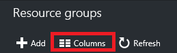
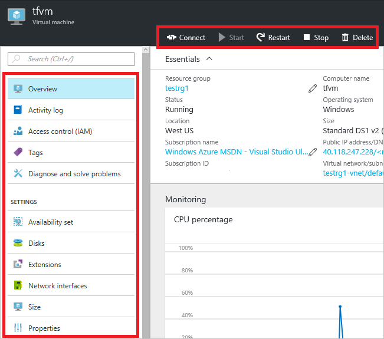

<properties
    pageTitle="使用 Azure 门户预览管理 Azure 资源 | Azure"
    description="使用 Azure 门户预览和 Azure Resource Manager 来管理资源。说明如何使用仪表板进行资源监视。"
    services="azure-resource-manager,azure-portal"
    documentationcenter=""
    author="tfitzmac"
    manager="timlt"
    editor="tysonn" />  

<tags
    ms.assetid="0725bbf2-5913-4c07-af6e-24e11d957fbc"
    ms.service="azure-resource-manager"
    ms.workload="multiple"
    ms.tgt_pltfrm="na"
    ms.devlang="na"
    ms.topic="article"
    ms.date="09/12/2016"
    wacn.date="12/26/2016"
    ms.author="tomfitz" />  

# 通过门户管理 Azure 资源
> [AZURE.SELECTOR]
* [Azure PowerShell](/documentation/articles/powershell-azure-resource-manager/)
* [Azure CLI](/documentation/articles/xplat-cli-azure-resource-manager/)
* [门户](/documentation/articles/resource-group-portal/)
* [REST API](/documentation/articles/resource-manager-rest-api/)

本主题说明如何将 [Azure 门户预览](https://portal.azure.cn)与 [Azure Resource Manager](/documentation/articles/resource-group-overview/) 配合使用来管理 Azure 资源。若要了解如何通过门户部署资源，请参阅 [Deploy resources with Resource Manager templates and Azure portal preview](/documentation/articles/resource-group-template-deploy-portal/)（使用 Resource Manager 模板和 Azure 门户预览部署资源）。

目前，并非每种服务都支持门户或资源管理器。对于这些服务，需要使用[经典门户](https://manage.windowsazure.cn)。若要了解每种服务的状态，请参阅 [Azure 门户预览可用性图表](/home/features/azure-portal/availability/)。

##  管理资源组
1. 若要查看订阅中的所有资源组，请选择“资源组”。
   
      

2. 若要创建空资源组，请选择“添加”。
   
      

3. 提供新资源组的名称和位置。选择“创建”。
   
      

4. 可能需要选择“刷新”以查看最近创建的资源组。
   
      

5. 若要自定义显示的资源组信息，请选择“列”。
   
      

6. 选择要添加的列，然后选择“更新”。
   
      

7. 若要了解如何将资源部署到新资源组，请参阅 [Deploy resources with Resource Manager templates and Azure portal preview](/documentation/articles/resource-group-template-deploy-portal/)（使用 Resource Manager 模板和 Azure 门户预览部署资源）。
8. 为了快速访问资源组，可以将边栏选项卡固定到仪表板上。
   
      

9. 仪表板显示资源组及其资源。可以选择资源组或其任何资源以导航到该项目。
   
      

## 标记资源
可以将标记应用到资源组和资源，以按照逻辑组织资产。有关使用标记的信息，请参阅 [Using tags to organize your Azure resources](/documentation/articles/resource-group-using-tags/)（使用标记来组织 Azure 资源）。

[AZURE.INCLUDE [resource-manager-tag-resource](../../includes/resource-manager-tag-resources.md)]

## 监视资源
选择一个资源时，资源边栏选项卡将显示用于监视该资源类型的默认图形和表。

1. 选择资源，并注意“监视”部分。它包括与资源类型相关的图形。下图显示存储帐户的默认监视数据。
   
      

2. 选择该部分上方的省略号 (...) 即可将边栏选项卡的某一部分固定到仪表板上。还可以自定义边栏选项卡中该部分的大小，或完全删除它。下图显示如何固定、自定义或删除 CPU 和内存部分。
   
      

3. 将该部分固定到仪表板后，将会在仪表板上看到摘要。并且，选择它后可立即看到关于该数据的详细信息。
   
      

4. 若要完全自定义通过门户监视的数据，请导航到默认仪表板，并选择“新建仪表板”。
   
      

5. 指定新仪表板的名称，然后将磁贴拖动到仪表板上。这些磁贴通过不同选项进行筛选。
   
      

   
     若要了解如何使用仪表板，请参阅 [Creating and sharing dashboards in the Azure portal preview](/documentation/articles/azure-portal-dashboards/)（在 Azure 门户预览中创建和共享仪表板）。

## 管理资源
在某个资源的边栏选项卡中，可看到用于管理该资源的选项。门户提供了用于该特定资源类型的管理选项。在资源边栏选项卡的顶部和左侧可看到管理命令。

  

通过这些选项，可以执行一些操作，如启动和停止虚拟机，或重新配置虚拟机的属性。

## 移动资源
如果需要将资源移到另一个资源组或另一个订阅，请参阅 [Move resources to new resource group or subscription](/documentation/articles/resource-group-move-resources/)（将资源移到新的资源组或订阅）。

## 锁定资源
可以锁定订阅、资源组或资源，以防止组织中的其他用户意外删除或修改关键资源。有关详细信息，请参阅[使用 Azure 资源管理器锁定资源](/documentation/articles/resource-group-lock-resources/)。

[AZURE.INCLUDE [resource-manager-lock-resources](../../includes/resource-manager-lock-resources.md)]

## 查看订阅和成本
可以查看有关订阅的信息以及所有资源的汇总成本。选择“订阅”以及要查看的订阅。可能只能选择一个订阅。

  

在订阅边栏选项卡中，可以看到资金消耗率。

  

以及按资源类型划分的成本明细。

  

## 导出模板
设置资源组后，你可能想要查看资源组的 Resource Manager 模板。导出模板有两个好处：

1. 由于模板包含所有完整的基础结构，因此将来可以轻松地自动完成解决方案的部署。
2. 可以查看代表解决方案的 JavaScript 对象表示法 (JSON)，以此熟悉模板语法。

有关分步指导，请参阅 [Export Azure Resource Manager template from existing resources](/documentation/articles/resource-manager-export-template/)（从现有资源导出 Azure Resource Manager 模板）。

## 删除资源组或资源
删除资源组会删除其包含的所有资源。你也可以删除资源组中的单个资源。删除资源组时请多加小心，因为其中可能包含与其链接的其他资源组中的资源。Resource Manager 不会删除链接资源，但如果没有所需资源，链接资源可能无法正常运行。

  

## 后续步骤
* 若要查看审核日志，请参阅 [Audit operations with Resource Manager](/documentation/articles/resource-group-audit/)（使用 Resource Manager 进行审核操作）。
* 若要排查部署错误，请参阅[使用 Azure 门户预览对资源组部署进行故障排除](/documentation/articles/resource-manager-troubleshoot-deployments-portal/)。
* 若要通过门户部署资源，请参阅 [Deploy resources with Resource Manager templates and Azure portal preview](/documentation/articles/resource-group-template-deploy-portal/)（使用 Resource Manager 模板和 Azure 门户预览部署资源）。
* 若要管理对资源的访问，请参阅 [Use role assignments to manage access to your Azure subscription resources](/documentation/articles/role-based-access-control-configure/)（使用角色分配来管理对 Azure 订阅资源的访问）。
* 如需了解企业如何使用 Resource Manager 对订阅进行有效管理，请参阅 [Azure 企业机架 - 规范性订阅管理](/documentation/articles/resource-manager-subscription-governance/)。

<!---HONumber=Mooncake_1219_2016-->