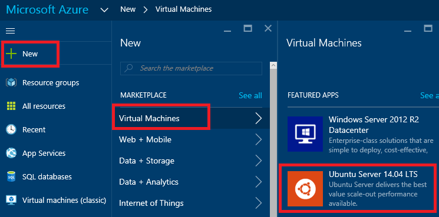
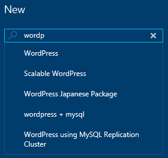
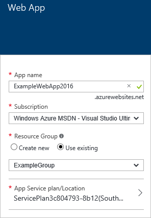
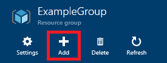
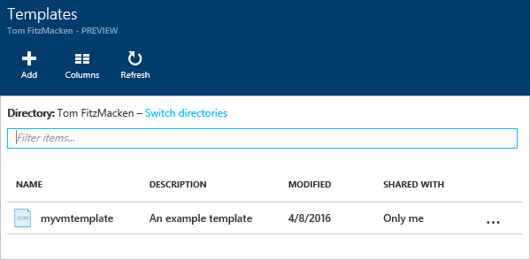

<properties
    pageTitle="使用 Azure 门户预览版部署 Azure 资源 | Azure"
    description="使用 Azure 门户预览版和 Azure Resource Manager 部署资源。"
    services="azure-resource-manager,azure-portal"
    documentationcenter=""
    author="tfitzmac"
    manager="timlt"
    editor="tysonn" />
<tags
    ms.assetid="2c98a4aa-8d9f-4a0a-b764-214dbe8ed009"
    ms.service="azure-resource-manager"
    ms.workload="multiple"
    ms.tgt_pltfrm="na"
    ms.devlang="na"
    ms.topic="article"
    ms.date="12/19/2016"
    wacn.date="01/25/2017"
    ms.author="tomfitz" />  

# 使用 Resource Manager 模板和 Azure 门户预览版部署资源
> [AZURE.SELECTOR]
- [PowerShell](/documentation/articles/resource-group-template-deploy/)
- [Azure CLI](/documentation/articles/resource-group-template-deploy-cli/)
- [门户](/documentation/articles/resource-group-template-deploy-portal/)
- [REST API](/documentation/articles/resource-group-template-deploy-rest/)

本主题演示如何使用 [Azure 门户预览版](https://portal.azure.cn)和 [Azure Resource Manager](/documentation/articles/resource-group-overview/) 部署 Azure 资源。若要了解有关管理资源的信息，请参阅[通过门户管理 Azure 资源](/documentation/articles/resource-group-portal/)。

目前，并非每种服务都支持门户或资源管理器。要使用这些服务，需使用[经典管理门户](https://manage.windowsazure.cn)。若要了解每种服务的状态，请参阅 [Azure 门户预览版可用性图表](https://azure.microsoft.com/features/azure-portal/availability/)。

##  创建资源组
1. 若要创建空资源组，请依次选择“新建”>“管理”>“资源组”。
   
      

2. 为其命名并指定位置，如有必要，选择一个订阅。需要提供资源组的位置，因为资源组存储与资源有关的元数据。出于合规性原因，你可能会想要指定该元数据的存储位置。一般情况下，建议指定大部分资源将驻留的位置。使用相同位置可简化模板。
   
      

## 从应用商店部署资源
创建资源组后，可以从应用商店将资源部署到资源组。应用商店为常见方案提供预定义的解决方案。

1. 若要开始部署，请选择“新建”和要部署的资源的类型。然后，查找要部署的资源的特定版本。
   
      

2. 如果看不到想要部署的特定解决方案，可以在应用商店中搜索。
   
      

3. 根据所选资源的类型，需要在部署之前设置相关属性的集合。此处不显示这些选项，因为它们因资源类型而异。对于所有类型，必须选择目标资源组。以下映像演示了如何创建 Web 应用并将其部署到创建的资源组。
   
      

   
    也可以在部署资源时创建资源组。选择“新建”并为资源组指定名称。
   
      

4. 部署开始。部署可能需要几分钟的时间。完成部署后，你会看到一条通知。
   
      

5. 部署资源后，可以使用资源组边栏选项卡上的“添加”命令将更多资源添加到资源组。
   
      

##  从自定义模板部署资源
如果想要执行部署，但不使用应用商店中的任何模板，可以创建自定义模板来针对你的解决方案定义基础结构。若要了解有关创建模板的信息，请参阅[创作 Azure 资源管理器模板](/documentation/articles/resource-group-authoring-templates/)。

1. 若要通过门户部署自定义模板，请选择“新建”，并开始搜索“模板部署”，直至可以从选项中选择它。
   
      

2. 从可用资源中选择“模板部署”。
   
      

3. 启动模板部署后，打开可用于自定义的空白模板。
   
      

   
    在编辑器中，添加用于定义要部署的资源的 JSON 语法。完成后，选择“保存”。有关编写 JSON 语法的指导，请参阅 [Resource Manager 模板演练](/documentation/articles/resource-manager-template-walkthrough/)。
   
      

4. 或者，也可以从 [Azure 快速启动模板](https://github.com/Azure/azure-quickstart-templates/)中选择预先存在的模板。这些模板是由社区提供的。它们涵盖了许多常见的方案，有人可能已添加了一个与你想要部署的模板类似的模板。可以搜索模板以查找与你的方案相匹配的模板。
   
      

    可以在编辑器中查看所选模板。
    
5. 提供所有其他值之后，选择“创建”可部署该模板。
   
      

## 从保存到帐户中的模板部署资源
该门户允许用户将模板保存到 Azure 帐户，以便以后重新部署它。

1. 若要查找已保存模板，请选择“浏览”>“模板”。
   
      

2. 从已保存到你的帐户的模板列表中，选择要使用的模板。
   
      

3. 选择“部署”以重新部署该已保存模板。
   
      

## 后续步骤
* 若要查看审核日志，请参阅 [Audit operations with Resource Manager](/documentation/articles/resource-group-audit/)（使用 Resource Manager 进行审核操作）。
* 若要排查部署错误，请参阅[查看部署操作](/documentation/articles/resource-manager-deployment-operations/)。
* 若要从部署或资源组中检索模板，请参阅[从现有资源导出 Azure Resource Manager 模板](/documentation/articles/resource-manager-export-template/)。
* 如需了解企业如何使用 Resource Manager 对订阅进行有效管理，请参阅 [Azure 企业机架 - 规范性订阅管理](/documentation/articles/resource-manager-subscription-governance/)。
* 有关自动化部署的四部分系列教程，请参阅[将应用程序自动部署到 Azure 虚拟机](/documentation/articles/virtual-machines-windows-dotnet-core-1-landing/)。此系列教程介绍了应用程序体系结构、访问与安全性、可用性与伸缩性，以及应用程序部署。

<!---HONumber=Mooncake_0120_2017-->
<!-- Update_Description: update meta properties -->
<!-- Update_Description: wording update -->
<!-- Update_Description: update image -->
<!-- Update_Description: update link reference -->