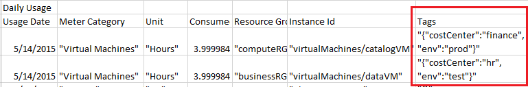

<properties
    pageTitle="为逻辑组织标记 Azure 资源 | Azure"
    description="演示如何应用标记来组织 Azure 资源进行计费和管理。"
    services="azure-resource-manager"
    documentationcenter=""
    author="tfitzmac"
    manager="timlt"
    editor="tysonn" />
<tags
    ms.assetid="003a78e5-2ff8-4685-93b4-e94d6fb8ed5b"
    ms.service="azure-resource-manager"
    ms.workload="multiple"
    ms.tgt_pltfrm="AzurePortal"
    ms.devlang="na"
    ms.topic="article"
    ms.date="02/15/2017"
    wacn.date="06/05/2017"
    ms.author="tomfitz" />  

# 使用标记整理 Azure 资源
[AZURE.INCLUDE [resource-manager-tag-introduction](../../includes/resource-manager-tag-introduction.md)]

> [AZURE.NOTE]
> 您只能将标记应用到支持资源管理器操作的资源。如果通过经典部署模型（如通过经典管理门户）创建虚拟机、虚拟网络或存储，则无法向该资源应用标记。若要支持标记，需通过 Resource Manager 重新部署这些资源。所有其他资源均支持标记。
> 
> 

<!-- Policy Unable on the Azure.cn>
## 确保标记与策略一致

使用资源策略，可以为你的组织创建标准规则。可以创建策略，以确保使用适当的值标记资源。有关详细信息，请参阅[对标记应用资源策略](/documentation/articles/resource-manager-policy-tags/)。
-->
## 模板

[AZURE.INCLUDE [resource-manager-tags-in-templates](../../includes/resource-manager-tags-in-templates.md)]

## 门户

[AZURE.INCLUDE [resource-manager-tag-resource](../../includes/resource-manager-tag-resources.md)]

## PowerShell

[AZURE.INCLUDE [resource-manager-tag-resources-powershell](../../includes/resource-manager-tag-resources-powershell.md)]

## Azure CLI 2.0

使用 Azure CLI 2.0，可以向资源和资源组添加标记，以及按标记值查询资源。

每次将标记应用到资源或资源组时，都会覆盖该资源或资源组上的现有标记。因此，必须根据资源或资源组是否具有要保留的现有标记，使用不同的方法。若要将标记添加到：

* 不带现有标记的资源组。

        az group update -n TagTestGroup --set tags.Environment=Test tags.Dept=IT

* 不带现有标记的资源。

        az resource tag --tags Dept=IT Environment=Test -g TagTestGroup -n storageexample --resource-type "Microsoft.Storage/storageAccounts"

若要向已具有标记的资源添加标记，请首先检索现有标记：

    az resource show --query tags --output list -g TagTestGroup -n storageexample --resource-type "Microsoft.Storage/storageAccounts"

会返回以下格式：

    Dept        : Finance
    Environment : Test

将现有标记重新应用到资源，并添加新标记。

    az resource tag --tags Dept=Finance Environment=Test CostCenter=IT -g TagTestGroup -n storageexample --resource-type "Microsoft.Storage/storageAccounts"

若要获取具有特定标记的资源组，请使用 `az group list`。

    az group list --tag Dept=IT

若要获取具有特定标记和值的所有资源，请使用 `az resource list`。

    az resource list --tag Dept=Finance

## Azure CLI 1.0

[AZURE.INCLUDE [resource-manager-tag-resources-cli](../../includes/resource-manager-tag-resources-cli.md)]

## REST API

门户和 PowerShell 在幕后都使用[资源管理器 REST API](https://docs.microsoft.com/rest/api/resources/)。如果需要将标记集成到另一个环境中，可以对资源 ID 使用 GET 以获取标记，并使用 PATCH 调用更新标记集。

## 标记和计费

使用标记可以对计费数据进行分组。例如，如果要针对不同组织运行多个 VM，可以使用标记，对使用情况按成本中心进行分组。您还可以使用标记根据运行时环境对成本进行分类；例如，在生产环境中运行的虚拟机的计费使用情况。

<!-- Not supported billing-usage-rate-card-overview on Azure.cn -->
可以通过使用情况逗号分隔值 (CSV) 文件检索有关标记的信息。可以从 [Azure 帐户门户](https://account.windowsazure.cn/)下载使用情况文件。有关 REST API 操作，请参阅 [Azure 计费 REST API 参考](https://msdn.microsoft.com/zh-cn/library/azure/1ea5b323-54bb-423d-916f-190de96c6a3c)。

在为支持标记和计费的服务下载使用情况 CSV 时，标记将显示在“标记”列中。有关详细信息，请参阅[了解你的 Azure 帐单](/documentation/articles/billing-understand-your-bill/)。

  

## 后续步骤
* 可以使用自定义策略对订阅应用限制和约定。定义的策略可能要求所有资源都拥有针对特定标记的值。有关详细信息，请参阅[使用策略来管理资源和控制访问](/documentation/articles/resource-manager-policy/)。
* 有关部署资源时使用 Azure PowerShell 的说明，请参阅[将 Azure PowerShell 与 Azure 资源管理器配合使用](/documentation/articles/powershell-azure-resource-manager/)。
* 有关部署资源时使用 Azure CLI 的说明，请参阅[将适用于 Mac、Linux 和 Windows 的 Azure CLI 与 Azure 资源管理配合使用](/documentation/articles/xplat-cli-azure-resource-manager/)。
* 如需门户使用简介，请参阅[使用 Azure 门户管理 Azure 资源](/documentation/articles/resource-group-portal/)
* 如需了解企业如何使用 Resource Manager 对订阅进行有效管理，请参阅 [Azure 企业机架 - 规范性订阅管理](/documentation/articles/resource-manager-subscription-governance/)。

<!---HONumber=Mooncake_0227_2017-->
<!-- Update_Description: update meta properties; wording update -->