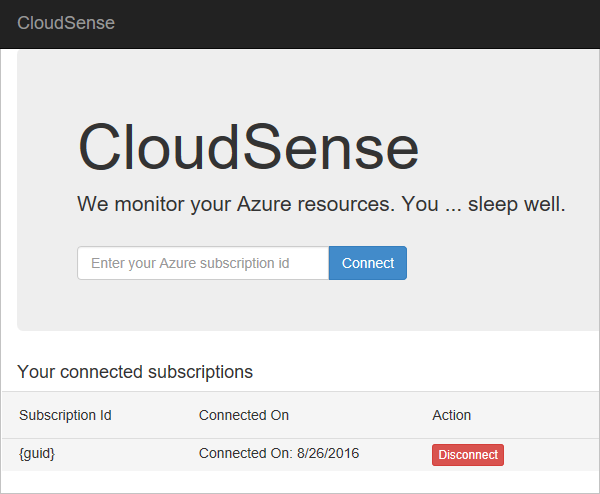

<properties
    pageTitle="Active Directory 身份验证和 Resource Manager | Azure"
    description="指导开发人员使用 Azure Resource Manager API 和 Active Directory 进行身份验证，将应用集成到其他 Azure 订阅。"
    services="azure-resource-manager,active-directory"
    documentationcenter="na"
    author="dushyantgill"
    manager="timlt"
    editor="tysonn" />  

<tags
    ms.assetid="17b2b40d-bf42-4c7d-9a88-9938409c5088"
    ms.service="azure-resource-manager"
    ms.devlang="na"
    ms.topic="article"
    ms.tgt_pltfrm="na"
    ms.workload="identity"
    ms.date="08/31/2016"
    wacn.date="12/26/2016"
    ms.author="dugill;tomfitz" />

# 如何使用 Azure Active Directory 与 Resource Manager 管理客户的资源
## 介绍
本主题面向需要创建应用来管理客户 Azure 资源的软件开发人员，介绍如何使用 Azure Resource Manager API 进行身份验证，并获取其他订阅中资源的访问权限。

应用可通过多种方式访问 Resource Manager API：

1. **用户 + 应用访问**：适用于代表登录用户访问资源的应用。此方法适用于仅处理“交互式管理”Azure 资源的应用，例如 Web 应用和命令行工具。
2. **仅限应用的访问**：适用于运行守护程序服务和计划作业的应用。应用的标识获得资源的直接访问权限。此方法适用于需要长期“脱机访问”Azure 的应用。

本主题提供创建应用来利用这两种授权方法的逐步说明。其中说明如何使用 REST API 或 C# 执行每个步骤。完整的 ASP.NET MVC 应用程序可在 [https://github.com/dushyantgill/VipSwapper/tree/master/CloudSense](https://github.com/dushyantgill/VipSwapper/tree/master/CloudSense) 中找到。

## Web 应用的功能
Web 应用：

1. 将 Azure 用户登录。
2. 请求用户授予 Resource Manager 的访问权限给 Web 应用。
3. 获取用户和应用访问令牌来访问 Resource Manager。
4. 使用令牌（来自步骤 3）调用 Resource Manager，并将应用的服务主体分配给订阅中的角色，使应用能够长期访问订阅。
5. 获取仅限应用的访问令牌。
6. 使用令牌（来自步骤 5）通过 Resource Manager 管理订阅中的资源。

下面是 Web 应用程序的端到端流程。

用户需要提供所用订阅的订阅 ID：

选择用于登录的帐户。

提供凭据。

授予应用访问你的 Azure 订阅的权限：

管理连接的订阅：

## 注册应用程序
在开始编写代码之前，请先使用 Azure Active Directory (AD) 注册 Web 应用。应用注册将在 Azure AD 中为你的应用创建一个中心标识。该标识保留有关应用程序的基本信息，例如应用程序用来进行身份验证和访问 Azure Resource Manager API 的 OAuth 客户端 ID、回复 URL 和凭据。应用注册还会记录应用程序在代表用户访问 Microsoft API 时所需的各种委派权限。

由于应用访问其他订阅，必须将它配置为多租户应用程序。为了通过验证，请提供与 Active Directory 关联的域。若要查看与 Active Directory 关联的域，请登录[经典管理门户](https://manage.windowsazure.cn)。选择 Active Directory，然后选择“域”。

以下示例演示如何使用 Azure PowerShell 注册应用。必须拥有最新版本（2016 年 8 月）Azure PowerShell 才能正常运行此命令。

    $app = New-AzureRmADApplication -DisplayName "{app name}" -HomePage "https://{your domain}/{app name}" -IdentifierUris "https://{your domain}/{app name}" -Password "{your password}" -AvailableToOtherTenants $true

若要以 AD 应用程序登录，需要使用应用程序的 ID 和密码。若要查看前一命令返回的应用程序 ID，请使用：

    $app.ApplicationId

以下示例演示如何使用 Azure CLI 注册应用。

    azure ad app create --name {app name} --home-page https://{your domain}/{app name} --identifier-uris https://{your domain}/{app name} --password {your password} --available true

结果包含 AppId，以应用程序的形式进行身份验证时需要此数据。

### 可选配置 - 证书凭据
Azure AD 还支持应用程序的证书凭据：创建自签名证书、保留私钥，以及将公钥添加到 Azure AD 应用程序注册。对于身份验证，应用程序会使用你的私钥将小负载发送到签名的 Azure AD，然后 Azure AD 使用注册的公钥来验证签名。

有关使用证书创建 AD 应用的信息，请参阅 [Use Azure PowerShell to create a service principal to access resources](/documentation/articles/resource-group-authenticate-service-principal/#create-service-principal-with-certificate)（使用 Azure PowerShell 创建服务主体来访问资源）或 [Use Azure CLI to create a service principal to access resources](/documentation/articles/resource-group-authenticate-service-principal-cli/#create-service-principal-with-certificate)（使用 Azure CLI 创建服务主体来访问资源）。

## 从订阅 ID 获取租户 ID
若要请求可用于调用 Resource Manager 的令牌，应用程序需要知道托管 Azure 订阅的 Azure AD 租户的租户 ID。用户可能知道其订阅 ID，但不知道其用于 Active Directory 的租户 ID。若要获取用户的租户 ID，请让用户提供订阅 ID。发送有关订阅的请求时，请提供该订阅 ID：

    https://management.chinacloudapi.cn/subscriptions/{subscription-id}?api-version=2015-01-01

请求因为用户尚未登录而失败，但可以从响应中检索租户 ID。在该异常中，从 **WWW-Authenticate** 的响应标头值中检索租户 ID。可以在 [GetDirectoryForSubscription](https://github.com/dushyantgill/VipSwapper/blob/master/CloudSense/CloudSense/AzureResourceManagerUtil.cs#L20) 方法中看到此实现。

## 获取用户和应用访问令牌
应用程序使用 OAuth 2.0 授权请求将用户重定向到 Azure AD - 以验证用户的凭据并取回授权代码。应用程序使用授权代码来访问 Resource Manager 的令牌。[ConnectSubscription](https://github.com/dushyantgill/VipSwapper/blob/master/CloudSense/CloudSense/Controllers/HomeController.cs#L42) 方法创建授权请求。

本主题说明用于对用户进行身份验证的 REST API 请求。也可以使用帮助库在代码中执行身份验证。有关这些库的详细信息，请参阅 [Azure Active Directory Authentication Libraries](/documentation/articles/active-directory-authentication-libraries/)（Azure Active Directory 身份验证库）。有关在应用程序中集成标识管理的指导，请参阅 [Azure Active Directory developer's guide](/documentation/articles/active-directory-developers-guide/)（Azure Active Directory 开发人员指南）。

### 授权请求 (OAuth 2.0)
将 Open ID Connect/OAuth2.0 授权请求发送到 Azure AD 授权终结点：

    https://login.chinacloudapi.cn/{tenant-id}/OAuth2/Authorize

[request an authorization code](/documentation/articles/active-directory-protocols-oauth-code/#request-an-authorization-code)（请求授权代码）主题中介绍了适用于此请求的查询字符串参数。

以下示例演示如何请求 OAuth2.0 授权：

    https://login.chinacloudapi.cn/{tenant-id}/OAuth2/Authorize?client_id=a0448380-c346-4f9f-b897-c18733de9394&response_mode=query&response_type=code&redirect_uri=http%3a%2f%2fwww.vipswapper.com%2fcloudsense%2fAccount%2fSignIn&resource=https%3a%2f%2fgraph.chinacloudapi.cn%2f&domain_hint=live.com

Azure AD 对用户进行身份验证，并根据需要请求用户向应用授予权限。它会将授权代码返回到应用程序的回复 URL。Azure AD 根据请求的 response\_mode，将数据发回到查询字符串，或作为发布数据发送。

    code=AAABAAAAiL****FDMZBUwZ8eCAA&session_state=2d16bbce-d5d1-443f-acdf-75f6b0ce8850

### 授权请求 (Open ID Connect)
如果不只想要代表用户访问 Azure Resource Manager，而且还要允许用户使用其 Azure AD 帐户登录你的应用程序，请发出 Open ID Connect 授权请求。使用 Open ID Connect，应用程序也可以从 Azure AD 接收 id\_token，应用可以使用它来将用户登录。

[Send the sign-in request](/documentation/articles/active-directory-protocols-openid-connect-code/#send-the-sign-in-request)（发送登录请求）主题中介绍了适用于此请求的查询字符串参数。

下面是一个示例 Open ID Connect 请求：

     https://login.chinacloudapi.cn/{tenant-id}/OAuth2/Authorize?client_id=a0448380-c346-4f9f-b897-c18733de9394&response_mode=form_post&response_type=code+id_token&redirect_uri=http%3a%2f%2fwww.vipswapper.com%2fcloudsense%2fAccount%2fSignIn&resource=https%3a%2f%2fgraph.chinacloudapi.cn%2f&scope=openid+profile&nonce=63567Dc4MDAw&domain_hint=live.com&state=M_12tMyKaM8

Azure AD 对用户进行身份验证，并根据需要请求用户向应用授予权限。它会将授权代码返回到应用程序的回复 URL。Azure AD 根据请求的 response\_mode，将数据发回到查询字符串，或作为发布数据发送。

下面是一个示例 Open ID Connect 响应：

    code=AAABAAAAiL*****I4rDWd7zXsH6WUjlkIEQxIAA&id_token=eyJ0eXAiOiJKV1Q*****T3GrzzSFxg&state=M_12tMyKaM8&session_state=2d16bbce-d5d1-443f-acdf-75f6b0ce8850

### 令牌请求（OAuth2.0 代码授予流）
既然应用程序已从 Azure AD 收到授权代码，现在你可以获取 Azure Resource Manager 的访问令牌。将 OAuth2.0 代码授予令牌请求发布到 Azure AD 令牌终结点：

    https://login.chinacloudapi.cn/{tenant-id}/OAuth2/Token

[use the authorization code](/documentation/articles/active-directory-protocols-oauth-code/#use-the-authorization-code-to-request-an-access-token)（使用授权代码）主题中介绍了适用于此请求的查询字符串参数。

以下示例演示如何使用密码凭据来请求代码授予令牌：

    POST https://login.chinacloudapi.cn/7fe877e6-a150-4992-bbfe-f517e304dfa0/oauth2/token HTTP/1.1

    Content-Type: application/x-www-form-urlencoded
    Content-Length: 1012

    grant_type=authorization_code&code=AAABAAAAiL9Kn2Z*****L1nVMH3Z5ESiAA&redirect_uri=http%3A%2F%2Flocalhost%3A62080%2FAccount%2FSignIn&client_id=a0448380-c346-4f9f-b897-c18733de9394&client_secret=olna84E8*****goScOg%3D

使用证书凭据时，请使用应用程序证书凭据的私钥来创建 JSON Web 令牌 (JWT) 并签名 (RSA SHA256)。令牌的声明类型在 [JWT 令牌声明](/documentation/articles/active-directory-protocols-oauth-code/#jwt-token-claims)中显示。请参考 [Active Directory Auth Library (.NET) code](https://github.com/AzureAD/azure-activedirectory-library-for-dotnet/blob/dev/src/ADAL.PCL.Desktop/CryptographyHelper.cs)（Active Directory 身份验证库 (.NET) 代码）来为客户端断言 JWT 令牌签名。

有关客户端身份验证的详细信息，请参阅 [Open ID Connect spec](http://openid.net/specs/openid-connect-core-1_0.html#ClientAuthentication)（Open ID Connect 规范）。

以下示例演示如何使用证书凭据来请求代码授予令牌：

    POST https://login.chinacloudapi.cn/7fe877e6-a150-4992-bbfe-f517e304dfa0/oauth2/token HTTP/1.1

    Content-Type: application/x-www-form-urlencoded
    Content-Length: 1012

    grant_type=authorization_code&code=AAABAAAAiL9Kn2Z*****L1nVMH3Z5ESiAA&redirect_uri=http%3A%2F%2Flocalhost%3A62080%2FAccount%2FSignIn&client_id=a0448380-c346-4f9f-b897-c18733de9394&client_assertion_type=urn%3Aietf%3Aparams%3Aoauth%3Aclient-assertion-type%3Ajwt-bearer&client_assertion=eyJhbG*****Y9cYo8nEjMyA

代码授予令牌的示例响应：

    HTTP/1.1 200 OK

    {"token_type":"Bearer","expires_in":"3599","expires_on":"1432039858","not_before":"1432035958","resource":"https://management.core.chinacloudapi.cn/","access_token":"eyJ0eXAiOiJKV1Q****M7Cw6JWtfY2lGc5A","refresh_token":"AAABAAAAiL9Kn2Z****55j-sjnyYgAA","scope":"user_impersonation","id_token":"eyJ0eXAiOiJKV*****-drP1J3P-HnHi9Rr46kGZnukEBH4dsg"}

#### 处理代码授予令牌响应
成功的令牌响应包含 Azure Resource Manager 的（用户 + 应用）访问令牌。应用程序使用此访问令牌来代表用户访问 Resource Manager。Azure AD 颁发的访问令牌生存期为一小时。Web 应用程序不太可能需要续订（用户 + 应用）访问令牌。如果需要续订访问令牌，请使用应用程序在令牌响应中收到的刷新令牌。将 OAuth2.0 令牌请求发布到 Azure AD 令牌终结点：

    https://login.chinacloudapi.cn/{tenant-id}/OAuth2/Token

[refreshing the access token](/documentation/articles/active-directory-protocols-oauth-code/#refreshing-the-access-tokens)（刷新访问令牌）中介绍了要在刷新请求中使用的参数。

以下示例演示如何使用刷新令牌：

    POST https://login.chinacloudapi.cn/7fe877e6-a150-4992-bbfe-f517e304dfa0/oauth2/token HTTP/1.1

    Content-Type: application/x-www-form-urlencoded
    Content-Length: 1012

    grant_type=refresh_token&refresh_token=AAABAAAAiL9Kn2Z****55j-sjnyYgAA&client_id=a0448380-c346-4f9f-b897-c18733de9394&client_secret=olna84E8*****goScOg%3D

尽管刷新令牌可用于获取 Azure Resource Manager 的新访问令牌，但它们并不适合应用程序脱机访问。刷新令牌生存期有限，且刷新令牌绑定到用户。如果用户离开了组织，使用该刷新令牌的应用程序将失去访问权限。此方法不适合团队用来管理其 Azure 资源的应用程序。

## 检查用户是否可以分配订阅的访问权限
现在，应用程序已获取令牌，可代表用户访问 Azure Resource Manager。下一步是将应用程序连接到订阅。在连接之后，即使用户不存在（长期脱机访问），仍然可以管理这些订阅。

对于要连接的每个订阅，可调用 [Resource Manager 列出权限](https://docs.microsoft.com/rest/api/authorization/permissions) API 来确定用户是否拥有订阅的访问管理权限。

ASP.NET MVC 示例应用的 [UserCanManagerAccessForSubscription](https://github.com/dushyantgill/VipSwapper/blob/master/CloudSense/CloudSense/AzureResourceManagerUtil.cs#L44) 方法可实现此调用。

以下示例演示如何请求用户对订阅的权限。83cfe939-2402-4581-b761-4f59b0a041e4 是订阅的 ID。

    GET https://management.chinacloudapi.cn/subscriptions/83cfe939-2402-4581-b761-4f59b0a041e4/providers/microsoft.authorization/permissions?api-version=2015-07-01 HTTP/1.1

    Authorization: Bearer eyJ0eXAiOiJKV1QiLC***lwO1mM7Cw6JWtfY2lGc5A

下面是请求获取用户对订阅的权限后返回的示例响应：

    HTTP/1.1 200 OK

    {"value":[{"actions":["*"],"notActions":["Microsoft.Authorization/*/Write","Microsoft.Authorization/*/Delete"]},{"actions":["*/read"],"notActions":[]}]}

权限 API 将返回多个权限。每个权限包括允许的操作 (actions) 和禁止的操作 (notactions)。如果某个操作出现在任何权限的允许操作列表中，并且不在该权限的禁止操作列表中，则用户可执行该操作。**microsoft.authorization/roleassignments/write** 是授予访问管理权限的操作。应用程序必须分析权限结果，以便在每个权限的 actions 和 notactions 中的此操作字符串上查找 regex 匹配项。

## 获取仅限应用的访问令牌
现在，已知道用户是否可以分配 Azure 订阅的访问权限。后续步骤如下：

1. 将相应的 RBAC 角色分配到订阅上的应用程序标识。
2. 通过查询订阅上的应用程序权限或使用仅限应用的令牌访问 Resource Manager，来验证访问权限分配。
3. 记录应用程序“已连接的订阅”数据结构中的连接 - 保存订阅的 ID。

让我们仔细了解第一个步骤。若要将相应的 RBAC 角色分配到应用程序标识，必须确定：

* 用户 Azure Active Directory 中的应用程序标识的对象 ID
* 应用程序需要在订阅上拥有的 RBAC 角色的标识符

当应用程序对来自 Azure AD 的用户进行身份验证时，将在该 Azure AD 中创建应用程序的服务主体对象。Azure 允许将 RBAC 角色分配到服务主体，以将直接访问权限授予 Azure 资源上的相应应用程序。这正是我们想要执行的操作。查询 Azure AD 图形 API，确定应用程序在已登录用户的 Azure AD 中的服务主体标识符。

你只有 Azure Resource Manager 的访问令牌 - 需要获取新的访问令牌来调用 Azure AD 图形 API。Azure AD 中的每个应用程序都有权查询其本身的服务主体对象，因此，仅限应用的访问令牌已足够。

###  获取 Azure AD 图形 API 的仅限应用的访问令牌
若要对应用进行身份验证并获取 Azure AD 图形 API 的令牌，请向 Azure AD 令牌终结点发出客户端凭据授予 OAuth2.0 流令牌请求 (**https://login.chinacloudapi.cn/{directory\_domain\_name}/OAuth2/Token**)。

ASP.net MVC 示例应用程序的 [GetObjectIdOfServicePrincipalInOrganization](https://github.com/dushyantgill/VipSwapper/blob/master/CloudSense/CloudSense/AzureADGraphAPIUtil.cs) 方法使用适用于 .NET 的 Active Directory 身份验证库来获取图形 API 的仅限应用的访问令牌。

[Request an Access Token](/documentation/articles/active-directory-protocols-oauth-service-to-service/#request-an-access-token)（请求访问令牌）主题中介绍了适用于此请求的查询字符串参数。

客户端凭据授予令牌的示例请求：

    POST https://login.chinacloudapi.cn/62e173e9-301e-423e-bcd4-29121ec1aa24/oauth2/token HTTP/1.1
    Content-Type: application/x-www-form-urlencoded
    Content-Length: 187</pre>
    <pre>grant_type=client_credentials&client_id=a0448380-c346-4f9f-b897-c18733de9394&resource=https%3A%2F%2Fgraph.chinacloudapi.cn%2F &client_secret=olna8C*****Og%3D

客户端凭据授予令牌的示例响应：

    HTTP/1.1 200 OK

    {"token_type":"Bearer","expires_in":"3599","expires_on":"1432039862","not_before":"1432035962","resource":"https://graph.chinacloudapi.cn/","access_token":"eyJ0eXAiOiJKV1QiLCJhbGciOiJSUzI1NiIsIng1dCI6Ik1uQ19WWmNBVGZNNXBPWWlKSE1iYTlnb0VLWSIsImtpZCI6Ik1uQ19WWmNBVGZNNXBPWWlKSE1iYTlnb0VLWSJ9.eyJhdWQiOiJodHRwczovL2dyYXBoLndpbmRv****G5gUTV-kKorR-pg"}

### 获取用户 Azure AD 中应用程序服务主体的 ObjectId
现在，请使用仅限应用的访问令牌来查询 [Azure AD Graph 服务主体](https://msdn.microsoft.com/Library/Azure/Ad/Graph/api/entity-and-complex-type-reference#serviceprincipal-entity) API，确定目录中应用程序服务主体的对象 ID。

ASP.net MVC 示例应用程序的 [GetObjectIdOfServicePrincipalInOrganization](https://github.com/dushyantgill/VipSwapper/blob/master/CloudSense/CloudSense/AzureADGraphAPIUtil.cs#) 方法可实现此调用。

以下示例演示如何请求应用程序的服务主体。a0448380-c346-4f9f-b897-c18733de9394 是应用程序的客户端 ID。

    GET https://graph.chinacloudapi.cn/62e173e9-301e-423e-bcd4-29121ec1aa24/servicePrincipals?api-version=1.5&$filter=appId%20eq%20'a0448380-c346-4f9f-b897-c18733de9394' HTTP/1.1

    Authorization: Bearer eyJ0eXAiOiJK*****-kKorR-pg

以下示例演示了请求应用程序的服务主体后返回的响应

    HTTP/1.1 200 OK

    {"odata.metadata":"https://graph.chinacloudapi.cn/62e173e9-301e-423e-bcd4-29121ec1aa24/$metadata#directoryObjects/Microsoft.DirectoryServices.ServicePrincipal","value":[{"odata.type":"Microsoft.DirectoryServices.ServicePrincipal","objectType":"ServicePrincipal","objectId":"9b5018d4-6951-42ed-8a92-f11ec283ccec","deletionTimestamp":null,"accountEnabled":true,"appDisplayName":"CloudSense","appId":"a0448380-c346-4f9f-b897-c18733de9394","appOwnerTenantId":"62e173e9-301e-423e-bcd4-29121ec1aa24","appRoleAssignmentRequired":false,"appRoles":[],"displayName":"CloudSense","errorUrl":null,"homepage":"http://www.vipswapper.com/cloudsense","keyCredentials":[],"logoutUrl":null,"oauth2Permissions":[{"adminConsentDescription":"Allow the application to access CloudSense on behalf of the signed-in user.","adminConsentDisplayName":"Access CloudSense","id":"b7b7338e-683a-4796-b95e-60c10380de1c","isEnabled":true,"type":"User","userConsentDescription":"Allow the application to access CloudSense on your behalf.","userConsentDisplayName":"Access CloudSense","value":"user_impersonation"}],"passwordCredentials":[],"preferredTokenSigningKeyThumbprint":null,"publisherName":"vipswapper"quot;,"replyUrls":["http://www.vipswapper.com/cloudsense","http://www.vipswapper.com","http://vipswapper.com","http://vipswapper.azurewebsites.net","http://localhost:62080"],"samlMetadataUrl":null,"servicePrincipalNames":["http://www.vipswapper.com/cloudsense","a0448380-c346-4f9f-b897-c18733de9394"],"tags":["WindowsAzureActiveDirectoryIntegratedApp"]}]}

### 获取 Azure RBAC 角色标识符
若要将适当的 RBAC 角色分配给服务主体，必须确定 Azure RBAC 角色的标识符。

应用程序的正确 RBAC 角色：

* 如果应用程序只监视订阅而不进行任何更改，它只需要对订阅的读取者权限。分配**读取者**角色。
* 如果应用程序管理 Azure 订阅并创建/修改/删除实体，它需要一个参与者权限。
  * 若要管理特定类型的资源，请分配资源的特定参与者角色（虚拟机参与者、虚拟网络参与者、存储帐户参与者，等等）
  * 若要管理任何资源类型，请分配**参与者**角色。

应用程序的角色分配向用户显示，因此请选择最低必要权限。

请调用 [Resource Manager 角色定义 API](https://docs.microsoft.com/rest/api/authorization/roledefinitions) 列出所有 Azure RBAC 角色，然后搜索并逐一查看结果，按名称找到所需的角色定义。

ASP.net MVC 示例应用的 [GetRoleId](https://github.com/dushyantgill/VipSwapper/blob/master/CloudSense/CloudSense/AzureResourceManagerUtil.cs#L246) 方法可实现此调用。

以下请求示例演示如何获取 Azure RBAC 角色标识符。09cbd307-aa71-4aca-b346-5f253e6e3ebb 是订阅的 ID。

    GET https://management.chinacloudapi.cn/subscriptions/09cbd307-aa71-4aca-b346-5f253e6e3ebb/providers/Microsoft.Authorization/roleDefinitions?api-version=2015-07-01 HTTP/1.1

    Authorization: Bearer eyJ0eXAiOiJKV*****fY2lGc5

响应格式如下：

    HTTP/1.1 200 OK

    {"value":[{"properties":{"roleName":"API Management Service Contributor","type":"BuiltInRole","description":"Lets you manage API Management services, but not access to them.","scope":"/","permissions":[{"actions":["Microsoft.ApiManagement/Services/*","Microsoft.Authorization/*/read","Microsoft.Resources/subscriptions/resources/read","Microsoft.Resources/subscriptions/resourceGroups/read","Microsoft.Resources/subscriptions/resourceGroups/resources/read","Microsoft.Resources/subscriptions/resourceGroups/deployments/*","Microsoft.Insights/alertRules/*","Microsoft.Support/*"],"notActions":[]}]},"id":"/subscriptions/09cbd307-aa71-4aca-b346-5f253e6e3ebb/providers/Microsoft.Authorization/roleDefinitions/312a565d-c81f-4fd8-895a-4e21e48d571c","type":"Microsoft.Authorization/roleDefinitions","name":"312a565d-c81f-4fd8-895a-4e21e48d571c"},{"properties":{"roleName":"Application Insights Component Contributor","type":"BuiltInRole","description":"Lets you manage Application Insights components, but not access to them.","scope":"/","permissions":[{"actions":["Microsoft.Insights/components/*","Microsoft.Insights/webtests/*","Microsoft.Authorization/*/read","Microsoft.Resources/subscriptions/resources/read","Microsoft.Resources/subscriptions/resourceGroups/read","Microsoft.Resources/subscriptions/resourceGroups/resources/read","Microsoft.Resources/subscriptions/resourceGroups/deployments/*","Microsoft.Insights/alertRules/*","Microsoft.Support/*"],"notActions":[]}]},"id":"/subscriptions/09cbd307-aa71-4aca-b346-5f253e6e3ebb/providers/Microsoft.Authorization/roleDefinitions/ae349356-3a1b-4a5e-921d-050484c6347e","type":"Microsoft.Authorization/roleDefinitions","name":"ae349356-3a1b-4a5e-921d-050484c6347e"}]}

不需要持续调用此 API。一旦确定角色定义的已知 GUID，便可以将角色定义 ID 构造为：

    /subscriptions/{subscription_id}/providers/Microsoft.Authorization/roleDefinitions/{well-known-role-guid}

下面是常用内置角色的已知 GUID：

| 角色 | Guid |
| --- | --- |
| 读取器 |acdd72a7-3385-48ef-bd42-f606fba81ae7 |
| 参与者 |b24988ac-6180-42a0-ab88-20f7382dd24c |
| 虚拟机参与者 |d73bb868-a0df-4d4d-bd69-98a00b01fccb |
| 虚拟网络参与者 |b34d265f-36f7-4a0d-a4d4-e158ca92e90f |
| 存储帐户参与者 |86e8f5dc-a6e9-4c67-9d15-de283e8eac25 |
| 网站参与者 |de139f84-1756-47ae-9be6-808fbbe84772 |
| Web 计划参与者 |2cc479cb-7b4d-49a8-b449-8c00fd0f0a4b |
| SQL Server 参与者 |6d8ee4ec-f05a-4a1d-8b00-a9b17e38b437 |
| SQL DB 参与者 |9b7fa17d-e63e-47b0-bb0a-15c516ac86ec |

### 将 RBAC 角色分配到应用程序
现已做好一切准备，可以使用 [Resource Manager 创建角色分配](https://docs.microsoft.com/rest/api/authorization/roleassignments) API 将相应的 RBAC 角色分配到服务主体。

ASP.net MVC 示例应用的 [GrantRoleToServicePrincipalOnSubscription](https://github.com/dushyantgill/VipSwapper/blob/master/CloudSense/CloudSense/AzureResourceManagerUtil.cs#L170) 方法可实现此调用。

将 RBAC 角色分配到应用程序的示例请求：

    PUT https://management.chinacloudapi.cn/subscriptions/09cbd307-aa71-4aca-b346-5f253e6e3ebb/providers/microsoft.authorization/roleassignments/4f87261d-2816-465d-8311-70a27558df4c?api-version=2015-07-01 HTTP/1.1

    Authorization: Bearer eyJ0eXAiOiJKV1QiL*****FlwO1mM7Cw6JWtfY2lGc5
    Content-Type: application/json
    Content-Length: 230

    {"properties": {"roleDefinitionId":"/subscriptions/09cbd307-aa71-4aca-b346-5f253e6e3ebb/providers/Microsoft.Authorization/roleDefinitions/acdd72a7-3385-48ef-bd42-f606fba81ae7","principalId":"c3097b31-7309-4c59-b4e3-770f8406bad2"}}

在请求中使用以下值：

| Guid | 说明 |
| --- | --- |
| 09cbd307-aa71-4aca-b346-5f253e6e3ebb |订阅的 ID |
| c3097b31-7309-4c59-b4e3-770f8406bad2 |应用程序服务主体的对象 ID |
| acdd72a7-3385-48ef-bd42-f606fba81ae7 |读取者角色的 ID |
| 4f87261d-2816-465d-8311-70a27558df4c |为新角色分配创建的新 GUID |

响应格式如下：

    HTTP/1.1 201 Created

    {"properties":{"roleDefinitionId":"/subscriptions/09cbd307-aa71-4aca-b346-5f253e6e3ebb/providers/Microsoft.Authorization/roleDefinitions/acdd72a7-3385-48ef-bd42-f606fba81ae7","principalId":"c3097b31-7309-4c59-b4e3-770f8406bad2","scope":"/subscriptions/09cbd307-aa71-4aca-b346-5f253e6e3ebb"},"id":"/subscriptions/09cbd307-aa71-4aca-b346-5f253e6e3ebb/providers/Microsoft.Authorization/roleAssignments/4f87261d-2816-465d-8311-70a27558df4c","type":"Microsoft.Authorization/roleAssignments","name":"4f87261d-2816-465d-8311-70a27558df4c"}

### 获取 Azure Resource Manager 的仅限应用的访问令牌
若要验证应用程序是否具有所需的订阅访问权限，请使用仅限应用的令牌对订阅执行测试任务。

若要获取仅限应用的访问令牌，请根据 [Get app-only access token for Azure AD Graph API](#app-azure-ad-graph)（获取 Azure AD 图形 API 的仅限应用的访问令牌）中的说明为资源参数使用不同的值：

    https://management.core.chinacloudapi.cn/

ASP.NET MVC 示例应用程序的 [ServicePrincipalHasReadAccessToSubscription](https://github.com/dushyantgill/VipSwapper/blob/master/CloudSense/CloudSense/AzureResourceManagerUtil.cs#L110) 方法使用适用于 .NET 的 Active Directory 身份验证库来获取 Azure Resource Manager 的仅限应用的访问令牌。

#### 获取应用程序对订阅的权限
若要检查应用程序是否具有 Azure 订阅上的所需访问权限，也可以调用 [Resource Manager 权限](https://docs.microsoft.com/rest/api/authorization/permissions) API。此方式类似于用于确定用户是否具有订阅访问管理权限的方式。不过，这次请使用上一步骤中收到的仅限应用的访问令牌来调用权限 API。

ASP.NET MVC 示例应用的 [ServicePrincipalHasReadAccessToSubscription](https://github.com/dushyantgill/VipSwapper/blob/master/CloudSense/CloudSense/AzureResourceManagerUtil.cs#L110) 方法可实现此调用。

## 管理连接的订阅
将相应的 RBAC 角色分配到订阅上的应用程序服务主体后，应用程序可以使用 Azure Resource Manager 的仅限应用的访问令牌来持续进行监视/管理。

如果订阅所有者使用经典管理门户或命令行工具删除应用程序的角色分配，应用程序再也无法访问该订阅。在此情况下，你应该通知用户，与订阅的连接是通过应用程序外部提供的，并为他们提供“修复”连接的选项。“修复”只是重新创建脱机删除的角色分配。

如同允许用户将其订阅连接到应用程序一样，必须允许用户断开连接订阅。从访问管理的观点来讲，断开连接意味着删除应用程序服务主体在订阅上的角色分配。（可选）也可能删除订阅的任何应用程序状态。
只有对订阅拥有访问管理权限的用户才能断开连接订阅。

ASP.net MVC 示例应用的 [RevokeRoleFromServicePrincipalOnSubscription 方法](https://github.com/dushyantgill/VipSwapper/blob/master/CloudSense/CloudSense/AzureResourceManagerUtil.cs#L200)可实现此调用。

大功告成 - 用户现在可以使用应用程序来轻松连接和管理其 Azure 订阅。

<!---HONumber=Mooncake_1219_2016-->