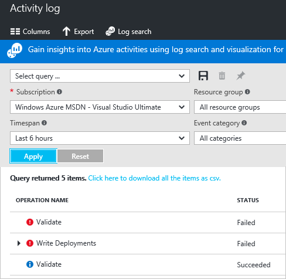
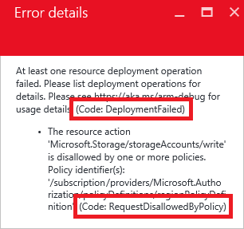
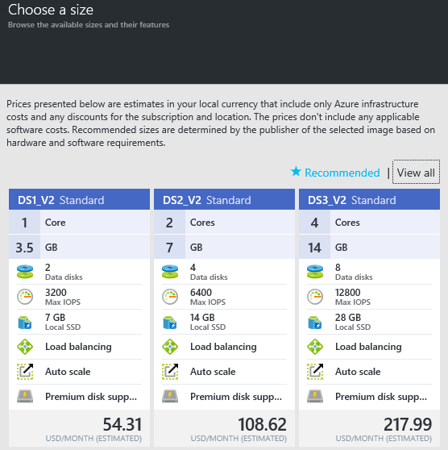
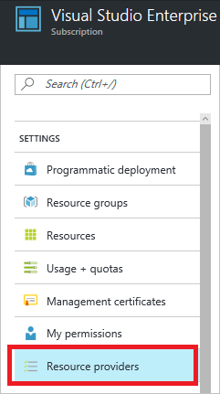
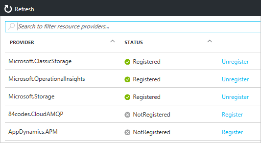
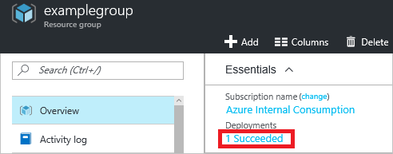
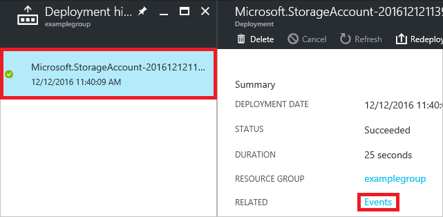
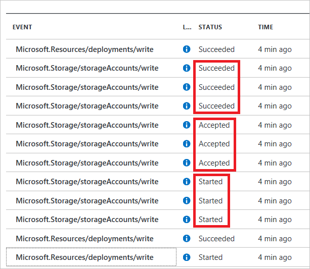
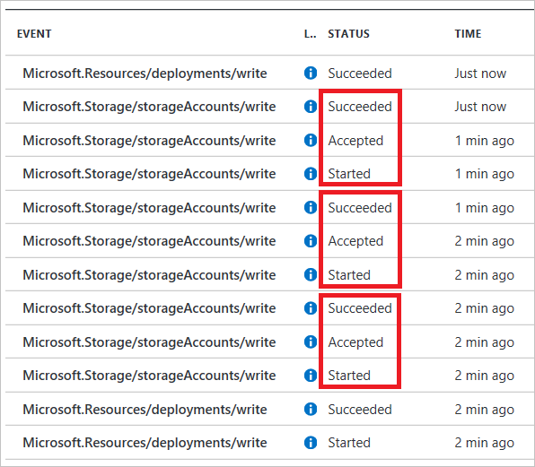

<properties
    pageTitle="排查常见的 Azure 部署错误 | Azure"
    description="说明如何解决使用 Azure Resource Manager 将资源部署到 Azure 时的常见错误。"
    services="azure-resource-manager"
    documentationcenter=""
    tags="top-support-issue"
    author="tfitzmac"
    manager="timlt"
    editor="tysonn"
    keywords="部署错误, azure 部署, 部署到 azure" />
<tags
    ms.assetid="c002a9be-4de5-4963-bd14-b54aa3d8fa59"
    ms.service="azure-resource-manager"
    ms.devlang="na"
    ms.topic="article"
    ms.tgt_pltfrm="na"
    ms.workload="na"
    ms.date="01/18/2017"
    wacn.date="03/03/2017"
    ms.author="tomfitz" />  

# 排查使用 Azure Resource Manager 时的常见 Azure 部署错误
本主题介绍如何解决可能遇到的一些常见 Azure 部署错误。

## 两种类型的错误
可能会出现两种类型的错误：

* 验证错误
* 部署错误

下图显示了订阅的活动日志。两个部署中发生了三个操作。在第一个部署中，模板通过了验证，但创建资源时失败（**写入部署**）。在第二个部署中，模板验证失败，未转到**写入部署**阶段。

  

方案中出现可预先确定会导致问题的验证错误。验证错误包括模板中的语法错误，还包括尝试部署将超过订阅配额的资源。部署错误起源于部署过程中出现的情况。例如，尝试访问正在并行部署的资源可能导致部署错误。

这两种类型的错误都会返回错误代码，可使用该代码来排查部署问题。这两种类型的错误会显示在[活动日志](/documentation/articles/resource-group-audit/)中。但是，验证错误不会显示在部署历史记录中，因为部署并未开始。

## 错误代码

本主题介绍以下错误代码：

* [AccountNameInvalid](#accountnameinvalid)
* [授权失败](#authorization-failed)
* [BadRequest](#badrequest)
* [DeploymentFailed](#deploymentfailed)
* [InvalidContentLink](#invalidcontentlink)
* [InvalidTemplate](#invalidtemplate)
* [MissingSubscriptionRegistration](#noregisteredproviderfound)
* [NotFound](#notfound)
* [NoRegisteredProviderFound](#noregisteredproviderfound)
* [OperationNotAllowed](#quotaexceeded)
* [ParentResourceNotFound](#parentresourcenotfound)
* [QuotaExceeded](#quotaexceeded)
* [RequestDisallowedByPolicy](#requestdisallowedbypolicy)
* [ResourceNotFound](#notfound)
* [SkuNotAvailable](#skunotavailable)
* [StorageAccountAlreadyExists](#storagenamenotunique)
* [StorageAccountAlreadyTaken](#storagenamenotunique)

###  DeploymentFailed

此错误代码指示常规部署错误，但它不是开始进行故障排除所需的错误代码。真正能够帮助解决问题的错误代码通常是该错误的下一级错误代码。例如，下图显示了部署错误下的 **RequestDisallowedByPolicy** 错误代码。

  

###  SkuNotAvailable

在部署资源（通常为虚拟机）时，可能会收到以下错误代码和错误消息：

    Code: SkuNotAvailable
    Message: The requested tier for resource '<resource>' is currently not available in location '<location>' 
    for subscription '<subscriptionID>'. Please try another tier or deploy to a different location.

当所选的资源 SKU（如 VM 大小）不可用于所选的位置时，会收到此错误。若要解决此问题，需要确定区域提供哪些 SKU。可以使用门户或 REST 操作查找可用的 SKU。

- 若要使用[门户](https://portal.azure.cn)，请登录到门户，然后通过界面添加资源。设置值时，可看到该资源的可用 SKU。不需要完成部署。

      

- 若要对虚拟机使用 REST API，请发送以下请求：

        GET https://management.chinacloudapi.cn/subscriptions/{subscription-id}/providers/Microsoft.Compute/skus?api-version=2016-03-30

     它会用以下格式返回可用的 SKU 和区域：

        {
            "value": [
	          {
	            "resourceType": "virtualMachines",
	            "name": "Standard_A0",
	            "tier": "Standard",
	            "size": "A0",
	            "locations": [
	              "chinaeast"
	            ],
	            "restrictions": []
	          },
	          {
	            "resourceType": "virtualMachines",
	            "name": "Standard_A1",
	            "tier": "Standard",
	            "size": "A1",
	            "locations": [
	              "chinaeast"
	            ],
	            "restrictions": []
	          },
	          ...
            ]
        }    

    如果在该区域或满足业务需求的备用区域中找不到合适的 SKU，请与 [Azure 支持](https://portal.azure.cn/#create/Microsoft.Support)联系。

###  InvalidTemplate

此错误可由多种不同类型的错误导致。

- 语法错误

    如果有错误消息指出模板验证失败，则可能是模板中存在语法问题。

        Code=InvalidTemplate
        Message=Deployment template validation failed

    此错误很容易发生，因为模板表达式可能很复杂。例如，存储帐户的以下名称分配包含一组方括号、三个函数、三组圆括号、一组单引号和一个属性：

        "name": "[concat('storage', uniqueString(resourceGroup().id))]",

    如果未提供匹配的语法，该模板将生成一个意外的值。

    当你收到此类错误时，请仔细检查表达式语法。考虑使用 [Visual Studio](/documentation/articles/vs-azure-tools-resource-groups-deployment-projects-create-deploy/) 或 [Visual Studio Code](/documentation/articles/resource-manager-vs-code/) 这样的 JSON 编辑器，以便在出现语法错误时发出警告。

- 段长度不正确

    当资源名称的格式不正确时，会发生另一种模板无效错误。

        Code=InvalidTemplate
        Message=Deployment template validation failed: 'The template resource {resource-name}'
        for type {resource-type} has incorrect segment lengths.

    根级别的资源其名称中的段必须比资源类型中的段少一个。段之间用斜杠隔开。在下面的示例中，类型有两个段，名称有一个段，因此为**有效名称**。

        {
          "type": "Microsoft.Web/serverfarms",
          "name": "myHostingPlanName",
          ...
        }

    但下一个示例**不是有效名称**，因为其段数与类型的段数相同。

        {
          "type": "Microsoft.Web/serverfarms",
          "name": "appPlan/myHostingPlanName",
          ...
        }

    对于子资源来说，类型和名称的段数必须相同。之所以必须这样，是因为子资源的完整名称和类型包含父名称和类型。因此，完整名称的段仍比完整类型的段少一个。

        "resources": [
            {
                "type": "Microsoft.KeyVault/vaults",
                "name": "contosokeyvault",
                ...
                "resources": [
                    {
                        "type": "secrets",
                        "name": "appPassword",
                        ...
                    }
                ]
            }
        ]

    确保段数正确对于 Resource Manager 类型来说可能很困难，这些类型应用到各个资源提供程序。例如，对网站应用资源锁需要使用包含四个段的类型。因此，该名称包含三个段：

        {
            "type": "Microsoft.Web/sites/providers/locks",
            "name": "[concat(variables('siteName'),'/Microsoft.Authorization/MySiteLock')]",
            ...
        }

- 不应使用 Copy 索引

    将 **copy** 元素应用到不支持该元素的模板部分时，会遇到此 **InvalidTemplate** 错误。只能将 copy 元素应用于资源类型。不能将 copy 应用于资源类型中的属性。例如，可以将 copy 应用于虚拟机，但不能将其应用于虚拟机的 OS 磁盘。在某些情况下，可以将子资源转换为父资源，以创建复制循环。有关使用 copy 的详细信息，请参阅[在 Azure Resource Manager 中创建多个资源实例](/documentation/articles/resource-group-create-multiple/)。

- 参数无效

    如果模板指定了参数的允许值，但你提供的值并不是这些允许值之一，则会收到类似于下面的错误消息：

        Code=InvalidTemplate;
        Message=Deployment template validation failed: 'The provided value {parameter value}
        for the template parameter {parameter name} is not valid. The parameter value is not
        part of the allowed values

    请仔细检查模板中的允许值，然后提供在部署过程中提供这些值之一。

- 检测到循环依赖项

    当资源以某种方式互相依赖，导致部署无法启动时，就会出现此错误。将多个相互依赖的项组合在一起时，会导致两个或两个以上的资源等待其他资源，而后者也在进行等待。例如，resource1 依赖于 resource3，resource2 依赖于 resource1，resource3 依赖于 resource2。通常情况下，删除不必要的依赖项即可解决此问题。有关依赖项错误的故障诊断建议，请参阅[检查部署顺序](#check-deployment-sequence)。

###  NotFound 和 ResourceNotFound

如果模板包含无法解析的资源的名称，将出现类似于下面的错误：

    Code=NotFound;
    Message=Cannot find ServerFarm with name exampleplan.

若要部署模板中缺少的资源，请检查是否需要添加依赖关系。如果可能，Resource Manager 将通过并行创建资源来优化部署。如果一个资源必须在另一个资源之后部署，则需在模板中使用 **dependsOn** 元素创建与其他资源的依赖关系。例如，在部署 Web 应用时，App Service 计划必须存在。如果未指定该 Web 应用与应用服务计划的依赖关系，Resource Manager 将同时创建这两个资源。此时将出现一条错误消息，指出找不到应用服务计划资源，因为尝试在 Web 应用上设置属性时它尚不存在。在 Web 应用中设置依赖关系可避免此错误。

    {
      "apiVersion": "2015-08-01",
      "type": "Microsoft.Web/sites",
      "dependsOn": [
        "[variables('hostingPlanName')]"
      ],
      ...
    }

有关依赖项错误的故障诊断建议，请参阅[检查部署顺序](#check-deployment-sequence)。

如果资源所在的资源组不是要部署到的资源组，也可能会出现此错误。在这种情况下，请使用 [resourceId 函数](/documentation/articles/resource-group-template-functions/#resourceid)获取资源的完全限定名称。

    "properties": {
        "name": "[parameters('siteName')]",
        "serverFarmId": "[resourceId('plangroup', 'Microsoft.Web/serverfarms', parameters('hostingPlanName'))]"
    }

如果尝试对无法解析的资源使用 [reference](/documentation/articles/resource-group-template-functions/#reference) 或 [listKeys](/documentation/articles/resource-group-template-functions/#listkeys) 函数，将出现以下错误：

    Code=ResourceNotFound;
    Message=The Resource 'Microsoft.Storage/storageAccounts/{storage name}' under resource
    group {resource group name} was not found.

请查找包含 **reference** 函数的表达式。仔细检查参数值是否正确。

###  ParentResourceNotFound

如果一项资源是另一资源的父级，则父资源必须存在才能创建子资源。如果它尚不存在，将收到以下错误：

    Code=ParentResourceNotFound;
    Message=Can not perform requested operation on nested resource. Parent resource 'exampleserver' not found."

子资源的名称包括父名称。例如，SQL 数据库可能定义为：

    {
      "type": "Microsoft.Sql/servers/databases",
      "name": "[concat(variables('databaseServerName'), '/', parameters('databaseName'))]",
      ...

但是，如果你不指定对父资源的依赖关系，则可能在部署父资源之前部署子资源。为更正此错误，请添加依赖关系。

    "dependsOn": [
        "[variables('databaseServerName')]"
    ]

###  StorageAccountAlreadyExists 和 StorageAccountAlreadyTaken

对于存储帐户，必须提供在 Azure 中唯一的资源名称。如果不提供唯一名称，会出现类似于下面的错误：

    Code=StorageAccountAlreadyTaken
    Message=The storage account named mystorage is already taken.

可将命名约定与 [uniqueString](/documentation/articles/resource-group-template-functions/#uniquestring) 函数的结果连接起来创建一个唯一名称。

    "name": "[concat('storage', uniqueString(resourceGroup().id))]",
    "type": "Microsoft.Storage/storageAccounts",

如果部署的存储帐户与订阅中某个现有存储帐户的名称相同，但提供的位置不同，将会出现一条错误消息，指出不同的位置已存在该存储帐户。请删除现有存储帐户，或者提供与现有存储帐户相同的位置。

###  AccountNameInvalid

尝试为存储帐户提供一个包含禁止字符的名称时，将会出现 **AccountNameInvalid** 错误。存储帐户名称必须为 3 到 24 个字符，只能使用数字和小写字母。[uniqueString](/documentation/articles/resource-group-template-functions/#uniquestring) 函数返回 13 个字符。如果将前缀连接到 **uniqueString** 结果，请提供 11 个字符（或更少字符）的前缀。

###  BadRequest

为属性提供的值无效时，可能遇到 BadRequest 状态。例如，如果为存储帐户提供错误的 SKU 值，部署将失败。若要确定属性的有效值，请查看 [REST API](https://docs.microsoft.com/rest/api) 以了解要部署的资源类型。

###  NoRegisteredProviderFound 和 MissingSubscriptionRegistration
部署资源时，你可能会收到以下错误代码和消息：

    Code: NoRegisteredProviderFound
    Message: No registered resource provider found for location {location}
    and API version {api-version} for type {resource-type}.

或者，可能收到类似的消息，指出：

    Code: MissingSubscriptionRegistration
    Message: The subscription is not registered to use namespace {resource-provider-namespace}

可能由于下三种原因之一而收到此错误：

1. 尚未为订阅注册资源提供程序
2. 资源类型不支持该 API 版本
3. 资源类型不支持该位置

错误消息应提供有关支持的位置和 API 版本的建议。可以将模板更改为建议的值之一。Azure 门户预览或正在使用的命令行接口会自动注册大多数提供程序，但非全部。如果你以前未使用特定的资源提供程序，则可能需要注册该提供程序。可以通过 PowerShell 或 Azure CLI 了解有关资源提供程序的详细信息。

**门户**

可以通过门户查看注册状态，并注册资源提供程序命名空间。

1. 对于你的订阅，选择“资源提供程序”。

      

2. 查看资源提供程序的列表，根据需要选择“注册”链接，注册你尝试部署的类型的资源提供程序。

      

**PowerShell**

若要查看注册状态，请使用 **Get-AzureRmResourceProvider**。

    Get-AzureRmResourceProvider -ListAvailable

若要注册提供程序，请使用 **Register-AzureRmResourceProvider**，并提供想要注册的资源提供程序的名称。

    Register-AzureRmResourceProvider -ProviderNamespace Microsoft.Cdn

若要获取特定类型的资源支持的位置，请使用：

    ((Get-AzureRmResourceProvider -ProviderNamespace Microsoft.Web).ResourceTypes | Where-Object ResourceTypeName -eq sites).Locations

若要获取特定类型的资源支持的 API 版本，请使用：

    ((Get-AzureRmResourceProvider -ProviderNamespace Microsoft.Web).ResourceTypes | Where-Object ResourceTypeName -eq sites).ApiVersions

**Azure CLI**

若要查看是否已注册提供程序，请使用 `azure provider list` 命令。

    azure provider list

若要注册资源提供程序，请使用 `azure provider register` 命令，并指定要注册的 *命名空间* 。

    azure provider register Microsoft.Cdn

若要查看资源提供程序支持的位置和 API 版本，请使用：

    azure provider show -n Microsoft.Compute --json > compute.json

###  QuotaExceeded 和 OperationNotAllowed
部署超出配额（可能是根据资源组、订阅、帐户和其他范围指定的）时，可能会遇到问题。例如，订阅可能配置为限制某个区域的核心数目。如果尝试部署超过允许核心数目的虚拟机，将收到指出超过配额的错误消息。有关完整的配额信息，请参阅 [Azure 订阅和服务限制、配额与约束](/documentation/articles/azure-subscription-service-limits/)。

若要检查订阅的核心配额，可以使用 Azure CLI 中的 `azure vm list-usage` 命令。以下示例显示，试用帐户的核心配额为 4 ：

    azure vm list-usage

将返回：

    info:    Executing command vm list-usage
    Location: chinanorth
    data:    Name   Unit   CurrentValue  Limit
    data:    -----  -----  ------------  -----
    data:    Cores  Count  0             4
    info:    vm list-usage command OK

如果在中国北部区域部署一个会创建四个以上的核心的模板，将出现类似如下的部署错误：

    Code=OperationNotAllowed
    Message=Operation results in exceeding quota limits of Core.
    Maximum allowed: 4, Current in use: 4, Additional requested: 2.

或者，可以在 PowerShell 中使用 **Get-AzureRmVMUsage** cmdlet。

    Get-AzureRmVMUsage

将返回：

    ...
    CurrentValue : 0
    Limit        : 4
    Name         : {
                     "value": "cores",
                     "localizedValue": "Total Regional Cores"
                   }
    Unit         : null
    ...

在这种情况中，你应前往门户并提交一份支持问题以增加你在要部署区域内的配额。

> [AZURE.NOTE]
> 请记住，对于资源组，配额针对每个单独的区域，而不是针对整个订阅。如果你需要在中国北部部署 30 个核心，则必须在中国北部寻求 30 个资源管理器核心。如果需要在有权访问的任何区域内部署总共 30 个核心，则应在所有区域内请求总共 30 个 Resource Manager 核心。
>
>

###  InvalidContentLink
如果收到以下错误消息：

    Code=InvalidContentLink
    Message=Unable to download deployment content from ...

原因很可能是你尝试链接到一个不可用的嵌套模板。请仔细检查提供给嵌套模板的 URI。如果模板在存储帐户中存在，请确保 URI 可访问。可能需要传递 SAS 令牌。有关详细信息，请参阅[将链接的模板与 Azure 资源管理器配合使用](/documentation/articles/resource-group-linked-templates/)。

###  RequestDisallowedByPolicy
如果订阅中的某个资源策略会阻止部署期间尝试执行的操作，将会出现此错误。在错误消息中查找策略标识符。

    Policy identifier(s): '/subscriptions/{guid}/providers/Microsoft.Authorization/policyDefinitions/regionPolicyDefinition'

在 **PowerShell** 中以 **Id** 参数形式提供该策略标识符即可检索有关阻止部署的策略的详细信息。

    (Get-AzureRmPolicyAssignment -Id "/subscriptions/{guid}/providers/Microsoft.Authorization/policyDefinitions/regionPolicyDefinition").Properties.policyRule | ConvertTo-Json

在 **Azure CLI** 中，请提供策略定义的名称：

    azure policy definition show regionPolicyDefinition --json

有关策略的详细信息，请参阅[使用策略来管理资源和控制访问](/documentation/articles/resource-manager-policy/)。

###  授权失败
你可能在部署期间收到错误，因为尝试部署资源的帐户或服务主体没有执行这些操作的访问权限。Azure Active Directory 可让你或你的系统管理员非常精确地控制哪些标识可以访问哪些资源。例如，如果你的帐户已分配到“读取者”角色，则无法创建资源。在此情况下，将会出现一条错误消息，指出授权失败。

有关基于角色的访问控制的详细信息，请参阅 [Azure 基于角色的访问控制](/documentation/articles/role-based-access-control-configure/)。

## 故障排除技巧和提示

### 启用调试日志记录
可以通过记录请求和/或响应，发现有关部署处理方式的重要信息。

- PowerShell

    在 PowerShell 中，将 **DeploymentDebugLogLevel** 参数设置为 All、ResponseContent 或 RequestContent。

        New-AzureRmResourceGroupDeployment -ResourceGroupName examplegroup -TemplateFile c:\Azure\Templates\storage.json -DeploymentDebugLogLevel All

    使用以下 cmdlet 检查请求内容：

        (Get-AzureRmResourceGroupDeploymentOperation -DeploymentName storageonly -ResourceGroupName startgroup).Properties.request | ConvertTo-Json

    或者，使用以下命令检查响应内容：

        (Get-AzureRmResourceGroupDeploymentOperation -DeploymentName storageonly -ResourceGroupName startgroup).Properties.response | ConvertTo-Json

    此信息可帮助确定模板中某个值的设置是否错误。

- Azure CLI

    在 Azure CLI 中，将 **--debug-setting** 参数设置为 All、ResponseContent 或 RequestContent。

        azure group deployment create --debug-setting All -f c:\Azure\Templates\storage.json -g examplegroup -n ExampleDeployment

    使用以下命令检查记录的请求和响应内容：

        azure group deployment operation list --resource-group examplegroup --name ExampleDeployment --json

    此信息可帮助确定模板中某个值的设置是否错误。

- 嵌套模板

    若要记录嵌套模板的调试信息，请使用 **debugSetting** 元素。

        {
            "apiVersion": "2016-09-01",
            "name": "nestedTemplate",
            "type": "Microsoft.Resources/deployments",
            "properties": {
                "mode": "Incremental",
                "templateLink": {
                    "uri": "{template-uri}",
                    "contentVersion": "1.0.0.0"
                },
                "debugSetting": {
                   "detailLevel": "requestContent, responseContent"
                }
            }
        }

### 创建故障排除模板
在某些情况下，排查模板问题的最简单方法是测试模板的部件。可以创建一个简化的模板，专注于调查你认为是错误起源的部件。例如，假设在引用资源时出现了错误。请勿处理整个模板，而是创建可返回可能导致问题的部件的模板。这可以帮助确定是否传入了正确的参数、是否正确使用了模板函数，以及是否获取了所需的资源。

    {
      "$schema": "https://schema.management.azure.com/schemas/2015-01-01/deploymentTemplate.json#",
      "contentVersion": "1.0.0.0",
      "parameters": {
        "storageName": {
            "type": "string"
        },
        "storageResourceGroup": {
            "type": "string"
        }
      },
      "variables": {},
      "resources": [],
      "outputs": {
        "exampleOutput": {
            "value": "[reference(resourceId(parameters('storageResourceGroup'), 'Microsoft.Storage/storageAccounts', parameters('storageName')), '2016-05-01')]",
            "type" : "object"
        }
      }
    }

或者，假设遇到部署错误，而你认为它与依赖关系设置错误有关。将模板分解为多个简化模板，对其进行测试。首先，创建仅部署单项资源（如 SQL Server）的模板。确保已正确定义该资源时，再添加依赖于它的资源（如 SQL 数据库）。正确定义这两项资源后，添加其他从属资源（如审核策略）。在每个测试部署之间，删除资源组，以确保充分测试依赖关系。

###  检查部署顺序

如果以意外的顺序部署资源，可能发生许多部署错误。依赖关系设置不当就会出现这些错误。缺少必需的依赖项时，就会出现一项资源尝试使用另一资源的值，但后者却不存在的情况。出现一个错误，指出找不到资源。可能会间歇性地遇到此类错误，因为资源的部署时间各不相同。例如，第一次尝试部署资源成功，因为所需资源偶然但却及时地完成了相关操作。但是，第二次尝试却失败了，因为所需资源未及时完成相关操作。

不过，你想要避免设置不必要的依赖项。存在不必要的依赖项时，会导致不互相依赖的资源无法并行部署，从而延长了部署时间。此外，可能会创建阻止部署的循环依赖项。[reference](/documentation/articles/resource-group-template-functions/#reference) 函数可创建隐式依赖项，依赖于在函数中指定为参数的资源，前提是该资源部署在同一模板中。因此，用户拥有的依赖项可以多于在 **dependsOn** 属性中指定的依赖项。[resourceId](/documentation/articles/resource-group-template-functions/#resourceid) 函数不创建隐式依赖项，也不验证资源是否存在。

遇到依赖项问题时，需了解资源部署顺序。查看部署操作顺序的方法如下：

1. 选择资源组的部署历史记录。

      

2. 从历史记录中选择一个部署，然后选择“事件”。

      

3. 检查每项资源的事件的顺序。注意每个操作的状态。例如，下图显示了并行部署的三个存储帐户。请注意，这三个存储帐户是同时启动的。

      

    下图显示了非并行部署的三个存储帐户。第二个存储帐户依赖于第一个存储帐户，第三个存储帐户又依赖于第二个存储帐户。因此，启动、接受并处理完成第一个存储帐户后才开始对下一个进行操作。

      

实际情况可能复杂得多，但可以通过相同方法发现每个资源的部署开始时间和完成时间。浏览部署事件，看其顺序是否不同于预期的顺序。如果答案为是，请重新评估该资源的依赖项。

Resource Manager 可在模板验证过程中确定循环依赖项。它会返回一条错误消息，明确指出存在循环依赖项。解决循环依赖项问题的步骤：

1. 在模板中找到循环依赖项中标识的资源。
2. 检查该资源的 **dependsOn** 属性并使用 **reference** 函数查看其所依赖的资源。
3. 检查这些资源，看其依赖于哪些资源。顺着这些依赖项检查下去，直到找到依赖于原始资源的资源。
4. 对于循环依赖项所牵涉的资源，请仔细检查所有使用 **dependsOn** 属性的情况，确定不需要的依赖项。删除这些依赖项。如果不确定某个依赖项是否为必需依赖项，可尝试删除它。
5. 重新部署模板。

部署模板时，删除 **dependsOn** 属性中的值可能导致错误。如果遇到错误，可将依赖项添加回模板。

如果该方法无法解决循环依赖项问题，可考虑将部分部署逻辑移至子资源（例如扩展或配置设置）中。将这些子资源配置为在循环依赖项所牵涉的资源之后部署。例如，假设要部署两个虚拟机，但必须在每个虚拟机上设置引用另一虚拟机的属性。可以按下述顺序部署这两个虚拟机：

1. vm1
2. vm2
3. vm1 上的扩展依赖于 vm1 和 vm2。扩展在 vm1 上设置的值是从 vm2 获取的。
4. vm2 上的扩展依赖于 vm1 和 vm2。扩展在 vm2 上设置的值是从 vm1 获取的。

同一方法适用于应用服务应用。可以考虑将配置值移到应用资源的子资源中。可以按下述顺序部署两个 Web 应用：

1. webapp1
2. webapp2
3. webapp1 的配置依赖于 webapp1 和 webapp2。它包含应用设置，其值来自 webapp2。
4. webapp2 的配置依赖于 webapp1 和 webapp2。它包含应用设置，其值来自 webapp1。

## 其他服务故障排除
如果前面的部署错误代码无助于解决问题，可以查看每个 Azure 服务的更详细的故障排除指南。

下表列出了有关虚拟机的疑难解答主题。

| 错误 | 文章 |
| --- | --- |
| 自定义脚本扩展错误 |[Windows VM 扩展失败](/documentation/articles/virtual-machines-windows-extensions-troubleshoot/) 或  [Linux VM 扩展失败](/documentation/articles/virtual-machines-linux-extensions-troubleshoot/) |
| OS 映像预配错误 |[新 Windows VM 错误](/documentation/articles/virtual-machines-windows-troubleshoot-deployment-new-vm/) 或 [新 Linux VM 错误](/documentation/articles/virtual-machines-linux-troubleshoot-deployment-new-vm/) |
| 分配失败 |[Windows VM 分配失败](/documentation/articles/virtual-machines-windows-allocation-failure/) 或  [Linux VM 分配失败](/documentation/articles/virtual-machines-linux-allocation-failure/) |
| 尝试进行连接时的安全外壳 (SSH) 错误 |[到 Linux VM 的安全外壳连接](/documentation/articles/virtual-machines-linux-troubleshoot-ssh-connection/) |
| 连接到 VM 上运行的应用程序时出错 |[Windows VM 上运行的应用程序](/documentation/articles/virtual-machines-windows-troubleshoot-app-connection/) 或  [Linux VM 上运行的应用程序](/documentation/articles/virtual-machines-linux-troubleshoot-app-connection/) |
| 远程桌面连接错误 |[到 Windows VM 的远程桌面连接](/documentation/articles/virtual-machines-windows-troubleshoot-rdp-connection/) |
| 通过重新部署解决的连接错误 |[将虚拟机重新部署到新的 Azure 节点](/documentation/articles/virtual-machines-windows-redeploy-to-new-node/) |
| 云服务错误 |[云服务部署问题](/documentation/articles/cloud-services-troubleshoot-deployment-problems/) |

下表列出了有关 Azure 服务的疑难解答主题。它重点介绍与部署或配置资源相关的问题。如果你需要帮助排查资源的运行时问题，请参阅该 Azure 服务的文档。

| 服务 | 文章 |
| --- | --- |
| 自动化 |[Azure 自动化中常见错误的疑难解答提示](/documentation/articles/automation-troubleshooting-automation-errors/) |
| Service Fabric |[排查在 Azure Service Fabric 上部署服务时遇到的常见问题](/documentation/articles/service-fabric-diagnostics-troubleshoot-common-scenarios/) |
| 站点恢复 |[监视虚拟机和物理服务器的保护及其故障排除](/documentation/articles/site-recovery-monitoring-and-troubleshooting/) |
| 存储 |[对 Azure 存储进行监视、诊断和故障排除](/documentation/articles/storage-monitoring-diagnosing-troubleshooting/) |
| SQL 数据库 |[排查 Azure SQL 数据库的连接问题](/documentation/articles/sql-database-troubleshoot-common-connection-issues/) |
| SQL 数据仓库 |[排查 Azure SQL 数据仓库问题](/documentation/articles/sql-data-warehouse-troubleshoot/) |

## 后续步骤
* 若要了解审核操作，请参阅 [Audit operations with Resource Manager](/documentation/articles/resource-group-audit/)（使用 Resource Manager 执行审核操作）。
* 若要了解部署期间为确定错误执行哪些操作，请参阅 [View deployment operations](/documentation/articles/resource-manager-deployment-operations/)（查看部署操作）。

<!---HONumber=Mooncake_0227_2017-->
<!-- Update_Description: update meta properties; update link reference; add DeploymentFailed errorcode  -->