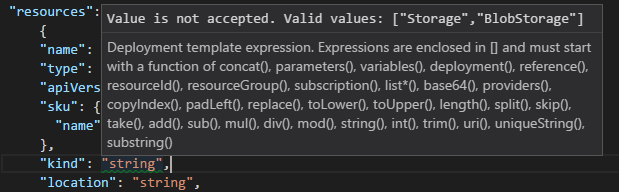
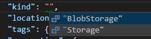
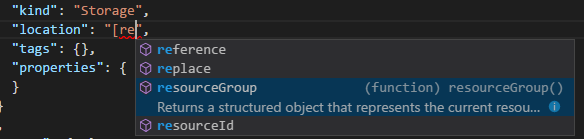

<properties
    pageTitle="创建第一个 Azure Resource Manager 模板 | Azure"
    description="分步指南：创建第一个 Azure Resource Manager 模板。 本指南介绍如何使用存储帐户的模板参考来创建模板。"
    services="azure-resource-manager"
    documentationcenter=""
    author="tfitzmac"
    manager="timlt"
    editor="tysonn" />
<tags
    ms.assetid=""
    ms.service="azure-resource-manager"
    ms.workload="multiple"
    ms.tgt_pltfrm="na"
    ms.devlang="na"
    ms.date="04/18/2017"
    wacn.date="06/05/2017"
    ms.topic="get-started-article"
    ms.author="v-yeche"
    ms.translationtype="Human Translation"
    ms.sourcegitcommit="08618ee31568db24eba7a7d9a5fc3b079cf34577"
    ms.openlocfilehash="4cd3d07221305eb96bc468cdd0c78171fdb1bd21"
    ms.contentlocale="zh-cn"
    ms.lasthandoff="05/26/2017" />

# 创建第一个 Azure Resource Manager 模板
本主题介绍如何通过相关步骤创建第一个 Azure Resource Manager 模板。 Resource Manager 模板为 JSON 文件，用于定义针对解决方案进行部署时所需的资源。 若要了解与部署和管理 Azure 解决方案相关联的概念，请参阅 [Azure Resource Manager 概述](/documentation/articles/resource-group-overview/)。 如果有现成的资源，需要为这些资源获取模板，请参阅[从现有资源导出 Azure Resource Manager 模板](/documentation/articles/resource-manager-export-template/)。

若要创建和修改模板，需要 JSON 编辑器。 [Visual Studio Code](https://code.visualstudio.com/) 是轻量型开源跨平台代码编辑器。 它通过扩展为创建和编辑 Resource Manager 模板提供支持。 本主题假定你使用 VS Code；但是，如果有其他 JSON 编辑器（例如 Visual Studio），你可以使用该编辑器。

## 获取 VS Code 和扩展
1. 根据需要从 [https://code.visualstudio.com/](https://code.visualstudio.com/) 安装 VS Code。

2. 访问 Quick Open (Ctrl+P) 并运行以下命令，以便安装 [Azure Resource Manager 工具](https://marketplace.visualstudio.com/items?itemName=msazurermtools.azurerm-vscode-tools)扩展： 

        ext install msazurermtools.azurerm-vscode-tools

3. 在系统提示时重新启动 VS Code 以启用该扩展。

## 创建空白模板

让我们从空白模板开始，该模板仅包含模板的基本部分。

1. 创建一个文件。 

2. 将以下 JSON 语法复制并粘贴到文件中：

        {
            "$schema": "http://schema.management.azure.com/schemas/2015-01-01/deploymentTemplate.json#",
            "contentVersion": "1.0.0.0",
            "parameters": {  },
            "variables": {  },
            "resources": [  ],
            "outputs": {  }
        }

3. 将该文件另存为 **azuredeploy.json**。 

## 添加存储帐户
1. 若要定义用于部署的存储帐户，请将该存储帐户添加到模板的 **resources** 节。

2. 将该 JSON 粘贴到模板的 **resources** 节中，如以下示例所示： 

        {
            "$schema": "http://schema.management.azure.com/schemas/2015-01-01/deploymentTemplate.json#",
            "contentVersion": "1.0.0.0",
            "parameters": {  },
            "variables": {  },
            "resources": [
                {
                    "name": "string",
                    "type": "Microsoft.Storage/storageAccounts",
                    "apiVersion": "2016-05-01",
                    "sku": {
                        "name": "string"
                    },
                    "kind": "string",
                    "location": "string",
                    "tags": {},
                    "properties": {
                        "customDomain": {
                            "name": "string",
                            "useSubDomain": boolean
                        },
                        "encryption": {
                            "services": {
                                "blob": {
                                    "enabled": boolean
                               }
                            },
                            "keySource": "Microsoft.Storage"
                        },
                        "accessTier": "string"
                    }
                }
            ],
            "outputs": {  }
        }

  上面的示例包括许多占位符值，以及某些在存储帐户中可能不需要的属性。

## 设置存储帐户的值

现在可以设置存储帐户的值。 

1. 再看一下复制 JSON 的位置。 有几个表描述了相关属性并提供了可用值。

2. 请注意，在 **properties** 元素中，**customDomain**、**encryption** 和 **accessTier** 均被列为“非必需”。 这些值对于你的方案可能很重要，但为了简单起见，本示例需删除它们。

        "resources": [
            {
                "name": "string",
                "type": "Microsoft.Storage/storageAccounts",
                "apiVersion": "2016-05-01",
                "sku": {
                 "name": "string"
                },
                "kind": "string",
                "location": "string",
                "tags": {},
                "properties": {
                }
            }
        ],

3. 目前，**kind** 元素设置为占位符值 ("string")。 VS Code 提供的许多功能有助于你了解那些在模板中使用的值。 请注意，VS Code 指示该值无效。 若将鼠标悬停在 "string" 上，则会看到 VS Code 为 **kind** 建议的有效值为 `Storage` 或 `BlobStorage`。 

    

    若要查看可用值，请删除双引号之间的字符，然后选择 **Ctrl+Space**。 从可用选项中选择“Storage”。

    

    如果使用的不是 VS Code，请参阅存储帐户模板参考页。 请注意，说明列出了相同的有效值。 将元素设置为 **Storage**。

        "kind": "Storage",

模板现在如下所示：

    {
      "$schema": "http://schema.management.azure.com/schemas/2015-01-01/deploymentTemplate.json#",
      "contentVersion": "1.0.0.0",
      "parameters": {  },
      "variables": {  },
      "resources": [
        {
          "name": "string",
          "type": "Microsoft.Storage/storageAccounts",
          "apiVersion": "2016-05-01",
          "sku": {
            "name": "string"
          },
          "kind": "Storage",
          "location": "string",
          "tags": {},
          "properties": {
          }
        }
      ],
      "outputs": {  }
    }

## 添加模板函数

可以在模板中使用函数，以便简化模板的语法，以及检索那些仅在部署模板时才可用的值。 如需完整的模板函数集，请参阅 [Azure Resource Manager 模板函数](/documentation/articles/resource-group-template-functions/)。

若要指定将存储帐户部署到与资源组相同的位置，请将 **location** 属性设置如下：

    "location": "[resourceGroup().location]",

VS Code 会再次帮助你，为你建议可用的函数。 

请注意，函数括在方括号中。 [resourceGroup](/documentation/articles/resource-group-template-functions/#resourcegroup) 函数返回一个对象，其中包含的属性名为 `location`。 资源组包含解决方案的所有相关资源。 可以将 location 属性硬编码为某个值（例如 "Central US"），但这样就必须手动更改模板才能重新部署到其他位置。 使用 `resourceGroup` 函数，则可以方便地将该模板重新部署到其他位置的其他资源组。

模板现在如下所示：

    {
      "$schema": "http://schema.management.azure.com/schemas/2015-01-01/deploymentTemplate.json#",
      "contentVersion": "1.0.0.0",
      "parameters": {  },
      "variables": {  },
      "resources": [
        {
          "name": "string",
          "type": "Microsoft.Storage/storageAccounts",
          "apiVersion": "2016-05-01",
          "sku": {
            "name": "string"
          },
          "kind": "Storage",
          "location": "[resourceGroup().location]",
          "tags": {},
          "properties": {
          }
        }
      ],
      "outputs": {  }
    }

## 添加参数和变量
模板中只剩下两个可以设置的值 - **name** 和 **sku.name**。 对于这些属性，可以添加参数，以便在部署过程中自定义这些值。 

存储帐户名称有多种限制，因此难以设置。 该名称必须为 3 到 24 个字符，只能使用数字和小写字母，而且必需唯一。 可以使用 [uniqueString](/documentation/articles/resource-group-template-functions/#uniquestring) 函数生成一个哈希值，不必试着去猜测一个符合限制条件的唯一值。 为了让该哈希值看起来更有意义，可以添加一个前缀，以便在部署后能够将其标识为存储帐户。 

1. 若要为名称传入一个符合命名约定的前缀，请转到模板的 **parameters** 节。 向模板添加一个接受存储帐户名称前缀的参数：

        "parameters": {
            "storageNamePrefix": {
                "type": "string",
                "maxLength": 11,
                "defaultValue": "storage",
                "metadata": {
                 "description": "The value to use for starting the storage account name."
                }
            }
        },

  该前缀的长度仅限 11 个字符，因为 `uniqueString` 返回 13 个字符，而名称不能超过 24 个字符。 如果没有在部署期间为该参数传入值，则使用默认值。

2. 转到模板的 **variables** 节。 若要通过前缀和唯一字符串来构造名称，请添加以下变量：

        "variables": {
            "storageName": "[concat(parameters('storageNamePrefix'), uniqueString(resourceGroup().id))]"
        },

3. 在 **resources** 节，将存储帐户名称设置为该变量。

        "name": "[variables('storageName')]",

3. 若要允许为存储帐户传入不同的 SKU，请转到 **parameters** 节。 在存储帐户名称前缀的参数之后添加一个参数，用于指定允许的 SKU 值和默认值。 可以在模板参考页或 VS Code 中找到允许的值。 以下示例为 SKU 提供了所有有效值。 不过，可以只对特定类型的 SKU 使用允许的值，此类 SKU 需通过该模板进行部署。

        "parameters": {
            "storageNamePrefix": {
                "type": "string",
                "maxLength": 11,
                "defaultValue": "storage",
                "metadata": {
                    "description": "The value to use for starting the storage account name."
                }
            },
            "storageSKU": {
                "type": "string",
                "allowedValues": [
                     "Standard_LRS",
                     "Standard_ZRS",
                     "Standard_GRS",
                     "Standard_RAGRS",
                     "Premium_LRS"
                ],
                "defaultValue": "Standard_LRS",
                "metadata": {
                     "description": "The type of replication to use for the storage account."
                }
            }
        },

3. 更改 SKU 属性，以便使用参数中的值：

        "sku": {
            "name": "[parameters('storageSKU')]"
        },

4. 保存文件。

模板现在如下所示：

        {
          "$schema": "http://schema.management.azure.com/schemas/2015-01-01/deploymentTemplate.json#",
          "contentVersion": "1.0.0.0",
          "parameters": {
            "storageNamePrefix": {
              "type": "string",
              "maxLength": 11,
              "defaultValue": "storage",
              "metadata": {
                "description": "The value to use for starting the storage account name."
              }
            },
            "storageSKU": {
              "type": "string",
              "allowedValues": [
                "Standard_LRS",
                "Standard_ZRS",
                "Standard_GRS",
                "Standard_RAGRS",
                "Premium_LRS"
              ],
              "defaultValue": "Standard_LRS",
              "metadata": {
                "description": "The type of replication to use for the storage account."
              }
            }
          },
          "variables": {
            "storageName": "[concat(parameters('storageNamePrefix'), uniqueString(resourceGroup().id))]"
          },
          "resources": [
            {
              "name": "[variables('storageName')]",
              "type": "Microsoft.Storage/storageAccounts",
              "apiVersion": "2016-05-01",
              "sku": {
                "name": "[parameters('storageSKU')]"
              },
              "kind": "Storage",
              "location": "[resourceGroup().location]",
              "tags": {},
              "properties": {
              }
            }
          ],
          "outputs": {  }
        }

## 后续步骤
* 模板已完成，可以将其部署到订阅了。 若要进行部署，请参阅[将资源部署到 Azure](/documentation/articles/resource-manager-quickstart-deploy/)。
* 若要详细了解模板的结构，请参阅 [Authoring Azure Resource Manager templates](/documentation/articles/resource-group-authoring-templates/)（创作 Azure Resource Manager 模板）。
* 若要查看许多不同类型的解决方案的完整模型，请参阅 [Azure Quickstart Templates](https://azure.microsoft.com/documentation/templates/)（Azure 快速入门模板）。

<!--Update_Description: Update meta description, wording update-->