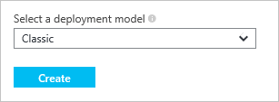

<properties
    pageTitle="Resource Manager 和经典部署 | Azure"
    description="介绍资源管理器部署模型与经典（或服务管理）部署模型之间的差异。"
    services="azure-resource-manager"
    documentationcenter="na"
    author="tfitzmac"
    manager="timlt"
    editor="tysonn" />  

<tags
    ms.assetid="7ae0ffa3-c8da-4151-bdcc-8f4f69290fb4"
    ms.service="azure-resource-manager"
    ms.devlang="na"
    ms.topic="article"
    ms.tgt_pltfrm="na"
    ms.workload="na"
    ms.date="11/01/2016"
    wacn.date="12/26/2016"
    ms.author="tomfitz" />

# Azure Resource Manager 与经典部署：了解部署模型和资源状态
本主题介绍 Azure Resource Manager 部署模型和经典部署模型、资源的状态，以及使用不同模型来部署资源的原因。Resource Manager 部署模型和经典部署模型代表两种不同的 Azure 解决方案部署和管理方式。可以通过两种不同的 API 集使用这两种模型，已部署的资源可能包含重大差异。这两个模型不是完全兼容的。本主题介绍这些差异。

为了简化资源部署和管理，Microsoft 建议对所有新资源使用 Resource Manager。Microsoft 建议在可能情况下，通过 Resource Manager 重新部署现有资源。

如果不熟悉 Resource Manager，可能需要先查看 [Azure Resource Manager 概述](/documentation/articles/resource-group-overview/)中定义的术语。

## 部署模型的历史
Azure 最初只提供经典部署模型。在此模型中，每个资源彼此独立；无法将相关的资源组合在一起。因此，必须手动跟踪构成解决方案或应用程序的资源 ，并记得以协调的方式管理。部署解决方案有两种方式：通过经典管理门户单独创建每个资源；或创建一个脚本，以正确的顺序部署所有资源。若要删除解决方案，必须逐个删除每个资源。无法轻松应用和更新相关资源的访问控制策略。最后，无法将标记应用到资源，因此无法使用有助于监视资源和管理计费的术语来标记资源。

Azure 在 2014 年引入了 Resource Manager，增加了资源组这一概念。资源组是一种容器，专门容纳共享同一生命周期的资源。Resource Manager 部署模型具有几大优点：

* 用户可以采用群组形式部署、管理和监视解决方案的所有服务，无需单独处理。
* 可以在解决方案的整个生命周期内重复部署该解决方案，确保以一致的状态部署资源。
* 可以将访问控制应用到资源组中的所有资源。将新资源添加到资源组时，会自动应用这些策略。
* 可以将标记应用到资源，以逻辑方式组织订阅中的所有资源。
* 可以使用 JavaScript 对象表示法 (JSON) 来定义解决方案的基础结构。JSON 文件称为 Resource Manager 模板。
* 可以定义各资源之间的依赖关系，使其按正确的顺序进行部署。

添加 Resource Manager 时，所有资源都追溯性地添加到默认资源组。如果现在通过经典部署创建资源，无论部署时指定资源组与否，资源都会在该服务默认的资源组中自动创建。但是，资源位于资源组内并不意味着其已转换为 Resource Manager 模型。下一部分会介绍每个服务如何处理这两种部署模型。

## 了解对模型的支持
确定用于资源的部署模型时，请注意以下三种方案：

1. 服务支持 Resource Manager 且只提供单个类型。
2. 服务支持 Resource Manager，但提供两个类型 - 一个用于 Resource Manager 部署，一个用于经典部署。此方案只适用于虚拟机、存储帐户和虚拟网络。
3. 服务不支持 Resource Manager。

若要查明服务是否支持 Resource Manager，请参阅[支持 Resource Manager 的提供程序](/documentation/articles/resource-manager-supported-services/)。

如果要使用的服务不支持 Resource Manager，则必须继续使用经典部署。

如果服务支持 Resource Manager 且**不是**虚拟机、存储帐户或虚拟网络，则可以直接使用 Resource Manager。

对于虚拟机、存储帐户和虚拟网络，如果资源是通过经典部署创建的，则必须继续通过经典操作对其进行操作。如果虚拟机、存储帐户或虚拟网络是通过 Resource Manager 部署创建的，则必须继续使用 Resource Manager 操作。如果订阅包含通过 Resource Manager 部署和经典部署创建的各种资源，则可能不容易进行这种区分。此资源组合会产生意外的结果，因为资源不支持相同的操作。

在某些情况下，Resource Manager 命令可以检索通过经典部署创建的资源信息，或者执行管理任务（例如将经典资源移到另一个资源组），但这些情况并不意味着该类型支持 Resource Manager 操作。例如，假设某个资源组包含使用经典部署创建的虚拟机。如果运行以下 Resource Manager PowerShell 命令：

    Get-AzureRmResource -ResourceGroupName ExampleGroup -ResourceType Microsoft.ClassicCompute/virtualMachines

该命令会返回虚拟机：

    Name              : ExampleClassicVM
    ResourceId        : /subscriptions/{guid}/resourceGroups/ExampleGroup/providers/Microsoft.ClassicCompute/virtualMachines/ExampleClassicVM
    ResourceName      : ExampleClassicVM
    ResourceType      : Microsoft.ClassicCompute/virtualMachines
    ResourceGroupName : ExampleGroup
    Location          : chinanorth
    SubscriptionId    : {guid}

但是，Resource Manager cmdlet **Get-AzureRmVM** 仅返回通过 Resource Manager 部署的虚拟机。以下命令不返回通过经典部署创建的虚拟机。

    Get-AzureRmVM -ResourceGroupName ExampleGroup

只有通过资源管理器创建的资源才支持标记。您不能将标记应用到经典资源。

## 资源管理器的特征
为了更好地理解这两个模型，请看看 Resource Manager 类型的特征：

* 通过 [Azure 门户预览](https://portal.azure.cn/)创建。
  
     
  
     对于计算、存储和网络资源，你可以选择使用资源管理器或经典部署。选择“Resource Manager”。
  
     
* 使用 Azure PowerShell cmdlet 的 Resource Manager 版本创建。这些命令采用 *Verb-AzureRmNoun* 格式。
  
        New-AzureRmResourceGroupDeployment
* 通过用于 REST 操作的 [Azure Resource Manager REST API](https://docs.microsoft.com/rest/api/resources/) 创建。
* 通过在 **arm** 模式下运行的 Azure CLI 命令创建。
  
        azure config mode arm
        azure group deployment create 
* 资源类型的名称中不包括 **(经典)**。下图显示类型为“存储帐户”。
  
      

##  经典部署的特性
您也可能知道经典部署模型就是服务管理模型。

在经典部署模型中创建的资源具有以下共同特性：

* 通过[经典管理门户](https://manage.windowsazure.cn)创建。
  
     
  
     或者，通过 Azure 门户预览创建，然后指定“经典”部署（适用于“计算”、“存储”和“网络”资源）。
  
     
* 通过 Azure PowerShell cmdlet 的服务管理版本创建。这些命令名称采用 *Verb-AzureNoun* 格式。
  
        New-AzureVM 
* 通过用于 REST 操作的[服务管理 REST API](https://msdn.microsoft.com/zh-cn/library/azure/ee460799.aspx) 创建。
* 通过在 **asm** 模式下运行的 Azure CLI 命令创建。
  
        azure config mode asm
        azure vm create 
* 资源类型的名称中包括 **(经典)**。下图显示类型为“存储帐户(经典)”。
  
      

用户可以使用 Azure 门户预览来管理通过经典部署创建的资源。

## 对计算、网络和存储的更改
下图显示通过 Resource Manager 部署的计算、网络和存储资源。

  

请注意资源之间的以下关系：

* 所有资源存在于一个资源组中。
* 虚拟机依赖在存储资源提供程序中定义的具体存储帐户，在 Blob 存储中存储其磁盘（必需）。
* 虚拟机引用在网络资源提供程序中定义的具体 NIC（必需）和在计算资源提供程序中定义的可用性集（可选）。
* NIC 引用虚拟机的指定 IP 地址（必需）、虚拟机的虚拟网络的子网（必需）和网络安全组（可选）。
* 虚拟网络内的子网引用网络安全组（可选）。
* 负载均衡器实例引用后端 IP 地址池，包括虚拟机的 NIC（可选），并引用负载均衡器的公共或专用 IP 地址（可选）。

以下是经典部署的组件及其关系：

  

托管虚拟机的经典解决方案包括：

* 一项必不可少的云服务，用作宿主虚拟机的容器（计算）。虚拟机自动配备一个网络接口卡 (NIC) 以及由 Azure 分配的 IP 地址。此外，云服务包含一个外部负载均衡器实例、一个公共 IP 地址以及若干默认终结点，以支持远程桌面、针对 Windows 虚拟机的远程 PowerShell 流量和针对 Linux 虚拟机的 Secure Shell (SSH) 流量。
* 一个必不可少的存储帐户，存储虚拟机的 VHD，包括操作系统、临时文件和附加的数据磁盘（存储）。
* 一个可选的虚拟网络，用作额外的容器，可以在其中创建子网结构并指定虚拟机所在的子网（网络）。

下表说明了计算、网络和存储资源提供程序交互方式的变化：

| 项目 | 经典 | 资源管理器 |
| --- | --- | --- |
| 面向虚拟机的云服务 |云服务是一个容器，用于容纳要求平台可用性和负载均衡的虚拟机。 |使用新模型，云服务不再是创建虚拟机所必需的对象。 |
| 虚拟网络 |对于虚拟机来说，虚拟网络是可选的。虚拟网络（如果包括）不能通过 Resource Manager 进行部署。 |虚拟机需要已通过 Resource Manager 部署的虚拟网络。 |
| 存储帐户 |虚拟机需要一个存储帐户，存储操作系统、临时文件和附加数据磁盘的 VHD。 |虚拟机需要一个存储帐户，在 Blob 存储中存储其磁盘。 |
| 可用性集 |通过在虚拟机上配置相同的“AvailabilitySetName”来指出平台的可用性。容错域的最大数量为 2。 |可用性集是 Microsoft.Compute 提供程序提供的一个资源。要求高可用性的虚拟机必须包含在可用性集中。现在，容错域的最大数量为 3。 |
| 地缘组 |创建虚拟网络需要地缘组。但是，随着区域虚拟网络的引入，便不再需要地缘组了。 |为了简单起见，地缘组概念不再存在于通过 Azure 资源管理器提供的 API 中。 |
| 负载均衡 |云服务的创建为部署的虚拟机提供了一个隐式负载均衡器。 |负载均衡器是 Microsoft.Network 提供程序提供的一个资源。需要负载均衡的虚拟机的主网络接口应该引用负载均衡器。负载均衡器既可以是内部的，也可以是外部的。负载均衡器实例引用后端 IP 地址池，包括虚拟机的 NIC（可选），并引用负载均衡器的公共或专用 IP 地址（可选）。[了解详细信息。](/documentation/articles/resource-groups-networking/) |
| 虚拟 IP 地址 |虚拟机添加到云服务后，云服务获得默认 VIP（虚拟 IP 地址）。虚拟 IP 地址是与隐式负载均衡器相关联的地址。 |公共 IP 地址是 Microsoft.Network 提供程序提供的一个资源。公共 IP 地址既可以是静态（保留）的，也可以是动态的。可以将动态公共 IP 分配到一个负载均衡器。可以使用安全组保护公共 IP。 |
| 保留 IP 地址 |可以在 Azure 中保留一个 IP 地址并将其与一个云服务关联在一起，以确保该 IP 地址具有粘性。 |可以在“静态”模式下创建公共 IP 地址，并且该地址提供与“保留 IP 地址”相同的功能。目前，静态公共 IP 只能分配到一个负载均衡器。 |
| 每个 VM 一个公共 IP 地址 (PIP) |公共 IP 地址也可以直接关联到 VM。 |公共 IP 地址是 Microsoft.Network 提供程序提供的一个资源。公共 IP 地址既可以是静态（保留）的，也可以是动态的。但是，目前只有动态公共 IP 可分配到网络接口，使每个 VM 获得一个公共 IP。 |
| 终结点 |需要在虚拟机上配置输入终结点，用于打开某些端口的连接。这是通过设置输入终结点来连接到虚拟机的一个常见模式。 |可以在负载均衡器上配置入站 NAT 规则，实现在具体端口上启用终结点以连接到 VM 的相同功能。 |
| DNS 名称 |云服务会获取一个隐式的全局唯一 DNS 名称。例如：`mycoffeeshop.chinacloudapp.cn`。 |DNS 名称是可在一个公共 IP 地址资源上指定的可选参数。FQDN 采用的格式为 `<domainlabel>.<region>.chinacloudapp.cn`。 |
| 网络接口 |作为虚拟机的网络配置定义的主网络接口和辅助网络接口及其属性。 |网络接口是 Microsoft.Network 提供程序提供的一个资源。网络接口的生命周期与虚拟机无关。它引用虚拟机的指定 IP 地址（必需）、虚拟机的虚拟网络的子网（必需）和网络安全组（可选）。 |

若要了解如何从不同部署模型连接虚拟网络，请参阅[在门户中从不同部署模型连接虚拟网络](/documentation/articles/vpn-gateway-connect-different-deployment-models-portal/)。

## 从经典部署迁移到 Resource Manager 部署
如果已准备好将资源从经典部署迁移到 Resource Manager 部署，请参阅：

1. [平台支持的从经典部署模型迁移到 Azure Resource Manager 的技术深入探讨](/documentation/articles/virtual-machines-windows-migration-classic-resource-manager-deep-dive/)
2. [平台支持从经典部署模型迁移到 Azure Resource Manager 的 IaaS 资源](/documentation/articles/virtual-machines-windows-migration-classic-resource-manager/)
3. [使用 Azure PowerShell 将 IaaS 资源从经典部署模型迁移到 Azure Resource Manager](/documentation/articles/virtual-machines-windows-ps-migration-classic-resource-manager/)
4. [使用 Azure CLI 将 IaaS 资源从经典部署模型迁移到 Azure Resource Manager 部署模型](/documentation/articles/virtual-machines-linux-cli-migration-classic-resource-manager/)

## 常见问题
**能否使用 Azure Resource Manager 创建一个虚拟机，将其部署在使用经典部署创建的虚拟网络中？**

此操作不受支持。不能使用 Azure Resource Manager 将虚拟机部署到使用经典部署创建的虚拟网络中。

**可以使用 Azure Resource Manager 从使用 Azure 服务管理 API 创建的用户映像创建虚拟机吗？**

此操作不受支持。但是，可以从使用服务管理 API 创建的存储帐户将 VHD 文件复制并添加到通过 Azure Resource Manager 创建的新帐户中。

**对订阅的配额有何影响？**

通过 Azure Resource Manager 创建的虚拟机、虚拟网络和存储帐户的配额与其他配额是分开的。每个订阅将获取配额以使用新的 API 创建资源。你可以在[此处](/documentation/articles/azure-subscription-service-limits/)了解有关额外配额的详细信息。

**可以通过 Resource Manager API 继续使用自动化脚本来预配虚拟机、虚拟网络、存储帐户吗？**

已经构建的所有自动化和脚本继续适用于在 Azure 服务管理模式下创建的现有虚拟机和虚拟网络。然而，必须更新这些脚本以使用新的架构，通过 Resource Manager 模式来创建相同的资源。

**在哪里可以找到 Azure Resource Manager 模板的示例？**

可以在 [Azure Resource Manager QuickStart Templates](https://github.com/Azure/azure-quickstart-templates/)（Azure Resource Manager 快速启动模板）中找到一系列广泛的初学者模板。

## 后续步骤
* 若要演练如何创建用于定义虚拟机、存储帐户和虚拟网络的模板，请参阅 [Resource Manager 模板演练](/documentation/articles/resource-manager-template-walkthrough/)。
* 若要查看用于部署模板的命令，请参阅[使用 Azure 资源管理器模板部署应用程序](/documentation/articles/resource-group-template-deploy/)。

<!---HONumber=Mooncake_1219_2016-->