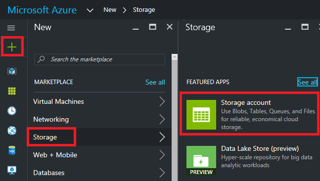
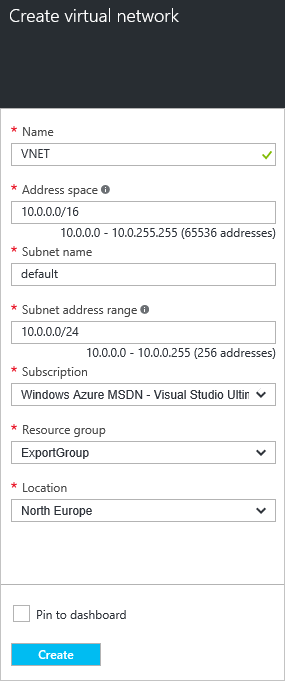
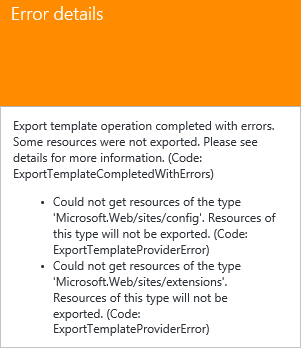

<properties
    pageTitle="导出 Azure Resource Manager 模板 | Azure"
    description="使用 Azure Resource Manager 从现有资源组导出模板。"
    services="azure-resource-manager"
    documentationcenter=""
    author="tfitzmac"
    manager="timlt"
    editor="tysonn" />  

<tags
    ms.assetid="5f5ca940-eef8-4125-b6a0-f44ba04ab5ab"
    ms.service="azure-resource-manager"
    ms.workload="multiple"
    ms.tgt_pltfrm="na"
    ms.devlang="na"
    ms.topic="get-started-article"
    ms.date="10/20/2016"
    wacn.date="12/26/2016"
    ms.author="tomfitz" />

# 从现有资源导出 Azure Resource Manager 模板
使用 Resource Manager 可从订阅中的现有资源导出 Resource Manager 模板。你可以使用该生成的模板了解模板语法，或根据需要自动重新部署解决方案。

必须注意的是，可以使用两种不同的方式来导出模板：

* 可以导出已用于部署的实际模板。导出的模板中包括的所有参数和变量与原始模板中显示的完全一样。如果通过门户部署了资源，此方法很有用。现在讲述如何构造模板来创建这些资源。
* 你可以导出表示资源组当前状态的模板。导出的模板不基于任何已用于部署的模板。与之相反，它所创建的模板为资源组的快照。导出的模板会有许多硬编码的值，其参数可能没有定义的那么多。如果已通过门户或脚本修改资源组，则可以使用此方法。现在，需要捕获资源组作为模板。

本主题演示这两种方法。

在本教程中，用户需要登录到 Azure 门户预览，创建存储帐户，然后导出该存储帐户的模板。需添加虚拟网络以修改资源组。最后，需导出表示其当前状态的新模板。尽管本文重点介绍简化的基础结构，但你也可以使用这些相同的步骤为更复杂的解决方案导出模板。

## 创建存储帐户
1. 在 [Azure 门户预览](https://portal.azure.cn)中，选择“新建”>“存储”>“存储帐户”。
   
        

2. 使用名称 **storage**、你的姓名缩写和日期创建存储帐户。存储帐户名称在 Azure 中必须是唯一的。如果名称已使用，则会显示错误消息，指出名称已使用。可尝试改变名称。对于资源组，可创建新的资源组，然后将其命名为 **ExportGroup**。可以对其他属性使用默认值。选择“创建”。
   
        

部署可能需要一分钟的时间。部署完成后，订阅将包含存储帐户。

## 在部署历史记录中查看模板
1. 转到新资源组的资源组边栏选项卡。可以看到，该边栏选项卡列出了上次部署的结果。选择此链接。
   
      
2. 可以看到该组的部署历史记录。在本例中，边栏选项卡可能只列出了一个部署。选择此部署。
   
     
3. 边栏选项卡将显示部署摘要。摘要包括此部署及其操作的状态，以及为参数提供的值。若要查看用于部署的模板，请选择“查看模板”。
   
     
4. Resource Manager 将检索以下六个文件：
   
    1. **模板** - 定义解决方案基础结构的模板。通过门户创建存储帐户时，Resource Manager 使用模板来部署该存储帐户，并保存该模板供将来参考。
    2. **参数** - 可用于在部署过程中传入值的参数文件。它包含在首次部署期间提供的值，但你可以在重新部署该模板时更改其中任何值。
    3. **CLI** - 可用于部署该模板的 Azure 命令行界面 (CLI) 脚本文件。
    4. **PowerShell** - 可用于部署该模板的 Azure PowerShell 脚本文件。
    5. **.NET** - 可用于部署该模板的 .NET 类。
    6. **Ruby** - 可用于部署模板的 Ruby 类。
      
    可通过边栏选项卡上的链接获取这些文件。默认情况下，边栏选项卡将显示模板。
      
    
      
    让我们特别注意该模板。你的模板的外观应类似于：
      
        {
      
          "$schema": "https://schema.management.azure.com/schemas/2015-01-01/deploymentTemplate.json#",
          "contentVersion": "1.0.0.0",
          "parameters": {
            "name": {
              "type": "String"
            },
            "accountType": {
              "type": "String"
            },
            "location": {
              "type": "String"
            },
            "encryptionEnabled": {
              "defaultValue": false,
              "type": "Bool"
            }
          },
          "resources": [
            {
              "type": "Microsoft.Storage/storageAccounts",
              "sku": {
                "name": "[parameters('accountType')]"
              },
              "kind": "Storage",
              "name": "[parameters('name')]",
              "apiVersion": "2016-01-01",
              "location": "[parameters('location')]",
              "properties": {
                "encryption": {
                  "services": {
                    "blob": {
                      "enabled": "[parameters('encryptionEnabled')]"
                    }
                  },
                  "keySource": "Microsoft.Storage"
                }
              }
            }
          ]
        }

该模板是用于创建存储帐户的实际模板。请注意，该模板包含的参数可用于部署不同类型的存储帐户。若要详细了解模板的结构，请参阅 [Authoring Azure Resource Manager templates](/documentation/articles/resource-group-authoring-templates/)（创作 Azure Resource Manager 模板）。有关可在模板中使用的函数的完整列表，请参阅 [Azure Resource Manager template functions](/documentation/articles/resource-group-template-functions/)（Azure Resource Manager 模板函数）。

## 添加虚拟网络
在上一部分中下载的模板表示该原始部署的基础结构。但是，它不会记录在部署之后所做的任何更改。为了说明此问题，让我们通过门户添加虚拟网络来修改资源组。

1. 在资源组边栏选项卡中，选择“添加”。
   
      
2. 从可用资源中选择“虚拟网络”。
   
      
3. 将虚拟网络命名为 **VNET**，并对其他属性使用默认值。选择“创建”。
   
      
4. 在虚拟网络已成功部署到资源组后，再次查看部署历史记录。现在，将看到两个部署。如果看不到第二个部署，则可能需要关闭资源组边栏选项卡，然后重新打开它。选择更新的部署。
   
        

5. 查看该部署的模板。请注意，它只定义虚拟网络。它不包括此前部署的存储帐户。用户不再有能够代表资源组中所有资源的模板。

## 从资源组导出模板
若要获取资源组的当前状态，可导出一个模板来显示资源组的快照。

> [AZURE.NOTE]
无法为资源超过 200 个的资源组导出模板。
> 
> 

1. 若要查看资源组的模板，请选择“自动化脚本”。
   
      
   
     并非所有资源类型都支持导出模板功能。如果资源组仅包含本文中显示的存储帐户和虚拟网络，则不会显示错误。不过，如果你已经创建其他资源类型，则可能会显示一个错误，指出导出存在问题。[修复导出问题](#fix-export-issues)部分介绍了如何处理这些问题。
2. 此时将再次显示可用于重新部署解决方案的六个文件，但这一次模板稍有不同。该模板只有两个参数：一个用于存储帐户名称，一个用于虚拟网络名称。
   
        "parameters": {
          "virtualNetworks_VNET_name": {
            "defaultValue": "VNET",
            "type": "String"
          },
          "storageAccounts_storagetf05092016_name": {
            "defaultValue": "storagetf05092016",
            "type": "String"
          }
        },
   
     Resource Manager 未检索到在部署期间使用的模板。但是，它将基于资源的当前配置生成新模板。例如，模板会将存储帐户位置和复制值设置为：
   
        "location": "northeurope",
        "tags": {},
        "properties": {
            "accountType": "Standard_RAGRS"
        },
3. 可以通过多个选项继续使用此模板。可以下载模板，然后通过 JSON 编辑器在本地使用该模板。也可以将模板保存到库，然后通过门户使用该模板。
   
     如果用户喜欢使用 JSON 编辑器（例如 [VS Code](/documentation/articles/resource-manager-vs-code/) 或 [Visual Studio](/documentation/articles/vs-azure-tools-resource-groups-deployment-projects-create-deploy/)），则可选择下载模板到本地，然后使用该编辑器。如果用户尚无法使用 JSON 编辑器，则可通过门户编辑模板。本主题的其余部分假设用户已在门户中将模板保存到库。但是，不管是通过 JSON 编辑器在本地操作还是通过门户进行操作，对模板所做的语法更改都是相同的。
   
     若要在本地操作，请选择“下载”。
   
        

   
     若要通过门户操作，请选择“添加到库”。
   
        

   
     将模板添加到库时，请为模板提供名称和说明，然后选择“保存”。
   
       

4. 若要查看在库中保存的模板，请选择“更多服务”，键入“模板”对结果进行筛选，然后选择“模板”。
   
        

5. 选择使用已保存名称的模板。
   
        

## 自定义模板
若需为每个部署创建相同的存储帐户和虚拟网络，则可使用导出的模板。不过，也可利用 Resource Manager 提供的相关选项对模板进行灵活得多的部署。例如，在部署期间，你可能需要指定要创建的存储帐户的类型或要用于虚拟网络地址前缀和子网前缀的值。

在此部分，用户将向导出的模板添加参数，以便在将这些资源部署到其他环境时，可以重新使用该模板。用户还将向模板添加某些功能，以减少在部署模板时遇到错误的可能性。用户不再需要为存储帐户构思唯一名称。模板会创建唯一名称。用户需限制可以为存储帐户类型指定的值，使之局限于有效的选项。

1. 选择“编辑”以自定义模板。
   
       

2. 选择模板。
   
       

3. 若要传入可能需要在部署过程中指定的值，请将 **parameters** 节替换为新的参数定义。请注意 **storageAccount\_accountType** 的 **allowedValues** 的值。如果你意外地提供了无效的值，则在部署开始之前将识别该错误。另请注意，你仅提供存储帐户名称的前缀，该前缀限制为 11 个字符。将前缀限制为 11 个字符时，可确保完整名称不超过存储帐户的最大字符数。使用前缀，可将命名约定应用于存储帐户。在下一步中，你将了解如何创建唯一名称。
   
        "parameters": {
          "storageAccount_prefix": {
            "type": "string",
            "maxLength": 11
          },
          "storageAccount_accountType": {
            "defaultValue": "Standard_RAGRS",
            "type": "string",
            "allowedValues": [
              "Standard_LRS",
              "Standard_ZRS",
              "Standard_GRS",
              "Standard_RAGRS",
              "Premium_LRS"
            ]
          },
          "virtualNetwork_name": {
            "type": "string"
          },
          "addressPrefix": {
            "defaultValue": "10.0.0.0/16",
            "type": "string"
          },
          "subnetName": {
            "defaultValue": "subnet-1",
            "type": "string"
          },
          "subnetAddressPrefix": {
            "defaultValue": "10.0.0.0/24",
            "type": "string"
          }
        },
4. 模板的 **variables** 节当前为空。在 **variables** 节中，用户可以创建值，简化模板其余部分的语法。将该节替换为新的变量定义。**storageAccount\_name** 变量将参数中的前缀连接到唯一字符串，该字符串根据资源组的标识符生成。提供参数值时，不再需要构思唯一名称。
   
        "variables": {
          "storageAccount_name": "[concat(parameters('storageAccount_prefix'), uniqueString(resourceGroup().id))]"
        },
5. 若要在资源定义中使用参数和变量，请将 **resources** 节替换为新的资源定义。请注意，除了分配给资源属性的值外，资源定义只进行了很少的更改。属性与已导出模板中的属性相同。你只需为参数值分配属性，而不是对值进行硬编码。资源的位置通过 **resourceGroup().location** 表达式设置为使用资源组所在的位置。为存储帐户名称创建的变量通过 **variables** 表达式进行引用。
   
        "resources": [
          {
            "type": "Microsoft.Network/virtualNetworks",
            "name": "[parameters('virtualNetwork_name')]",
            "apiVersion": "2015-06-15",
            "location": "[resourceGroup().location]",
            "properties": {
              "addressSpace": {
                "addressPrefixes": [
                  "[parameters('addressPrefix')]"
                ]
              },
              "subnets": [
                {
                  "name": "[parameters('subnetName')]",
                  "properties": {
                    "addressPrefix": "[parameters('subnetAddressPrefix')]"
                  }
                }
              ]
            },
            "dependsOn": []
          },
          {
            "type": "Microsoft.Storage/storageAccounts",
            "name": "[variables('storageAccount_name')]",
            "apiVersion": "2015-06-15",
            "location": "[resourceGroup().location]",
            "tags": {},
            "properties": {
                "accountType": "[parameters('storageAccount_accountType')]"
            },
            "dependsOn": []
          }
        ]
6. 编辑完模板后，选择“确定”。
7. 选择“保存”保存对模板所做的更改。
   
       

8. 若要部署已更新的模板，请选择“部署”。
   
       

9. 提供参数值，并选择要将资源部署到其中的新资源组。

## 更新已下载的参数文件
若要使用下载的文件（而不是门户库），则需更新下载的参数文件。该文件不再与模板中的参数匹配。你不必使用参数文件，但参数文件可以简化重新部署环境时的过程。用户会对许多参数使用模板中定义的默认值，因此，参数文件只需要两个值。

将 parameters.json 文件的内容替换为以下内容：

    {
      "$schema": "https://schema.management.azure.com/schemas/2015-01-01/deploymentParameters.json#",
      "contentVersion": "1.0.0.0",
      "parameters": {
        "storageAccount_prefix": {
          "value": "storage"
        },
        "virtualNetwork_name": {
          "value": "VNET"
        }
      }
    }

更新后的参数文件仅为没有默认值的参数提供值。如果你需要不同于默认值的值，则可以为其他参数提供值。

##  修复导出问题
并非所有资源类型都支持导出模板功能。具体而言，Resource Manager 不会导出某些资源类型，以防止公开敏感数据。例如，如果你的站点配置中有一个连接字符串，你可能不希望其显式显示在导出的模板中。你可以手动将缺失的资源添加回模板中，从而解决这个问题。

> [AZURE.NOTE]
仅当从资源组而不是从部署历史记录中导出时，才会遇到导出问题。如果你的上一个部署能够准确地代表资源组的当前状态，则应从部署历史记录而非资源组中导出模板。只有在你已对资源组进行更改且该更改未在单个模板中定义的情况下，才应从资源组导出。
> 
> 

例如，如果导出的模板所对应的资源组包含一个 Web 应用（SQL 数据库），且站点配置中包含一个连接字符串，则会显示以下消息：

  

选择该消息会具体显示哪些资源类型未导出。

  

本主题介绍常见的修补程序。

### 连接字符串
在网站资源中，添加数据库连接字符串的定义：

    {
      "type": "Microsoft.Web/sites",
      ...
      "resources": [
        {
          "apiVersion": "2015-08-01",
          "type": "config",
          "name": "connectionstrings",
          "dependsOn": [
              "[concat('Microsoft.Web/Sites/', parameters('<site-name>'))]"
          ],
          "properties": {
              "DefaultConnection": {
                "value": "[concat('Data Source=tcp:', reference(concat('Microsoft.Sql/servers/', parameters('<database-server-name>'))).fullyQualifiedDomainName, ',1433;Initial Catalog=', parameters('<database-name>'), ';User Id=', parameters('<admin-login>'), '@', parameters('<database-server-name>'), ';Password=', parameters('<admin-password>'), ';')]",
                  "type": "SQLServer"
              }
          }
        }
      ]
    }

### 网站扩展
在网站资源中，添加要安装的代码的定义：

    {
      "type": "Microsoft.Web/sites",
      ...
      "resources": [
        {
          "name": "MSDeploy",
          "type": "extensions",
          "location": "[resourceGroup().location]",
          "apiVersion": "2015-08-01",
          "dependsOn": [
            "[concat('Microsoft.Web/sites/', parameters('<site-name>'))]"
          ],
          "properties": {
            "packageUri": "[concat(parameters('<artifacts-location>'), '/', parameters('<package-folder>'), '/', parameters('<package-file-name>'), parameters('<sas-token>'))]",
            "dbType": "None",
            "connectionString": "",
            "setParameters": {
              "IIS Web Application Name": "[parameters('<site-name>')]"
            }
          }
        }
      ]
    }

### 虚拟机扩展
如需虚拟机扩展的示例，请参阅 [Azure Windows VM Extension Configuration Samples](/documentation/articles/virtual-machines-windows-extensions-configuration-samples/)（Azure Windows VM 扩展配置示例）。

### 虚拟网络网关
添加虚拟网络网关资源类型。

    {
      "type": "Microsoft.Network/virtualNetworkGateways",
      "name": "[parameters('<gateway-name>')]",
      "apiVersion": "2015-06-15",
      "location": "[resourceGroup().location]",
      "properties": {
        "gatewayType": "[parameters('<gateway-type>')]",
        "ipConfigurations": [
          {
            "name": "default",
            "properties": {
              "privateIPAllocationMethod": "Dynamic",
              "subnet": {
                "id": "[resourceId('Microsoft.Network/virtualNetworks/subnets', parameters('<vnet-name>'), parameters('<new-subnet-name>'))]"
              },
              "publicIpAddress": {
                "id": "[resourceId('Microsoft.Network/publicIPAddresses', parameters('<new-public-ip-address-Name>'))]"
              }
            }
          }
        ],
        "enableBgp": false,
        "vpnType": "[parameters('<vpn-type>')]"
      },
      "dependsOn": [
        "Microsoft.Network/virtualNetworks/codegroup4/subnets/GatewaySubnet",
        "[concat('Microsoft.Network/publicIPAddresses/', parameters('<new-public-ip-address-Name>'))]"
      ]
    },

### 本地网络网关
添加本地网络网关资源类型。

    {
        "type": "Microsoft.Network/localNetworkGateways",
        "name": "[parameters('<local-network-gateway-name>')]",
        "apiVersion": "2015-06-15",
        "location": "[resourceGroup().location]",
        "properties": {
          "localNetworkAddressSpace": {
            "addressPrefixes": "[parameters('<address-prefixes>')]"
          }
        }
    }

### 连接
添加连接资源类型。

    {
        "apiVersion": "2015-06-15",
        "name": "[parameters('<connection-name>')]",
        "type": "Microsoft.Network/connections",
        "location": "[resourceGroup().location]",
        "properties": {
            "virtualNetworkGateway1": {
            "id": "[resourceId('Microsoft.Network/virtualNetworkGateways', parameters('<gateway-name>'))]"
          },
          "localNetworkGateway2": {
            "id": "[resourceId('Microsoft.Network/localNetworkGateways', parameters('<local-gateway-name>'))]"
          },
          "connectionType": "IPsec",
          "routingWeight": 10,
          "sharedKey": "[parameters('<shared-key>')]"
        }
    },

## 后续步骤
祝贺你！ 你已学习如何从门户中创建的资源导出模板。

* 可以通过 [PowerShell](/documentation/articles/resource-group-template-deploy/)、[Azure CLI](/documentation/articles/resource-group-template-deploy-cli/) 或 [REST API](/documentation/articles/resource-group-template-deploy-rest/) 部署模板。
* 若要了解如何通过 PowerShell 导出模板，请参阅 [Using Azure PowerShell with Azure Resource Manager](/documentation/articles/powershell-azure-resource-manager/)（将 Azure PowerShell 与 Azure Resource Manager 配合使用）。
* 若要了解如何通过 Azure CLI 导出模板，请参阅 [Use the Azure CLI for Mac, Linux, and Windows with Azure Resource Manager](/documentation/articles/xplat-cli-azure-resource-manager/)（将用于 Mac、Linux 和 Windows 的 Azure CLI 与 Azure Resource Manager 配合使用）。

<!---HONumber=Mooncake_1219_2016-->