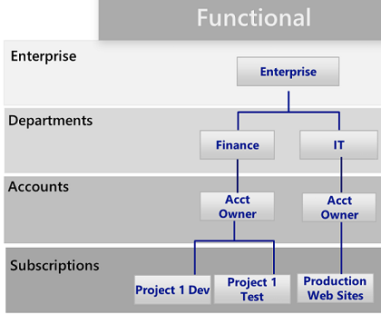
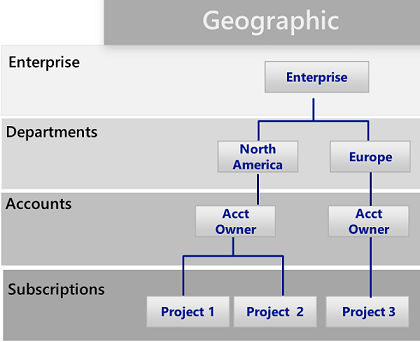
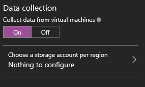

<properties
    pageTitle="企业过渡到 Azure 的最佳实践 | Azure"
    description="本文介绍一个基架，企业可以使用它来确保环境的安全性与可管理性。"
    services="azure-resource-manager"
    documentationcenter="na"
    author="rdendtler"
    manager="timlt"
    editor="tysonn" />  

<tags
    ms.assetid="8692f37e-4d33-4100-b472-a8da37ce628f"
    ms.service="azure-resource-manager"
    ms.devlang="na"
    ms.topic="article"
    ms.tgt_pltfrm="na"
    ms.workload="na"
    ms.date="10/05/2016"
    wacn.date="12/26/2016"
    ms.author="rodend;karlku;tomfitz" />  

# Azure 企业基架 - 出于合规目的监管订阅
为了实现敏捷性和灵活性，企业越来越多地采用公有云。它们利用云的优势来产生营收或优化企业资源。Azure 提供多种不同的服务，企业可以像构建块一样将它们组合，解决广泛的工作负荷与应用程序需求。

但是，往往难以知道从何处着手。决定使用 Azure 之后，经常会涌现以下几个问题：

* “如何满足特定国家/地区针对数据所有权制定的法规要求？”
* “如何确保用户不会无意中更改关键系统？”
* “怎么知道每个资源是否发挥了作用，以便可以准确地做出规划和预算？”

不带任何防护措施的空白订阅，其前景是让人担忧的。如果不在这方面有所作为，可能会在过渡到 Azure 时遇到阻碍。

本文为技术专业人员提供一个起点，帮助他们解决监管需求，并在监管需求与敏捷性需求之间权衡利弊。其中将会介绍企业基架的概念，它可以引导组织实施和管理 Azure 订阅。

## 监管需求
在过渡到 Azure 时，必须提前解决监管方面的问题，确保成功地在企业中利用云。遗憾的是，建立全面监管系统所花费的时间和存在的官僚主义，意味着某些业务小组必须直接与供应商对话，而不与企业 IT 部门沟通。如果资源未得到正确管理，这种方法可能会导致企业出现漏洞。公有云的特征 - 敏捷性、灵活性和基于消耗量的定价 - 对于需要快速满足客户（内部和外部）需求的业务小组而言非常重要。但是，企业 IT 部门需要确保有效地保护数据和系统。

在现实生活中，我们可以使用基架来打好建筑物的基础。基架主导总体框架，为需要安装的长久系统提供定位点。企业基架也是如此：一套灵活的控制机制和 Azure 功能为环境提供结构，为公有云上生成的服务提供定位点。它为构建者（IT 人员和业务小组）提供创建和附加新服务的基础。

该基架建立在我们与各种规模的客户交往时收获的实践经验基础之上。这些客户既包括在云中开发解决方案的小型组织，也包括财富 500 强企业，还包括在云中迁移和开发解决方案的独立软件供应商。企业基架采用灵活设计，为传统的 IT 工作负载和敏捷工作负载提供有针对性的支持；例如，开发人员可以基于 Azure 功能创建软件即服务 (SaaS) 应用程序。

企业基架旨在用作 Azure 中每个新订阅的基础。它能使管理员确保工作负荷满足组织的最低监管要求，同时又不妨碍业务小组和开发人员尽快实现自身的目标。

> [AZURE.IMPORTANT]
监管对于 Azure 的成功至关重要。本文阐述企业基架的技术实现，不过，对于宏观的流程以及组件之间的关系，只是一笔带过。策略监管的流程是自顶向下实施的，由企业的目标决定。为 Azure 创建的监管模型自然包括 IT 部门的主张，但更重要的是，它应该融入业务小组负责人以及安全和风险管理部门的有力表述。最终，企业基架都应该缓解业务风险，帮助实现组织的使命和目标。
> 
> 

下图描绘了基架的组件。基础依赖于坚实的部门、帐户和订阅计划。支柱包括 Resource Manager 策略和强有力的命名标准。基架的剩余部分来自可实现一个安全、可管理环境的核心 Azure 功能与特性。

  

> [AZURE.NOTE]
Azure 自 2008 年推出以来不断快速发展。这种发展要求 Microsoft 工程团队反复思考服务的管理和部署方式。Azure Resource Manager 模型在 2014 年推出，现已取代经典部署模型。组织可以使用 Resource Manager 更轻松地部署、管理和控制 Azure 资源。Resource Manager 在创建资源时允许并行化，可以更快部署复杂、相互依赖的解决方案。它还包括精细访问控制，能够使用元数据标记资源。Microsoft 建议通过 Resource Manager 模型创建所有资源。企业基架是专门针对 Resource Manager 模型设计的。
> 
> 

## 定义层次结构
基架的基础是 Azure 企业许可登记表（和企业门户）。企业许可登记表定义 Azure 服务在公司内部的形式与用法，属于核心监管结构。在企业协议中，客户可以将环境进一步细分为部门、帐户，最终细分为订阅。Azure 订阅是包含所有资源的基本单位。它还定义 Azure 中的多种限制，例如核心数、资源数，等等。

  

层次结构每家企业都是独特的，使用上图中的层次结构可以在公司内部十分灵活地对 Azure 进行组织。在实施本文档中的指导之前，应该为层次结构建模，了解对帐单、资源访问权限和复杂性造成的影响。

Azure 注册的三种常见模式为：

* **功能**模式
  
      

* **业务单位**模式
  
      

* **地理**模式
  
      

可以在订阅级别应用基架，将企业的监管要求扩展到订阅中。

## 命名标准
基架的第一个支柱是命名标准。使用妥善设计的命名标准，可以在门户、帐单和脚本中识别资源。企业很可能已针对本地基础结构制定了命名标准。将 Azure 添加到环境时，应该将这些命名标准扩展到 Azure 资源。命名标准有助于在所有级别提高环境管理的效率。

> [AZURE.TIP]
> * 如果可能，请审阅并采纳[模式与实践指南](/documentation/articles/guidance-naming-conventions/)。可以借助此指南来确定一套有意义的命名标准。
> * 对资源名称使用骆驼拼写法（例如，myResourceGroup 和 vnetNetworkName）。注意：某些资源，例如存储帐户，只允许使用小写字母（不能包括其他特殊字符）。
> * 考虑使用 Azure Resource Manager 策略（下一部分将会介绍）强制实施命名标准。
> 
> 

## 策略和审核
基架的第二个支柱涉及到创建 [Azure Resource Manager 策略](/documentation/articles/resource-manager-policy/)和[审核活动日志](/documentation/articles/resource-group-audit/)。使用 Resource Manager 可以控制 Azure 中的风险。可以定义策略，通过限制、强制实施或审核特定的操作来确保数据所有权。

* 策略是默认的**允许**系统。通过针对资源定义并分配策略以便拒绝或审核针对资源执行的操作，来控制这些操作。
* 策略由策略定义（采用某种策略定义语言，if-then 条件）说明。
* 使用 JSON（Javascript 对象表示法）格式的文件创建策略。定义策略后，应将其分配到特定的范围：订阅、资源组或资源。

策略包含多个操作，从而可以根据方案采用精细控制方法。操作包括：

* **拒绝**：阻止资源请求
* **审核**：允许请求，但在活动日志中添加一行（可用于提供警报或触发 Runbook）
* **追加**：将指定的信息添加到资源。例如，如果某个资源没有“CostCenter”标记，则添加该标记并使用默认值。

### Resource Manager 策略的常见用途
Azure Resource Manager 策略是 Azure 工具包中的一个强大工具。使用这些策略可以避免意外的成本，通过标记识别资源的成本中心，以及确保满足法规要求。将策略与内置审核功能相结合，可以创建复杂而灵活的解决方案。策略允许公司针对“传统 IT”工作负荷和“敏捷”工作负荷（例如，开发客户应用程序）提供控制。策略的最常见模式包括：

* **地域法规遵从/数据所有权** - Azure 在全球各区域运营。企业总是希望能够控制创建资源的位置（不管是为了确保数据所有权，还是只为了确保在靠近最终使用者的位置创建资源）。
* **成本管理** - 一个 Azure 订阅可以包含多种类型和规模的资源。公司总是希望标准订阅能够避免不必要地使用大型资源，否则每月需要损耗数百美元甚至更多。
* **通过必需标记进行默认监管** - 要求使用标记，是最常见的且客户最想要的功能之一。使用 Azure Resource Manager 策略，企业可以确保适当地标记资源。最常见的标记包括：部门、资源所有者和环境类型（例如生产、测试、开发）

**示例**

业务线应用程序的“传统 IT”订阅

* 强制针对所有资源使用“部门”和“所有者”标记
* 仅限在北美区域创建资源
* 仅限创建 G 系列 VM 和 HDInsight 群集

创建云应用程序的业务单位使用的“敏捷”环境

* 为满足数据所有权要求，只允许在特定区域创建资源。
* 强制针对所有资源使用“环境”标记。如果创建的资源不带标记，则在该资源后面追加“环境: 未知”标记。
* 如果资源在北美以外的区域创建，则审核资源，但不阻止创建资源。
* 创建高成本资源时审核。

> [AZURE.TIP]
跨组织使用 Resource Manager 策略的最常见场合是控制可以在 *哪里* 创建资源，以及可以创建 *什么* 类型的资源。除了针对 *哪里* 和 *什么* 提供控制以外，许多企业还使用策略来确保资源包含相应的元数据，能够抵消使用费。对于以下目的，建议在订阅级别应用策略：
> 
> * 地域法规遵从/数据所有权
> * 成本管理
> * 必需标记（由业务需求决定，例如“付款人”、“应用程序所有者”）
> 
> 可在更低的范围级别应用其他策略。
> 
> 

### 审核 - 发生了什么？
若要查看环境是否正常运行，需要审核用户活动。Azure 中的大多数资源类型都会创建诊断日志，可以通过日志工具或在 Azure Operations Management Suite 中对其进行分析。可以跨多个订阅收集活动日志，提供部门或企业视图。审核记录既是一个重要的诊断工具，也是在 Azure 环境中触发事件的关键机制。

使用 Resource Manager 部署中的活动日志，可以确定执行了哪些**操作**，以及谁执行了这些操作。可以使用 Log Analytics 等工具来收集和聚合活动日志。

## 资源标记
随着组织中的用户不断地在订阅中添加资源，将资源与相应的部门、客户和环境相关联就变得越发重要。可以通过[标记](/documentation/articles/resource-group-using-tags/)将元数据附加到资源。可以使用标记提供有关资源或所有者的信息。使用标记不仅可以通过多种方式聚合与分组资源，而且还能使用这些数据实现费用分摊的目的。可以标记最多包含 15 个“键:值”对的资源。

资源标记十分灵活，应附加到大多数资源。常见的资源标记示例包括：

* 付款人
* 部门（或业务单位）
* 环境（生产、过渡、开发）
* 层（Web 层、应用程序层）
* 应用程序所有者
* 项目名称

  

有关标记的更多示例，请参阅 [Recommended naming conventions for Azure resources](/documentation/articles/guidance-naming-conventions/)（Azure 资源的建议命名约定）。

> [AZURE.TIP]
创建标记策略，规定业务、财务、安全、风险管理和综合环境管理部门需要各个订阅中的哪些元数据。考虑制定强制要求对以下各项使用标记的策略：
> 
> * 资源组
> * 存储
> * 虚拟机
> * 应用程序服务环境/Web 服务器
> 
> 

## 资源组
使用 Resource Manager 可将资源放入有意义的组中，便于管理、记帐或自然关联。如前所述，Azure 有两种部署模型。在早期的经典模型中，管理的基本单位是订阅。订阅中的资源很难分解，导致需要创建大量的订阅。Resource Manager 模型中引入了资源组。资源组是具有相同生命周期的或共享某个属性（例如“所有 SQL 服务器”或“应用程序 A”）的资源的容器。

资源组不能彼此包含，资源只能属于一个资源组。可以针对资源组中的所有资源应用特定操作。例如，删除某个资源组会删除该资源组中的所有资源。通常，可将整个应用程序或相关系统放在同一个资源组中。例如，名为 Contoso Web 应用程序的三层应用程序在同一个资源组中包含 Web 服务器、应用程序服务器和 SQL 服务器。

> [AZURE.TIP]
资源组的组织方式根据“传统 IT”工作负荷与“敏捷 IT”工作负荷
> 
> * 而有所不同“传统 IT”工作负荷通常按同一生命周期中的项（例如某个应用程序）分组。由于可按应用程序分组，因此可以管理每个应用程序。
> * “敏捷 IT”工作负荷往往侧重面向外部客户的云应用程序。资源组应反映部署层（如 Web 层、应用程序层）和管理层。
> 
> 

## 基于角色的访问控制
我们可能会问自己，“谁才有权访问资源？”或者“如何控制这种访问权限？” 允许或禁止访问 Azure 门户预览，以及控制在门户中对资源的访问至关重要。

Azure 在最初发布时，对订阅的访问控制非常直接：只允许管理员或共同管理员访问。有权访问经典模型中的订阅意味着有权访问门户中的所有资源。缺少精细控制导致需要衍生订阅来针对 Azure 注册提供合理的访问控制级别。

现在不再需要衍生订阅。使用基于角色的访问控制，可将用户分配到标准角色（例如常见的“读取者”和“写入者”角色类型）。还可以自定义角色。

> [AZURE.TIP]
> * 使用 AD Connect 工具将企业标识存储（最常见的包括 Active Directory）连接到 Azure Active Directory。
> * 使用托管标识控制管理员/共同管理员订阅。**不要**将管理员/共同管理员分配到新的订阅所有者。应使用 RBAC 角色为组或个人提供“所有者”权限。
> * 将 Azure 用户添加到 Active Directory 中的组（例如，应用程序 X 所有者）。使用同步组为组成员提供适当的权限来管理包含应用程序的资源组。
> * 遵循只授予完成预期工作所需的**最低特权**的原则。例如：
> * 部署组：只能部署资源的组。
> * 虚拟机管理：能够重新启动 VM（为了操作）的组
> 
> 

## Azure 资源锁
随着组织不断在订阅中添加核心服务，确保这些服务随时可用，避免业务中断已变得越来越重要。使用[资源锁](/documentation/articles/resource-group-lock-resources/)可以限制针对高价值资源（修改或删除这些资源会给应用程序或云基础结构造成重大影响）的操作。可以将锁应用于订阅、资源组或资源。通常，我们会将锁应用于虚拟网络、网关和存储帐户等基础资源。

资源锁目前支持两个值：CanNotDelete 和 ReadOnly。CanNotDelete 表示用户（具有相应权限）仍可读取或修改某个资源，但无法删除该资源。ReadOnly 表示经过授权的用户无法删除或修改某个资源。

若要创建或删除管理锁，必须有权执行 `Microsoft.Authorization/*` 或 `Microsoft.Authorization/locks/*` 操作。在内置角色中，只有“所有者”和“用户访问管理员”有权执行这些操作。

> [AZURE.TIP]
应该用锁保护核心网络选项。意外删除网关或站点到站点 VPN 会给 Azure 订阅造成严重影响。Azure 不允许删除正在使用的虚拟网络，但应用更多限制是有利的预防措施。此外，策略对于相应控制机制的维护至关重要。建议对使用中的策略应用 **CanNotDelete** 锁。
> 
> * 虚拟网络：CanNotDelete
> * 网络安全组：CanNotDelete
> * 策略：CanNotDelete
> 
> 

## 核心网络资源
对资源的访问可能是从内部（在企业网络中）或外部（通过 Internet）发起的。组织中的用户经常会无意中将资源放在错误的位置，使其遭到恶意访问。与对待本地设备一样，企业必须增设相应的控制机制，确保 Azure 用户做出正确的决策。为了进行订阅监管，我们指定了可提供基本访问控制的核心资源。这些核心资源包括：

* **虚拟网络**是子网的容器对象。尽管严格意义上没有必要，但将应用程序连接到内部企业资源时往往要用到它。
* **网络安全组**类似于防火墙，为资源如何通过网络“通信”提供规则。它们针对子网（或虚拟机）如何/是否能够连接到 Internet 或同一虚拟网络中的其他子网提供精细控制。

  

> [AZURE.TIP]
> * 为面向外部的工作负荷和面向内部的工作负荷创建专用的虚拟网络。这种方法可以减少将原本用于内部工作负荷的虚拟机意外放入外向空间的可能性。
> * 网络安全组对于这种配置至关重要。最起码应该阻止从内部虚拟网络访问 Internet，并阻止从外部虚拟网络访问企业网络。
> 
> 

### 自动化
单独管理每个资源不仅费时，而且在执行某些操作时还很容易出错。Azure 提供多种自动化功能，包括 Azure 自动化、逻辑应用和 Azure Functions。[Azure 自动化](/documentation/articles/automation-intro/)可让管理员创建和定义 Runbook 来处理常见的资源管理任务。可以使用 PowerShell 代码编辑器或图形编辑器创建 Runbook。可以生成复杂的多阶段工作流。Azure 自动化通常用于处理常见任务，例如，关闭未使用的资源，无需人工干预创建资源来响应特定的触发器。

> [AZURE.TIP]
> * 创建 Azure 自动化帐户，查看 [Runbook 库](/documentation/articles/automation-runbook-gallery/)中提供的 Runbook（图形和命令行）。
> * 导入并自定义重要的 Runbook 供自己使用。
> 
> 一种常见方案是按计划启动/关闭虚拟机。库中提供了示例 Runbook，它们可以处理这种方案，同时解释如何对其扩展。
> 
> 

## Azure 安全中心
在采用云的过程中，最大的阻碍之一也许是安全忧虑。IT 风险管理人员和安全部门需确保 Azure 中资源的安全。

[Azure 安全中心](/documentation/articles/security-center-intro/)在一个中心视图中提供订阅中资源的安全状态，并提供建议帮助避免资源泄密。它支持更精细的策略（例如，向特定的资源组应用策略，使企业能够根据面临的风险调整立场）。最后，Azure 安全中心是一个开放式平台，允许 Microsoft 合作伙伴和独立软件供应商创建可与 Azure 安全中心对接的软件来增强其功能。

> [AZURE.TIP]
Azure 安全中心默认已在每个订阅中启用。但是，必须通过虚拟机启用数据收集，才能允许 Azure 安全中心安装其代理并开始收集数据。
> 
>   

> 
> 

## 后续步骤
* 了解订阅监管后，接下来可以了解如何实施这些建议。请参阅 [Examples of implementing Azure subscription governance](/documentation/articles/resource-manager-subscription-examples/)（Azure 订阅监管实施示例）。

*本主题由 [Karl Kuhnhausen](https://github.com/karlkuhnhausen) 供稿。*

<!---HONumber=Mooncake_1219_2016-->