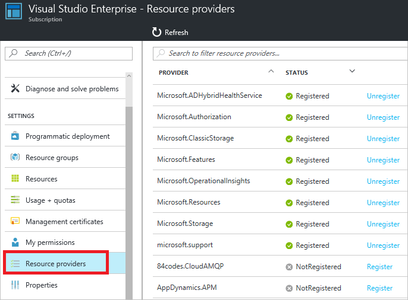

<properties
    pageTitle="Resource Manager 支持的服务 | Azure"
    description="介绍支持资源管理器的资源提供程序及其架构和可用 API 版本，以及可托管资源的区域。"
    services="azure-resource-manager"
    documentationcenter="na"
    author="tfitzmac"
    manager="timlt"
    editor="tysonn" />
<tags
    ms.assetid="3c7a6fe4-371a-40da-9ebe-b574f583305b"
    ms.service="azure-resource-manager"
    ms.devlang="na"
    ms.topic="article"
    ms.tgt_pltfrm="na"
    ms.workload="na"
    ms.date="03/20/2017"
    wacn.date="03/31/2017"
    ms.author="tomfitz" />

# 资源管理器提供程序、区域、 API 版本和架构
本主题提供支持 Azure Resource Manager 的资源提供程序列表。

部署资源时，你还需要知道哪些区域支持这些资源，以及哪些 API 版本可用于资源。[支持的区域](#supported-regions)部分说明了如何找出哪些区域支持相应的订阅和资源。[支持的 API 版本](#supported-api-versions)部分说明了如何判断可以使用哪些 API 版本。

<!-- Not supported the features/azure-portal/availability on Azure.cn-->
若要查看哪些服务支持移动资源，请参阅 [Move resources to new resource group or subscription](/documentation/articles/resource-group-move-resources/)（将资源移到新资源组或订阅）。

下表列出哪些 Microsoft 服务可通过资源管理器支持部署和管理，哪些则不可以。此外，还有许多第三方资源提供程序支持 Resource Manager。了解如何在[资源提供程序和类型](#resource-providers-and-types)部分查看所有资源提供程序。

## 计算
| 服务 | 已启用资源管理器 | REST API | 模板格式 |
| --- | --- | --- | --- |
| 批处理 |是 |[Batch REST](https://docs.microsoft.com/rest/api/batchservice) | |
| 动态生命周期服务 |是 | | |
| 规模集 |是 |[规模集 REST](https://docs.microsoft.com/rest/api/compute/virtualmachinescalesets) |[规模集资源](https://github.com/Azure/azure-quickstart-templates/search?utf8=%E2%9C%93&q=virtualMachineScaleSets&type=Code) |
| Service Fabric |是 |[Service Fabric Rest](https://docs.microsoft.com/rest/api/servicefabric) | [Service Fabric 架构](https://github.com/Azure/azure-resource-manager-schemas/blob/master/schemas/2016-09-01/Microsoft.ServiceFabric.json) [Microsoft.ServiceFabric](https://github.com/Azure/azure-quickstart-templates/search?utf8=%E2%9C%93&q=%22Microsoft.ServiceFabric%22&type=Code) |
| 虚拟机 |是 |[VM REST](https://docs.microsoft.com/rest/api/compute/virtualmachines) |[VM 资源](https://github.com/Azure/azure-quickstart-templates/search?utf8=%E2%9C%93&q=%22Microsoft.Compute%2Fvirtualmachines%22&type=Code) |
| 虚拟机（经典）|有限制 |- |- |
| 云服务（经典）|有限制（参阅下文）|- |- |
<!-- 规模集 REST change to rest/api/virtualmachinescalesets/-->
<!-- VM REST change to rest/api/compute/virtualmachines/virtualmachines-rest-api/-->

虚拟机（经典）是指已通过经典部署模型部署的资源，而不是通过资源管理器部署模型部署的资源。一般而言，这些资源不支持资源管理器操作，但已启用某些操作。有关这些部署模型的详细信息，请参阅[了解资源管理器部署和经典部署](/documentation/articles/resource-manager-deployment-model/)。

云服务（经典）可与其他经典资源配合使用。但是，经典资源不能充分利用所有 Resource Manager 功能，并且不太适合未来的解决方案。应该考虑将你的应用程序基础结构更改为使用 Microsoft.Compute、Microsoft.Storage 和 Microsoft.Network 命名空间中的资源。

## 联网
| 服务 | 已启用资源管理器 | REST API | 模板格式 |
| --- | --- | --- | --- |
| 应用程序网关 |是 |[应用程序网关 REST](https://msdn.microsoft.com/zh-cn/library/azure/mt684939.aspx) | [应用程序网关资源](https://github.com/Azure/azure-quickstart-templates/search?utf8=%E2%9C%93&q=%22Microsoft.Network%2FapplicationGateways%22&type=Code) |
| ExpressRoute |是 |[ExpressRoute REST](https://msdn.microsoft.com/zh-cn/library/azure/mt586720.aspx) | [ExpressRoute 资源](https://github.com/Azure/azure-quickstart-templates/search?utf8=%E2%9C%93&q=%22Microsoft.Network%2FexpressRouteCircuits%22&type=Code) |
| 负载均衡器 |是 |[负载均衡器 REST](https://msdn.microsoft.com/zh-cn/library/azure/mt163651.aspx) |[负载均衡器资源](https://github.com/Azure/azure-quickstart-templates/search?utf8=%E2%9C%93&q=%22Microsoft.Network%2Floadbalancers%22&type=Code) |
| 流量管理器 |是 |[流量管理器 REST](https://msdn.microsoft.com/zh-cn/library/azure/mt163667.aspx) |[流量管理器资源](https://github.com/Azure/azure-quickstart-templates/search?utf8=%E2%9C%93&q=%22Microsoft.Network%2Ftrafficmanagerprofiles%22&type=Code) |
| 虚拟网络 |是 |[虚拟网络 REST](https://msdn.microsoft.com/zh-cn/library/azure/mt163650.aspx) | [虚拟网络资源](https://github.com/Azure/azure-quickstart-templates/search?utf8=%E2%9C%93&q=%22Microsoft.Network%2FvirtualNetworks%22&type=Code) |
| 网络网关 |是 |[网络网关 REST](https://msdn.microsoft.com/zh-cn/library/azure/mt163859.aspx) | [连接资源](https://github.com/Azure/azure-quickstart-templates/search?utf8=%E2%9C%93&q=%22Microsoft.Network%2Fconnections%22&type=Code) <b/> [本地网络网关资源](https://github.com/Azure/azure-quickstart-templates/search?utf8=%E2%9C%93&q=%22Microsoft.Network%2FlocalNetworkGateways%22&type=Code)   [虚拟网络网关资源](https://github.com/Azure/azure-quickstart-templates/search?utf8=%E2%9C%93&q=%22Microsoft.Network%2FvirtualNetworkGateways%22&type=Code) |

## 存储
| 服务 | 已启用资源管理器 | REST API | 模板格式 |
| --- | --- | --- | --- |
| 存储 |是 |[存储 REST](https://docs.microsoft.com/rest/api/storagerp) |[存储资源](https://github.com/Azure/azure-quickstart-templates/search?utf8=%E2%9C%93&q=%22Microsoft.Storage%22&type=Code) |

## 数据库
| 服务 | 已启用资源管理器 | REST API | 模板格式 |
| --- | --- | --- | --- |
| DocumentDB |是 |[DocumentDB REST](https://docs.microsoft.com/rest/api/documentdbresourceprovider) |[DocumentDB 资源](https://github.com/Azure/azure-quickstart-templates/search?utf8=%E2%9C%93&q=%22Microsoft.DocumentDb%22&type=Code) |
| Redis 缓存 |是 | [Redis 缓存 REST](https://docs.microsoft.com/rest/api/redis) |[Redis 资源](https://github.com/Azure/azure-quickstart-templates/search?utf8=%E2%9C%93&q=%22Microsoft.Cache%22&type=Code) |
| SQL 数据库 |是 |[SQL 数据库 REST](https://docs.microsoft.com/rest/api/sql) |[SQL 数据库资源](https://github.com/Azure/azure-quickstart-templates/search?utf8=%E2%9C%93&q=%22Microsoft.Sql%22&type=Code) |
| SQL 数据仓库 |是 | | |

## Web 和移动
| 服务 | 已启用资源管理器 | REST API | 模板格式 |
| --- | --- | --- | --- |
| API Apps |是 | [应用服务 REST](https://docs.microsoft.com/rest/api/appservice) |[Web 资源](https://github.com/Azure/azure-quickstart-templates/search?utf8=%E2%9C%93&q=%22kind%22%3A+%22apiApp%22&type=Code) |
| API 管理 |是 |[API 管理 REST](https://docs.microsoft.com/rest/api/apimanagement) |[API 管理资源](https://github.com/Azure/azure-quickstart-templates/search?utf8=%E2%9C%93&q=%22Microsoft.ApiManagement%22&type=Code) |
| Function App |是 | [Function App REST](https://docs.microsoft.com/rest/api/appservice) |[Function App 资源](https://github.com/Azure/azure-quickstart-templates/search?utf8=%E2%9C%93&q=%22functionApp%22&type=Code) | 
| 逻辑应用 |是 |[逻辑应用 REST](https://docs.microsoft.com/rest/api/logic) |[逻辑应用资源](https://github.com/Azure/azure-quickstart-templates/search?utf8=%E2%9C%93&q=%22Microsoft.Logic%22&type=Code) | 
| Web 应用 |是 | [Web 应用 REST](https://docs.microsoft.com/rest/api/appservice/webapps) | [Microsoft.Web](https://github.com/Azure/azure-quickstart-templates/search?utf8=%E2%9C%93&q=%22Microsoft.Web%22&type=Code) |

## 智能 + 分析
| 服务 | 已启用资源管理器 | REST API | 模板格式 | 
| --- | --- | --- | --- |
| 认知服务 |是 | [认知服务 REST](https://docs.microsoft.com/rest/api/cognitiveservices) | |
| HDInsights |是 |[HDInsights REST](https://docs.microsoft.com/rest/api/hdinsight) |[HDInsight 资源](https://github.com/Azure/azure-quickstart-templates/search?utf8=%E2%9C%93&q=%22Microsoft.HDInsight%22&type=Code) |
| 流分析 |是 |[流分析 REST](https://docs.microsoft.com/rest/api/streamanalytics) | |
| Power BI |是 |[Power BI Embedded REST](https://docs.microsoft.com/rest/api/powerbiembedded) | |

## 物联网
| 服务 | 已启用资源管理器 | REST API | 模板格式 |
| --- | --- | --- | --- |
| 事件中心 |是 |[事件中心 REST](https://docs.microsoft.com/rest/api/eventhub) |[事件中心资源](https://github.com/Azure/azure-quickstart-templates/search?utf8=%E2%9C%93&q=%22Microsoft.EventHub%22&type=Code) |
| IoTHubs |是 |[IoT 中心 REST](https://docs.microsoft.com/rest/api/iothub) |[IoT 中心资源](https://github.com/Azure/azure-quickstart-templates/search?utf8=%E2%9C%93&q=%22Microsoft.Devices%22&type=Code) |
| 通知中心 |是 |[Notification Hub REST](https://docs.microsoft.com/rest/api/notificationhubs) |[通知中心资源](https://github.com/Azure/azure-quickstart-templates/search?utf8=%E2%9C%93&q=%22Microsoft.NotificationHubs%22&type=Code) |

## 媒体和 CDN
| 服务 | 已启用资源管理器 | REST API | 模板格式 |
| --- | --- | --- | --- |
| CDN |是 |[CDN REST](https://docs.microsoft.com/rest/api/cdn) |[CDN 资源](https://github.com/Azure/azure-quickstart-templates/search?utf8=%E2%9C%93&q=%22Microsoft.Cdn%22&type=Code) |
| 媒体服务 |是 |[媒体服务 REST](https://docs.microsoft.com/rest/api/media) |[媒体资源](https://github.com/Azure/azure-quickstart-templates/search?utf8=%E2%9C%93&q=%22Microsoft.Media%22&type=Code) |

## 混合集成
| 服务 | 已启用资源管理器 | REST API | 模板格式 |
| --- | --- | --- | --- |
| 恢复服务 |是 |[恢复服务 REST](https://docs.microsoft.com/rest/api/recoveryservices) |[恢复服务资源](https://github.com/Azure/azure-quickstart-templates/search?utf8=%E2%9C%93&q=%22Microsoft.RecoveryServices%22&type=Code) |
| 服务总线 |是 |[服务总线 REST](https://docs.microsoft.com/rest/api/servicebus) |[服务总线资源](https://github.com/Azure/azure-quickstart-templates/search?utf8=%E2%9C%93&q=%22Microsoft.ServiceBus%22&type=Code) |

## 标识和访问管理
Azure Active Directory 可以使用 Resource Manager 为订阅启用基于角色的访问控制。若要了解如何使用基于角色的访问控制和 Active Directory，请参阅 [Azure Role-based Access Control](/documentation/articles/role-based-access-control-configure/)（Azure 基于角色的访问控制）。

## 开发人员服务
| 服务 | 已启用资源管理器 | REST API | 模板格式 |
| --- | --- | --- | --- |
| 监视 |是 |[监视器 REST](https://docs.microsoft.com/rest/api/monitor) |[Insights 资源](https://github.com/Azure/azure-quickstart-templates/search?utf8=%E2%9C%93&q=%22Microsoft.insights%22&type=Code) |

## 管理和安全性
| 服务 | 已启用资源管理器 | REST API | 模板格式 |
| --- | --- | --- | --- |
| 自动化 |是 |[自动化 REST](https://msdn.microsoft.com/zh-cn/library/azure/mt662285.aspx) |[自动化资源](https://github.com/Azure/azure-quickstart-templates/search?utf8=%E2%9C%93&q=%22Microsoft.Automation%22&type=Code) |
| 密钥保管库 |是 |[密钥保管库 REST](https://docs.microsoft.com/rest/api/keyvault) |[Key Vault 资源](https://github.com/Azure/azure-quickstart-templates/search?utf8=%E2%9C%93&q=%22Microsoft.KeyVault%22&type=Code) |
| 计划程序 |是 |[计划程序 REST](https://docs.microsoft.com/rest/api/scheduler) |[计划程序资源](https://github.com/Azure/azure-quickstart-templates/search?utf8=%E2%9C%93&q=%22Microsoft.Scheduler%22&type=Code) |
| 安全性（预览版） |是 |[安全 REST](https://msdn.microsoft.com/zh-cn/library/azure/mt704034.aspx) |[安全资源](https://github.com/Azure/azure-quickstart-templates/search?utf8=%E2%9C%93&q=%22Microsoft.Security%22&type=Code) |

## 资源管理器
| 功能 | 已启用资源管理器 | REST API | 模板格式 |
| --- | --- | --- | --- |
| 授权 |是 |[授权 REST](https://docs.microsoft.com/rest/api/authorization) | [角色分配](/documentation/articles/active-directory-users-assign-role-azure-portal/) [Microsoft.Authorization](https://github.com/Azure/azure-quickstart-templates/search?utf8=%E2%9C%93&q=%22Microsoft.Authorization%22&type=Code) |
| 资源 |是 |[资源 REST](https://docs.microsoft.com/rest/api/resources) | [Microsoft.Resources](https://github.com/Azure/azure-quickstart-templates/search?utf8=%E2%9C%93&q=%22Microsoft.Resources%22&type=Code) |

##  资源提供程序和类型
部署资源时，经常需要检索有关资源提供程序和类型的信息。可以通过 REST API、Azure PowerShell 或 Azure CLI 检索此信息。

若要使用资源提供程序，该资源提供程序必须已注册到你的帐户。默认情况下，会自动注册多个资源提供程序；但是，你可能需要手动注册某些资源提供程序。下面的示例演示如何获取资源提供程序的注册状态，并注册资源提供程序（如果需要）。

### 门户
从订阅边栏选项卡选择“资源提供程序”即可轻松查看支持的资源提供程序列表。若要向资源提供程序注册订阅，请选择“注册”链接。
   
  

### REST API
若要获取所有可用的资源提供程序，包括其类型、位置、API 版本和注册状态，请使用[列出所有资源提供程序](https://docs.microsoft.com/rest/api/resources/providers#Providers_List)操作。如果需要注册资源提供程序，请参阅 [Register a subscription with a resource provider](https://docs.microsoft.com/rest/api/resources/providers#Providers_Register)（将订阅注册到资源提供程序）。

### PowerShell
以下示例说明如何获取所有可用的资源提供程序。

    Get-AzureRmResourceProvider -ListAvailable

以下示例演示如何获取特定资源提供程序的资源类型。

    (Get-AzureRmResourceProvider -ProviderNamespace Microsoft.Web).ResourceTypes

若要注册资源提供程序，请提供命名空间：

    Register-AzureRmResourceProvider -ProviderNamespace Microsoft.ApiManagement

### Azure CLI
以下示例说明如何获取所有可用的资源提供程序。

    az provider list

可使用以下命令查看特定资源提供程序的信息：

    az provider show --namespace Microsoft.Web

若要注册资源提供程序，请提供命名空间：

    az provider register --namespace Microsoft.ServiceBus

##  支持的区域
部署资源时，通常需要指定资源的区域。所有区域都支持资源管理器，但部署的资源可能无法在所有区域中受到支持。此外，订阅可能存在一些限制，以防止用户使用某些支持该资源的区域。这些限制可能与所在国家/地区的税务问题有关，或者与由订阅管理员所放置，只能使用特定区域的策略结果有关。
<!-- region service not supported on Azure.cn -->

### 门户
执行以下步骤即可查看某种资源类型支持的区域：

1. 选择“更多服务”>“资源浏览器”。
   
      

2. 打开“提供程序”节点。
   
      

3. 选择资源提供程序，然后查看支持的区域和 API 版本。
   
      

### REST API
若要发现哪些区域可供订阅中的特定资源类型使用，请使用[列出所有资源提供程序](https://docs.microsoft.com/rest/api/resources/providers#Providers_List)操作。

### PowerShell
以下示例演示如何获取支持网站的区域。

    ((Get-AzureRmResourceProvider -ProviderNamespace Microsoft.Web).ResourceTypes | Where-Object ResourceTypeName -eq sites).Locations

### Azure CLI
以下示例演示如何获取支持的网站位置。

    az provider show --namespace Microsoft.Web --query "resourceTypes[?resourceType=='sites'].locations"

## 支持的 API 版本
部署模板时，必须指定要用于创建每个资源的 API 版本。API 版本对应于资源提供程序发布的 REST API 操作版本。资源提供程序启用新功能时，会发布 REST API 的新版本。因此，在模板中指定的 API 版本会影响你可以在模板中指定的属性。通常，在创建模板时，需要选择最新的 API 版本。对于现有模板，你可以决定是要继续使用以前的 API 版本，还是要选择最新版本来更新模板以利用新功能。

### 门户
确定支持的 API 版本时，所采用的方式与确定支持的区域（如前所示）相同。

### REST API
若要发现哪些 API 版本可供资源类型使用，请使用[列出所有资源提供程序](https://docs.microsoft.com/rest/api/resources/providers#Providers_List)操作。

### PowerShell
以下示例演示如何获取特定资源类型可用的 API 版本。

    ((Get-AzureRmResourceProvider -ProviderNamespace Microsoft.Web).ResourceTypes | Where-Object ResourceTypeName -eq sites).ApiVersions

输出类似于：

    2015-08-01
    2015-07-01
    2015-06-01
    2015-05-01
    2015-04-01
    2015-02-01
    2014-11-01
    2014-06-01
    2014-04-01-preview
    2014-04-01

### Azure CLI
使用以下命令获取资源提供程序的可用 API 版本：

    az provider show --namespace Microsoft.Web --query "resourceTypes[?resourceType=='sites'].apiVersions"

## 后续步骤
* 若要了解如何创建资源管理器模板，请参阅[创作 Azure 资源管理器模板](/documentation/articles/resource-group-authoring-templates/)。
* 若要了解如何部署资源，请参阅[使用 Azure 资源管理器模板部署应用程序](/documentation/articles/resource-group-template-deploy/)。

<!---HONumber=Mooncake_0327_2017-->
<!-- Update_Description: update meta properties; wording update； remove the service schema in table -->