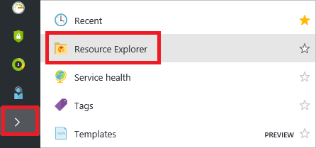

<properties
    pageTitle="Resource Manager 支持的服务 | Azure"
    description="介绍支持资源管理器的资源提供程序及其架构和可用 API 版本，以及可托管资源的区域。"
    services="azure-resource-manager"
    documentationcenter="na"
    author="tfitzmac"
    manager="timlt"
    editor="tysonn" />  

<tags
    ms.assetid="3c7a6fe4-371a-40da-9ebe-b574f583305b"
    ms.service="azure-resource-manager"
    ms.devlang="na"
    ms.topic="article"
    ms.tgt_pltfrm="na"
    ms.workload="na"
    ms.date="10/25/2016"
    wacn.date="12/26/2016"
    ms.author="magoedte;tomfitz" />

# 资源管理器提供程序、区域、 API 版本和架构
Azure 资源管理器为你提供了一种新的方式来部署和管理构成应用程序的服务。大多数（但并非所有）服务都支持资源管理器，有些服务仅部分支持资源管理器。本主题提供支持 Azure 资源管理器的资源提供程序列表。

部署资源时，你还需要知道哪些区域支持这些资源，以及哪些 API 版本可用于资源。[支持的区域](#supported-regions)部分说明了如何找出哪些区域支持相应的订阅和资源。[支持的 API 版本](#supported-api-versions)部分说明了如何判断可以使用哪些 API 版本。

若要查看哪些服务支持移动资源，请参阅 [Move resources to new resource group or subscription](/documentation/articles/resource-group-move-resources/)（将资源移到新资源组或订阅）。

下表列出哪些 Microsoft 服务可通过资源管理器支持部署和管理，哪些则不可以。“快速入门模板”列中的链接向指定资源提供程序的 Azure 快速入门模板存储库发送查询。快速入门模板中经常会添加和更新数据。即使特定的服务存在链接，也并不一定代表查询将从存储库返回模板。此外，还有许多第三方资源提供程序支持 Resource Manager。了解如何在[资源提供程序和类型](#resource-providers-and-types)部分查看所有资源提供程序。

## 计算
| 服务 | 已启用资源管理器 | REST API | 架构 | 快速入门模板 |
| --- | --- | --- | --- | --- |
| 批处理 |是 |[Batch REST](https://docs.microsoft.com/rest/api/batchservice/) |[2015-12-01](https://github.com/Azure/azure-resource-manager-schemas/blob/master/schemas/2015-12-01/Microsoft.Batch.json) | |
| 容器 |是 |[容器服务 REST](https://msdn.microsoft.com/zh-cn/library/azure/mt711470.aspx) |[2016-03-30](https://github.com/Azure/azure-resource-manager-schemas/blob/master/schemas/2016-03-30/Microsoft.ContainerService.json) |[Microsoft.ContainerService](https://github.com/Azure/azure-quickstart-templates) |
| 动态生命周期服务 |是 | | | |
| 规模集 |是 |[规模集 REST](https://msdn.microsoft.com/zh-cn/library/azure/mt705635.aspx) |[2015-08-01](https://github.com/Azure/azure-resource-manager-schemas/blob/master/schemas/2015-08-01/Microsoft.Compute.json) |[virtualMachineScaleSets](https://github.com/Azure/azure-quickstart-templates) |
| Service Fabric |是 |[Service Fabric Rest](https://msdn.microsoft.com/zh-cn/library/azure/dn707692.aspx) | |[Microsoft.ServiceFabric](https://github.com/Azure/azure-quickstart-templates) |
| 虚拟机 |是 |[VM REST](https://msdn.microsoft.com/zh-cn/library/azure/mt163647.aspx) |[2015-08-01](https://github.com/Azure/azure-resource-manager-schemas/blob/master/schemas/2015-08-01/Microsoft.Compute.json) |[virtualMachines](https://github.com/Azure/azure-quickstart-templates) |
| 虚拟机（经典）|有限制 |- |- |- |
| 远程应用 |否 |- |- |- |
| 云服务（经典）|有限制（参阅下文）|- |- |- |

虚拟机（经典）是指已通过经典部署模型部署的资源，而不是通过资源管理器部署模型部署的资源。一般而言，这些资源不支持资源管理器操作，但已启用某些操作。有关这些部署模型的详细信息，请参阅[了解资源管理器部署和经典部署](/documentation/articles/resource-manager-deployment-model/)。

云服务（经典）与其他经典资源配合使用；但是，经典资源不能充分利用所有的 Resource Manager 功能，并且不太适合用于将来的解决方案。应该考虑将你的应用程序基础结构更改为使用 Microsoft.Compute、Microsoft.Storage 和 Microsoft.Network 命名空间中的资源。

## 联网
| 服务 | 已启用资源管理器 | REST API | 架构 | 快速入门模板 |
| --- | --- | --- | --- | --- |
| 应用程序网关 |是 |[应用程序网关 REST](https://msdn.microsoft.com/zh-cn/library/azure/mt684939.aspx) | |[applicationGateways](https://github.com/Azure/azure-quickstart-templates) |
| DNS |是 |[DNS REST](https://msdn.microsoft.com/zh-cn/library/azure/mt163862.aspx) |[2016-04-01](https://github.com/Azure/azure-resource-manager-schemas/blob/master/schemas/2016-04-01/Microsoft.Network.json) |[dnsZones](https://github.com/Azure/azure-quickstart-templates) |
| ExpressRoute |是 |[ExpressRoute REST](https://msdn.microsoft.com/zh-cn/library/azure/mt586720.aspx) | |[expressRouteCircuits](https://github.com/Azure/azure-quickstart-templates) |
| 负载均衡器 |是 |[负载均衡器 REST](https://msdn.microsoft.com/zh-cn/library/azure/mt163651.aspx) |[2015-08-01](https://github.com/Azure/azure-resource-manager-schemas/blob/master/schemas/2015-08-01/Microsoft.Network.json) |[loadBalancers](https://github.com/Azure/azure-quickstart-templates) |
| 流量管理器 |是 |[流量管理器 REST](https://msdn.microsoft.com/zh-cn/library/azure/mt163667.aspx) |[2015-11-01](https://github.com/Azure/azure-resource-manager-schemas/blob/master/schemas/2015-11-01/Microsoft.Network.json) |[trafficmanagerprofiles](https://github.com/Azure/azure-quickstart-templates) |
| 虚拟网络 |是 |[虚拟网络 REST](https://msdn.microsoft.com/zh-CN/library/azure/mt163650.aspx) |[2015-08-01](https://github.com/Azure/azure-resource-manager-schemas/blob/master/schemas/2015-08-01/Microsoft.Network.json) |[virtualNetworks](https://github.com/Azure/azure-quickstart-templates) |
| VPN 网关 |是 |[网络网关 REST](https://msdn.microsoft.com/zh-cn/library/azure/mt163859.aspx) | |[virtualNetworkGateways](https://github.com/Azure/azure-quickstart-templates)   [localNetworkGateways](https://github.com/Azure/azure-quickstart-templates)  [连接](https://github.com/Azure/azure-quickstart-templates) |

## 存储
| 服务 | 已启用资源管理器 | REST API | 架构 | 快速入门模板 |
| --- | --- | --- | --- | --- |
| 存储 |是 |[存储 REST](https://msdn.microsoft.com/zh-cn/library/azure/mt163683.aspx) |[存储帐户](/documentation/articles/resource-manager-template-storage/) |[Microsoft.Storage](https://github.com/Azure/azure-quickstart-templates) |
| StorSimple |是 | | | |

## 数据库
| 服务 | 已启用资源管理器 | REST API | 架构 | 快速入门模板 |
| --- | --- | --- | --- | --- |
| DocumentDB |是 |[DocumentDB REST](https://msdn.microsoft.com/zh-cn/library/azure/dn781481.aspx) |[2015-04-08](https://github.com/Azure/azure-resource-manager-schemas/blob/master/schemas/2015-04-08/Microsoft.DocumentDB.json) |[Microsoft.DocumentDB](https://github.com/Azure/azure-quickstart-templates) |
| Redis 缓存 |是 | [Redis 缓存 REST](https://docs.microsoft.com/rest/api/redis/) |[2016-04-01](https://github.com/Azure/azure-resource-manager-schemas/blob/master/schemas/2016-04-01/Microsoft.Cache.json) |[Microsoft.Cache](https://github.com/Azure/azure-quickstart-templates) |
| SQL 数据库 |是 |[SQL 数据库 REST](https://msdn.microsoft.com/zh-cn/library/azure/mt163571.aspx) |[2014-04-01-preview](https://github.com/Azure/azure-resource-manager-schemas/blob/master/schemas/2014-04-01-preview/Microsoft.Sql.json) |[Microsoft.Sql](https://github.com/Azure/azure-quickstart-templates) |
| SQL 数据仓库 |是 | | | |

## Web 和移动
| 服务 | 已启用资源管理器 | REST API | 架构 | 快速入门模板 |
| --- | --- | --- | --- | --- |
| API Apps |是 | [应用服务 REST](https://docs.microsoft.com/rest/api/appservice/) |[2015-08-01](https://github.com/Azure/azure-resource-manager-schemas/blob/master/schemas/2015-08-01/Microsoft.Web.json) |[API Apps](https://github.com/Azure/azure-quickstart-templates) |
| API 管理 |是 |[API 管理 REST](https://msdn.microsoft.com/zh-cn/library/azure/dn776326.aspx) |[2016-07-07](https://github.com/Azure/azure-resource-manager-schemas/blob/master/schemas/2016-07-07/Microsoft.ApiManagement.json) |[Microsoft.ApiManagement](https://github.com/Azure/azure-quickstart-templates) |
| 内容审查器 |是 | | | |
| 函数应用 |是 | | |[functionApp](https://github.com/Azure/azure-quickstart-templates) |
| Logic Apps |是 |[工作流服务 REST API](https://msdn.microsoft.com/zh-cn/library/azure/mt643787.aspx) |[2016-06-01](https://github.com/Azure/azure-resource-manager-schemas/blob/master/schemas/2016-06-01/Microsoft.Logic.json) |[Microsoft.Logic](https://github.com/Azure/azure-quickstart-templates) |
| Mobile Apps |是 | [应用服务 REST](https://docs.microsoft.com/rest/api/appservice/) |[2015-08-01](https://github.com/Azure/azure-resource-manager-schemas/blob/master/schemas/2015-08-01/Microsoft.Web.json) |[mobileApp](https://github.com/Azure/azure-quickstart-templates) |
| Mobile Engagement |是 |[Mobile Engagement REST](https://msdn.microsoft.com/zh-cn/library/azure/mt683754.aspx) | |[Microsoft.MobileEngagements](https://github.com/Azure/azure-quickstart-templates) |
| 搜索 |是 |[搜索 REST](https://msdn.microsoft.com/zh-cn/library/azure/dn798935.aspx) | |[Microsoft.Search](https://github.com/Azure/azure-quickstart-templates) |
| Web 应用 |是 | [应用服务 REST](https://docs.microsoft.com/rest/api/appservice/) |[2015-08-01](https://github.com/Azure/azure-resource-manager-schemas/blob/master/schemas/2015-08-01/Microsoft.Web.json) |[Microsoft.Web](https://github.com/Azure/azure-quickstart-templates) |

## 分析
| 服务 | 已启用资源管理器 | REST API | 架构 | 快速入门模板 |
| --- | --- | --- | --- | --- |
| 数据目录 |是 |[数据目录 REST](https://msdn.microsoft.com/zh-cn/library/azure/mt267595.aspx) |[2016-03-30](https://github.com/Azure/azure-resource-manager-schemas/blob/master/schemas/2016-03-30/Microsoft.DataCatalog.json) | |
| Data Factory |是 |[数据工厂 REST](https://msdn.microsoft.com/zh-cn/library/azure/dn906738.aspx) | |[Microsoft.DataFactory](https://github.com/Azure/azure-quickstart-templates) |
| 数据湖分析 |是 | [Data Lake REST](https://docs.microsoft.com/rest/api/datalakeanalytics/) |[2015-10-01-preview](https://github.com/Azure/azure-resource-manager-schemas/blob/master/schemas/2015-10-01-preview/Microsoft.DataLakeAnalytics.json) |[Microsoft.DataLakeAnalytics](https://github.com/Azure/azure-quickstart-templates) |
| 数据湖存储 |是 |[Data Lake Store REST](https://msdn.microsoft.com/zh-cn/library/azure/mt693424.aspx) |[2015-10-01-preview](https://github.com/Azure/azure-resource-manager-schemas/blob/master/schemas/2015-10-01-preview/Microsoft.DataLakeAnalytics.json) |[Microsoft.DataLakeStore](https://github.com/Azure/azure-quickstart-templates) |
| HDInsights |是 |[HDInsights REST](https://msdn.microsoft.com/zh-cn/library/azure/mt622197.aspx) | |[Microsoft.HDInsight](https://github.com/Azure/azure-quickstart-templates) |
| 机器学习 |是 |[机器学习 REST](https://msdn.microsoft.com/zh-cn/library/azure/mt767538.aspx) |[2016-05-01-preview](https://github.com/Azure/azure-resource-manager-schemas/blob/master/schemas/2016-05-01-preview/Microsoft.MachineLearning.json) | |
| 流分析 |是 |[流分析 REST](https://msdn.microsoft.com/zh-cn/library/azure/dn835031.aspx) | | |
| Power BI |是 |[Power BI Embedded REST](https://msdn.microsoft.com/zh-cn/library/azure/mt712303.aspx) |[2016-01-29](https://github.com/Azure/azure-resource-manager-schemas/blob/master/schemas/2016-01-29/Microsoft.PowerBI.json) | |

## Intelligence
| 服务 | 已启用资源管理器 | REST API | 架构 | 快速入门模板 |
| --- | --- | --- | --- | --- |
| 认知服务 |是 | [认知服务 REST](https://docs.microsoft.com/rest/api/cognitiveservices/) |[2016-02-01-preview](https://github.com/Azure/azure-resource-manager-schemas/blob/master/schemas/2016-02-01-preview/Microsoft.CognitiveServices.json) | |

## 物联网
| 服务 | 已启用资源管理器 | REST API | 架构 | 快速入门模板 |
| --- | --- | --- | --- | --- |
| 事件中心 |是 |[事件中心 REST](https://msdn.microsoft.com/zh-cn/library/azure/dn790674.aspx) |[2015-08-01](https://github.com/Azure/azure-resource-manager-schemas/blob/master/schemas/2015-08-01/Microsoft.EventHub.json) |[Microsoft.EventHub](https://github.com/Azure/azure-quickstart-templates) |
| IoTHubs |是 |[IoT 中心 REST](https://msdn.microsoft.com/zh-cn/library/azure/mt589014.aspx) |[2016-02-03](https://github.com/Azure/azure-resource-manager-schemas/blob/master/schemas/2016-02-03/Microsoft.Devices.json) |[Microsoft.Devices](https://github.com/Azure/azure-quickstart-templates) |
| 通知中心 |是 |[Notification Hub REST](https://msdn.microsoft.com/zh-cn/library/azure/dn495827.aspx) |[2015-04-01](https://github.com/Azure/azure-resource-manager-schemas/blob/master/schemas/2015-04-01/Microsoft.NotificationHubs.json) |[Microsoft.NotificationHubs](https://github.com/Azure/azure-quickstart-templates) |

## 媒体和 CDN
| 服务 | 已启用资源管理器 | REST API | 架构 | 快速入门模板 |
| --- | --- | --- | --- | --- |
| CDN |是 |[CDN REST](https://msdn.microsoft.com/zh-cn/library/azure/mt634456.aspx) |[2016-04-02](https://github.com/Azure/azure-resource-manager-schemas/blob/master/schemas/2016-04-02/Microsoft.Cdn.json) |[Microsoft.Cdn](https://github.com/Azure/azure-quickstart-templates) |
| 媒体服务 |是 |[媒体服务 REST](https://docs.microsoft.com/zh-cn/rest/api/media/) |[2015-10-01](https://github.com/Azure/azure-resource-manager-schemas/blob/master/schemas/2015-10-01/Microsoft.Media.json) | |

## 混合集成
| 服务 | 已启用资源管理器 | REST API | 架构 | 快速入门模板 |
| --- | --- | --- | --- | --- |
| BizTalk 服务 |是 | |[2014-04-01](https://github.com/Azure/azure-resource-manager-schemas/blob/master/schemas/2014-04-01/Microsoft.BizTalkServices.json) | |
| 恢复服务 |是 |[Site Recovery REST](https://msdn.microsoft.com/zh-cn/library/azure/mt750497.aspx) |[2016-06-01](https://github.com/Azure/azure-resource-manager-schemas/blob/master/schemas/2016-06-01/Microsoft.RecoveryServices.json) |[Microsoft.RecoveryServices](https://github.com/Azure/azure-quickstart-templates) |
| 服务总线 |是 |[服务总线 REST](https://msdn.microsoft.com/zh-cn/library/azure/mt639375.aspx) |[2015-08-01](https://github.com/Azure/azure-resource-manager-schemas/blob/master/schemas/2015-08-01/Microsoft.ServiceBus.json) |[Microsoft.ServiceBus](https://github.com/Azure/azure-quickstart-templates) |

## 标识和访问管理
Azure Active Directory 可以使用 Resource Manager 为订阅启用基于角色的访问控制。若要了解如何使用基于角色的访问控制和 Active Directory，请参阅 [Azure Role-based Access Control](/documentation/articles/role-based-access-control-configure/)（Azure 基于角色的访问控制）。

## 开发人员服务
| 服务 | 已启用资源管理器 | REST API | 架构 | 快速入门模板 |
| --- | --- | --- | --- | --- |
| Application Insights |是 |[Insights REST](https://msdn.microsoft.com/zh-cn/library/azure/dn931943.aspx) |[2014-04-01](https://github.com/Azure/azure-resource-manager-schemas/blob/master/schemas/2014-04-01/Microsoft.Insights.json) |[Microsoft.insights](https://github.com/Azure/azure-quickstart-templates) |
| 必应地图 |是 | | | |
| DevTest Labs |是 | [DevTest REST](https://docs.microsoft.com/rest/api/dtl/) |[2016-05-15](https://github.com/Azure/azure-resource-manager-schemas/blob/master/schemas/2016-05-15/Microsoft.DevTestLab.json) |[Microsoft.DevTestLab](https://github.com/Azure/azure-quickstart-templates) |
| Visual Studio 帐户 |是 | |[2014-02-26](https://github.com/Azure/azure-resource-manager-schemas/blob/master/schemas/2014-02-26/microsoft.visualstudio.json) | |

## 管理和安全性
| 服务 | 已启用资源管理器 | REST API | 架构 | 快速入门模板 |
| --- | --- | --- | --- | --- |
| 自动化 |是 |[自动化 REST](https://msdn.microsoft.com/zh-cn/library/azure/mt662285.aspx) |[2015-10-31](https://github.com/Azure/azure-resource-manager-schemas/blob/master/schemas/2015-10-31/Microsoft.Automation.json) |[Microsoft.Automation](https://github.com/Azure/azure-quickstart-templates) |
| 密钥保管库 |是 |[密钥保管库 REST](https://msdn.microsoft.com/zh-cn/library/azure/dn903609.aspx) |[密钥保管库](/documentation/articles/resource-manager-template-keyvault/) [密钥保管库机密](/documentation/articles/resource-manager-template-keyvault-secret/) |[Microsoft.KeyVault](https://github.com/Azure/azure-quickstart-templates) |
| 操作见解 |是 | | | |
| 计划程序 |是 |[计划程序 REST](https://msdn.microsoft.com/zh-cn/library/azure/mt629143.aspx) |[2016-03-01](https://github.com/Azure/azure-resource-manager-schemas/blob/master/schemas/2016-03-01/Microsoft.Scheduler.json) |[Microsoft.Scheduler](https://github.com/Azure/azure-quickstart-templates) |
| 安全性（预览版） |是 |[安全 REST](https://msdn.microsoft.com/zh-cn/library/azure/mt704034.aspx) | |[Microsoft.Security](https://github.com/Azure/azure-quickstart-templates) |

## 资源管理器
| 功能 | 已启用资源管理器 | REST API | 架构 | 快速入门模板 |
| --- | --- | --- | --- | --- |
| 授权 |是 |[管理锁](https://msdn.microsoft.com/zh-cn/library/azure/mt204563.aspx) [基于角色的访问控制](https://msdn.microsoft.com/zh-cn/library/azure/dn906885.aspx) |[资源锁](/documentation/articles/resource-manager-template-lock/) [角色分配](/documentation/articles/resource-manager-template-role/) |[Microsoft.Authorization](https://github.com/Azure/azure-quickstart-templates) |
| 资源 |是 |[链接的资源](https://msdn.microsoft.com/zh-cn/library/azure/mt238499.aspx) |[资源链接](/documentation/articles/resource-manager-template-links/) |[Microsoft.Resources](https://github.com/Azure/azure-quickstart-templates) |

##  资源提供程序和类型
部署资源时，经常需要检索有关资源提供程序和类型的信息。可以通过 REST API、Azure PowerShell 或 Azure CLI 检索此信息。

若要使用资源提供程序，该资源提供程序必须已注册到你的帐户。默认情况下，会自动注册多个资源提供程序；但是，你可能需要手动注册某些资源提供程序。下面的示例演示如何获取资源提供程序的注册状态，并注册资源提供程序（如果需要）。

### 门户
执行以下步骤即可轻松查看受支持的资源提供程序的列表：

1. 选择“我的权限”。
   
      

2. 选择“资源提供程序状态”
   
      

3. 此时会显示订阅的资源提供程序的完整列表。
   
      

### REST API
若要获取所有可用的资源提供程序，包括其类型、位置、API 版本和注册状态，请使用[列出所有资源提供程序](https://docs.microsoft.com/rest/api/resources/providers#Providers_List)操作。如果需要注册资源提供程序，请参阅 [Register a subscription with a resource provider](https://docs.microsoft.com/rest/api/resources/providers#Providers_Register)（将订阅注册到资源提供程序）。

### PowerShell
以下示例演示如何获取所有可用的资源提供程序。

    Get-AzureRmResourceProvider -ListAvailable

以下示例演示如何获取特定资源提供程序的资源类型。

    (Get-AzureRmResourceProvider -ProviderNamespace Microsoft.Web).ResourceTypes

输出类似于：

    ResourceTypeName                Locations                                         
    ----------------                ---------                                         
    sites/extensions                {China North, China East} 
    sites/slots/extensions          {China North, China East} .
    ...

若要注册资源提供程序，请提供命名空间：

    Register-AzureRmResourceProvider -ProviderNamespace Microsoft.ApiManagement

### Azure CLI
以下示例演示如何获取所有可用的资源提供程序。

    azure provider list

输出类似于：

    info:    Executing command provider list
    + Getting registered providers
    data:    Namespace                        Registered
    data:    -------------------------------  -------------
    data:    Microsoft.ApiManagement          Unregistered
    data:    Microsoft.AppService             Registered
    data:    Microsoft.Authorization          Registered
    ...

可以使用以下命令将特定资源提供程序的信息保存到文件。

    azure provider show Microsoft.Web -vv --json > c:\temp.json

若要注册资源提供程序，请提供命名空间：

    azure provider register -n Microsoft.ServiceBus

##  支持的区域
部署资源时，通常需要指定资源的区域。所有区域都支持资源管理器，但部署的资源可能无法在所有区域中受到支持。此外，订阅可能存在一些限制，以防止用户使用某些支持该资源的区域。这些限制可能与所在国家/地区的税务问题有关，或者与由订阅管理员所放置，只能使用特定区域的策略结果有关。

可以通过门户、REST API、PowerShell 或 Azure CLI 来确定订阅支持的特定资源类型所在的区域。

### 门户
执行以下步骤即可查看某种资源类型支持的区域：

1. 选择“更多服务”>“资源浏览器”。
   
      

2. 打开“提供程序”节点。
   
      

3. 选择资源提供程序，然后查看支持的区域和 API 版本。
   
      

### REST API
若要发现哪些区域可供订阅中的特定资源类型使用，请使用[列出所有资源提供程序](https://docs.microsoft.com/rest/api/resources/providers#Providers_List)操作。

### PowerShell
以下示例演示如何获取支持网站的区域。

    ((Get-AzureRmResourceProvider -ProviderNamespace Microsoft.Web).ResourceTypes | Where-Object ResourceTypeName -eq sites).Locations

输出类似于：

    China North
    China East

### Azure CLI
以下示例返回每个资源类型支持的所有位置。

    azure location list

也可以使用 [jq](https://stedolan.github.io/jq/) 之类的 JSON 实用工具来筛选位置结果。

    azure location list --json | jq '.[] | select(.name == "Microsoft.Web/sites")'

将返回：

    {
      "name": "Microsoft.Web/sites",
      "location": "China North,China East"
    }

##  支持的 API 版本
部署模板时，必须指定要用于创建每个资源的 API 版本。API 版本对应于资源提供程序发布的 REST API 操作版本。资源提供程序启用新功能时，会发布 REST API 的新版本。因此，在模板中指定的 API 版本会影响你可以在模板中指定的属性。通常，在创建模板时，需要选择最新的 API 版本。对于现有模板，你可以决定是要继续使用以前的 API 版本，还是要选择最新版本来更新模板以利用新功能。

### 门户
确定支持的 API 版本时，所采用的方式与确定支持的区域（如前所示）相同。

### REST API
若要发现哪些 API 版本可供资源类型使用，请使用[列出所有资源提供程序](https://docs.microsoft.com/rest/api/resources/providers#Providers_List)操作。

### PowerShell
以下示例演示如何获取特定资源类型可用的 API 版本。

    ((Get-AzureRmResourceProvider -ProviderNamespace Microsoft.Web).ResourceTypes | Where-Object ResourceTypeName -eq sites).ApiVersions

输出类似于：

    2015-08-01
    2015-07-01
    2015-06-01
    2015-05-01
    2015-04-01
    2015-02-01
    2014-11-01
    2014-06-01
    2014-04-01-preview
    2014-04-01

### Azure CLI
可以使用以下命令将资源提供程序的信息（包括可用的 API 版本）保存到文件。

    azure provider show Microsoft.Web -vv --json > c:\temp.json

你可以打开该文件并查找 **apiVersions** 元素

## 后续步骤
* 若要了解如何创建资源管理器模板，请参阅[创作 Azure 资源管理器模板](/documentation/articles/resource-group-authoring-templates/)。
* 若要了解如何部署资源，请参阅[使用 Azure 资源管理器模板部署应用程序](/documentation/articles/resource-group-template-deploy/)。

<!---HONumber=Mooncake_1219_2016-->