<properties
    pageTitle="Azure 资源组 Visual Studio 项目 | Azure"
    description="使用 Visual Studio 创建 Azure 资源组项目，并将资源部署到 Azure。"
    services="azure-resource-manager"
    documentationcenter="na"
    author="tfitzmac"
    manager="timlt"
    editor="tysonn" />  

<tags
    ms.assetid="4bd084c8-0842-4a10-8460-080c6a085bec"
    ms.service="azure-resource-manager"
    ms.devlang="multiple"
    ms.topic="get-started-article"
    ms.tgt_pltfrm="na"
    ms.workload="na"
    ms.date="03/10/2017"
    wacn.date="01/25/2017"
    ms.author="tomfitz" />

# 通过 Visual Studio 创建和部署 Azure 资源组
使用 Visual Studio 和 [Azure SDK](/downloads/) 可以创建一个项目，用于将基础结构和代码部署到 Azure。例如，你可以为应用定义 Web 主机、网站和数据库，然后将该基础结构与代码一起部署。或者，你可以定义虚拟机、虚拟网络和存储帐户，然后连同虚拟机上执行的脚本一起部署该基础结构。**Azure 资源组**部署项目可让你通过单个可重复的的操作部署全部所需的资源。有关部署和管理资源的详细信息，请参阅 [Azure Resource Manager overview](/documentation/articles/resource-group-overview/)（Azure Resource Manager 概述）。

Azure 资源组项目包含 Azure Resource Manager JSON 模板，用于定义部署到 Azure 的资源。若要了解 Resource Manager 模板的元素，请参阅 [Authoring Azure Resource Manager templates](/documentation/articles/resource-group-authoring-templates/)（创作 Azure Resource Manager 模板）。Visual Studio 允许你编辑这些模板，并提供工具来简化模板的使用。

在本主题中，会部署 Web 应用和 SQL 数据库。但是，对于任何类型的资源，这些步骤都几乎一样。可以轻松地部署虚拟机及其相关资源。Visual Studio 许多不同的入门模板用于部署常见方案。

本文说明 Visual Studio 2015 Update 2 和用于 .NET 2.9 的 Azure SDK。如果将 Visual Studio 2013 与 Azure SDK 2.9 配合使用，体验大体相同。可以使用 2.6 或更高版本的 Azure SDK；但是，用户界面体验可能会不同于本文所示的用户界面体验。强烈建议在开始执行相关步骤前安装最新版本的 [Azure SDK](/downloads/)。

## 创建 Azure 资源组项目
在此过程中，会使用 **Web 应用 + SQL** 模板创建 Azure 资源组项目。

1. 在 Visual Studio 中，选择“文件”、“新建项目”，再选择“C#”或“Visual Basic”。然后选择“云”，再选择“Azure 资源组”项目。
   
    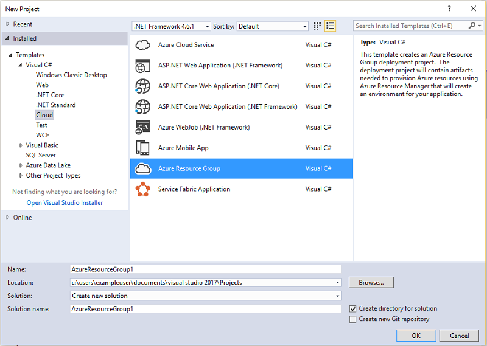
2. 选择要部署到 Azure Resource Manager 的模板。可以看到，系统根据你要部署的项目类型提供了许多不同的选项。对于本主题，我们选择 **Web 应用 + SQL** 模板。
   
    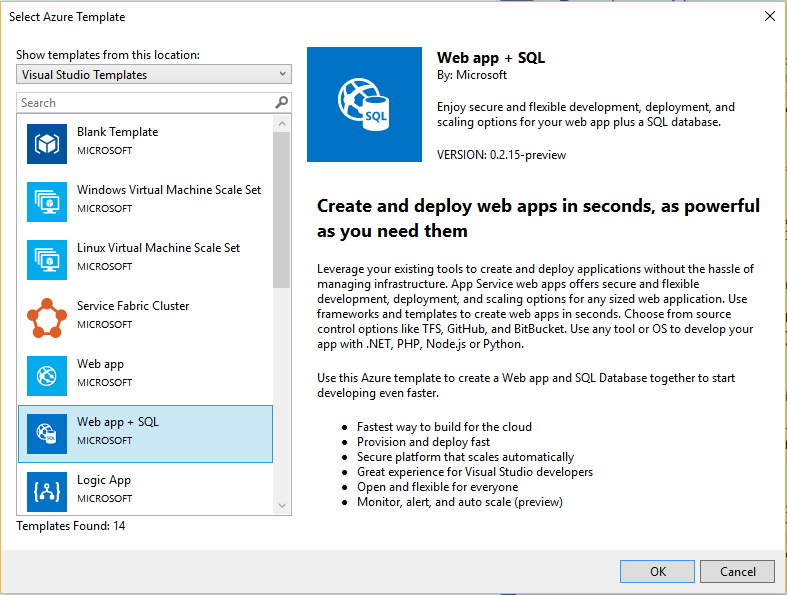  

   
    选择的模板只是起点；你可以根据方案添加和删除资源。
   
    > [AZURE.NOTE]
    Visual Studio 将在线检索可用模板的列表。该列表可能会更改。
    > 
    > 
   
    Visual Studio 将创建 Web 应用和 SQL 数据库的资源组部署项目。
3. 若要查看创建的内容，请展开部署项目中的节点。
   
    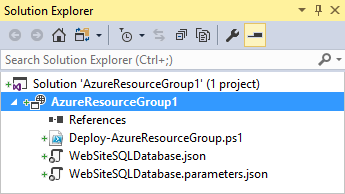  

   
    我们为此示例选择了 Web 应用 + SQL 模板，因此，会看到以下文件：
   
    | 文件名 | 说明 |
    | --- | --- |
    | Deploy-AzureResourceGroup.ps1 |一个 PowerShell 脚本，可通过调用 PowerShell 命令来部署到 Azure Resource Manager。 **注意** Visual Studio 使用此 PowerShell 脚本来部署模板。对此脚本进行更改会影响 Visual Studio 中的部署，因此请小心。|
    | WebSiteSQLDatabase.json |Resource Manager 模板（用于定义需部署到 Azure 的基础结构，以及可以在部署过程中提供的参数。它还定义各资源之间的依赖关系，以便 Resource Manager 按正确的顺序部署资源。|
    | WebSiteSQLDatabase.parameters.json |一个参数文件，其中包含模板所需的值。需要传入这些参数值来自定义每个部署。|
   
    所有资源组部署项目都包含这些基本文件。其他项目可能包含其他文件以支持其他功能。

## 自定义 Resource Manager 模板
可以通过修改 JSON 模板（描述要部署的资源）来自定义部署项目。JSON 是“JavaScript 对象表示法”的缩写，是一种易于使用的序列化数据格式。JSON 文件使用在每个文件顶部引用的架构。如果想要了解该架构，可以下载并分析它。架构定义所允许的元素、字段的类型和格式、可能的枚举值，等等。若要了解 Resource Manager 模板的元素，请参阅 [Authoring Azure Resource Manager templates](/documentation/articles/resource-group-authoring-templates/)（创作 Azure Resource Manager 模板）。

若要使用模板，请打开 **WebSiteSQLDatabase.json**。

Visual Studio 编辑器提供了工具来帮助编辑 Resource Manager 模板。“JSON 大纲”窗口可让你轻松查看模板中定义的元素。

在大纲中选择任一元素会转到模板的该部分，并且突出显示相应的 JSON。

可以通过选择“JSON 大纲”窗口顶部的“添加资源”按钮，或右键单击“资源”然后选择“添加新资源”，来添加资源。

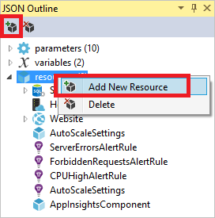

对于本教程，请选择“存储帐户”并指定其名称。提供一个长度不超过 11 个字符并且仅包含数字和小写字母的名称。

  

请注意，不仅会添加资源，而且还添加存储帐户类型的参数，以及存储帐户名称的变量。

**storageType** 参数是使用允许的类型和默认类型预定义的。你可以保留或根据方案编辑这些值。如果不希望任何人通过此模板部署 **Premium\_LRS** 存储帐户，可从允许的类型中将其删除。

    "storageType": {
      "type": "string",
      "defaultValue": "Standard_LRS",
      "allowedValues": [
        "Standard_LRS",
        "Standard_ZRS",
        "Standard_GRS",
        "Standard_RAGRS"
      ]
    }

Visual Studio 还提供了 Intellisense 来帮助你了解编辑模板时可以使用哪些属性。例如，若要编辑应用服务计划的属性，请导航到 **HostingPlan** 资源，并为 **properties** 添加值。请注意，Intellisense 显示可用的值，并提供该值的描述。

可以将 **numberOfWorkers** 设置为 1。

    "properties": {
      "name": "[parameters('hostingPlanName')]",
      "numberOfWorkers": 1
    }

## 将资源组部署到 Azure
现在你已准备好部署项目。部署 Azure 资源组项目时，请将其部署到 Azure 资源组。资源组是共享同一生命周期的资源的逻辑分组。

1. 在部署项目节点的快捷菜单中，选择“部署”>“新建部署”。
   
    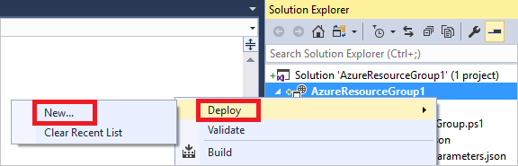
   
    此时将显示“部署到资源组”对话框。
   
    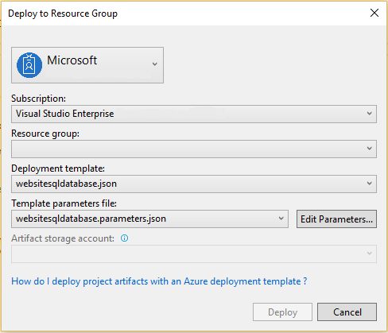
2. 在“资源组”下拉框中，选择现有资源组或创建新资源组。若要创建资源组，请打开“资源组”下拉框，然后选择“新建”。
   
    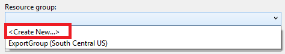
   
    此时将显示“创建资源组”对话框。指定组名称与位置，然后选择“创建”按钮。
   
    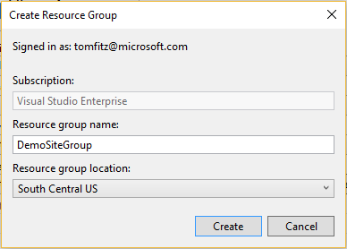  

3. 选择“编辑参数”按钮，编辑部署的参数。
   
    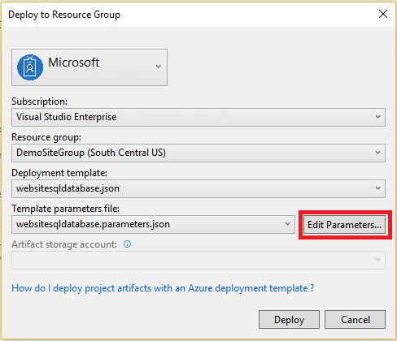  

4. 提供空参数的值，然后选择“保存”按钮。空参数包括 **hostingPlanName**、**administratorLogin**、**administratorLoginPassword** 和 **databaseName**。
   
    **hostingPlanName** 指定要创建的[应用服务计划](/documentation/articles/azure-web-sites-web-hosting-plans-in-depth-overview/)的名称。
   
    **administratorLogin** 指定 SQL Server 管理员的用户名。不要使用类似 **sa** 或 **admin** 的常见管理员名称。
   
    **administratorLoginPassword** 指定 SQL Server 管理员的密码。“将密码以纯文本格式保存在参数文件中”选项不安全；因此，请不要选择此选项。密码没有以纯文本格式保存，因此，需要在部署期间再次提供此密码。
   
    **databaseName** 指定要创建的数据库的名称。
   
    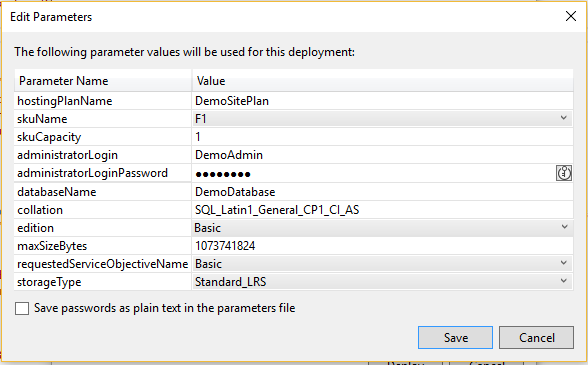  

5. 选择“部署”按钮将项目部署到 Azure。PowerShell 控制台会在 Visual Studio 实例外部打开。出现提示时，在 PowerShell 控制台中输入 SQL Server 管理员密码。**PowerShell 控制台可能会隐藏在其他项后面，或在任务栏中最小化。** 查找此控制台，然后选择它来提供密码。
   
    > [AZURE.NOTE]
    Visual Studio 可能会要求安装 Azure PowerShell cmdlet。需要安装 Azure PowerShell cmdlet 才能成功部署资源组。如果出现提示，请安装 Azure PowerShell cmdlet。
    > 
    > 
6. 部署可能需要几分钟的时间。在“输出”窗口中，可以看到部署的状态。完成部署后，最后一条消息使用类似如下的内容指示部署成功：
   
        ... 
        18:00:58 - Successfully deployed template 'c:\users\user\documents\visual studio 2015\projects\azureresourcegroup1\azureresourcegroup1\templates\websitesqldatabase.json' to resource group 'DemoSiteGroup'.
7. 在浏览器中，打开 [Azure 门户](https://portal.azure.cn/)并登录帐户。若要查看资源组，请选择“资源组”，然后选择部署到的资源组。
   
    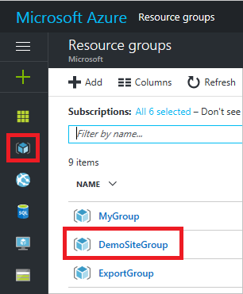
8. 将显示所有已部署的资源。请注意，存储帐户的名称与添加该资源时指定的名称不完全匹配。存储帐户必须是唯一的。模板会自动将字符的字符串添加到提供的名称，以提供唯一的名称。
   
    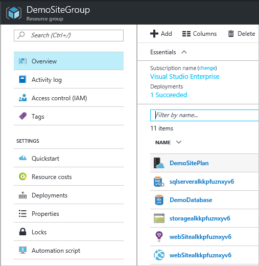  

9. 如果做了更改并想要重新部署项目，可以从 Azure 资源组项目的快捷菜单中选择现有资源组。在快捷菜单中，选择“部署”，然后选择部署的资源组。
   
    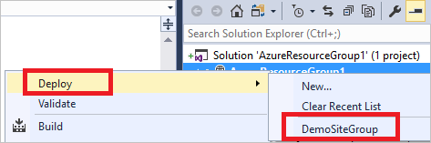

## 将代码与基础结构一起部署
此时，你已为应用部署基础结构，但尚未在项目中部署实际代码。本主题说明如何在部署期间部署 Web 应用和 SQL 数据库表。如果是部署虚拟机而不是 Web 应用，你需要在部署过程中，在计算机上运行一些代码。为 Web 应用部署代码的过程与设置虚拟机的过程几乎相同。

1. 将项目添加到 Visual Studio 解决方案。右键单击该解决方案，然后选择“添加”>“新项目”。
   
    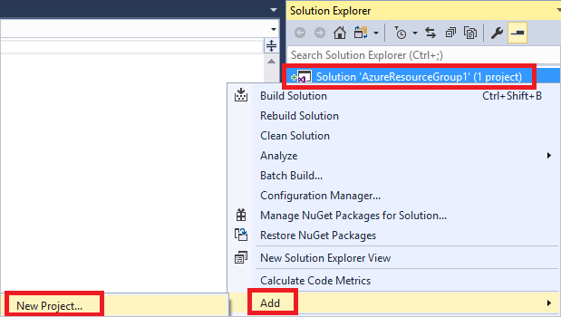  

2. 添加 **ASP.NET Web 应用程序**。
   
    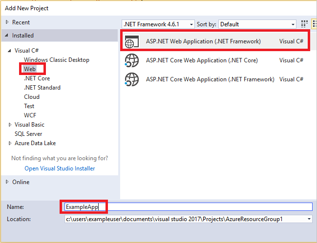  

3. 选择“MVC”并清除“云中的主机”字段，因为资源组项目将执行该任务。
   
    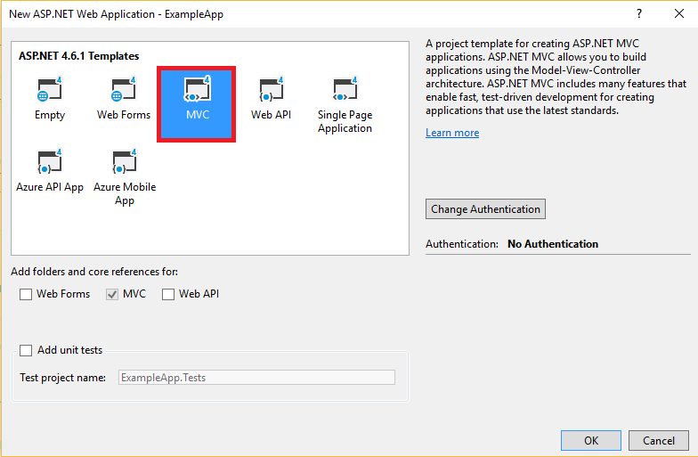  

4. Visual Studio 创建 Web 应用后，会在解决方案中看到这两个项目。
   
    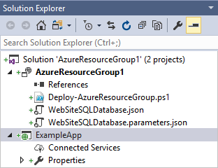  

5. 现在，需要确保资源组项目知道存在新项目。返回资源组项目 (AzureResourceGroup1)。右键单击“引用”，然后选择“添加引用”。
   
      

6. 选择创建的 Web 应用项目。
   
    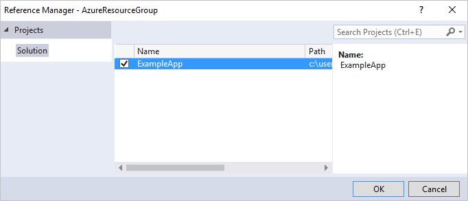  

   
    通过添加引用，可以将 Web 应用项目链接到资源组项目中，并自动设置三个重要属性。可以在“属性”窗口中看到这些用于引用的属性。
   
      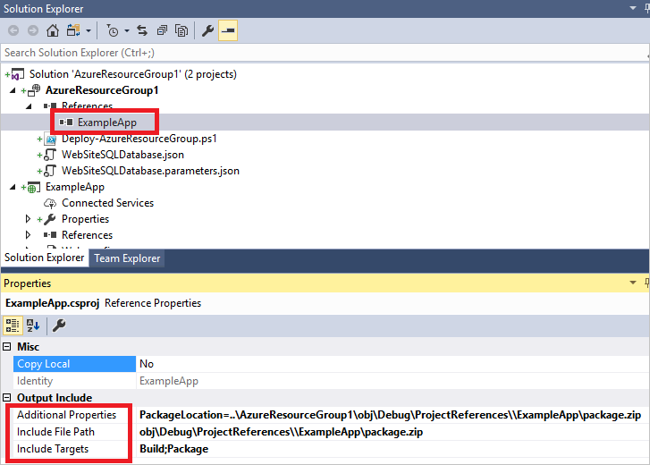  

   
    属性包括：
   
   * “其他属性”包含要推送到 Azure 存储的 Web 部署包暂存位置。请注意文件夹 (ExampleApp) 和文件 (package.zip)。部署应用时，会提供这些值作为参数。
   * “包含文件路径”包含创建包所在的路径。“包含目标”包含部署执行的命令。
   * 默认值“生成并打包”可让部署生成并创建 Web 部署包 (package.zip)。
     
     不需要使用发布配置文件，因为部署将从属性中获取所需的信息来创建包。
7. 将资源添加到模板。
   
      

8. 这次请选择“适用于 Web 应用的 Web 部署”。
   
    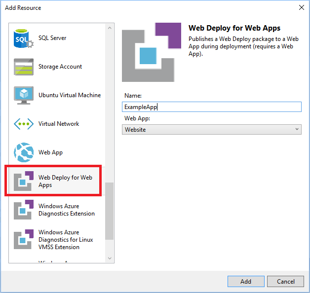  

9. 将资源组项目重新部署到资源组。这次还有一些新的参数。不需要为 **\_artifactsLocation** 或 **\_artifactsLocationSasToken** 提供值，因为 Visual Studio 会自动生成这些值。但是，必须将文件夹和文件名称设置为包含部署包的路径（在下图中显示为 **ExampleAppPackageFolder** 和 **ExampleAppPackageFileName**）。提供之前在引用属性中看到的值（**ExampleApp** 和 **package.zip**）。
   
      

   
    对于“项目存储帐户”，请选择部署此资源组时所用的帐户。
10. 部署完成后，请在门户中选择 Web 应用。选择 URL，浏览到站点。
    
       

11. 请注意，已成功部署默认的 ASP.NET 应用。
    
       

## 后续步骤
* 若要了解如何通过门户管理资源，请参阅[使用 Azure 门户管理 Azure 资源](/documentation/articles/resource-group-portal/)。
* 若要详细了解模板，请参阅 [Authoring Azure Resource Manager templates](/documentation/articles/resource-group-authoring-templates/)（创作 Azure Resource Manager 模板）。

<!---HONumber=Mooncake_1219_2016-->