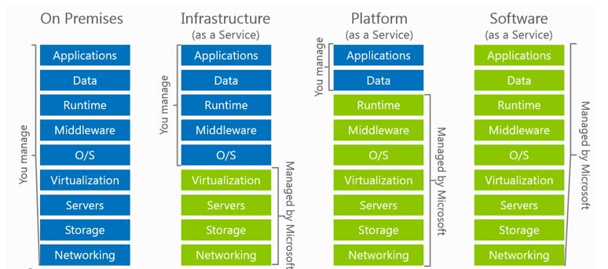

<properties
   pageTitle="有关 Azure IaaS 上软件更新的最佳实践 | Azure"
   description="本文提供了有关 Azure IaaS 环境中软件更新的最佳实践集合。本文面向每天要进行变更控制、软件更新和资产管理的 IT 专业人员和安全分析人员（包括负责其组织安全和合规性工作的人员）。"
   services="virtual-machines, cloud-services, storage"
   documentationCenter="na"
   authors="YuriD"
   manager="swadhwa"
   editor=""
   tags="azure-service-management,azure-resource-manager"/>

<tags
   ms.service="azure-security"
   ms.date="05/11/2016"
   wacn.date="06/13/2016"/>

#有关 Azure IaaS 上软件更新的最佳实践

在学习 Azure IaaS 环境的任何最佳实践深入探讨之前，请务必了解用于管理软件更新的方案。下图可帮助你了解这些方案：

在整个基础结构位于本地的传统数据中心模型中，你需要承担管理操作系统、应用程序、网络设备（路由器、交换机等）和硬件（固件）更新的全部责任。在 IaaS 方案中，你仍然需要管理操作系统和应用程序的更新；但是，操作系统和应用程序下面的整个基础结构将由 Microsoft 管理。在所有这些模型中，客户仍是其数据的所有者且仍必须负责在终结点级别保护数据。

在 PaaS 方案中，你对软件更新所负的责任比较少，因为操作系统的更新是 Microsoft 的责任。在 SaaS 方案中，整个堆栈的软件更新责任由 Microsoft 承担。

这些原则在混合方案中同样适用。在混合方案中，公司将使用 Azure IaaS VM 与本地资源通信，如下图所示。

## 初始评估

即使公司已采用更新管理系统，并且已采用软件更新策略，也必须经常检查前面的策略评估并根据当前的要求进行更新。这意味着你需要熟悉公司中资源的当前状态。若要达到此状态，你需要知道：

-   企业中的物理和虚拟计算机。

-   这些物理和虚拟计算机所运行的操作系统和版本。

-   每台计算机当前安装的软件更新（Service Pack 版本、软件更新和其他修改）。

-   每台计算机在企业中执行的功能。

-   在每台计算机上运行的应用程序和程序。

-   每台计算机的所有权和联系人信息。

-   环境中存在的资产，以及用来判断哪些区域需要最大关注和保护的相对值。

-   已知的安全问题，以及企业在安全级别用于识别新安全问题或更改的过程。

-   为了保护环境而部署的应对措施。

你应该定期更新此信息，并且此信息应该可随时提供给那些参与软件更新管理过程的人员使用。

## 建立基准

软件更新管理过程中的重要部分就是为企业中的计算机创建操作系统版本、应用程序和硬件的初始标准安装；这些措施称为基准。基准是在特定时间点建立的产品或系统配置。例如，应用程序或操作系统基准可让你将计算机或服务重建到特定状态。

基准可以减少必须在企业中部署的软件更新数目并提高监视合规性的能力，从而提供查找及修复潜在问题的基础并简化软件更新管理过程。

在执行企业的初始审核之后，你应该使用取自审核的信息来定义生产环境中 IT 组件的操作基准。根据生产环境中部署的各种硬件和软件，可能需要许多的基准。

例如，某些服务器需要软件更新，以免在运行 Windows Server 2012 过程中进入关机过程时挂起。这些服务器的基准应该包含此软件更新。

在大型组织中，这通常有助于将企业中的计算机划分为各种资产类别，并使用相同版本的软件和软件更新来使每个类别遵循标准基准。然后，你可以在指定软件更新分发优先级时使用这些资产类别。

## 订阅适当的软件更新通知服务

在对企业中所用的软件执行初始审核之后，你应该针对每个软件产品和版本确定用于接收新软件更新通知的最佳方法。根据具体的软件产品，最佳通知方法可能是电子邮件通知、网站或计算机发布内容。

例如，Microsoft 安全响应中心 (MSRC) 会响应 Microsoft 产品的所有安全相关疑虑，并提供 Microsoft 安全公告服务、针对新发现漏洞的免费电子邮件通知，以及为了解决这些漏洞所发布的软件更新。你可以从 http://www.microsoft.com/technet/security/bulletin/notify.mspx 订阅此服务。

## 软件更新注意事项

在对企业中所用的软件执行初始审核之后，你应该根据使用的软件更新管理系统，确定设置软件更新管理系统的要求。对于 WSUS，请参阅 [Windows Server Update Services 最佳实践](https://technet.microsoft.com/zh-cn/library/Cc708536)；对于系统中心，请参阅[在 Configuration Manager 中规划软件更新](https://technet.microsoft.com/zh-cn/library/gg712696)。

但是，无论使用的解决方案为何，都有一些适用的常规注意事项和最佳实践，后面的部分将会介绍。

### 设置环境

在计划设置软件更新管理环境时，请考虑以下实践：

-   **基于稳定准则创建生产软件更新集合**：一般而言，使用稳定准则来创建可供盘点和分发软件更新的集合，有助于简化软件更新管理过程的各个阶段。稳定准则可以包含已安装的客户端操作系统版本和 Service Pack 级别、系统角色或目标组织。

-   **创建包含参考计算机的预生产集合**：预生产集合应该包含操作系统版本、业务线软件以及企业中运行的其他软件的代表性配置。

还应该考虑软件更新服务器的位置：位于云上的 Azure IaaS 基础结构中还是在本地。这是一项重要决策，因为你需要评估本地资源与 Azure 基础结构之间的流量。有关如何将本地基础结构连接到 Azure 的详细信息，请阅读[将本地网络连接到 Azure 虚拟网络](https://technet.microsoft.com/zh-CN/library/Dn786406.aspx)。

根据当前的基础结构以及当前使用的软件更新系统，用于确定更新服务器位置的设计选项会有所不同。对于 WSUS，请参阅[在组织中部署 Windows Server Update Services](https://technet.microsoft.com/zh-cn/library/hh852340.aspx)，对于 System Center Configuration Manager，请参阅[在 Configuration Manager 中规划站点和层次结构](https://technet.microsoft.com/zh-cn/library/Gg712681.aspx)。

### 备份

定期备份很重要，不只是对软件更新管理平台本身而言，对即将更新的服务器而言也是如此。采用[变更管理过程](https://technet.microsoft.com/zh-cn/library/cc543216.aspx)的组织要求 IT 部门合理解释需要更新服务器的原因、预估的停机时间以及可能的影响。为了确保在更新失败时能采用回滚配置，请务必定期备份系统。

Azure IaaS 的某些备份选项包括：

-   [使用 Data Protection Manager 保护 Azure IaaS 工作负荷](https://azure.microsoft.com/blog/2014/09/08/azure-iaas-workload-protection-using-data-protection-manager/)

-   [备份 Azure 虚拟机](/documentation/articles/backup-azure-vms)

### 监视

应该定期运行报告，以针对每个已获授权的软件更新，监视遗漏或已安装的更新数目，或状态不完整的更新。同样，报告未获授权的软件更新可让部署决策变得更容易。

你还应该考虑以下任务：

-   对公司内部所有计算机的适用和已安装安全更新执行审核。

-   授权更新并将其部署到适当的计算机。

-   跟踪公司内所有计算机的库存和更新安装状态与进度。

除了本文中所述的常规注意事项以外，你还应该考虑每个产品的最佳实践，例如：如果 Azure 中有一个装有 SQL Server 的 VM，请确保遵循该产品的软件更新建议。

## 后续步骤

使用本文中所述的指导原则可以帮助判断适用于 Azure IaaS 中虚拟机软件更新的最佳选项。传统数据中心与 Azure IaaS 之间的软件更新最佳实践有许多相似之处，因此建议评估当前的软件更新策略，以包含 Azure VM 并将本文中的相关最佳实践纳入整个软件更新过程。

<!---HONumber=Mooncake_0606_2016-->