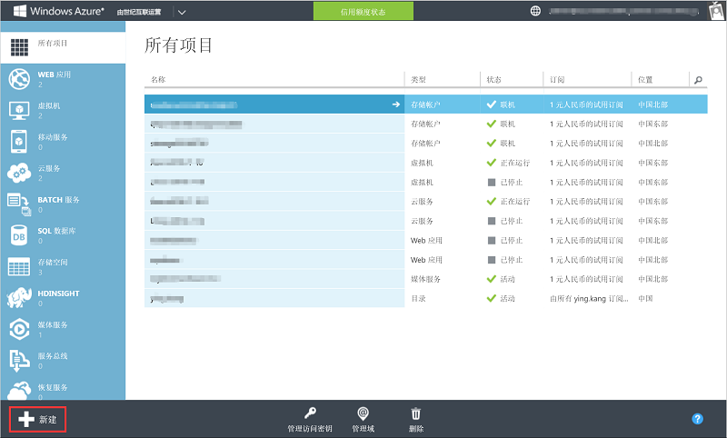
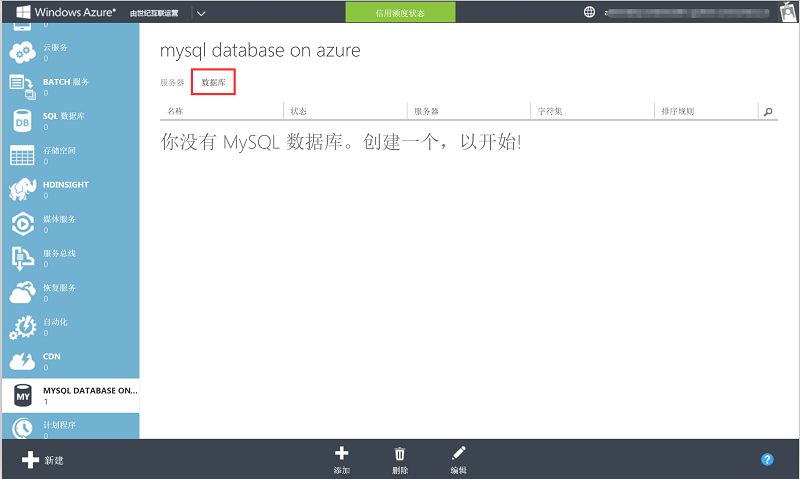
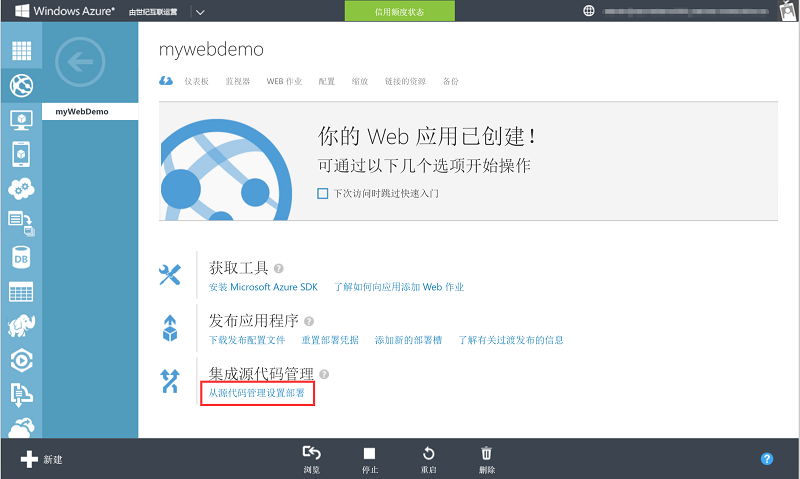

<properties
	pageTitle="MySQL 数据库 + Web 应用操作手册"
    description=""
    services=""
    documentationCenter=""
    authors=""
    manager=""
    editor=""
    tags=""/>

<tags ms.service="multiple" ms.date="" wacn.date="07/26/2016"/>

#MySQL 数据库 + Web 应用操作手册

##Step 1: 创建 MySQL Database on Azure 的数据库服务器

1. 您可以通过 [Azure 经典管理门户](https://manage.windowsazure.cn/)创建您的 MySQL 服务器。 

	
	
	
2. 登陆后，点击左下角“新建”按钮。

	

3. 我们依次选择**数据服务** 、**MYSQL DATABASE ON AZURE** 、**快速创建**，然后填写信息，点击**创建**。

	
	
4. 几秒之内，Azure 已经为我们创建了一个 MySQL Database on Azure 数据库服务器，即 wpdemo。

	
	
##Step 2: 配置防火墙访问设置
	
点击我们刚才创建的 wpdemo 数据库服务器，请确认配置选项卡中允许的服务已经被设置为是，否则可能造成部署失败。 

	
##Step 3: 创建数据库
	
1. 在 MySQL Database on Azure 工作区选择**数据库**选项卡。

	
	
2. 点击**添加**按钮进行数据库的创建。

	
	
3. 点击 **√**，完成新建数据库。

	
	
	
##Step 4: 创建 Web 应用
1. 在管理页面，点击左下角**新建**，创建一个 Web 应用。

	
	
2. 在新建页面，选择**计算** 、**WEB应用**、**快速创建**，新建一个名为 wpdemo 的 Web 应用，点击**创建**。
	
	
	
3. 将所有 WordPress 安装文件部署到刚创建的 Web 应用中，点击我们新建的 wpdemo，进入详细页面。
	
	
	
4. 点击上图中红色标识的从源代码管理设置部署。
	
	
	
5. 这里我们选择本地 Git 存储库（请确保已将 WordPress 加入到了本地 Git 当中）
	
	
	
6. 将本地文件推送至 Azure，完成 WordPress 站点的部署工作，访问 wpdemo 的 URL，浏览站点。
	
	
	 
	更多参考内容：[WordPress 官方网站](https://cn.wordpress.org/)、[从源控件发布到 Azure Web 应用](/documentation/articles/app-service-deploy-local-git/)。

##Step 5: 应用的安装配置

1. 访问部署 Web 应用

	访问之前创建的 Web 应用，进入 WordPress 配置页面，选择所要使用的语言，屏幕将会出现下图中显示的内容。
	
	
	
2. 连接配置 MySQL 数据库

	将第三步所创建数据库的详细配置信息填入下图界面中。

	
	
	当您看到下图所示，表示您的 WordPress 与 MySQL 的连接已经成功了。

	
	
	点击进行安装，完成您的 WordPress 部署工作。

###最佳实践

由于在发起连接时，MySQL Database on Azure 会做更多的验证工作，导致发起连接的开销相对于本地数据库更大。对于数据库连接的管理能够显著影响到整个应用程序的性能。为了使您的程序能够达到性能最优，目标是降低发起连接的次数，把发起连接的时间不放在关键的代码路径上。我们强烈建议您使用数据库连接池 (connection pool) 或长连接 (persistent connection) 连接 MySQL Database on Azure。并配置验证机制验证连接池有效。

具体操作可参考： [如何高效连接到 MySQL Database on Azure](/documentation/articles/mysql-database-connection-pool/) 以及 [配置验证机制验证连接池有效](/documentation/articles/mysql-database-validationquery/)。

但需要注意的是，如果您用的是开源的网站应用平台，如 wordpress, drupal, 该平台默认使用短连接，难以更改源码，因而此部分最佳实践可能失效。

##扩展服务: 

###1. Redis 缓存扩展

如果您的网站运行过程中负载较高，我们推荐您使用 Azure Redis 缓存做扩展部署，它能够实现您的网站进行高吞吐量、低延迟的数据访问 ，极大提升应用程序响应性和用户体验。参考配置文档：[将 Azure 中的 Web 应用连接到 Redis 缓存](/documentation/articles/web-sites-connect-to-redis-using-memcache-protocol/)。

###2. CDN 扩展

如果您的网站用户分布地域比较广、需要向不同网络运营商提供服务覆盖、存在文件下载（例如软件安装包、影音文件等）分发的业务需求，建议您的 Web 应用搭配 Azure CDN 扩展部署，将用户请求分配到最优节点，优化用户享受高速网络访问的体验。参考配置文档：[Web 加速 CDN 节点创建](/documentation/articles/cdn-how-to-create-Web-CDN-endpoint/)。

##常见问题与相关文档 

* [关于 MySQL on Azure 服务的常见问题](/documentation/articles/mysql-database-tech-faq/)
* [关于 MySQL on Azure 服务入门指南](/documentation/articles/mysql-database-get-started/)
* [MySQL on Azure 服务导入导出指导](/documentation/articles/mysql-database-migration/)
* [关于 Web 应用的相关技术文档](/documentation/services/web-sites/)

