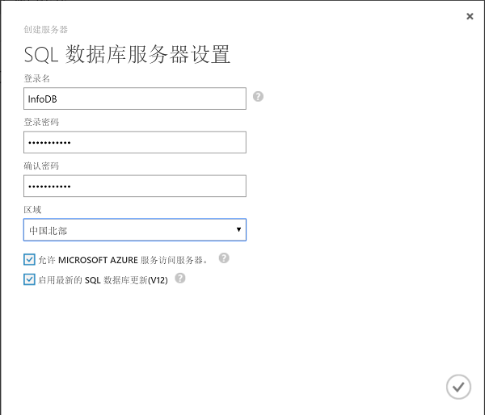
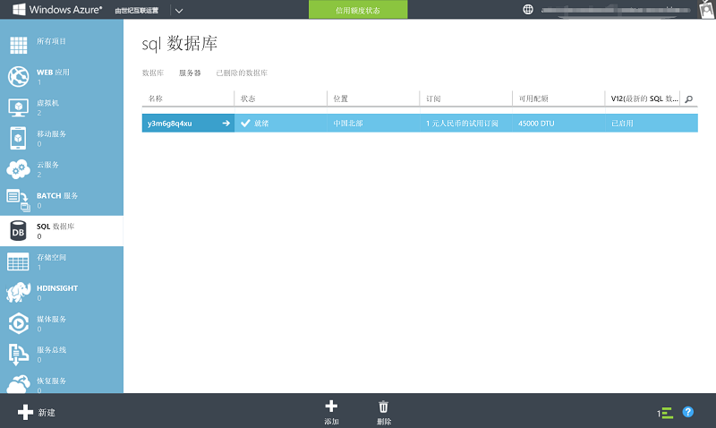
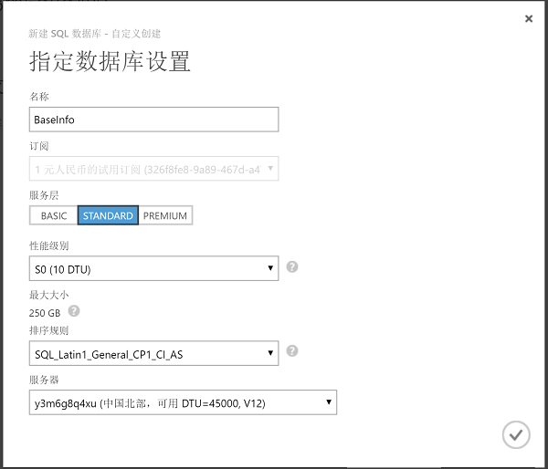
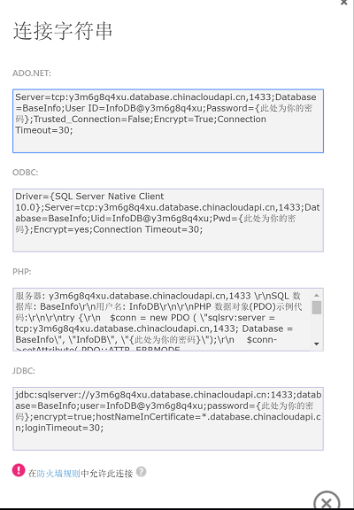
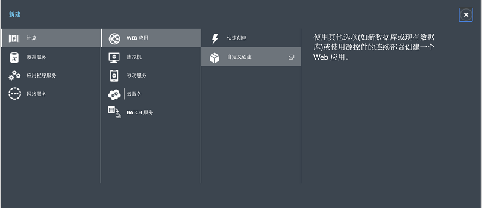
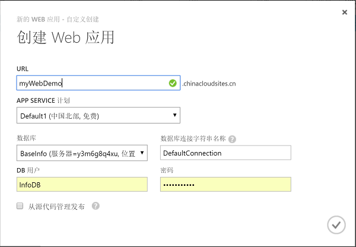

<properties
	pageTitle="SQL 数据库 + Web 应用操作手册"
    description="SQL 数据库 + Web 应用操作手册"
    services=""
    documentationCenter=""
    authors=""
    manager=""
    editor=""
    tags=""/>

<tags ms.service="multiple" ms.date="" wacn.date="07/26/2016"/>

#SQL 数据库 + Web 应用操作手册

##Step 1: 在 Azure 上创建一个 SQL 数据库服务器

1. 您可以通过 [Azure 经典管理门户](https://manage.windowsazure.cn/)创建您的 SQL 服务器。
	
	
	
2. 登陆后，在 SQL 数据库页面中，选择**服务器**选项卡，进入 SQL 数据库服务器列表页面。
	
	
	
3. 点击**添加**按钮，新建一个 SQL 数据库服务器。
	
	
	
4. 点击 √，只需几秒即可创建完成，服务器的名字是 Azure 随机分配的，不能更改。

	
	
##Step 2: 配置 IP 和防火墙访问设置

接下来我们要对 SQL 服务器进行配置，点击进入我们新建的服务器，选择**配置选项卡**。我们要把自己当前的 IP 地址加到防火墙规则里，IP 地址支持单个的，也支持地址段，可以根据实际的需要设置。点击**保存**，完成设置。

	
	
##Step 3: 创建 SQL 数据库

1. 进入我们新建的 SQL 数据库服务器，选择**数据库**选项卡。
	
	
	
2. 击创建 SQL 数据库，新建一个 SQL 数据库。
	
	
	
3. 点击 √，完成 SQL 数据库创建。
	
	
	
##Step 4: 准备数据库连接字符串
	
1. 点击进入我们 Step 3 创建的 SQL 数据库，点击**链接到你的数据库**。
	
	
	
2. 可以看到 Azure SQL 数据库为我们生成了 ADO .Net、ODBC、PHP 和 JDBC 四种连接字符串，您可以按需选择类型进行您的 Web 数据库连接配置，方便快捷。

	
	
##Step 5: 部署 Web 应用

1. 点击**新建**、**计算**、**WEB 应用**。
	
	
	
2. 点击**自定义创建**，新建 Web 应用. 
	
	
	
3. 这里我们可以直接选择上文已经创建好的 SQL 数据库，Azure 会自动帮你配置连接。
	
	
	
4. 点击 √，完成 Web 应用创建。
	
	
	
	至此，我们就完成了在 Azure 上创建一个 SQL 服务器和一个连接到这个 SQL 服务器的 Web 应用。 部署应用到 Azure 详见[将应用部署到  Azure](/documentation/articles/web-sites-deploy/)
	 
##扩展服务 

###1. Redis 缓存扩展

如果您的网站运行过程中负载较高，我们推荐您使用 Azure Redis 缓存做扩展部署，它能够实现您的网站进行高吞吐量、低延迟的数据访问 ，极大提升应用程序响应性和用户体验。参考配置文档：[将 Azure 中的 Web 应用连接到 Redis 缓存](/documentation/articles/web-sites-connect-to-redis-using-memcache-protocol/)。

###2. CDN 扩展

如果您的网站用户分布地域比较广、需要向不同网络运营商提供服务覆盖、存在文件下载（例如软件安装包、影音文件等）分发的业务需求，建议您的 Web 应用搭配 Azure CDN 扩展部署，将用户请求分配到最优节点，优化用户享受高速网络访问的体验。参考配置文档：[Web 加速 CDN 节点创建](/documentation/articles/cdn-how-to-create-Web-CDN-endpoint/)。

##常见问题与相关文档

* [SQL 数据库入门指导](/documentation/articles/sql-database-get-started/)
* [SQL Server 数据库的迁移指南](/documentation/articles/sql-database-cloud-migrate/)
* [SQL 数据库常见问题](/documentation/articles/sql-database-faq/)

