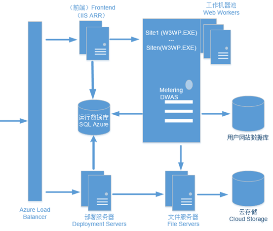
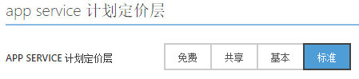
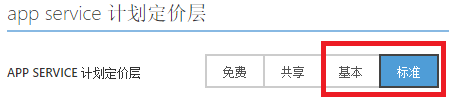
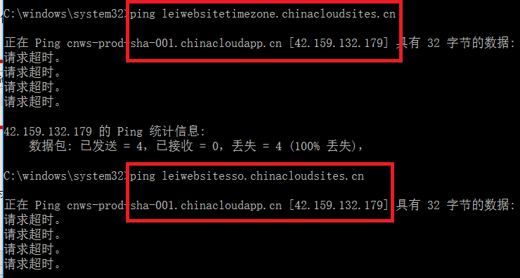
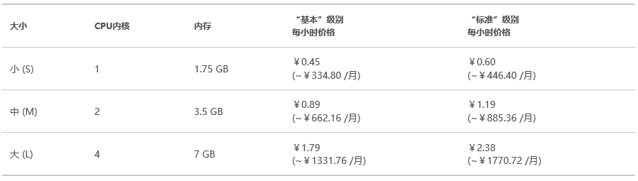
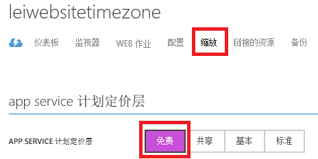

<properties
	pageTitle="Azure Web 应用用户手册 - 第一部分 | Azure"
	description="详细介绍如何创建和管理 Azure Web 应用。"
	services="app-service-web"
	documentationCenter=""
	authors="Lei Zhang"
	manager=""
	editor=""/>

<tags
	ms.service="app-service-web"
	ms.date=""
	wacn.date="07/07/2016"/>

# Azure Web 应用用户手册 - 第一部分

- [Azure Web 应用用户手册 - 第二部分](/documentation/articles/azure-web-apps-user-manual-part2/)
- [Azure Web 应用用户手册 - 第三部分](/documentation/articles/azure-web-apps-user-manual-part3/)

## 1. Azure Web 应用相关服务
### 1.1 Azure Web 应用的带宽问题
在中国，互联网接入带宽的费用是非常昂贵的, 大约是美国的 20 倍。独享带宽的价格显而易见是非常昂贵的。 适合云计算的场景包括：开关模式、爆发增长模式等。显然购买独享带宽不能体现云计算弹性的优势。如果购买了独享的带宽的情况下，客户用不用云计算，带宽成本也是必须支付的。假设用户购买了200M 独享带宽，结果项目上线后发现用户量很少，互联网带宽闲置了，但是这 200M 带宽费用还是必须支付的。 Azure 带宽虽然是共享带宽，却是随着负载均衡服务器的数量增加而逐渐增加的。 当实际项目上线后发现互联带宽不够，可以把更多的 Azure 虚拟机加入到负载均衡器上。当发现互联网带宽闲置了，则将部分 Azure 虚拟机关闭即可。

例如一个证券行业的客户，在业务高峰期的时候 (股票开市，早上 9：30 - 下午 3点)，利用约 100 台 Azure 虚拟机横向扩展的能力，来处理大量的客户端并发。在业务低谷的时候 (股票休市)，利用少量的 Azure 虚拟机横向扩展，用来节省成本。Azure 具备 Auto Scaling 的能力，可以按照计划任务开启或者关闭多台 Azure 虚拟机，整个过程都是自动化完成的。) 这种横向扩展的方式比以往购买固定带宽的成本要大大的减少。这种 Azure 虚拟机动态增加/减少的优势，可以帮助客户极大的减少成本。

### 1.2 什么是 Azure Web 应用
在开发 Web 应用程序的时候，都需要 IT 人员准备 Windows OS 或者 Linux OS 的 Web Server，安装相应的 Web 组件，比如 IIS, Tomcat 等。然后开发人员把相应的代码部署到 Web Server 上并进行配置。

对于 IT 运维人员来说，Web Server 是 IaaS (Infrastructure-as-a-Service，基础设置即服务)，IT 运维人员需要维护 Web Server 的操作系统等内容。

对于开发人员来说，Web Server 是 PaaS (Platform-as-a-Service，平台即服务)，开发人员只需要维护 Web Application 即可。底层的操作系统等交给 IT 运维人员。

同理，Azure Web 应用提供 PaaS 服务。开发人员只需要把开发的代码直接部署到 Azure Web 应用，无需管理操作系统，降低了管理的成本。

### 1.3 Azure Web 应用支持的开发语言
Azure Web 应用支持的开发语言包括：.NET, Java, PHP, Python, Node.js。

### 1.4 Azure Web 应用架构
Azure Web 应用是一个多租户的环境。Azure Web 应用架构借鉴了 Microsoft Web Farm Framework 的设计。它由 5 个最基本的核心组件构成。

 
1.	**网站工作服务器 (Web Worker)**

	客户的网站运行在网站工作服务器。每个部署单元通常有上千台网站工作服务器。可以简单的认为一台网站工作服务器就是一台 IIS 服务器。每台服务器上可能同时运行很多客户的网站。客户也可以要求自己的网站同时运行几个实例，Azure Web 应用提供负载均衡服务。工作服务器上安装有运行客户网站必需的语言环境和各种框架。包括：

	* (1)	IIS
	* (2)	.Net Framework
	* (3)	PHP
	* (4)	Node.js
	* (5)	Python
	* (6)	WebDeploy/GIT
	* (7)	数据访问组件，比如 Microsoft Data Access Component 和 MySQL 的数据驱动程序

2.	**前端服务器 (Frontend)**

	前端服务器是 Azure Web 应用系统的入口服务器。每个部署单元通常有多台前端服务器。Azure 负载均衡设备负责把客户的请求分发到前端服务器。前端服务器上安装有扩展的 IIS Application Request Routing(ARR)。 IIS ARR 是一个工作在 HTTP 层的负载均衡组件，它是前端服务器的最重要的组件。可阅读[这篇文章](http://www.iis.net/downloads/microsoft/application-request-routing)帮助您更好的理解前端服务器的工作原理。

	前端服务器主要提供三个功能：

	* (1)	请求转发功能。将客户的请求转发到对应的工作服务器，并将工作服务器的响应转发给客户端。
	* (2)	负载均衡功能。如果客户网站有多个实例在运行，前端服务器根据配置的负载均衡算法将客户请求分发到各个网站实例。
	* (3)	分配工作服务器。当第一个请求到达时，前端服务器根据工作服务器的负载情况选择当前负载最低的工作服务器分配给客户。

3.	**部署服务器 (Publishing Server)**

	Azure Web 应用提供多种部署方式，比如 GIT，WebDeploy，FTP 等。只有 FTP 部署通过部署服务器完成。同时，FTP 提供了诊断日志下载功能。GIT 和 WebDeploy 直接通过客户网站本身完成部署任务。

4.	**文件服务器 (File Server)**

	文件服务器通过 Azure 云存储提供文件服务，包括客户网站文件，配置文件，诊断日志和临时文件等。客户的网站文件保存在文件服务器，工作服务器通过 UNC 共享路径的方式访问网站文件。

5.	**运行时数据库 (Runtime Database)**

	运行时数据库存储有客户网站数据，配置等信息，同时保存客户资源使用情况。

### 1.5 Azure Web 应用会话保持
在 [1.4 节](#section_3_4) 中，已经介绍了，Azure 负载均衡设备负责把客户的请求分发到前端服务器。前端服务器上安装有扩展的 IIS Application Request Routing(ARR)。IIS ARR 默认提供 Sticky-Session 功能，保证会话的保持，实现方式是利用 Affinity Cookie。

具体请参考[这篇博客](https://azure.microsoft.com/en-us/blog/disabling-arrs-instance-affinity-in-windows-azure-web-sites/)。

### 1.6 Azure Web 应用文件同步
在 Azure IaaS 虚拟机中，VM 与 VM 之间文件是使用不同的 Azure VHD，所以 VM 与 VM 之间的同步问题需要用户自己解决。

在 Azure Web 应用架构中，多个 Web 应用实例是采用共享磁盘的方式 (XDrive)，所以用户无需考虑多个 Web 应用实例之间的文件同步。

### 1.7 Azure Web 应用如何解决大并发
建议使用多台 Azure Web 应用，利用横向扩展的方式来解决大量的并发。

单个节点向上扩展是有限的，因为受限于现有的 CPU 制造技术，无法将大量的计算资源都堆积到 1 台 300 Core 甚至 400 Core 的计算节点上。对于需要大量的计算资源的情况下，可以通过横向扩展的方法来解决。

所谓横向扩展，就是由 1 个计算节点，横向扩展到多个计算节点上并行计算，如 50 个、100 个计算节点。例如一个互联网业务需要大量的计算资源，那可以将这些计算需求由 100 台 4 Core 的计算节点进行并行计算。

### 1.8 Azure Web 应用单个实例大小
熟悉 Azure IaaS 平台的都知道，Azure 单个虚拟机计算能力分为：A 系列 (A0-A7) 和 D 系列 (D1-D14)，对应不同的 CPU 和内存的计算能力。

对于 Azure Web 应用来说，单个计算实例分为三种不同的类型

* (1)	小型，配置为：单核心，1.75GB 内存
* (2)	中型，配置为：双核心，3.5GB 内存
* (3)	大型，配置为：四核心，7GB 内存

>[AZURE.NOTE]
>如果您开发的 Web Application，单个实例需要运行的最小计算单元大于 4Core/7GB (对应 Web 应用单台最高配置大型，4Core/7GB)，则这个 Web Application 不适合部署在 Azure Web 应用 PaaS 平台。

### 1.9 Azure Web 应用服务类型
Azure Web 应用提供四种不同的服务类型，如下图：

 
这四种不同的服务类型区别如下：

<table border="1">
<thead>
<tr>
<th></th>				<th>免费</th>			<th>共享</th>		<th>基本</th>				<th>标准</th>
</tr>
</thead>
<tbody>
<tr>
<td>网站</td>			<td>10</td>				<td>100</td>		<td>无限制</td>				<td>无限制</td>
</tr>
<tr>
<td>存储</td>			<td>1GB</td>			<td>1GB</td>		<td>10GB</td>				<td>50GB</td>
</tr>
<tr>
<td>出数据中心流量</td>	<td>每天最多 165MB</td>	<td>无限制</td>		<td>无限制</td>				<td>无限制</td>
</tr>
<tr>
<td>计算实例</td>		<td>共享</td>			<td>共享</td>		<td>专用</td>				<td>专用</td>
</tr>
<tr>
<td>自定义域支持</td>		<td>不支持</td>			<td>支持</td>		<td>支持</td>				<td>支持</td>
</tr>
<tr>
<td>自定义 SSL 支持</td>	<td>不支持</td>			<td>不支持</td>		<td></td>					<td>包含 5 个 SNI SSL 和 1 个 IP SSL 连接</td>
</tr>
<tr>
<td>横向扩展实例数</td>	<td>不支持</td>			<td>6 个共享实例</td>	<td>3 个专用实例</td>			<td>10 个专用实例</td>
</tr>
<tr>
<td>自动扩展</td>		<td>不支持</td>			<td>不支持</td>		<td>不支持</td>				<td>支持</td>
</tr>
<tr>
<td>服务级别</td>		<td>不支持</td>			<td>不支持</td>		<td>99.9%</td>	<td>99.9%</td>
</tr>
</tbody>
</table>

更详细的服务类型比较，请参考 Azure 中国 [官网](/home/features/web-site/pricing/) 

这四种服务类型的区别如下：

1.	免费 (Free)

	* (1)	如果在免费 (Free) 模式下，客户的计算资源是和其他用户共享的，不是独享的。也就是说，免费 Web 应用的资源是和别的用户共享 CPU
	* (2)	一个 Azure 账户最多只能创建 10 个类型为免费的 Azure Web 应用
	* (3)	在免费模式下，一个 Azure Web 应用每天仅有 60 分钟的 CPU 计算时间
	* (4)	在免费模式下，一个 Azure Web 应用最多能使用的存储大小为 1GB
	* (5)	在免费模式下，Azure Web 应用不支持横向扩展功能
	* (6)	在免费模式下，Azure Web 应用是没有服务级别协议保障的

2.	共享 (Shared)

	* (1)	如果在共享 (Shared) 模式下，客户的计算资源是和其他用户共享的，不是独享的。也就是说，共享 Web 应用的资源是和别的用户共享 CPU。
	* (2)	一个 Azure 账户最多只能创建 100 个类型为共享的 Azure Web 应用
	* (3)	在共享模式下，一个 Azure Web 应用最多能使用的存储大小为 1GB
	* (4)	在共享模式下，一个 Azure Web 应用每天仅有 240 分钟的 CPU 计算时间
	* (5)	在共享模式下，Azure Web 应用支持横向扩展功能，且横向支持最多 6 个共享实例
	* (6)	在共享模式下，Azure Web 应用是没有服务级别协议保障的

3.	基本 (Basic)

	* (1)	如果在基本 (Basic) 模式下，客户的计算资源是独享的
	* (2)	基本模式下，独享的计算资源有三种类型：小型，中型，大型
	* (3)	一个 Azure 账户可以创建无限多个类型为基本的 Azure Web 应用
	* (4)	在基本模式下，一个 Azure Web 应用最多能使用的存储大小为 10GB
	* (5)	在基本模式下，Azure Web 应用支持横向扩展功能，且横向支持最多 3 个独享的实例
	* (6)	在基本模式下，Azure Web 应用支持 99.9% 的服务级别协议

4.	标准 (Standard)

	* (1)	如果在标准 (Standard) 模式下，客户的计算资源是独享的
	* (2)	标准模式下，独享的计算资源有三种类型：小型，中型，大型
	* (3)	一个 Azure 账户可以创建无限多个类型为标准的 Azure Web 应用
	* (4)	在标准模式下，一个 Azure Web 应用最多能使用的存储大小为 50GB
	* (5)	在标准模式下，Azure Web 应用支持横向扩展功能，且横向支持最多 10 个独享的实例
	* (6)	在标准模式下，Azure Web 应用支持99.9%的服务级别协议

 
>[AZURE.NOTE]
>对于 Azure Web 应用来说，需要把 App Service 配置为基本或标准，才能得到 99.9% 的服务级别协议。但是只需要 1 个实例数就有服务级别协议保障，并不需要 2 个或者 2 个以上的实例做高可用性。

### 1.10 Azure Web 应用使用静态资源
有用户会问，即使 Azure Web 应用标准 (Standard) 类型，存储只有 50GB。如果用户的 Web 项目文件包含了很多视频内容，超过 Azure Web 应用最大 50GB 的限制，应该怎么办？

这里建议把 Web 项目文件的静态资源，比如图片、照片、视频等都保存在 Azure 存储里，这样的好处有以下几点：

1.	加快网站部署速度

	去除掉静态资源 (图片、照片、视频) 的 Web 项目文件只包含了源代码信息，文件容量小，上传速度就加快了

2.	静态资源可以直接访问 Azure 存储

	通过将静态内容请求发送到 Azure 存储，将动态内容的请求发送到 Azure 云主机，就可以大大减少云主机独享带宽的压力。

### 1.11 Azure Web 应用公网 IP
Azure PaaS 云服务和虚拟机都有独享的公网 IPV4 地址。

Azure 全球的 IP Range 信息，可以参考[这里](http://www.microsoft.com/en-us/download/details.aspx?id=41653)

国内由世纪互联运营的 Microsoft Azure 的 IP Range 信息，可以参考[这里](http://www.microsoft.com/en-us/download/details.aspx?id=42064)

但是在使用 Azure Web 应用的时候，常常需要固定公网 IPV4 地址。在这种情况下，需要小心对待。

Azure Web 应用是一个多租户的环境，每个部署单元有一个可以通过 Internet 访问的入口 IP (称之为 VIP)。

所有网站的 DNS 都指向该 VIP（配置 IP SSL 除外，采用 IP SSL 可以获得单独的公网入口 IP）。客户端的所有 HTTP 请求都发往该 VIP，Azure 的网络设备/服务负责进行地址转换并将请求转发到 Azure Web 应用的前端服务器。然后，由前端服务器将 HTTP 请求转发到对应的工作服务器。

架构图同 [1.4 节](#section_3_4)，如下：

 
在不使用 IP SSL 的情况下，所有 Azure 用户的 Azure Web 应用的入口公网 IP 地址 (Inbound VIP) 是共享的。

如果客户部署在 Azure Web 应用需要调用外部的网络服务，比如 SQL Azure, MySQL，Bing MAPI API，等。Azure Web 应用使用该 VIP 连接外部服务。部署在同一个部署单元的所有网站在调用外部网络服务时都使用该 VIP。随着网站数目的增加，单一的 VIP 已经不能满足客户的需要。为此，增加了四个出口 VIP（入口 VIP 同时会作为出口 VIP）。具体信息如下：

1.	部署单元：BJB-001 (Azure 北京数据中心)

		Inbound VIP :42.159.5.43
		Outbound VIPs:
		42.159.4.73
		42.159.4.84
		42.159.4.211
		42.159.4.160

2.	部署单元：SHA-001 (Azure 上海数据中心)

		Inbound VIP: 42.159.132.179
		Outbound VIPs:
		42.159.135.109
		42.159.135.174
		42.159.135.208
		42.159.133.172

如果您的应用程序有 IP 白名单的要求，那么就只需要把上面的部署单元的所有 VIP 加入到允许的 IP 地址列表中。

如何查看 Azure Web 应用部署在 Azure 数据中心的信息。

比如有 2 个真实的应用程序，DNS 信息如下：

 
可以直接使用 ping 命令，如下：

 
可以看到这 2 个 Azure Web 应用的 Inbound VIP 都是 42.159.132.179。

根据上面的部署单元信息，可以查看到这 2 个 Azure Web 应用是部署在上海数据中心的 SHA-001。

以上介绍的是由世纪互联运营的 Microsoft Azure Web 应用 Inbound/Outbound VIP 信息。

如果您使用的是全球的 Azure ([官网](https://www.azure.com/))，具体的 Azure Web 应用 Inbound/Outbound IP 请参考这个[链接](https://social.msdn.microsoft.com/Forums/azure/en-US/fd53afb7-14b8-41ca-bfcb-305bdeea413e/maintenance-notice-upcoming-changes-to-increase-capacity-for-outbound-network-calls?forum=windowsazurewebsitespreview)

### 1.12 Azure Web 应用成本分析
Azure Web 应用提供四种不同的服务类型：

 
1.	免费 (Free)

	* (1)	在免费模式下，客户的 Web 应用是不收取费用的。但是每一个 Azure Web 应用每天仅有 60 分钟的 CPU 计算时间。
	* (2)	在免费模式下，Azure Web 应用没有服务级别协议保障

2.	共享 (Shared)

	* (1)	共享模式下，Azure Web 应用支持横向扩展功能，且横向支持最多 6 个共享实例。
	* (2)	在共享模式下，一个 Azure Web 应用每天仅有 240 分钟的 CPU 计算时间
	* (3)	在共享模式下，每一个 Web 应用实例的标准价格是每小时 ￥0.11。
	* (4)	在共享模式下，Azure Web 应用没有服务级别协议保障

3.	基本 (Basic) 和标准 (Standard) 收费如下：

以上价格参考 Azure 中国 [官方价格信息](http://www.azure.cn/home/features/web-site/pricing/)

* (1)	在基本模式下，单个小型，中型，大型的 Web 应用实例价格分别为 0.45 元/小时，0.89 元/小时，1.79 元/小时。
* (2)	在基本模式下，如果用多个实例进行横向扩展，则每小时单价会按照实例个数增加。

	比如 2 个 Web 应用小型实例做负载均衡，每小时费用 = 0.45 元 × 2 个实例 = 0.90 元/小时

* (3)	在标准模式下，单个小型，中型，大型的 Web 应用实例价格分别为 0.60 元/小时，1.19 元/小时，2.38 元/小时。
* (4)	在标准模式下，如果用多个实例进行横向扩展，则每小时单价会按照实例个数增加。

	比如 2 个 Web 应用大型实例做负载均衡，每小时费用 = 2.38 元 × 2 个实例 = 4.76 元/小时

* (5)	只有在基本和标准模式下，Azure Web 应用才享受 99.9% 的服务级别协议

### 1.13 Azure Web 应用停止计费
当关闭Azure Web 应用的时候，还是会继续计费的。如下图：

上图中，虽然 Azure Web 应用状态变为 ”已停止”，但是因为定价层是”标准”，所以这个 Azure Web 应用还是会继续计费。
为了避免继续产生费用，请将不再使用的网站实例删除，或将其更改为 ”免费” 级别。如下图：

 
### 1.14 Azure Web 应用限制
1.	单个 Web 应用实例大小

	单个 Azure Web 应用实例最大为大型，配置是 4Core/7GB。如果您开发的 Web 应用，单个实例需要运行的最小计算单元大于 4Core/7GB，则这个 Web 应用不适合部署在 Azure Web 应用 PaaS 平台。

2.	横向扩展能力

	在标准模式下，Azure Web 应用支持横向扩展功能，且横向支持最多 10 个独享的实例

3.	不支持安装软件

	因为无法通过 Windows Remote Desktop 或者 Linux SSH 管理 Azure Web 应用的操作系统，所以 Azure Web 应用不支持自定义安装软件

4.	不支持 Azure Virtual Network 虚拟网络

	在由世纪互联运营的 Microsoft Azure，Azure Web 应用目前不支持加入到 Virtual Network 虚拟网络中，所以访问加入到 Virtual Network 的 Azure VM 虚拟机，必须通过 Azure VM 的公网 IP 或者 DNS 访问。为了保证安全性，建议结合 Access Control List(ACL) 设置一起使用。
