<properties
	pageTitle="Azure Web 应用用户手册 - 第二部分 | Azure"
	description="详细介绍如何创建和管理 Azure Web 应用。"
	services="app-service-web"
	documentationCenter=""
	authors="Lei Zhang"
	manager=""
	editor=""/>

<tags
	ms.service="app-service-web"
	ms.date=""
	wacn.date="07/05/2016"/>

# Azure Web 应用用户手册 - 第二部分

- [Azure Web 应用用户手册 - 第一部分](/documentation/articles/azure-web-apps-user-manual-part1/)
- [Azure Web 应用用户手册 - 第三部分](/documentation/articles/azure-web-apps-user-manual-part3/)

## 2. 开始创建 Azure Web 应用
### 2.1 规划好 Azure 订阅
订阅是进行 Azure 账单分拆的最小单位。

如果企业内部需要进行内部成本核算，例如 IT 部门、销售部门、市场部门均需要使用 Azure，并且根据不同的部门的 Azure 实际使用量进行内部成本核算，就需要实现规划好三个不同的 Azure 订阅。在创建 Azure IaaS 相关资源的时候，将这些资源创建在不同的订阅下。

### 2.2 选择订阅
登陆 Azure [经典管理门户] (https://manage.windowsazure.cn)，输入账户和密码。

点击右上角的订阅按钮，如下图:

 
### 2.3 模拟场景
Contoso 公司已经采购了 Azure 中国的服务，并且开发部门使用 Visual Studio 2013，开发 ASP.NET 应用程序。

在开始以下内容之前，请准备：

1.	Azure 中国账户
2.	Visual Studio 2013

### 2.4 创建一个空的 Azure Web 应用
1.	登录 Azure [经典管理门户](https://manage.windowsazure.cn)
2.	输入相应的用户名和密码
3.	点击 Azure 管理界面左下角的新建图标，如下图：

	

4.	点击计算-> Web 应用->自定义创建，如下图：

	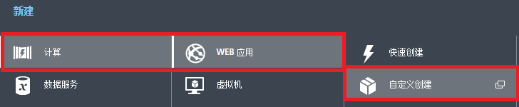

5.	在弹出的界面里，输入 Web 应用的名称，命令为 LeiWebSite。如下图：

	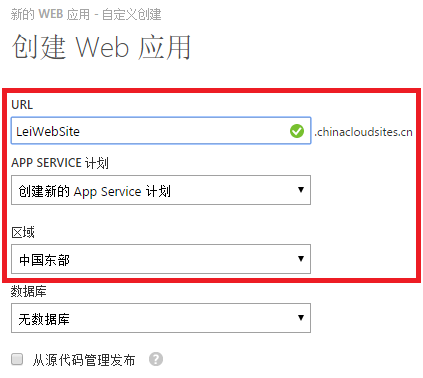

	注意上图中：
	* (1)	URL，输入需要的 DNS 名称
	* (2)	APP Service 计划，选择创建新的 App Service 计划
	* (3)	区域，选择中国东部的数据中心

6.	在弹出的界面里，输入 Web 应用的名称，命令为 LeiWebSite。如下图：

	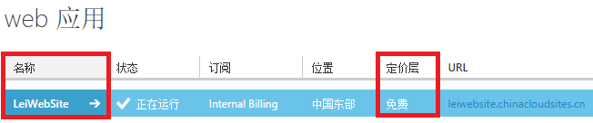

	注意上图中：
	* (1)	名称就是输入的DNS名称
	* (2)	定价层为免费，就是在服务类型中的免费 (Free) 模式

7.	然后在IE浏览器中输入创建成功的 Azure Web 应用 DNS 地址：http://leiwebsite.chinacloudsites.cn/，就可以看到欢迎界面，如下图：

	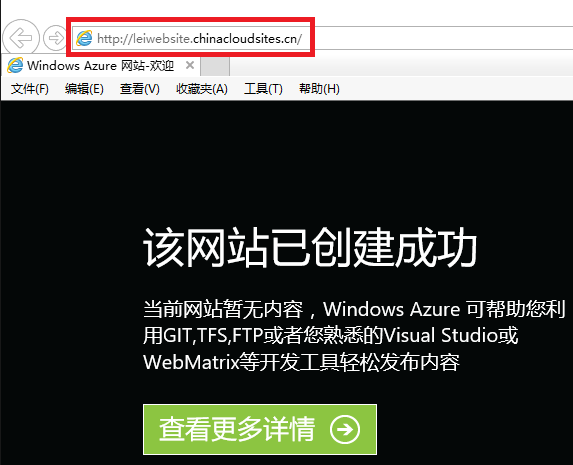

### 2.5 下载发布配置文件
1.	回到 Azure [经典管理门户](https://manage.windowsazure.cn)
2.	点击之前创建的 Azure Web 应用名称，如下图红色部分：

	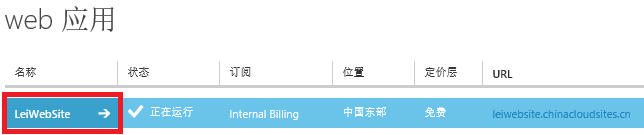

3.	页面跳转，点击仪表板页面，点击右下角的下载发布配置文件。如下图：

	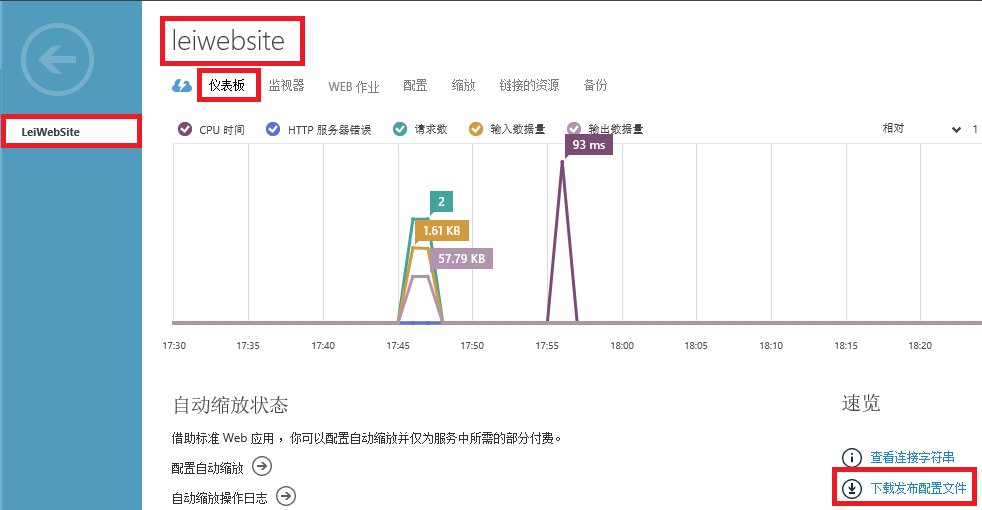

4.	把下载的文件保存在本地计算机的 D 盘。

### 2.6 创建一个 Hello World 项目
在上一节中，创建了一个空的 Azure Web 应用。在本节中，将在本地通过 Visual Studio 2013 创建一个 Web 应用。

1.	首先以管理员身份，运行 Visual Studio 2013
2.	创建一个新的 Web Project，命名为 LeiWebSiteProject，如下图：

	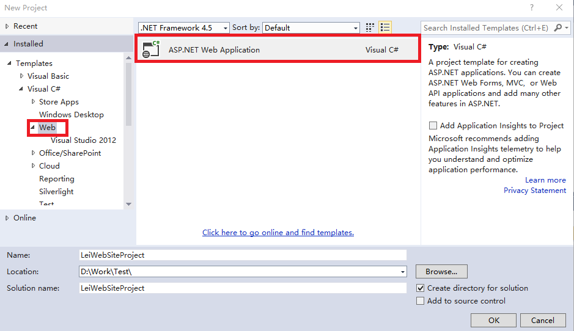

3.	选择一个 Web 应用的 Template，这里使用 Web Form，如下图：

	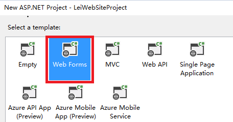

4.	修改 Project 中的 Default.aspx 页面逻辑，增加 Hello Azure Web 应用逻辑，如下图：

	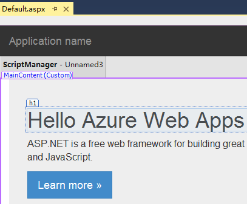

### 2.7 将网站代码通过 Visual Studio 部署
1.	点击 Visual Studio 2013，点击项目文件，右键 Publish。如下图：

	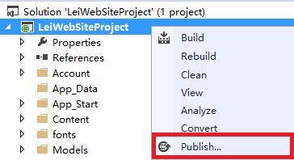

2.	在弹出的界面中，选择 Import

	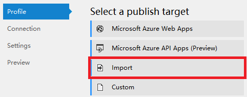

3.	在弹出的界面中，点击 Browse，选择在 [2.5 节](#section_4_5)中

	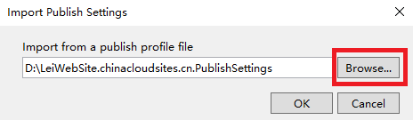

4.	选择完毕后，在 Setting 页面，可以选择需要发布的版本是 Debug 还是 Release，如下图：

	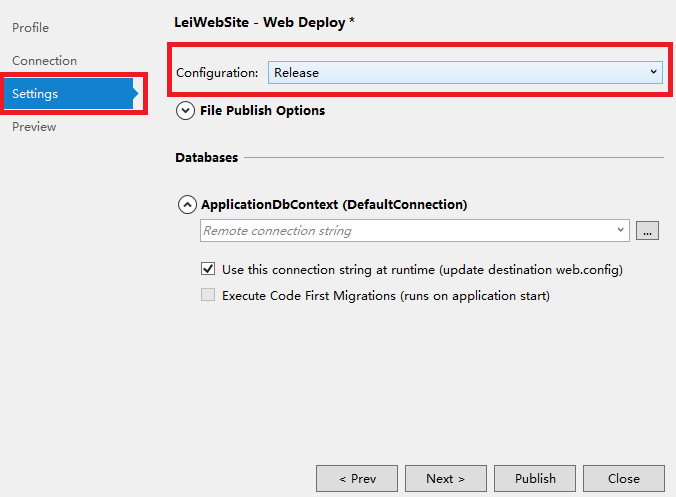

5.	最后在 Preview 页面，点击 Publish 即可。如下图：

	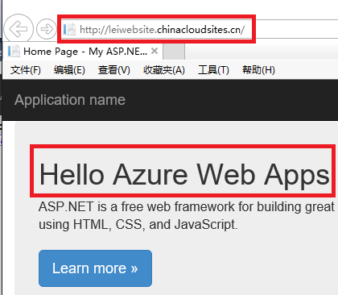

6.	如果 Azure Web 应用最后在 Preview 页面，点击 Publish 即可。如下图：

	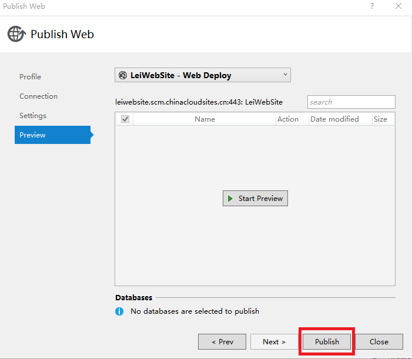

7.	等发布成功了以后，就可以通过访问成功的 Azure Web 应用的 DNS 地址，如下图：

	

8.	Visual Studio 支持增量部署，假设修改某个页面内容，只需要右键 Publish，在步骤 "Preview" 中可以看到，系统会提示更新的内容：

	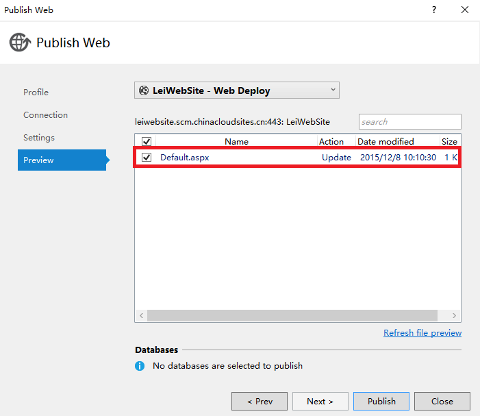

### 2.8 将网站代码通过 FTP 部署
1.	如果使用的是 Visual Studio，当通过以上两节内容，下载了发布配置文件并通过 Visual Studio Publish，也可以通过FTP进行发布，如下图：

	

	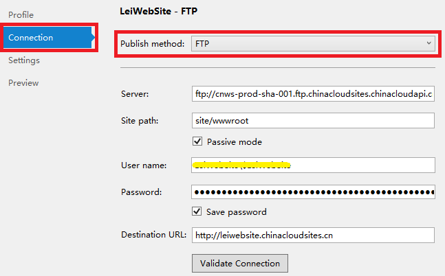

2.	介绍一下通过 Azure [管理门户](https://manage.windowsazure.cn)，来发布 Azure Web 应用。

	点击创建成功的 Azure Web 应用，如下图红色区域：

	

3.	页面跳转，点击仪表板。如下图：

	

4.	在仪表板栏目中，点击下图中的 ”重置部署凭据”。如下图：

	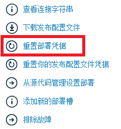

5.	在弹出的页面中，设置 FTP 的用户名和密码，如下图：

	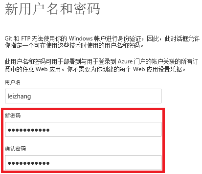

6.	重置 FTP 密码完成后，可以浏览到 FTP 的地址和登录名，如下图：

	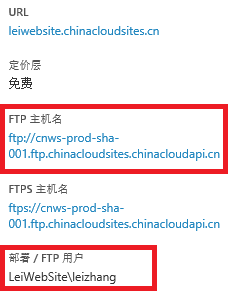

	注意：FTP 的登录名是包含 [DNS]\[UserName]
	 虽然在步骤 5 中设置了用户名是 leizhang，但是在登录 FTP 服务器的时候必须使用 LeiWebSite\leizhang

7.	打开 Windows 资源管理器，地址输入上图中的 FTP 主机名，用户名为 LeiWebSite\leizhang，密码为在步骤 5 中设置的密码，如下图：

	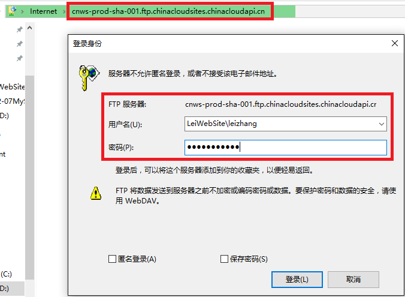

8.	登录成功后，将本地的项目文件保存到 FTP 中的 Site 目录下的 wwwroot 目录下，如下图：

	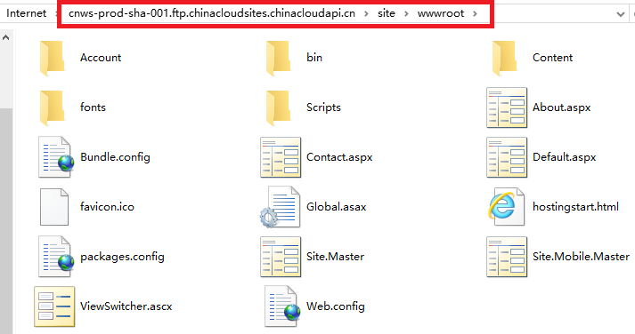

### 2.9 缩放 Azure Web 应用
#### 2.9.1 横向扩展 Azure Web 应用
在[第 1.8 节](/documentation/articles/azure-web-apps-user-manual-part1/#section_3_8)中，已经介绍了 Azure Web 应用单个实例大小，如下：

* (1)	小型，配置为：单核心，1.75GB 内存
* (2)	中型，配置为：双核心，3.5GB 内存
* (3)	大型，配置为：四核心，7GB 内存

在[第 1.9 节](/documentation/articles/azure-web-apps-user-manual-part1/#section_3_9)中，介绍了 Azure Web 应用提供不同的服务类型，如下图所示：

<table border="1">
<thead>
<tr>
<th></th>				<th>免费</th>	<th>共享</th>		<th>基本</th>				<th>标准</th>
</tr>
</thead>
<tbody>
<tr>
<td>横向扩展实例数</td>	<td>不支持</td>	<td>6个共享实例</td>	<td>3个专用实例</td>			<td>10 个专用实例</td>
</tr>
<tr>
<td>服务级别</td>		<td>不支持</td>	<td>不支持</td>		<td>99.9%</td>	<td>99.9%</td>
</tr>
</tbody>
</table>

1.	在 Azure [经典管理门户](https://manage.windowsazure.cn)，点击缩放:

	

2.	点击 App Service 计划定价层，如下图。如果想把 Web 应用设置为共享模式，并且有 6 个共享实例做横向扩展，请按照下图设置：

	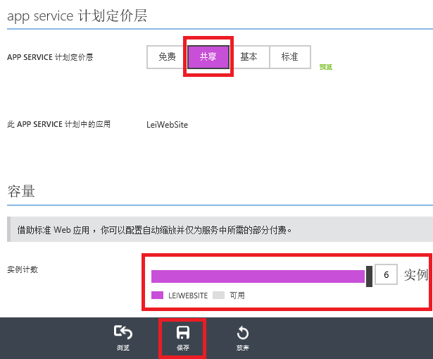

3.	如果想把 Web 应用设置为基本模式，并且有 3 个基本实例做横向扩展，每个实例配置为 1Core/1.75GB，请按照下图设置：

	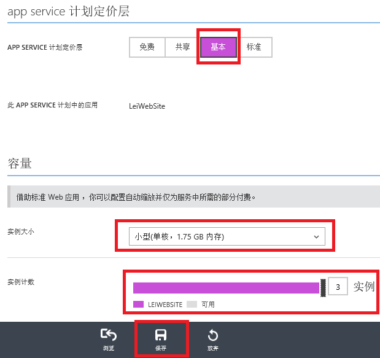

4.	如果想把 Web 应用设置为标准模式，并且有 10 个标准实例做横向扩展，每个实例配置为 2Core/3.5GB，请按照下图设置：

	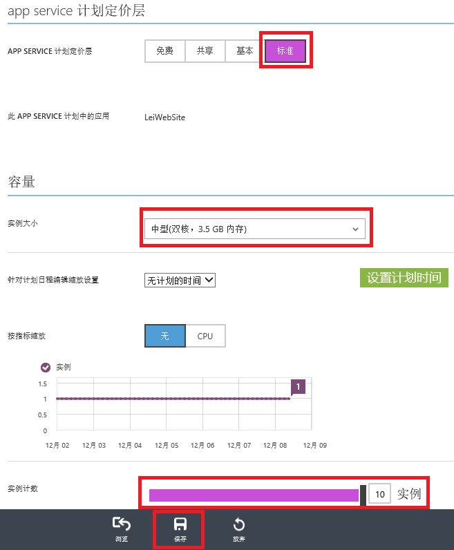

>[AZURE.NOTE]
>本节中横向扩展的 Azure Web 应用，是按照固定的实例个数，24*7 静态响应客户端请求的。

#### 2.9.2 动态缩放 Azure Web 应用
Azure 还具有弹性扩展的优势，在访问量比较高的情况下，可以设置若干多台 Azure Web 应用做负载均衡；在访问量比较低的情况下，可以减少 Azure Web 应用的并发数量。

>[AZURE.NOTE]
>只有在 Azure Web 应用标准模式下，才支持自动扩展功能。

假设一个场景，某个部署在 Azure Web 应用的企业官网，访问量是固定的。

* (1)	在周 1-5 的工作日中，访问高峰期时间是 8:00:-23:00，横向扩展 10 台 2Core/3.5GB 的 Azure Web 应用做负载均衡
* (2)	在周 1-5 的工作日中，访问低谷期时间 23:00-8:00，横向缩小为 2 台 2Core/3.5GB 的 Azure Web 应用做负载均衡
* (3)	在周末全天是访问的高峰期，横向扩展 10 台 2Core/3.5GB 的 Azure Web 应用做负载均衡

 

1.	首先点击 Azure Web 应用的缩放选项，设置计划定价层为标准，然后点击设置计划时间，如下图：

	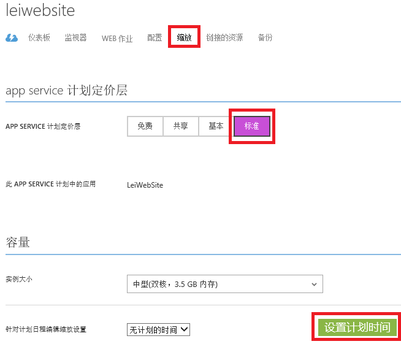

2.	在弹出的窗口中，进行如下设置：

	* (1)	勾选 ”日夜的缩放设置不同” 和 ”工作日和周末的缩放设置不同”
	* (2)	设置开始时间和结束时间，8:00AM 和 11:00PM
	* (3)	时区使用默认的 UTC+8 时区

	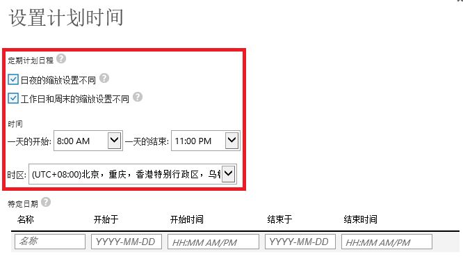

	设置完毕后请保存。

3.	先设置工作日白天的动态缩放策略，如下图：

	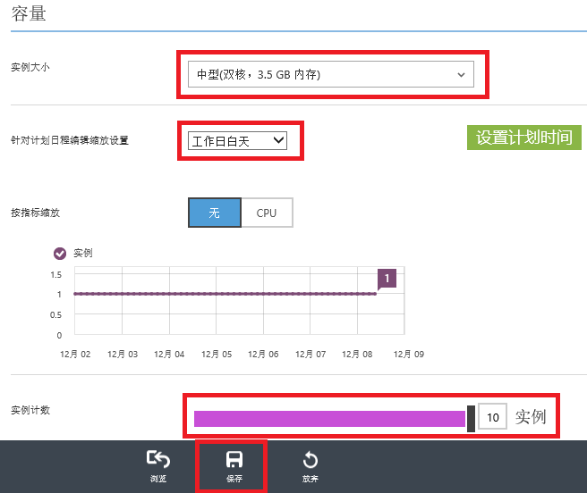

	**在周 1-5 的工作白天 (之前定义的访问高峰时间 8:00:-23:00)，横向扩展 10 台 2Core/3.5GB 的 Azure Web 应用做负载均衡**

4.	再设置工作日夜间的动态缩放策略，如下图：

	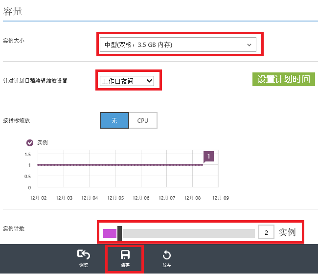

	**在周 1-5 的工作夜间 (之前定义的访问低谷时间 23:00:-8:00 )，横向扩展 2 台 2Core/3.5GB 的 Azure Web 应用做负载均衡**

5.	最后设置双休日的动态缩放策略，如下图：

	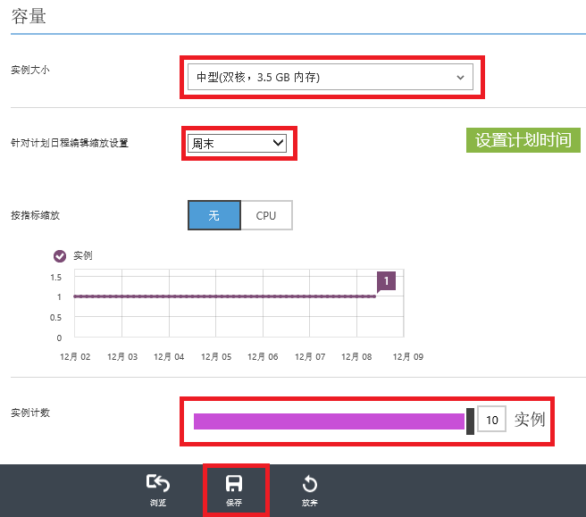

	**在周末全天，横向扩展 10 台 2Core/3.5GB 的 Azure Web 应用做负载均衡。**

### 2.10 配置 Azure Web 应用
1.	还可以对于 Azure Web 应用进行配置，如下图：

	

2.	配置 Web 应用的运行环境，如下图：

	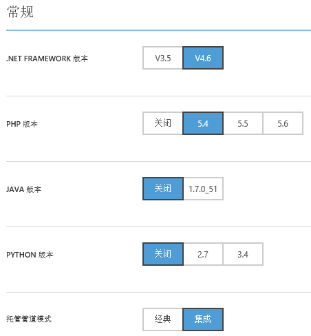

3.	配置默认页面：

	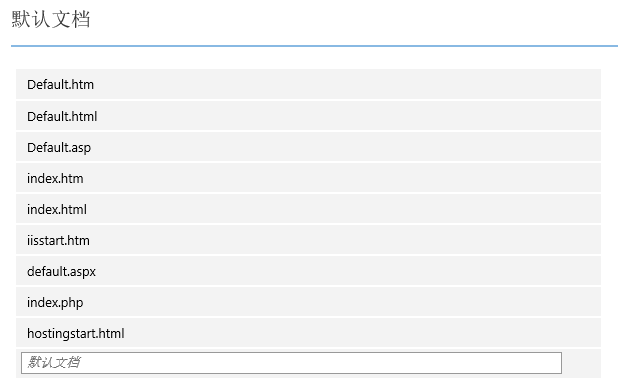

4.	配置虚拟目录：

	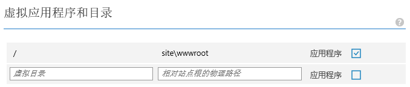

### 2.11 监控 Azure Web 应用
1.	点击监视器，如下图：

	

2.	可以显示过去 1 小时、24 小时、7 天内的 Azure Web 应用监控指标

	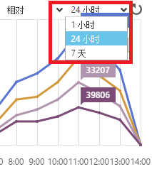

3.	或者根据需要，增加监控指标内容。如下图：

	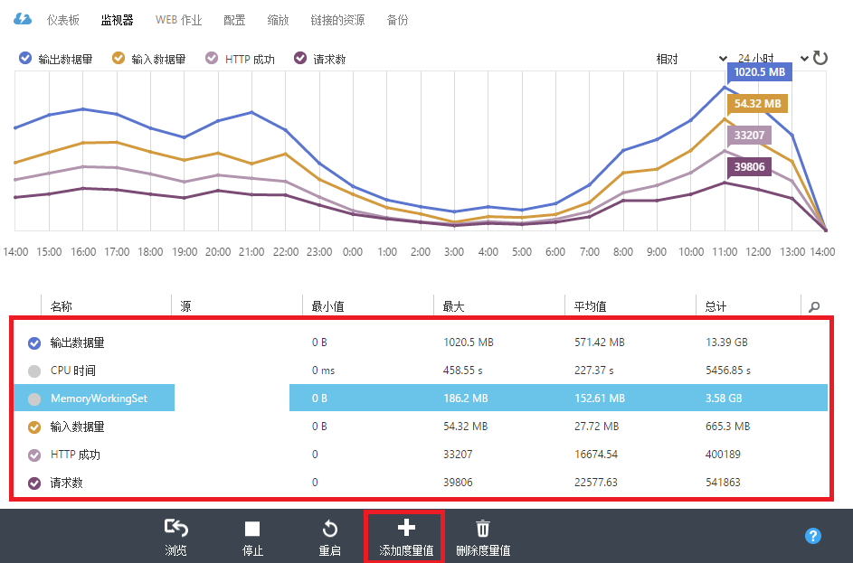

4.	注意：上图中关于 CPU 的监控指标是 CPU Time，而不是一般情况下的 CPU 利用率 (CPU Usage)。这是因为对于 ”免费” 和 ”共享” 级别，分别包括每天 60 分钟和 240 分钟的 CPU Time。

