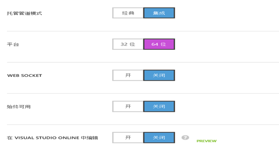
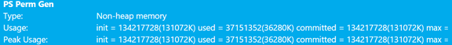

<properties
	pageTitle="Azure Web 应用用户手册 - 第三部分 | Azure"
	description="详细介绍如何创建和管理 Azure Web 应用。"
	services="app-service-web"
	documentationCenter=""
	authors="Lei Zhang"
	manager=""
	editor=""/>

<tags
	ms.service="app-service-web"
	ms.date=""
	wacn.date="07/05/2016"/>

# Azure Web 应用用户手册 - 第三部分

- [Azure Web 应用用户手册 - 第一部分](/documentation/articles/azure-web-apps-user-manual-part1/)
- [Azure Web 应用用户手册 - 第二部分](/documentation/articles/azure-web-apps-user-manual-part2/)

## 3. 高级内容
### 3.1 使用源代码管理器管理 Azure Web 应用
假设客户开发使用源代码管理器来管理项目代码，那如何通过 Azure Web 应用来发布呢？

为了与之前的项目做区分，创建一个新的 Azure Web 应用，命名为 LeiWebSiteGit，DNS 地址为 http://leiwebsitegit.chinacloudsites.cn

1.	点击仪表板，详细信息，如下图：

	

2.	在弹出的窗口中，根据需要选择本地 Git 或者外部 Git，如下图：

	

3.	选择上图的本地 Git 存储，等待页面刷新。然后点击部署：

	

	上图红色区域，就可以在本地 Git 把代码库部署到 Azure Web 应用

4.	或者从外部 Git 来部署，如下图：

	

5.	最后设置 GitHub 的 URL，如下图：

	

### 3.2 修改 Azure Web 应用时区
1.	默认情况下，Azure Web 应用默认的系统时间是 UTC 时区。

	比如在本地使用 Visual Studio 2013 创建 Web 应用项目，在 Default.aspx.cs 输入以下代码：

		Label1.Text = DateTime.Now.ToString();

	部署到 Azure Web 应用之后，显示的是 UTC 时区。如下图：

	

2.	其实可以通过 Web 应用配置页面，来设置 Web 应用的当前时间，如下图：

	

	设置 WEBSITE_TIME_ZONE，值设置为 China Standard Time。

	这样显示的系统时间就为 UTC+8 时区，如下图：

	

### 3.3 PHP 开发者必读

#### 3.3.1 在 Azure Web 应用配置 PHP
在很多情况下，需要在 Azure Web 应用里配置 PHP，例如：

* (1)	更改内置 PHP 版本
* (2)	在默认 PHP 运行时中启用扩展
* (3)	使用自定义 PHP 运行时

#### 3.3.2 PHP 使用 Azure 存储
在[第 1.10 节](/documentation/articles/azure-web-apps-user-manual-part1/#section_3_10)中，建议把 Web 项目文件的静态资源，比如图片、照片、视频等都保存在 Azure 存储里。

### 3.4 Java 开发者必读
#### 3.4.1 Azure Web 应用 Java 运行环境基本配置
1.	登入 Azure 的经典管理门户，创建一个测试的 website 应用 myjavasite, 如下所示：

	

2.	进入你创建的站点 myjavasite，选择 "仪表板"，因为后续主要通过 FTP 方式来更新网站，所以需要重置一下部署密码，选择右下角 "重置部署凭据"，设置你的部署密码并牢记：

	

3.	选择 "配置" 界面，来配置 Java 运行环境，默认情况下 PHP 运行环境是打开的，但测试 Java 不需要，选择关闭；Java 版本选择 1.7.0_51, Tomcat 选择 7.0.50，目前这些版本是在 Azure 站点上提供的也是唯一的版本：

	

4.	最后平台部分，请选择 64 位，32 位平台对于 JVM 大小会有 2GB 限制，所以并不推荐，正常情况下选择选择 64 位。

	

5.	Azure 的网站也支持用户自定义 SSL，可以上传自己的 pfx 文件并进行设置，也支持自定义域名，可以通过 cName 将你的域名指向 Azure 的网站，在此不再详述：

	

6.	可以在界面上配置您的网站的默认 welcome 文件，即在默认情况下 /site/wwwroot 下哪个文件为 welcome 文件，并且可以添加，修改默认文档的名字和搜索顺序，设置完成点击保存配置：

	

7.	回到 "仪表板" 界面，在右下角可以看到您的 website 的 URL，上传文件的 FTP 地址，FTP 的用户名密码，点击站点 URL，可以看到默认的主页，代表您的网站是配置创建成功的：

	

	

#### 3.4.2 Azure Web 应用发布 Java Web 应用
在 Azure 站点上发布 Java Web 应用非常简单，可以使用 git 从源代码发布，也可以使用 FTP/FTPs 直接发布，本节介绍 FTP 方式。

1.	准备好您的 Java web app 的 war 包，在本例中，使用 Eclipse 的导出功能，在您的项目上单击右键，选择 "Export"，将您的项目按照提示导出为 war 包

	

	

	

2.	选择一个合适的 FTP 工具，在本例中，使用免费的开源工具 FileZilla，[下载](https://filezilla-project.org/)并安装

3.	登录 Azure 的管理主页，在网站的 "仪表板" 界面，可以找到需要上传到 web 网站的 FTP 地址，用户名，密码是教程 1 中设置的部署密码：

	

4.	使用 FileZilla 连接到您的 web 站点，进入到根目录 /site/wwwroot 下，您会看到有一个 webapps 目录，如果做过 Tomcat 上 web 应用的部署，那么这个 webapps 目录就是 tomcat webapps 的目录，进入 webapps 目录然后将您的 WAR 包上传到该目录：

	

	

5.	WAR 包上传完成后，稍等几分钟，完成部署，然后使用 WEB 站点的 URL，加上 web 应用的 context，例如应用是 greenhouse，那么访问站点就是 URL+/greenhouse：

	

6.	至此，您会看到您的应用成功部署，并已经正确运行。

#### 2.4.3 定制化 Azure Web 应用提供的默认的 Tomcat 和 JDK 环境
在之前的测试中，如果访问 WEB 站点 URL 时不加任何上下文，实际上看到的 web 界面是系统自带的测试页面 index.jsp,位于/ site/wwwroot/webapps/ROOT 目录下，是 Tomcat 默认的根目录。

1.	由于要检测 JVM 的 usage 信息以便确定，定制化修改的 Java 参数是否生效，所以需要写一些测试代码，打印出当前 JVM 的参数信息; 首先使用 FileZilla 连接到您的网站，进入到 /site/wwwroot/webapps/ROOT 目录下，下载 index.jsp 文件到本地。
2.	有一个简单的测试程序，测试 Java 运行时 heap size 大小，使用 ManagmentBeans 获得的 JVM 参数，已经上传到了 github，请直接下载，或者可以打开 [index.jsp](https://github.com/kingliantop/azurelabs/blob/master/Java/websites/index.jsp) 文件添加相关代码如下：

		 1 <%@ page import="java.lang.management.*" %>
		 2 
		 3 <%
		 4 
		 5 ArrayList<String> mainPageProps = new ArrayList<String>();
		 6 
		 7 ……
		 8 
		 9      ……
		10 
		11 int MB=1024*1024;
		12 
		13 Runtime runtime = Runtime.getRuntime();
		14 
		15 out.print("<tr><td>Runtime Total memory:</td><td>" + runtime.totalMemory()/MB+"M</td></tr>");
		16 
		17 out.print("<tr><td>Runtime Free memory:</td><td>" + runtime.freeMemory()/MB+"M</td></tr>");
		18 
		19 out.print("<tr><td>Runtime Used memory:</td><td>" + (runtime.totalMemory() - runtime.freeMemory())/MB+"M</td></tr>");
		20 
		21 out.print("<tr><td>Runtime Max memory:</td><td>" + runtime.maxMemory()/MB+"M</td></tr>");
		22 
		23                 
		24 
		25 Iterator iter = ManagementFactory.getMemoryPoolMXBeans().iterator();
		26 
		27                 
		28 
		29 out.print("<tr><td><h3>Memory MXBean</h3></td></tr>");
		30 
		31 out.print("<tr><td>Heap Memory Usage:</td><td>" + ManagementFactory.getMemoryMXBean().getHeapMemoryUsage()+"</td></tr>");
		32 
		33 out.print("<tr><td>Non-Heap Memory Usage:</td><td>" + ManagementFactory.getMemoryMXBean().getNonHeapMemoryUsage()+"</td></tr>");
		34 
		35 out.print("<tr><td><h3>Memory Pool MXBeans</h3></td></tr>");
		36 
		37                     
		38 
		39 while (iter.hasNext()) {
		40 
		41     MemoryPoolMXBean item = (MemoryPoolMXBean) iter.next();
		42 
		43     out.print("<tr><td><b>"+item.getName()+"</b></td></tr>");
		44 
		45     out.print("<tr><td>Type:</td><td>" + item.getType()+"</td></tr>");
		46 
		47     out.print("<tr><td>Usage:</td><td>" + item.getUsage()+"</td></tr>");
		48 
		49     out.print("<tr><td>Peak Usage:</td><td>" + item.getPeakUsage()+"</td></tr>");
		50 
		51     out.print("<tr><td>Collection Usage:</td><td>" + item.getCollectionUsage()+"</td></tr>");
		52 
		53                 }
		54 
		55 %>    

3.	上传修改后的 index.jsp 文件到 ROOT 目录下，覆盖原来的文件，重新打开您的 web 站点主页，可以看到测试程序会打印出当前运行环境下内存大小，heap size，non-heap size 大小等相关信息

	

4.	可以看到默认运行环境下，初始 Heap 大小为 28664K，已经使用大约 54M，最大内容使用量是 433M，而当前测试环境使用的网站实例大小为小型，大约是一个 core，1.75G 内存：

	

	对于 PermGen 大小，初始大小为：

		init = 22020096(21504K) used = 41871616(40890K) committed = 41943040(40960K) max = 85983232(83968K)

5.	做个简单的实验，将 web 站点的实例升级，看看 Azure web app 是否会自动根据当前系统实例的大小来调整 JVM 相关参数，在 "缩放" 页面，将实例升级到中型实例，点击保存：

	

	这个时候会看到默认的 heap size 也发生了变化：

	

	那么 Azure 是如何调整 Tomcat 的运行环境和配置的呢？这样动态的调整是如何做到的呢？

	其实没有什么 magic，Azure 的 website 底层是 Windows Server，采用 IIS 来对其他第三方的服务器例如 Tomcat 进行管理。 IIS 有一个管理模块，叫做 HttpPlatformHandler，可以做如下几件事情：

	* (1)	所有以前直接处理 Http 请求的第三方应用服务器，如 Tomcat，Jetty，Node.JS 等，HTTP 请求都交由 IIS 来进行接受。
	* (2)	由 IIS 接管的请求，都会被转发至后台真正处理的服务器，比如 Tomcat 等，作用类似于 Nginx，apache http
	* (3)	管理第三方程序，启动第三方程序，设定启动参数，定制化相应环境等等，所有这些操作都通过一个叫做 web.config 的文件来配置实现。

	那么经由上述介绍可以知道，在 Azure web app 这个 PAAS 平台上，如果需要做些定制化环境部署，需要使用这个机制，由 HttpPlatformHandler 通过 web.config 配置文件来实现。

	在本测试场景中，假定用户需要修改默认运行环境下的 heap size 和 PermGen 的大小，因为在常见的 Java 应用错误中，出现的 OutOfMemory 错误，有些就是由于 PermGen 大小设置过小引起的。

6.	首先需要准备一个 web.config 文件，在本示例中使用 Azure 站点提供的 Tomcat 和 JDK，需要配置的相关参数 -Xms512m -Xmx1024m -XX:PermSize=128m -XX:MaxPermSize=256m 放在 JAVA_OPTS 下：

		 1 <?xml version="1.0" encoding="UTF-8"?>
		 2 
		 3 <configuration>
		 4 
		 5 <system.webServer>
		 6 
		 7 <handlers>
		 8 
		 9 <add name="httpPlatformHandler" path="*" verb="*" modules="httpPlatformHandler" resourceType="Unspecified" />
		10 
		11 </handlers>
		12 
		13 <httpPlatform processPath="%AZURE_TOMCAT7_HOME%\bin\startup.bat"
		14 
		15 arguments="">
		16 
		17 <environmentVariables>
		18 
		19 <environmentVariable name="CATALINA_OPTS" value="-Dport.http=%HTTP_PLATFORM_PORT%" />
		20 
		21 <environmentVariable name="JAVA_OPTS" value="-Djava.net.preferIPv4Stack=true -Xms256m -Xmx1024m -XX:PermSize=128m -XX:MaxPermSize=256m" />
		22 
		23 </environmentVariables>
		24 
		25 </httpPlatform>
		26 
		27 </system.webServer>
		28 
		29 </configuration> 

	注意事项：

	* 默认的系统的 tomcat 路径是 "%AZURE_TOMCAT7_HOME%\bin\startup.bat"，需要注意正确设置
	* Java 相关的参数设置放在 JAVA_OPTS 里面如 -Xms，-Xmx 等

7.	默认设置下的 Heap size，PermGen 等大小设置, 刷新测试页面，可以看到：

	

	<pre><code>Heap Size：Heap Memory Usage:    init = 58712896(57336K) used = 150252200(146730K) committed = 360710144(352256K) max = 835190784(815616K)</code></pre>

	

	<pre><code>Perm Gen：
	Usage:    init = 22020096(21504K) used = 42138168(41150K) committed = 42467328(41472K) max = 85983232(83968K)</code></pre>

8.	使用你的 FTP 工具，将 web.config 文件上传到您的 Azure 站点根目录 /site/wwwroot：

	

9.	重新刷新页面，会看到相关 JVM 参数值已经发生了变化：

	

	<pre><code>Heap Memory Usage:    init = 536870912(524288K) used = 118235616(115464K) committed = 660602880(645120K) max = 954728448(932352K)</code></pre>

	

	<pre><code>Usage:    init = 134217728(131072K) used = 37151352(36280K) committed = 134217728(131072K) max = 268435456(262144K)</code></pre>

10.	通过 web.config 和 HttpPlatformHandler 机制，可以对 Azure 的站点进行定制。

#### 3.4.4 定制化使用您自己的 Tomcat 版本和 JDK 环境
在上面章节中，介绍了如何通过 web.config，定制默认的 Azure web app 的 Java 运行环境，默认情况下，Azure 站点的 Tomcat 是 7.0.50，Java 版本是 1.7.0_51，但用户自己测试开发或者生产环境的 Tomcat 和 Java 版本有可能是更高版本的，那么在 Azure Web 应用上是否可以深度定制化，使用用户自己的 Tomcat 和 Java 呢？

在本节中，介绍在 Azure web 应用的 PAAS 服务中，如何深度定制使用您自己版本的 Tomcat，JDK，设置相关参数。

1.	首先在本地安装或者下载 JDK，一般安装在 C 盘，使用的 Java 版本是 1.8.0_60 如下：

	

2.	使用 FTP 工具连接到 web 站点，在根目录下建一个 bin 子目录，并将本地 JDK 目录下的所有文件，包括 JDK 目录上传到 bin 目录下，上传完的目录结构如下：

	

3.	JDK 上传完毕后，在 Apache 官网下载 Tomcat，由于 Azure 使用的是 Tomcat7.0.50，在本测试中，下载 Tomcat 8.0，解压缩到本地：

	

4.	在 Azure 的 website PAAS 服务中，您所定制化使用的 Tomcat 实际上是放到了一个托管环境，所以在上传之前，需要做一些定制化修改，请打开本地的 Tomcat 的 conf 目录下 server.xml 文件，打开进行编辑。

	

5.	找到 Server，Shutdown 这一行，将 port 的值改为 "-1"，如下图所示：

	

6.	找到 Connector port 这一行，将 port 值修改为 "${port.http}"

	

7.	注释掉 https，AJP 段：

	

8.	打开当前目录下 web.xml，设置 <listings\>参数为 true:

	

9.	打开当前目录下的 context.xml 文件，设置 context 的 reloadable 参数为"true"：

	

10.	保存并退出，然后使用 FTP 工具，将 Tomcat 所有文件上传到根目录的 bin 目录下，如下图所示：

	

11.	最后需要创建自己的定制化的 web.config 文件，打开您的编辑器，将下面的 web.config 文件内容拷贝粘贴，如果您的 JDK、tomcat 有所不同，请修改相关路径, 也可以直接从 [GitHub](https://github.com/kingliantop/azurelabs/blob/master/Java/websites/indepth/web.config) 直接下载。

		 1 <?xml version="1.0" encoding="UTF-8"?>
		 2 
		 3 <configuration>
		 4 
		 5 <system.webServer>
		 6 
		 7 <handlers>
		 8 
		 9 <add name="httpPlatformHandler" path="*" verb="*" modules="httpPlatformHandler" resourceType="Unspecified" />
		10 
		11 </handlers>
		12 
		13 <httpPlatform processPath="%HOME%\site\wwwroot\bin\apache-tomcat-8.0.32\bin\startup.bat"
		14 
		15 arguments="">
		16 
		17 <environmentVariables>
		18 
		19 <environmentVariable name="CATALINA_OPTS" value="-Dport.http=%HTTP_PLATFORM_PORT%" />
		20 
		21 <environmentVariable name="CATALINA_HOME" value="%HOME%\site\wwwroot\bin\apache-tomcat-8.0.32" />
		22 
		23 <environmentVariable name="JRE_HOME" value="%HOME%\site\wwwroot\bin\jdk1.8.0_60" /> <environmentVariable name="JAVA_OPTS" value="-Djava.net.preferIPv4Stack=true -Dsun.java2d.d3d=false -Xms512m -Xmx1024m -XX:PermSize=128m -XX:MaxPermSize=256m" />
		24 
		25 </environmentVariables>
		26 
		27 </httpPlatform>
		28 
		29 </system.webServer>
		30 
		31 </configuration>

12.	最后一步，将 web.config 文件上传到您的 web 站点的根目录：

	

13.	这时 Tomcat 服务器会重启，PAAS 环境会重新部署，大约等 1 分钟左右，打开您的 website 站点，将看到：

	

	证明您 website 站点的确已经开始使用您自己的 Tomcat 8.0 作为容器了，但为什么显示的页面不是之前可以看到 Heap size 的页面呢？这是因为部署了自己的 tomcat 后，工作目录变成了您的 tomcat 8 下面的 webapps 目录。

14.	打开 FTP 工具，连接到您的站点，上传之前修改过的 index.jsp 到 Tomcat 8 的 webapps 目录下的 ROOT 下：

	

15.	打开您的 web 站点主页，可以看到显示的已经是之前修改过的 index.jsp 页面了，从页面可以看出，Java 使用的是定制的 Java 8，而 Tomcat 是定制的 Tomcat 8，深度定制化生效了：

	

#### 3.4.5 Java 8 下PermGen 及参数设置
在上一章节中，定制化使用了 Java 8 环境，使用的测试页面打印出了 JVM 基本参数，但如果仔细观察，会发现在 MXBeans 中，没有出现 PermGen 的使用数据，初始大小等信息，即使已经设置了大小：

在 Java 7 及以前版本中，PermGen 主要存放加载的类和元数据信息，如果设置过小，类加载失败，可能会出现 OutOfMemory 的经典错误，在 Azure web 应用里面的 Java 开发中，碰到的客户定制化设置的问题也会涉及到 PermGen 的大小定制化。

那么在 Java 8 里面，PermGen 去哪了呢？

可以先来看一下 JVM 的内存模型，JVM 的内存分为 Heap memory 和 Non-Heap memory，Heap memory 主要会存放一些 Java Object 对象信息，而 non-heap memory 如 PermGen 主要会存放一些加载的 Java classes 和元数据信息。

在 Java 8 之前的 Java 版本当中，Heap size 可以通过 MS, MX 进行大小设置，而 PermGen 可以通过 PermSize, MaxPerm 在 Java option 中进行大小设置。之前的 JVM 的一个明显问题是，在启动的时候设置了 XX:MaxPermSize，那么一旦在运行过程中加载的类超过了这个大小限制，就会马上碰到 OOM（out of memory）错误，当然这种设计除了会出现 OOM，也会有无法动态调整，很难调优等缺点，也会导致一系列的 bug 和性能问题。

因此，在 Java 8 的设计中，Oracle 和 Java 社区放弃了 PermGen 设置，从此之后不再有 PermGen，但是元数据依然是需要保存的，所以在 Java 8 中，元数据移到了本地内存中，叫 Metaspace 的地方。

那么对于最终用户来讲有什么变化呢？您不会因为 PermGen 碰到 OOM 的问题，因为所有的有效系统内存都可以做 Metaspace，所以不需要单独设置 metaspace，在一个 64 位系统的机器中，默认的 Metaspace 初始大小是 21MB，那么最大呢？理论上如果您的元数据真的非常多，加载的类也很多，最大可以用完您所有的有效系统内存。

那么有没有办法设置或者限制 Metaspace 的大小呢？可以，Java 提供了两个参数来让您在必要的情况下设置 Metaspace 的大小：

- XX:MetaspaceSize：64 微系统默认 21MB，可以设置大一些避免频繁的 full GC
- XX:MaxMetaspaceSize：理论上大小没有限制，但可以设置一个限制值

回到的 Azure web 应用的 Java OPTS 的设置上，在 Java 8 的环境里面 PermSize 已经无用了，所以 web.config 中设置可简化为：

### 3.5 Azure Web 应用备份
在使用 Azure Web 应用的时候，经常会遇到需要对 Web 应用进行备份的情况。

在本章中，需要准备以下内容：

1.	部署一个新的 Azure Web 应用，并且配置为标准模式

	

2.	创建一个新的 PaaS SQL 数据库。步骤略。截图如下：

	

3.	在 Web 应用里配置页面设置，如下图：

	

	增加 SQL Azure 的连接字符串，如下图：

	

4.	创建一个空的存储账号 leiwebsitestorage，将来备份的 Web 应用源代码和 Azure 数据库 bacpac 文件都会保存到这个存储账号里。
5.	这样准备好了 Azure Web 应用和其对应的 Azure 数据库的连接字符串了。
6.	Azure Web 应用在备份的时候，不仅仅备份了 Azure Web 应用的项目文件，同时也会备份连接字符串对应的 Azure 数据库服务。

接下来开始本章的内容：

1.	点击 Web 应用的备份页面，如下图：

	

	上图中，设置了：
	* (1)	自动化备份 Azure Web 应用
	* (2)	备份的目标存储账户为 leiwebsitestorage
	* (3)	备份周期为每天
	* (4)	同时备份 Azure SQL 数据库
	* (5)	最后执行保存操作

2.	设置完毕后，可以点击上图的保存，或者立刻备份

	备份完毕后，可以在 leiwebsite 存储这个存储账号里。

	

	点击上图中的 websitebackups，页面跳转

	

	上图中，LeiWebSite_201512200955.xml 描述了备份的内容，可以下载查看一下：

	

	上图的红色部分描述了备份 Azure 数据库的内容，leiwebsitedb.bacpac 就是备份的数据库信息

	还可以下载 zip 压缩包看看：

	

	上图中，既包含了 Azure Web 应用的源代码，又包含了 Azure 数据库的备份文件 leiwebsitedb.bacpac

3.	备份完毕后，还可以对 Web 应用进行还原

	

	选择需要的还原点即可，如下图：

	

### 3.6 Azure Web 应用设置 CNAME 解析
1.	在 Azure Web 应用创建的新的 Web 应用，默认的 DNS 名称为 http://[xxxxxx].chinacloudsites.cn，这个 DNS 的根域名是世纪互联备案过的，如果客户只使用这个根域名，是不需要备案的。不过一般情况下，客户不会用 Azure 默认的 DNS 地址对外提供服务。

2.	如果客户不想使用 Azure 默认提供的 DNS 地址 http://[xxxxxx].chinacloudsites.cn，想使用自己的二级域名 (e.g. http://azure.contoso.com.cn) 做 A 记录 (或者 CNAME ) 解析到 Azure 的公网 IP 地址，则需要用户把自己的域名所在的根域名 (e.g. contoso.com) 进行 ICP 备案。用户可以通过各种域名备案组织/代理，对自己的根域名 (contoso.com) 进行注册（国内的国外的），但如果指向了在国内的 IP 地址，就必须到工信部进行备案。

3.	如果客户的根域名 (contoso.com.cn) 在没有备案的情况下，做了 A 记录解析到 Azure 的公网 IP 上，(即 http://azure.contoso.com.cn 的 A 记录，指向到 Azure 的公网 IP 43.159.xxx.xxx)。

	工信部在进行审查的时候，这个根域名没有进行备案

	这时候工信部会要求世纪互联关停这个公网 IP 对应的 Azure 上的 Web 应用，会对客户的应用产生影响

在开始本节内容之前，请先确认：

* (1)	根域名必须经过 ICP 备案
* (2)	拥有根域名或者一个二级域名，假设是 www.contoso.com.cn 
* (3)	DNS 供应商也一起参与

本节实现的目标是：部署在 Azure Web 应用上的网站 (http://contosowebapp.chinacloudsites.cn)，使用自己备案过的DNS地址。

1.	首先在缩放页面，把 Azure Web 应用设置为共享、基本或者标准。只有这三种才支持自定义域名，如下图：

	

2.	让 DNS 供应商创建 DNS 记录。比如，创建从 www.contoso.com.cn 指向到 Azure 云端的 http://contosowebapp.chinacloudsites.cn 的 CNAME 资源记录。

3.	选择 Azure Web 应用配置页面，如下图：

	

4.	点击管理域名，如下图：

	

5.	在弹出的窗口中，输入已经经过 ICP 备案的根域名或者二级域名，如下图：

	

6.	在上图中，会发现增加完自定义域名之后，会有红色感叹号。考虑到 DNS 同步会有延迟，一般情况下，需要不停尝试以等待验证通过。

7.	验证通过后，上面的红色感叹号就会变成绿色图标，这就表示设置成功了。然后就可以通过用户的自定义域名 http://www.contoso.com.cn，来访问 Azure Web 应用上的服务了。

## 4. 注意事项
1.	默认情况下，在创建的 Azure 服务，默认使用的 DNS 地址为: http://xxx.chinacloudapi.cn，这个 DNS 的根域名是世纪互联备案过的，如果客户只使用这个根域名，是不需要备案的

	不过一般情况下，客户不会用 Azure 默认的 DNS 地址对外提供服务

2.	如果客户不想使用 Azure 默认提供的 DNS 地址 http://[xxxxxx].chinacloudsites.cn，想使用自己的二级域名 (e.g. http://azure.contoso.com.cn) 做 A 记录解析到 Azure 的公网 IP 地址，则需要用户把自己的域名所在的根域名 (e.g. contoso.com.cn) 进行 ICP 备案。用户可以通过各种域名备案组织/代理，对自己的根域名 (contoso.com) 进行注册（国内的国外的）。

	但如果指向国内 Azure 的 IP 地址，需要用户到[世纪互联备案网站](http://icp.cloud.21vianet.com)提交备案信息

3.	如果客户的根域名 (contoso.com.cn) 在没有备案的情况下，做了 A 记录解析到 Azure 的公网 IP 上，(即 http://azure.contoso.com.cn 的 A 记录，指向到 Azure 的公网 IP 43.192.xxx.xxx)

	工信部在进行审查的时候，如果根域名没有进行备案，会要求世纪互联尽快关闭该网站。

	世纪互联目前的流程是，先通知用户在规定时间内按要求对网站进行关闭。如用户不能在规定时间内按要求完成，或世纪互联无法联系到用户时，会采取暂停用户部署或订阅服务。

4.	如果客户之前在 IDC 托管机房，或者其他网络接入商 (如万网等) 注册过顶级域名 (contoso.com.cn)，且该域名指向的公网 IP 地址不在 Azure 云平台。

	现在需要将 IP 指向到 Azure 云平台，根据现有的备案要求，需要用户到世纪互联提交备案信息，做新增接入操作。具体请联系世纪互联。

