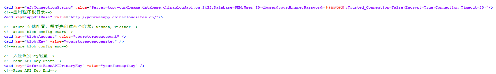
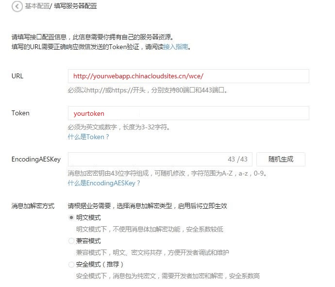
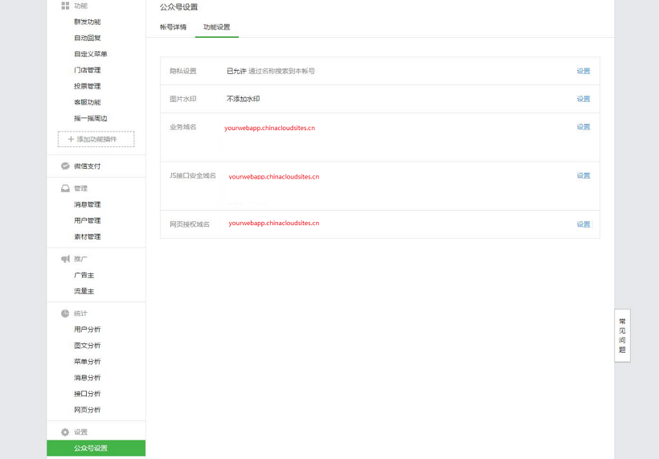
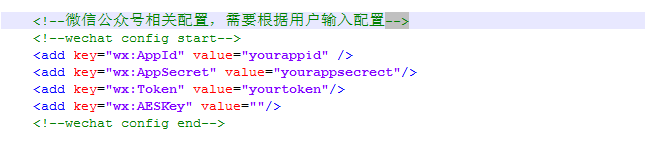

<properties
	pageTitle="基于认知服务的智慧云会务管理系统部署说明 | Azure"
    description="基于认知服务的智慧云会务管理系统部署说明"
    services=""
    documentationCenter=""
    authors=""
    manager=""
    editor=""
    tags=""/>

<tags ms.service="multiple" ms.date="" wacn.date="01/17/2017"/>

 
# 基于认知服务的智慧云会务管理系统部署说明

## 主要开发技术说明
1. 开发语言：Asp.net（C#）；

2. 开发环境：Windows 10，.NET Framework 4.5，Visual Studio 2015；

3. 主要技术：Asp.net MVC 5，Entity Framework，HTML5 ，CSS3，JQuery；

4. 数据库：Azure SQL 数据库； 

5. 文件存储：Azure Storage 存储；

6. 人脸识别：微软认知服务人脸识别 API；

## 系统部署方法
1. 部署文件：“dest” 目录下为系统部署程序文件，用于系统部署；

2. 部署方法：将 “dest” 目录下的所有文件拷贝到目标网站根目录下即可。

## 系统部署步骤

### Azure 服务创建

1. 创建一个 SQL Azure 数据库名为 **yourdbname**，数据库用户名为 **dbuser**，密码为 **Password!**；

2. 创建一个存储账户 **yourstoreageaccount**，访问密钥为 **yourstoreageaccesskey**， 并创建两个容器 wechat 和 visitor；

3. 创建一个 Web App 名称为 **yourwebapp** ，网站链接为 **http://yourwebapp.chinacloudsites.cn** ；

4. 申请一个认知服务人脸识别 API Key  **yourfaceapikey** 。

### 系统部署

1. 通过 FTP 的方式登录已创建的 yourwebapp 网站；

2. 参考上面的部署方法将系统部署程序包中的所有文件，拷贝到网站根目录下；

3. 参考下图所示配置修改网站配置文件（web.config）中 AppSettings 配置项；

    
 
### 微信配置

1.	打开微信服务好开发模式；

2.	按照下图所示配置，配置服务号的服务器基本配置；

    
 
3.	参考下图完成微信公众号业务域名、JS 接口安全域名及网页授权配置。

    
 
4.	参考下图修改配置文件（web.config）AppSettigs 中微信相关配置项。

    
 
### 系统初始化

系统部署完成后，在浏览器中打开 http://yourwebapp.chinacloudsites.cn ，系统会自动完成初始化的工作，包括数据库初始化，微信底部菜单初始化。

## 系统各功能页面说明
1. 活动门户首页：http://yourwebapp.chinacloudsites.cn/

2. 签到管理页面：http://yourwebapp.chinacloudsites.cn/checkin/allusers

3. 微信自动回复服务URL：http://yourwebapp.chinacloudsites.cn/wce/

