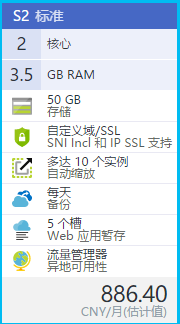
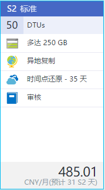
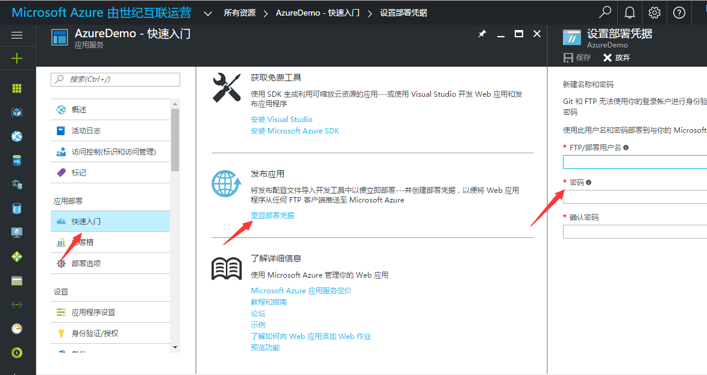

<properties
	pageTitle="盛派自助微信营销系统 | Azure"
    description="盛派自助微信营销系统"
    services=""
    documentationCenter=""
    authors=""
    manager=""
    editor=""
    tags=""/>

<tags ms.service="multiple" ms.date="" wacn.date="01/17/2017"/>

# 盛派自助微信营销系统

## AzureDemo 部署方案

### 环境要求

1. Web 应用服务

    
 	
2. Redis 缓存

    
 
3. DataBase 数据库

    
 
4. 认知服务

    - 计算机视觉
    - 情绪感知

>[AZURE.NOTE]以上配置仅供参考。

### 环境配置
1.	Web 应用

    1. 域名配置

        
 
        >[AZURE.NOTE]域名需要做 CName 映射,到域名购买平台做 CName 映射。

    2. Ftp 配置

        
			 			 
2. Redis 缓存

    仅允许 SSL 访问

    
				 
3. DataBase数据库

    将所需 IP 地址加入数据库防火墙

4. 微信公众号配置
	
    1) 接口权限申请

    
			 
    2) 域名配置

    
			 
    3) 业务域名配置

    
 
    4) JS 接口安全域名配置

    
 
    5) 网页授权域名配置

    
 
				

##系统参数配置

1. DataBase 数据库：

    连接字符串 Key：ConnectionString

    格式: `data source=[Server Address];initial catalog=[DataBaseName];user id=[UserName];password=[Pwd];MultipleActiveResultSets=True;App=EntityFramework`

2. Rdis 缓存：

    连接字符串 Key：Cache_Redis_Configuration

    格式：`[],password=[],ssl=True,abortConnect=False`

    备注：Redis 缓存→设置→访问密钥→ 主连接字符串(StackExchange.Redis)

3. 认知服务：

    情绪感知 Key：EmotionKey

    计算机视觉 Key：VisionKey

4. 微信公众号

    公众号 AppId: Key：AppId
    公众号 AppSecret: Key：AppSecret

    >[AZURE.NOTE]微信公众号类型不能为订阅号。

5. 域名

    网站域名 Key：DomainName

>[AZURE.NOTE]网页授权以后的网站域名

## 项目初始化

1. 一键部署之后初次运行请在浏览器中输入 http://[域名]/ Install 完成项目初始化。

2. 初始化默认用户名 TNT2 密码 123123，请自行修改。

3. 后台管理登录地址 http://[域名]/AzureAdmin/Login。
