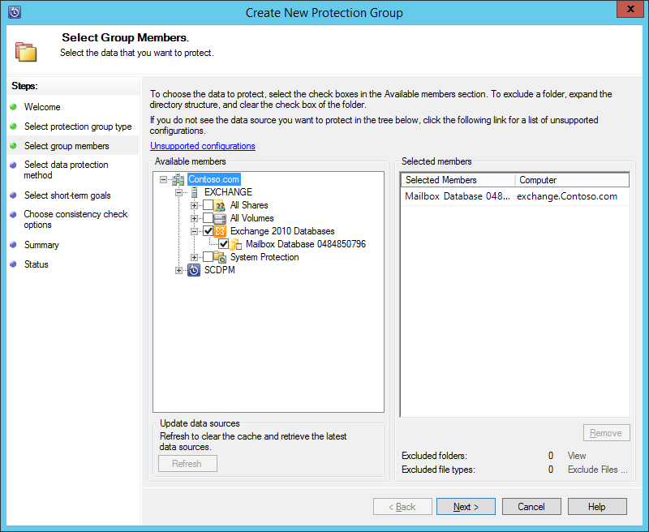
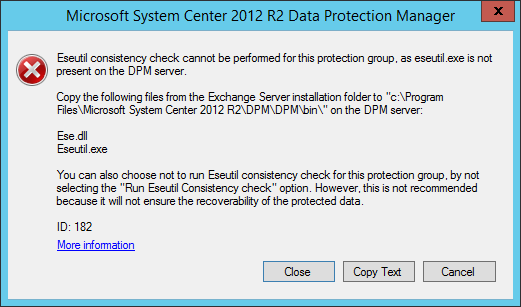
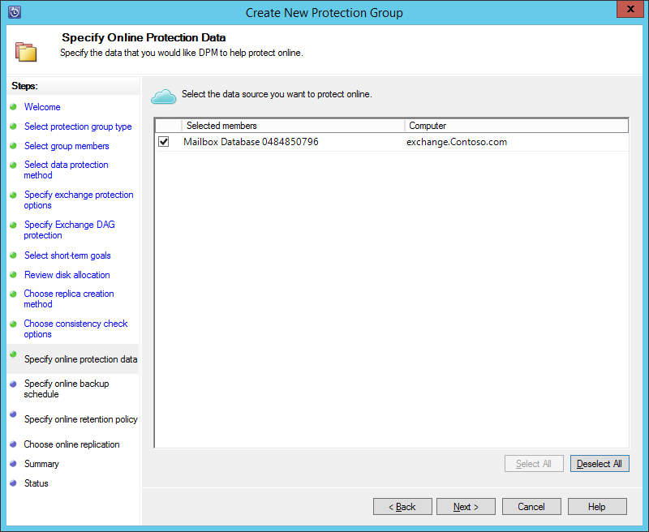
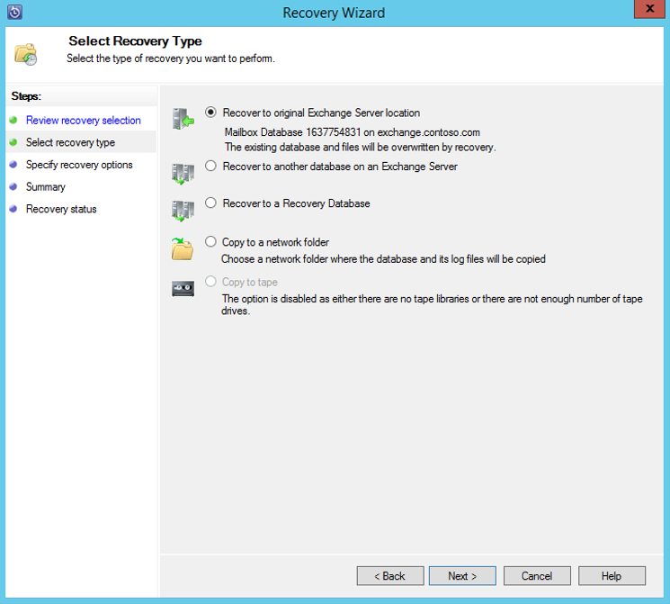

<properties
	pageTitle="使用 System Center 2012 R2 DPM 将 Exchange Server 备份到 Azure 备份 | Azure"
	description="了解如何使用 System Center 2012 R2 DPM 将 Exchange Server 备份到 Azure 备份"
	services="backup"
	documentationCenter=""
	authors="AnuragMehrotra"
	manager="shivamg"
	editor=""/>

<tags 
	ms.service="backup"
	ms.date="05/19/2016"
	wacn.date="09/04/2016"/>

# 使用 System Center 2012 R2 DPM 将 Exchange Server 备份到 Azure 备份
本文说明如何配置 System Center 2012 R2 Data Protection Manager (DPM) 服务器，以将 Microsoft Exchange Server 备份到 Azure 备份。

## 更新
若要在 Azure 备份中成功注册 DPM 服务器，必须安装 System Center 2012 R2 DPM 的最新更新汇总和 Azure 备份代理的最新版本。从 [Microsoft 目录](http://catalog.update.microsoft.com/v7/site/Search.aspx?q=System%20Center%202012%20R2%20Data%20protection%20manager)获取最新的更新汇总。

>[AZURE.NOTE] 对于本文中的示例，将会安装 Azure 备份代理 2.0.8719.0 版，并在 System Center 2012 R2 DPM 上安装更新汇总 6。

## 先决条件
在继续下一步之前，请确保符合使用 Microsoft Azure 备份保护工作负荷的所有[先决条件](/documentation/articles/backup-azure-dpm-introduction/#prerequisites)。这些先决条件包括：

- 已在 Azure 网站上创建备份保管库。
- 代理和保管库凭据已下载到 DPM 服务器。
- DPM 服务器上已安装代理。
- 已使用保管库凭据注册 DPM 服务器。
- 若要保护 Exchange 2016，请升级到 DPM 2012 R2 UR9 或更高版本

## DPM 保护代理  
若要在 Exchange Server 上安装 DPM 保护代理，请遵循以下步骤：

1. 确保已正确配置防火墙。请参阅[配置代理的防火墙异常](https://technet.microsoft.com/library/Hh758204.aspx)。

2. 在 DPM 管理员控制台中单击“管理”>“代理”>“安装”，在 Exchange Server 上安装代理。有关详细步骤，请参阅[安装 DPM 保护代理](https://technet.microsoft.com/library/hh758186.aspx?f=255&MSPPError=-2147217396)。

## 为 Exchange Server 创建保护组

1. 在 DPM 管理员控制台中，单击“保护”，然后单击工具功能区上的“添加”，以打开“创建新保护组”向导。

2. 在向导的“欢迎”屏幕上单击“下一步”。

3. 在“选择保护组类型”屏幕上，选择“服务器”并单击“下一步”。

4. 选择想要保护的 Exchange Server 数据库，然后单击“下一步”。

    >[AZURE.NOTE]如果要保护 Exchange 2013，请检查 [Exchange 2013 先决条件](https://technet.microsoft.com/library/dn751029.aspx)。

    下例中选择了Exchange 2010 数据库。

    

5. 选择数据保护方法。

    为保护组命名，然后选择以下两个选项：

    - 我想要使用磁盘提供短期保护。
    - 我想要使用在线保护。

6. 单击**“下一步”**。

7. 如果想要检查 Exchange Server 数据库的完整性，请选择“运行 Eseutil 以检查数据完整性”选项。

    选择此选项后，将在 DPM 服务器上运行备份一致性检查，以避免由于在 Exchange Server 上运行 **eseutil** 命令而产生的 I/O 流量。

    >[AZURE.NOTE]若要使用此选项，必须将 Ese.dll 和 Eseutil.exe 文件复制到 DPM 服务器上的 C:\\Program Files\\Microsoft System Center 2012 R2\\DPM\\DPM\\bin 目录。否则会触发以下错误：  
    

8. 单击**“下一步”**。

9. 选择“复制备份”的数据库，然后单击“下一步”。

    >[AZURE.NOTE]如果未针对数据库的至少一个 DAG 副本选择“完全备份”，则不会截断日志。

10. 配置“短期备份”的目标，然后单击“下一步”。

11. 检查可用磁盘空间，然后单击“下一步”。

12. 选择 DPM 服务器创建初始复制的时间，然后单击“下一步”。

13. 选择一致性检查选项，然后单击“下一步”。

14. 选择要备份到 Azure 数据库，然后单击“下一步”。例如：

    

15. 定义“Azure 备份”的计划，然后单击“下一步”。例如：

    

    >[AZURE.NOTE] 请注意，在线恢复点基于快速完全恢复点。因此，必须将在线恢复点安排在针对快速完全恢复点指定的时间之后。

16. 配置“Azure 备份”的保留策略，然后单击“下一步”。

17. 选择在线复制选项并单击“下一步”。

    如果你有大型数据库，通过网络创建初始备份所需的时间会很长。若要避免此问题，你可以创建脱机备份。

    

18. 确认设置，然后单击“创建组”。

19. 单击“关闭”。

## 恢复 Exchange 数据库

1. 若要恢复 Exchange 数据库，请在 DPM 管理员控制台中单击“恢复”。

2. 找到要恢复的 Exchange 数据库。

3. 从“恢复时间”下拉列表中选择在线恢复点。

4. 单击“恢复”启动“恢复向导”。

在线恢复点有五种恢复类型：

- **恢复到原始 Exchange Server 位置：**数据将恢复到原始 Exchange Server。
- **恢复到 Exchange Server 上的其他数据库：**数据将恢复到其他 Exchange Server 上的其他数据库。
- **恢复到恢复数据库：**数据将恢复到 Exchange 恢复数据库 (RDB)。
- **复制到网络文件夹：**数据将恢复到网络文件夹。
- **复制到磁带：**如果 DPM 服务器上安装并配置了磁带库或独立的磁带机，则恢复点将复制到可用的磁带。

    

## 后续步骤

- [Azure 备份常见问题](/documentation/articles/backup-azure-backup-faq/)

<!---HONumber=Mooncake_0627_2016-->