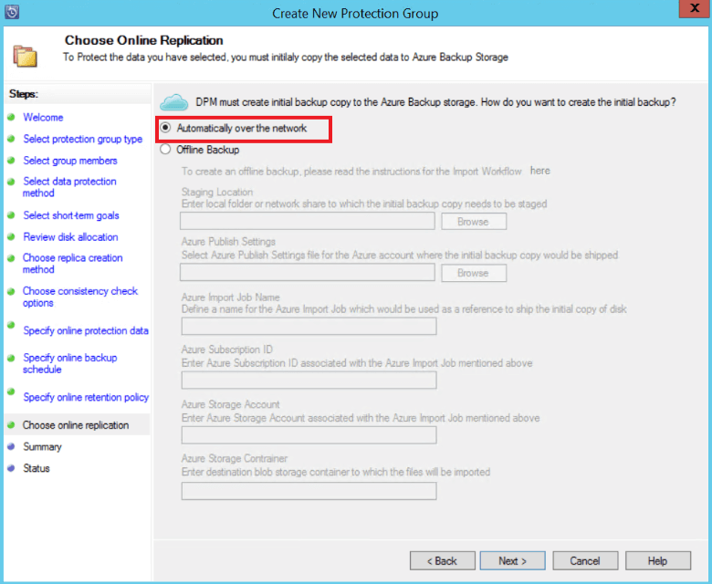
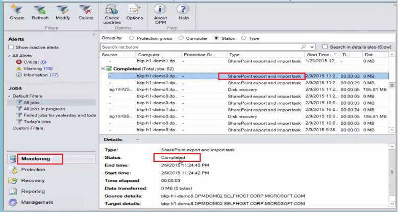
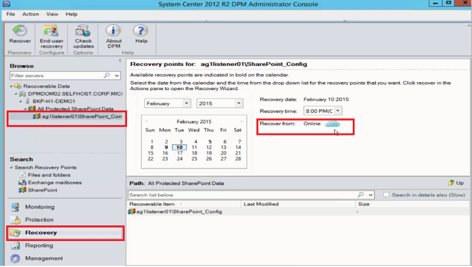

<properties
	pageTitle="在 Azure 中使用 DPM/Azure 备份服务器保护 SharePoint 场 | Azure"
	description="本文概述如何在 Azure 中使用 DPM/Azure 备份服务器保护 SharePoint 场"
	services="backup"
	documentationCenter=""
	authors="nkolli1"
	manager="shreeshd"
	editor=""/>

<tags
	ms.service="backup" 
	ms.date="06/06/2015"
	wacn.date="07/04/2016"/>

# 将 SharePoint 场备份到 Azure
使用 System Center Data Protection Manager (DPM) 将 SharePoint 场备份到 Microsoft Azure，其方法与备份其他数据源极为类似。Azure 备份提供灵活的备份计划来创建每日、每周、每月或每年备份点，并提供适用于各种备份点的保留策略选项。利用 DPM，不仅可以存储本地磁盘副本以实现快速的恢复时间目标 (RTO)，还可以将副本存储到 Azure 以进行经济高效的长期保留。

## SharePoint 支持的版本与相关保护方案
DPM 的 Azure 备份支持以下方案。

| 工作负载 | 版本 | Sharepoint 部署 | DPM 部署类型 | DPM - System Center 2012 R2 | 保护和恢复 |
| -------- | ------- | --------------------- | ------------------- | --------------------------- | ----------------------- |
| SharePoint | SharePoint 2013、SharePoint 2010、SharePoint 2007、SharePoint 3.0 | 作为物理服务器或 Hyper-V/VMware 虚拟机部署的 SharePoint   --------------   SQL AlwaysOn | 物理服务器或本地 Hyper-V 虚拟机 | 支持从更新汇总 5 备份到 Azure | 保护 SharePoint 场恢复选项：从磁盘恢复点恢复场、数据库、文件或列表项。从 Azure 恢复点恢复场和数据库。 |

## 开始之前
在将 SharePoint 场备份到 Azure 之前，需要确保满足几个条件。

### 先决条件
在继续之前，请确保符合使用 Microsoft Azure 备份保护工作负荷的所有[先决条件](/documentation/articles/backup-azure-dpm-introduction/#prerequisites)。先决条件包括如下任务：创建备份保管库、下载保管库凭据、安装 Azure 备份代理，以及在保管库中注册 DPM/Azure 备份服务器。

### DPM 代理
必须在运行 SharePoint Server 或 SQL Server 的服务器以及属于 SharePoint 场的任何其他服务器上安装 DPM 代理。有关如何设置保护代理的详细信息，请参阅 [设置保护代理](https://technet.microsoft.com/library/hh758034(v=sc.12).aspx)。唯一的例外是，你只能在单个 Web 前端 (WFE) 服务器上安装代理。DPM 只需将一台 WFE 服务器上的代理作为保护的入口点。

### SharePoint 场
针对场中的每 1000 万个项，必须有至少 2 GB 的卷空间用于放置 DPM 文件夹。此空间对目录生成是必要的。为了使 DPM 恢复特定项（网站集合、站点、列表、文档库、文件夹、单个文档与列表项），目录生成将创建一个包含在每个内容数据库中的 URL 列表。你可以在 DPM 管理员控制台的“恢复”任务区域中，查看“可恢复项”窗格中的 URL 列表。

### SQL Server
DPM 以本地系统的形式运行，并备份 SQL Server 数据库，它需要对帐户具有 SQL Server 的 sysadmin 权限。在你想要备份的 SQL Server 上，将 NT AUTHORITY\\SYSTEM 设置为 *sysadmin*。

如果 SharePoint 场有使用 SQL Server 别名配置的 SQL Server 数据库，请在 DPM 将要保护的前端 Web 服务器上安装 SQL Server 客户端组件。

### SharePoint Server
尽管性能取决于许多因素，例如 SharePoint 场的大小，但一般做法是使用一台 DPM 服务器来保护 25 TB 的 SharePoint 场。

### DPM Update Rollup 5
若要开始在 Azure 上保护 SharePoint 场，你需要安装 DPM 更新汇总 5 或更高版本。如果使用 SQL AlwaysOn 配置 SharePoint 场，更新汇总 5 将提供在 Azure 上保护该场的功能。有关详细信息，请参阅介绍 [DPM Update Rollup 5](http://blogs.technet.com/b/dpm/archive/2015/02/11/update-rollup-5-for-system-center-2012-r2-data-protection-manager-is-now-available.aspx)（DPM 更新汇总 5）的博文

### 不支持的功能
- 保护 SharePoint 场的 DPM 不会保护搜索索引或应用程序服务数据库。你需要单独为这些数据库配置保护。
- DPM 不提供横向扩展文件服务器 (SOFS) 共享托管的 SharePoint SQL Server 数据库备份。

## 配置 SharePoint 保护
必须使用 **ConfigureSharePoint.exe** 配置 SharePoint VSS 写入器服务（WSS 写入器服务），才能使用 DPM 保护 SharePoint。

可以在前端 Web 服务器的 [DPM 安装路径]\\bin 文件夹中找到 **ConfigureSharePoint.exe**。此工具可将 SharePoint 场的凭据提供给保护代理。应在单个 WFE 服务器上运行该工具。如果有多个 WFE 服务器，在配置保护组时，请只选择其中一个。

### 配置 SharePoint VSS 写入器服务
1. 在 WFE 服务器上的命令提示符下，切换到 [DPM 安装路径]\\bin\\
2. 运行 ConfigureSharePoint-EnableSharePointProtection
3. 输入场管理员凭据。此帐户应是 WFE 服务器上本地管理员组的成员。如果场管理员不是本地管理员，请在 WFE 服务器上授予以下权限：
  - 授予 WSS_Admin_WPG 组对 DPM 文件夹 (%Program Files%\\Microsoft Data Protection Manager\\DPM) 的完全控制权。
  - 授予 WSS_Admin_WPG 组对 DPM 注册表项 (HKEY_LOCAL_MACHINE\\SOFTWARE\\Microsoft\\Microsoft Data Protection Manager) 的读取访问权限。

>[AZURE.NOTE]每当 SharePoint 场管理员凭据发生更改时，你需要重新运行 ConfigureSharePoint.exe。

## 使用 DPM 备份 SharePoint 场
如前所述配置 DPM 和 SharePoint 场之后，可以使用 DPM 保护 SharePoint。

### 保护 SharePoint 场
1. 在 DPM 管理员控制台的“保护”选项卡中，单击“新建”。
    

2. 在“创建新保护组”向导的“选择保护组类型”屏幕上，选择“服务器”，然后单击“下一步”。

    

3. 在“选择组成员”屏幕上，选中你要保护的 SharePoint 服务器对应的复选框，然后单击“下一步”

    

    >[AZURE.NOTE] 在已安装 DPM 代理的情况下，你可以在向导中看到该服务器。DPM 还会显示其结构。由于已运行 ConfigureSharePoint.exe，DPM 将与 SharePoint VSS 写入器服务及其对应的 SQL Server 数据库通信，并识别 SharePoint 场结构、关联的内容数据库和任何对应项。

4. 在“选择数据保护方法”页上，输入“保护组”的名称，然后选择偏好的“保护方法”。单击**“下一步”**。

    

    >[AZURE.NOTE]选择磁盘保护有助于达到简短恢复时间的恢复时间目标。相比于磁带，Azure 是具有成本效益的长期保护目标。有关详细信息，请参阅此[文章](/documentation/articles/backup-azure-backup-cloud-as-tape/)。

5. 在“指定短期目标”页上，选择偏好的“保留范围”，并指定备份时间。

    

    >[AZURE.NOTE]由于恢复大多数针对少于五天的数据进行，因此我们在此示例中选择了在磁盘上保留 5 天，并确保在非生产时段进行备份。

6. 复查为保护组分配的存储池磁盘空间，然后单击“下一步”。

7. 对于每个保护组，DPM 将分配磁盘空间用于存储和管理副本。此时，DPM 必须创建选定数据的副本。选择创建副本的方法和时间，然后单击“下一步”。

    

    >[AZURE.NOTE]若要确保不会影响网络流量，请选择生产时段之外的时间。

8. DPM 可对副本执行一致性检查，以确保数据完整性。有两个可用的选项。你可以定义运行一致性检查的计划，或在副本变得不一致时，让 DPM 自动运行一致性检查。选择你偏好的选项，然后单击“下一步”。

    

9. 在“指定联机保护数据”屏幕上，选择你要保护的 SharePoint 场，然后单击“下一步”。

    

10. 在“指定联机备份计划”屏幕上，选择你偏好的计划，然后单击“下一步”。

    

    >[AZURE.NOTE] DPM 允许在每天的 2 个不同时间备份到 Azure。Azure 备份还提供了一项功能，可让你使用 [Azure 备份网络限制](/documentation/articles/backup-configure-vault/#enable-network-throttling)来控制高峰期和非高峰期用于备份的 WAN 带宽量。

11. 根据选择的备份计划，在“指定联机保留策略”屏幕上，选择每日、每周、每月和每年备份点的保留策略。

    

    >[AZURE.NOTE]DPM 使用 Grandfather-father-son 保留方案，可让你为不同的备份点选择不同的保留策略。

12. 类似于磁盘，需要在 Azure 中创建初始引用点副本。选择在 Azure 中创建初始备份副本的偏好选项，然后单击“下一步”。

    

13. 在“摘要”页上复查选择的设置，然后单击“创建组”。创建保护组之后，你将看到成功消息。

    

## 使用 DPM 从磁盘还原 SharePoint 项
在以下示例中，“恢复 SharePoint 项”被意外删除，需要恢复。

1. 打开“DPM 管理员控制台”。DPM 保护的所有 SharePoint 场都在“保护”选项卡中显示。

    

2. 若要开始恢复该项，请选择“恢复”选项卡。

    

3. 可以通过在恢复点范围内执行基于通配符的搜索，在 SharePoint 中搜索“恢复 SharePoint 项”。

    

4. 从搜索结果中选择相应的恢复点，单击右键该项，然后选择“恢复”。

5. 你还可以浏览各个恢复点，并选择要恢复的数据库或项。选择“日期 > 恢复时间”，然后选择正确的“数据库 > SharePoint 场 > 恢复点 > 项”。

    

6. 右键单击该项，然后选择“恢复”打开“恢复向导”。单击**“下一步”**。

    

7. 选择你要执行的恢复类型，然后单击“下一步”。

    

    >[AZURE.NOTE] 示例中所选的“恢复到原始”会将该项恢复到原始 SharePoint 站点。

8. 选择你要使用的“恢复过程”。
    - 如果 SharePoint 场未更改，并且与正在还原的恢复点相同，请选择“不使用恢复场进行恢复”。
    - 如果 SharePoint 场自创建恢复点后已更改，请选择“使用恢复场进行恢复”。

    

9. 提供暂时恢复数据库的暂存 SQL Server 实例位置，并在要恢复该项的 DPM 服务器和运行 SharePoint 的服务器上提供暂存文件共享。

    

    DPM 将托管 SharePoint 项的内容数据库附加到临时 SQL Server 实例。DPM 服务器将从内容数据库恢复该项，并将它放在 DPM 服务器上的暂存文件位置。现在，需要将 DPM 服务器上位于暂存位置的已恢复项导出到 SharePoint 场上的暂存位置。

    

10. 选择“指定恢复选项”，并将安全设置应用到 SharePoint 场，或应用恢复点的安全设置。单击**“下一步”**。

    

    >[AZURE.NOTE] 你可以选择限制网络带宽使用率。这可以在生产时段最大程度地降低对生产服务器的影响。

11. 复查摘要信息，然后单击“恢复”开始恢复文件。

    

12. 现在，在“DPM 管理员控制台”中选择“监视”选项卡以查看恢复的“状态”。

    

    >[AZURE.NOTE] 文件现已还原。你可以刷新 SharePoint 站点来检查已还原的文件。

## 使用 DPM 从 Azure 还原 SharePoint 数据库

1. 若要恢复 SharePoint 内容数据库，请浏览各个恢复点（如上所示），并选择要还原的恢复点。

    

2. 双击 SharePoint 恢复点以显示可用的 SharePoint 目录信息。

    > [AZURE.NOTE] 由于 SharePoint 场在 Azure 中受长期保留保护，因此 DPM 服务器上没有可用的目录信息（元数据）。这样，每当需要恢复时间点 SharePoint 内容数据库时，你都需要重新编录 SharePoint 场。

3. 单击“重新编目”。

    

    此时将显示“云重新编录”状态窗口。

    

    完成编录后，状态将更改为“成功”。单击“关闭”。

    

4. 单击 DPM“恢复”选项卡中显示的 SharePoint 对象，以获取内容数据库结构。右键单击相应的项，然后单击“恢复”。

    

5. 此时，请按照[上述恢复步骤](#restore-a-sharepoint-item-from-disk-using-dpm)，从磁盘恢复 Sharepoint 内容数据库。

## 常见问题
问：哪些版本的 DPM 支持 SQL 2014 和 SQL 2012 (SP2) 
答：包含 Update Rollup 4 的 DPM 2012 R2 提供此支持

问：如果使用 SQL AlwaysOn（使用磁盘上保护）配置了 SharePoint，我是否能将 SharePoint 项恢复到原始位置？  
答：可以，该项可以恢复到原始 SharePoint 站点。

问：如果使用 SQL AlwaysOn 配置了 SharePoint，我是否能将 SharePoint 数据库恢复到原始位置？  
答：由于 SharePoint 数据库是在 SQL AlwaysOn 中配置的，因此除非删除可用性组，否则无法修改它们。因此，DPM 无法将数据库还原到原始位置。你可以将 SQL Server 数据库恢复到另一个 SQL Server 实例。

## 后续步骤
- 了解有关使用 DPM 保护 SharePoint 的详细信息 — 参阅[视频系列 — 使用 DPM 保护 SharePoint](http://channel9.msdn.com/Series/Azure-Backup/Microsoft-SCDPM-Protection-of-SharePoint-1-of-2-How-to-create-a-SharePoint-Protection-Group)
- 查看 [System Center 2012 - Data Protection Manager 发行说明](https://technet.microsoft.com/library/jj860415.aspx)
- 查看 [System Center 2012 SP1 中的 Data Protection Manager 发行说明](https://technet.microsoft.com/library/jj860394.aspx)

<!---HONumber=Mooncake_0627_2016-->