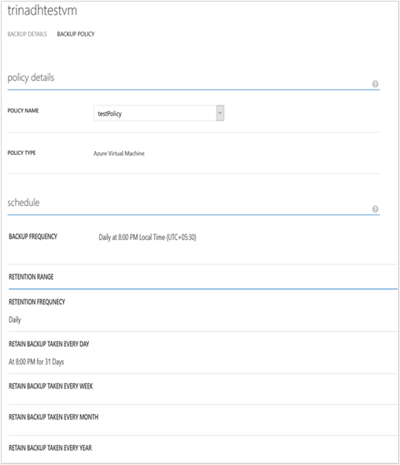

<properties
	pageTitle="管理和监视 Azure 虚拟机备份 | Azure"
	description="了解如何管理和监视 Azure 虚拟机备份"
	services="backup"
	documentationCenter=""
	authors="trinadhk"
	manager="shreeshd"
	editor=""/>

<tags
	ms.service="backup" 
	ms.date="05/06/2016"
	wacn.date="06/06/2016"/>

# 管理和监视 Azure 虚拟机备份

## 管理受保护的虚拟机

若要管理受保护的虚拟机，请执行以下操作：

1. 若要查看和管理某个虚拟机的备份设置，请单击“受保护的项”选项卡。

2. 单击受保护项的名称可以查看“备份详细信息”选项卡，其中显示了有关上次备份的信息。

    

3. 若要查看和管理某个虚拟机的备份策略设置，请单击“策略”选项卡。

    

    “备份策略”选项卡将显示现有策略。你可以根据需要进行更改。如果需要创建新策略，请在“策略”页上单击“创建”。请注意，如果要删除某个策略，则它不应当具有与之关联的任何虚拟机。

    

4. 可以在“作业”页上获取有关虚拟机的操作或状态的更多信息。单击列表中的某个作业可获取更多详细信息，还可以筛选特定虚拟机的作业。

    

## 虚拟机的按需备份
为虚拟机配置保护后，可以对它执行按需备份。如果虚拟机的初始备份已挂起，则按需备份将在 Azure 备份保管库中创建虚拟机的完整副本。如果已完成第一个备份，按需备份只会将以前备份的更改发送到 Azure 备份保管库。

若要执行虚拟机的按需备份，请执行以下操作：

1. 导航到“受保护的项”页，选择“Azure 虚拟机”作为“类型”（如果尚未选择），然后单击“选择”按钮。

    

2. 选择你要进行按需备份的虚拟机，然后单击页底部的“立即备份”按钮。

    

    这会在选定的虚拟机上创建备份作业。通过此作业创建的恢复点保留范围与在虚拟机关联的策略中指定的保留范围相同。

    

    >[AZURE.NOTE]若要查看与虚拟机关联的策略，请向下钻取到“受保护的项”页中的虚拟机，然后转到“备份策略”选项卡。

3. 创建作业后，可以单击 Toast 栏中的“查看作业”按钮，以在“作业”页中查看相应的作业。

    

4. 成功完成作业后，即会创建可用来还原虚拟机的恢复点。这还会使“受保护的项”页中的恢复点列值递增 1。

## 停止保护虚拟机
可以使用以下选项来选择停止虚拟机的将来备份：

- 保留 Azure 备份保管库中与虚拟机关联的备份数据
- 删除与虚拟机关联的备份数据

如果你已选择保留与虚拟机关联的备份数据，则可使用该备份数据来还原虚拟机。有关此类虚拟机的定价详细信息，请单击[此处](/home/features/back-up/pricing/)。

若要停止保护虚拟机，请执行以下操作：

1. 导航到“受保护的项”页，选择“Azure 虚拟机”作为筛选类型（如果尚未选择），然后单击“选择”按钮。

    

2. 选择虚拟机，然后单击页底部的“停止保护”。

    

3. 默认情况下，Azure 备份不会删除与虚拟机关联的备份数据。

    

    如果你要删除备份数据，请选中该复选框。

    

    请选择停止备份的理由。尽管理由是选填的，但提供理由可帮助 Azure 备份处理反馈，并根据客户的情况设置处理优先级。

4. 单击“提交”按钮以提交“停止保护”作业。单击“查看作业”，在“作业”页中查看相应的作业。

    

    如果你未在“停止保护”向导中选择“删除关联的备份数据”选项，则在作业完成后，保护状态将更改为“已停止保护”。数据将会使用 Azure 备份保留，直到被显式删除。你随时都可通过在“受保护的项”页中选择虚拟机，然后单击“删除”来删除数据。

    

    如果你已选择“删除关联的备份数据”选项，则虚拟机将不会出现在“受保护的项”页中。

## 重新保护虚拟机
如果你未在“停止保护”中选择“删除关联的备份数据”选项，可以遵循类似于备份已注册虚拟机的步骤来重新保护虚拟机。受保护后，此虚拟机将在停止保护之前保留备份数据，并在重新保护后创建恢复点。

重新保护之后，如果有“停止保护”之前的恢复点，则虚拟机的保护状态将更改为“受保护”。

  

>[AZURE.NOTE]重新保护虚拟机时，你可以选择一个不同的策略，而不是最初用于保护虚拟机的策略。

## 取消注册虚拟机

如果你想要从备份保管库中删除虚拟机，请执行以下操作：

1. 单击页底部的“取消注册”按钮。

    

    屏幕底部将会显示要求你进行确认的 Toast 通知。单击“是”继续。

    

## 删除备份数据
你可以通过以下方法之一删除与虚拟机关联的备份数据：

- 在停止保护作业期间
- 在虚拟机上完成停止保护作业之后

对于在成功完成“停止备份”作业后处于“已停止保护”状态的虚拟机，若要删除其上的备份数据，请执行以下操作：

1. 导航到“受保护的项”页，选择“Azure 虚拟机”作为类型，然后单击“选择”按钮。

    

2. 选择虚拟机。虚拟机将显示为“已停止保护”状态。

    

3. 单击页底部的“删除”按钮。

    

4. 在“删除备份数据”向导中，选择删除备份数据的原因（强烈建议），然后单击“提交”。

    

5. 这将创建一个作业来删除选定虚拟机的备份数据。单击“查看作业”，在“作业”页中查看相应的作业。

    

    完成该作业后，与虚拟机对应的条目将从“受保护的项”页中删除。

## 仪表板
在“仪表板”页中，可以查看有关 Azure 虚拟机、其存储和过去 24 小时内关联作业的信息。你可以查看备份状态和任何关联的备份错误。

>[AZURE.NOTE]仪表板中的值每 24 小时刷新一次。

## 审核操作
可以通过 Azure 备份来查看客户触发的备份操作的“操作日志”，因此可以轻松地确切了解针对备份保管库执行了哪些管理操作。通过操作日志，可以针对备份操作进行很好的事后总结和审核。

操作日志中记录了以下操作：

- 注册
- 注销
- 配置保护
- 备份（二者均可通过 BackupNow 以按需备份的形式进行计划）
- 还原
- 停止保护
- 删除备份数据
- 添加策略
- 删除策略
- 更新策略
- 取消作业

若要查看某个备份保管库的相应操作日志，请执行以下操作：

1. 导航到 Azure 经典管理门户中的“管理服务”，然后单击“操作日志”选项卡。

    

2. 在筛选器中选择“备份”作为“类型”，在“服务名称”中指定备份保管库名称，然后单击“提交”。

    

3. 在操作日志中，选择任意操作，然后单击“详细信息”查看与操作相对应的详细信息。

    

    “详细信息向导”包含与触发的操作、作业 ID、触发此操作时所在的资源以及操作启动时间相关的信息。

    

## 警报通知
你可以获取经典管理门户中作业的自定义警报通知。为此，你需要针对操作日志事件定义基于 PowerShell 的警报规则。我们建议使用 PowerShell 1.3.0 或更高版本。

若要定义自定义通知以便在备份失败时发出警报，可使用如下所示的示例命令：

		PS C:\> $actionEmail = New-AzureRmAlertRuleEmail -CustomEmail contoso@microsoft.com
		PS C:\> Add-AzureRmLogAlertRule -Name backupFailedAlert -Location "East US" -ResourceGroup RecoveryServices-DP2RCXUGWS3MLJF4LKPI3A3OMJ2DI4SRJK6HIJH22HFIHZVVELRQ-East-US -OperationName Microsoft.Backup/backupVault/Backup -Status Failed -TargetResourceId /subscriptions/86eeac34-eth9a-4de3-84db-7a27d121967e/resourceGroups/RecoveryServices-DP2RCXUGWS3MLJF4LKPI3A3OMJ2DI4SRJK6HIJH22HFIHZVVELRQ-East-US/providers/microsoft.backupbvtd2/BackupVault/trinadhVault -Actions $actionEmail

**ResourceId**：你可以从“操作日志”弹出窗口中获取此项，如以上部分所述。操作的详细信息弹出窗口中的 ResourceUri 是要针对此 cmdlet 提交的 ResourceId。

**OperationName**：采用“Microsoft.Backup/backupvault/<EventName>”格式，其中，EventName 的值为 Register、Unregister、ConfigureProtection、Backup、Restore、StopProtection、DeleteBackupData、CreateProtectionPolicy、DeleteProtectionPolicy、UpdateProtectionPolicy 中的一个

**Status**：支持的值包括 Started、Succeeded 和 Failed。

**ResourceGroup**：触发操作时所在的资源的 ResourceGroup。可以从 ResourceId 值获取此项。ResourceId 值中字段 */resourceGroups/* 与字段 */providers/* 之间的值是 ResourceGroup 的值。

**Name**：警报规则的名称。

**CustomEmail**：指定要向其发送警报通知的自定义电子邮件地址

**SendToServiceOwners**：此选项会将警报通知发送给订阅的所有管理员和共同管理员。可以在 **New-AzureRmAlertRuleEmail** cmdlet 中使用

### 对警报的限制
基于事件的警报会受到以下限制：

1. 警报在备份保管库的所有虚拟机上触发。你不能通过自定义来获取备份保管库中特定虚拟机集的警报。
2. 此功能以预览版提供。[了解详细信息](/documentation/articles/insights-powershell-samples/#create-alert-rules)
3. 你将收到来自“alerts-noreply@mail.windowsazure.com”的警报。目前你无法修改电子邮件发件人。 

## 后续步骤

- [还原 Azure VM](/documentation/articles/backup-azure-restore-vms/)

<!---HONumber=Mooncake_0530_2016-->