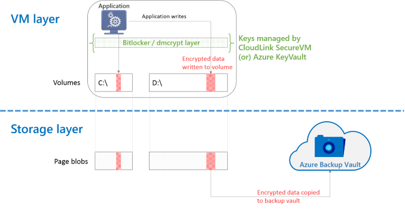

<properties
   pageTitle="Azure 备份 - 备份包含加密磁盘的 Azure IaaS VM | Azure"
   description="了解 Azure 备份在备份 IaaS VM 期间如何处理使用 BitLocker 或 dmcrypt 加密的数据。本文帮助你预先了解在处理加密的磁盘时，备份和还原体验的差异。"
   services="backup"
   documentationCenter=""
   authors="markgalioto"
   manager="jwhit"
   editor=""/>
<tags
   ms.service="backup"
   ms.date="03/14/2016"
   wacn.date="04/12/2016"/>

# VM 备份期间处理加密的磁盘

如果企业想要在 Azure 中加密其 VM 数据，可以使用 Bitlocker（在 Windows 计算机上）或 dmcrypt（在 Linux 计算机上）解决方案。两者都属于卷级加密解决方案。本文详细说明如何为此类 Azure VM 设置备份，以及加密的数据对于还原工作流的影响。

## 备份工作原理

整体解决方案包括两个层：VM 层和存储层。

1. VM 层处理来宾操作系统和虚拟机中运行的应用程序所看到的数据。它也是运行加密软件（Bitlocker 或 dmcrypt），以透明方式加密卷上的数据，然后将数据写入磁盘的层。
2. 存储层处理附加到 VM 的页 Blob 和磁盘。它不知道正在将哪些数据写入磁盘，也不知道数据是否已加密。这是运行 VM 备份功能所在的层。

整个数据加密以透明方式在 VM 层中无缝进行。因此，写入附加到 VM 的页 Blob 的数据是加密的数据。当 [Azure 备份创建 VM 的磁盘快照和传输数据](/documentation/articles/backup-azure-vms-introduction/#how-does-azure-back-up-virtual-machines)时，将复制页 Blob 上的加密数据。

## 解决方案组件

若要使此解决方案正常运行，需要正确配置和管理它包含的许多组件：

| 函数 | 使用的软件 | 附加说明 |
| -------- | ------------- | ------- |
| 加密 | Bitlocker 或 dmcrypt | 由于相比于 Azure 备份，这种加密在不同的层中进行，因此可以使用任何加密软件。尽管如此，我们只使用 Bitlocker 和 dmcrypt 验证了这种体验。   加密数据需要使用密钥。必须将密钥存放在安全的位置，以确保对数据的访问经过授权。 |
| 密钥管理 | CloudLink SecureVM 或 Azure KeyVault | 密钥是加密或解密数据的关键所在。如果没有正确的密钥，就无法检索数据。这对以下操作极其重要： <li>密钥滚动更新<li>长期保留  例如，用于备份 7 年前数据的密钥可能与当天使用的密钥不同。如果没有 7 年前的密钥，就无法使用从该时间还原的数据。|
| 数据备份 | Azure 备份 | 使用 Azure 备份并配合 [Azure 经典管理门户](http://manage.windowsazure.cn)或 PowerShell 来备份 Azure IaaS VM |
| 数据还原 | Azure 备份 | 使用 Azure 备份从恢复点还原磁盘或整个 VM。在执行还原操作过程中，Azure 备份不会解密数据。|
| 解密 | Bitlocker 或 dmcrypt | 为了从还原的数据磁盘或还原的 VM 读取数据，软件需有密钥管理软件提供的密钥。如果没有正确的密钥，就无法解密数据。 |

> [AZURE.IMPORTANT]  密钥管理（包括密钥滚动更新）不是 Azure 备份的一部分。这一方面需要分开管理，但对整体备份/还原操作很重要。

### 支持的方案

| &nbsp; | 备份保管库 | 恢复服务保管库 |
| :-- | :-- | :-- |
| Azure IaaS V1 VM | 是 | 否 |
| Azure IaaS V2 VM | 不适用 | 否 |

## CloudLink SecureVM

[CloudLink SecureVM](http://www.cloudlinktech.com/choose-your-cloud/microsoft-azure/) 是 VM 加密解决方案，可用于保护 Azure IaaS VM 数据。CloudLink SecureVM 可以配合 Azure 备份使用。

### 支持信息

- CloudLink SecureVM 版本 4.0（内部版本 21536.121 或更高）
- Azure PowerShell 0.9.8 或更高版本

### 密钥管理

当你需要滚动更新或更改已有备份的 VM 的密钥时，需要确保备份时所用的密钥可用。建议的方法之一是创建密钥存储区或整个 SecureVM 系统的备份。

### 文档和资源

- [部署指南 - PDF](http://www.cloudlinktech.com/Azure/CL_SecureVM_4_0_DG_EMC_Azure_R2.pdf)
- [部署和使用 SecureVM - 视频](https://www.youtube.com/watch?v=8AIRe92UDNg)

<!---HONumber=Mooncake_0530_2016-->