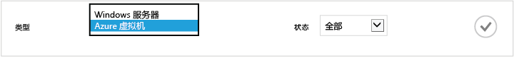
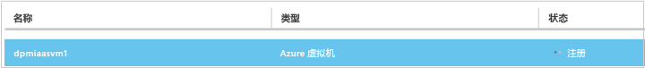
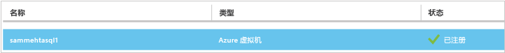
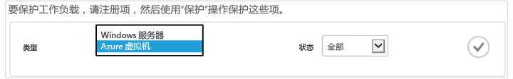
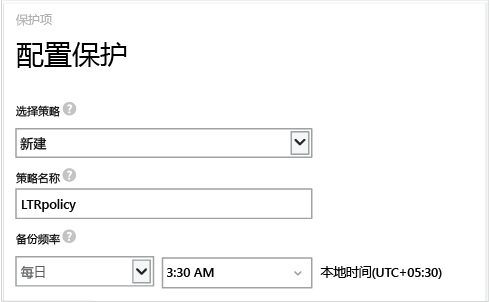
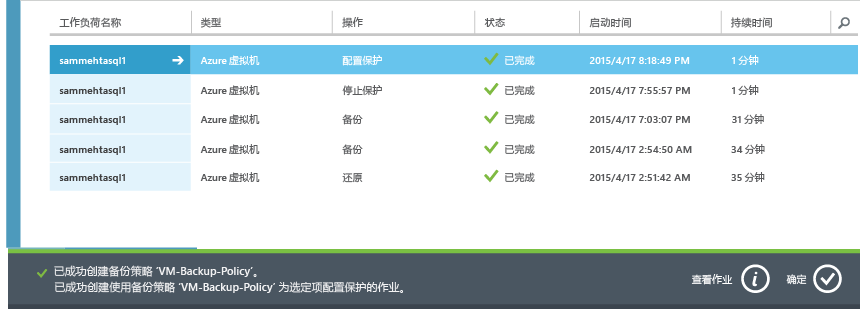

<properties
	pageTitle="使用 Azure 备份在 Azure 中保护 VM | Azure"
	description="使用 Azure 备份服务保护 Azure VM。本教程介绍如何在 Azure 中创建保管库、注册 VM、创建策略和保护 VM。"
	services="backup"
	documentationCenter=""
	authors="markgalioto"
	manager="jwhit"
	editor=""/>

<tags
	ms.service="backup"
	ms.date="04/22/2016"
	wacn.date="06/06/2016"/>

# 先睹为快：备份 Azure 虚拟机

本教程将引导你完成将 Azure 虚拟机 (VM) 备份到 Azure 的步骤。若要顺利完成本教程，必须满足以下先决条件：

- 已在 Azure 订阅中创建 VM。
- VM 已连接到 Azure 公共 IP 地址。有关更多信息，请参阅[网络连接](./backup-azure-vms-prepare.md#network-connectivity)。

若要备份 VM，需要执行五个主要步骤：

创建一个备份保管库，或指定现有的备份保管库。 
使用 Azure 经典管理门户来发现并注册虚拟机。 
安装 VM 代理。 
创建用于保护虚拟机的策略。 
运行备份。

>[AZURE.NOTE] Azure 有两种用于创建和使用资源的部署模型：[Resource Manager 和经典部署模型](/documentation/articles/resource-manager-deployment-model/)。本教程适用于可在 Azure 经典管理门户中创建的 VM。Azure 备份服务支持基于 Azure Resource Manager (ARM) 的 VM - 也称为 IaaS V2 VM。

## 步骤 1 - 为 VM 创建备份保管库

备份保管库是存储所有按时间创建的备份和恢复点的实体。备份保管库还包含将应用到要备份的虚拟机的备份策略。

1. 登录到 [Azure 经典管理门户](http://manage.windowsazure.cn/)。

2. 在 Azure 经典管理门户的左下角单击“新建”。

    

3. 在“快速创建”向导中，单击“数据服务”>“恢复服务”>“备份保管库”>“快速创建”。

    

    向导将提示你输入**名称**和**区域**。如果你管理多个订阅，将出现一个对话框让你选择订阅。

4. 对于“名称”，请输入一个友好名称来标识保管库。名称对于 Azure 订阅需要是唯一的。

5. 在“区域”中，为保管库选择地理区域。保管库**必须**与要保护的虚拟机位于同一区域中。

    如果你不知道 VM 所在的区域，请关闭此向导，然后单击 Azure 服务列表中的“虚拟机”。“位置”列提供区域的名称。如果你在多个区域中具有虚拟机，请在每个区域中创建备份保管库。

6. 如果向导中没有“订阅”对话框，请跳到下一个步骤。如果你使用多个订阅，请选择要与新备份保管库关联的订阅。

    

7. 单击“创建保管库”。创建备份保管库可能需要一段时间。可以在经典管理门户底部监视状态通知。

    

    将出现一条消息确认保管库已成功创建。该保管库在“恢复服务”页中以“活动”状态列出。

    

8. 在“恢复服务”页面的保管库列表中，选择创建的保管库以启动“快速启动”页面。

    

9. 在“快速启动”页面上，单击“配置”打开存储复制选项。
    

10. 在“存储复制”选项中，选择保管库的复制选项。

    

    默认情况下，保管库具有异地冗余存储。如果这是你的主要备份，请选择异地冗余存储。如果你想要一个更便宜、但持久性不太高的选项，请选择本地冗余存储。请在 [Azure Storage replication overview（Azure 存储复制概述）](/documentation/articles/storage-redundancy/)中深入了解异地冗余和本地冗余存储选项。

选择好保管库的存储选项后，可以开始将 VM 与保管库相关联。若要开始关联，请发现及注册 Azure 虚拟机。

## 步骤 2 - 发现并注册 Azure 虚拟机
向保管库注册 VM 之前，请运行发现过程以识别所有新 VM。随后将返回订阅中的虚拟机列表和其他信息，例如云服务名称、区域等。

1. 登录到 [Azure 经典管理门户](http://manage.windowsazure.cn/)

2. 在 Azure 经典管理门户中，单击“恢复服务”打开恢复服务保管库列表。
    

3. 从保管库列表中，选择要备份 VM 的保管库。

    当你选择保管库时，它将在“快速启动”页面中打开。

4. 在保管库菜单中，单击“已注册的项”。

    

5. 在“类型”菜单中选择“Azure 虚拟机”。

    

6. 单击页面底部的“发现”。
    

    发现过程可能会需要几分钟，将以表格显示虚拟机。屏幕底部有一个通知，让你知道系统正在运行发现过程。

    

    发现过程完成后，该通知会变化。

    

7. 单击页面底部的“注册”。
    

8. 在“注册项”快捷菜单中，选择你要注册的虚拟机。

    >[AZURE.TIP] 可以一次注册多个虚拟机。

    为每一个选定的虚拟机创建一个作业。

9. 单击通知中的“查看作业”，转到“作业”页。

    

    虚拟机还会出现在注册项列表中，并会显示注册操作的状态。

    

    操作完成后，状态会改变以反映“已注册”状态。

    

## 步骤 3 - 在虚拟机中安装 VM 代理

Azure VM 代理必须安装在 Azure 虚拟机上，备份扩展才能运行。如果你的 VM 是从 Azure 库创建的，则该 VM 上已包含 VM 代理。你可以跳到[保护 VM](/documentation/articles/backup-azure-vms-first-look/#step-4---protect-azure-virtual-machines)。

如果你的 VM 是从本地数据中心迁移的，则该 VM 上可能尚未安装 VM 代理。必须先在虚拟机上安装 VM 代理，然后才能继续保护 VM。有关安装 VM 代理的详细步骤，请参阅[“Backup VMs”（备份 VM）一文中的“VM Agent”（VM 代理）部分](/documentation/articles/backup-azure-vms-prepare/#vm-agent)。

## 步骤 4 - 创建备份策略
在触发初始备份作业之前，请设置计划来规定何时创建备份快照。规定备份快照创建时间以及快照保留时长的计划就是备份策略。保留期信息基于祖父-父-子备份轮转方案。

1. 导航到备份保管库（位于 Azure 经典管理门户的“恢复服务”下），然后单击“注册的项”。
2. 从下拉菜单中选择“Azure 虚拟机”。

    

3. 单击页面底部的“保护”。
    

    此时将显示“保护项”向导，其中只列出了已注册但未受保护的虚拟机。

    

4. 选择要保护的虚拟机。

    如果存在两个以上的同名虚拟机，请使用云服务来区别虚拟机。

5. 在“配置保护”菜单中，选择现有策略或创建新策略，以保护你标识的虚拟机。

    新备份保管库与一个默认策略相关联。此策略在每天晚上创建每日快照，该每日快照将保留 30 天。每个备份策略可以有多个关联的虚拟机。但无论何时，该虚拟机只能与一个策略相关联。

    

    >[AZURE.NOTE] 备份策略包括计划备份的保留期方案。如果选择现有的备份策略，则不能修改下一步的保留期选项。

6. 在“保留范围”中，定义特定备份点的每日、每周、每月和每年范围。

    

    保留策略指定存储备份的时间长短。你可以根据备份的时间指定不同的保留策略。

7. 单击“作业”查看“配置保护”作业的列表。

    

    现在你已创建策略，接下来请转到下一步骤，运行初始备份。

## 步骤 5 - 初始备份

在虚拟机受到策略保护后，可以在“受保护的项”选项卡上查看该关系。在执行初始备份之前，“保护状态”将显示为“受保护 - (等待初始备份)”。默认情况下，第一个计划的备份是初始备份。

若要立即开始初始备份，请执行以下操作：

1. 在“受保护的项”页面底部，单击“立即备份”。
    

    Azure 备份服务将为初始备份操作创建备份作业。

2. 单击“作业”选项卡查看作业列表。

    

    完成初始备份后，“受保护的项”选项卡中的虚拟机状态将显示为“受保护”。

    

    >[AZURE.NOTE] 备份虚拟机是在本地完成的过程。你不能将一个区域的虚拟机备份到另一个区域的备份保管库。因此，对于每个需要备份 VM 的 Azure 区域，需要在该区域中至少创建一个备份保管库。

## 后续步骤
成功备份 VM 后，你可能需要执行几个相关的步骤。最符合逻辑的步骤是让自己熟悉如何将数据还原到 VM，但是，也有帮助你了解如何确保数据安全并持续降skc低成本的管理任务。

- [管理和监视你的虚拟机](/documentation/articles/backup-azure-manage-vms/)
- [恢复虚拟机](/documentation/articles/backup-azure-restore-vms/)
- [故障排除指南](/documentation/articles/backup-azure-vms-troubleshoot/)

## 有疑问？
如果你有疑问，或者希望包含某种功能，请[给我们反馈](http://aka.ms/azurebackup_feedback)。

<!---HONumber=Mooncake_0530_2016-->