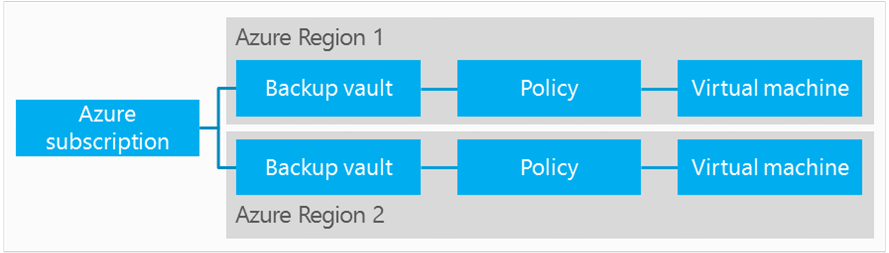
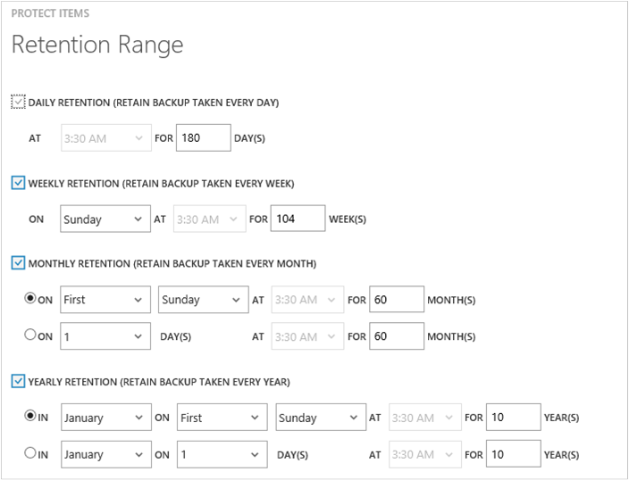

<properties
	pageTitle="使用 Azure 备份在 Azure 中保护 VM | Microsoft Azure"
	description="使用 Azure 备份服务保护 Azure VM。本教程介绍如何在 Azure 中创建保管库、注册 VM、创建策略和保护 VM。"
	services="backup"
	documentationCenter=""
	authors="markgalioto"
	manager="jwhit"
	editor=""/>

<tags
	ms.service="backup"
	ms.date="03/14/2016"
	wacn.date="05/09/2016"/>

# 先睹为快：备份 Azure 虚拟机

本教程将引导你完成一组用于准备 Azure 环境以便备份 Azure 虚拟机 (VM) 的步骤。本教程假设 Azure 订阅中已有 VM，且已采取措施以允许备份服务访问 VM。概括而言，你将要完成以下这些步骤。

1. 创建或登录到 Azure 订阅。
2. 在与 VM 相同的区域中创建备份保管库，或标识现有的备份保管库。
3. 使用 Azure 门户来发现并注册订阅中的虚拟机。
4. 在虚拟机上安装 VM 代理（如果使用 Azure 资源库中的 VM，则 VM 代理已经存在）。
5. 创建用于保护虚拟机的策略。
6. 运行备份。

>[AZURE.NOTE] Azure 有两种用于创建和使用资源的部署模型：[Resource Manager 和经典部署模型](/documentation/articles/resource-manager-deployment-model)。Azure 备份服务目前不支持基于 Azure Resource Manager (ARM) 的虚拟机（也称为 IaaS V2 虚拟机）。由于 Iaas V2 VM 在新的 Azure 门户发行时才推出，因此本教程当初在设计时适用于可在 Azure 经典门户中创建的 VM 类型。

## 步骤 1 - 为 VM 创建备份保管库

备份保管库是存储所有按时间创建的备份和恢复点的实体。备份保管库还包含将应用到要备份的虚拟机的备份策略。

下图显示了各种 Azure 备份实体之间的关系：
    

创建备份保管库的步骤：

1. 登录到 [Azure 门户](http://manage.windowsazure.cn/)。

2. 在 Azure 门户中，单击“新建”>“数据服务”>“恢复服务”>“备份保管库”>“快速创建”（请参阅下图）。

    

3. 对于“名称”，输入一个友好名称以标识此保管库。名称对于 Azure 订阅需要是唯一的。键入包含 2 到 50 个字符的名称。名称必须以字母开头，只能包含字母、数字和连字符。

4. 在“区域”中，为保管库选择地理区域。保管库必须与你要保护的虚拟机位于同一区域中。

    如果你不确定 VM 的所在区域，请关闭保管库创建对话框，并转到门户中的虚拟机列表。如果虚拟机位于多个区域，则你需要在每个区域中创建备份保管库，但是请在创建好第一个区域的保管库后再到下一个区域创建。无需指定存储帐户即可存储备份数据 — 备份保管库和 Azure 备份服务会自动处理这种情况。

5. 在“订阅”中，选择要与备份保管库关联的订阅。仅当组织帐户与多个 Azure 订阅关联时，才会有多个选项。

6. 单击“创建保管库”。创建备份保管库可能需要一段时间。可以在门户底部监视状态通知。

    

    一条消息将确认已成功创建保管库。并且将在“恢复服务”页上将保管库列出为“活动”保管库。

    

7. 在“恢复服务”页面的保管库列表中，单击创建的保管库以启动“快速启动”页面。

    

8. 在“快速启动”页面上，单击“配置”打开存储复制选项。
    

9. 在“存储复制”选项中，选择保管库的复制选项。

    

    默认情况下，保管库具有异地冗余存储。如果你使用 Azure 作为主要备份存储终结点，则建议继续使用异地冗余存储。如果使用 Azure 作为非主要的备份存储终结点，则可以考虑选择本地冗余存储，以减少在 Azure 中存储数据的成本。请在此[概述](../storage/storage-redundancy.md)中深入了解[异地冗余](/documentation/articles/storage-redundancy#geo-redundant-storage)和[本地冗余](/documentation/articles/storage-redundancy#locally-redundant-storage)存储选项。

选择好保管库的存储选项后，可以开始将 VM 与保管库相关联。若要开始关联，请发现及注册 Azure 虚拟机。

## 步骤 2 - 发现并注册 Azure 虚拟机
在向保管库注册 VM 前，请先执行发现过程，以确保能够识别任何添加到订阅中的新虚拟机。该过程将在 Azure 上查询订阅中的虚拟机列表和其他信息，例如云服务名称、区域等。

1. 登录到 [Azure 门户](http://manage.windowsazure.cn/)

2. 在 Azure 经典门户中，单击“恢复服务”打开恢复服务保管库列表。
    

3. 在“恢复服务”保管库列表中，选择用于备份 VM 的保管库。

    当你选择保管库时，它将在“快速启动”页面中打开。

4. 在保管库菜单（位于页面顶部）中，单击“已注册的项”。

5. 在“类型”菜单中选择“Azure 虚拟机”。

    

6. 单击页面底部的“发现”。
    

    发现过程可能会需要几分钟，将以表格显示虚拟机。屏幕底部有一个通知，让你知道系统正在运行发现过程。

    

    发现过程完成后，该通知会变化。

    

7. 单击页面底部的“注册”。
    

8. 在“注册项”快捷菜单中，选择你要注册的虚拟机。如果存在两个或两个以上的同名虚拟机，请使用云服务来区别它们。

    >[AZURE.TIP] 可以一次注册多个虚拟机。

    为每一个选定的虚拟机创建一个作业。

9. 单击通知中的“查看作业”，转到“作业”页。

    

    虚拟机还会出现在注册项列表中，并会显示注册操作的状态。

    

    操作完成后，状态会改变以反映“已注册”状态。

    

## 步骤 3 - 在虚拟机中安装 VM 代理

Azure VM 代理必须安装在 Azure 虚拟机上，备份扩展才能运行。如果 VM 创建自 Azure 资源库，则 VM 代理已存在于虚拟机上。但是，从本地数据中心迁移的 VM 上未安装 VM 代理。在这种情况下，必须显式安装 VM 代理。在尝试备份 Azure VM 之前，请先检查是否已在虚拟机上正确安装 Azure VM 代理（请参阅下表）。如果你要创建自定义 VM，[请先确保已选中“安装 VM 代理”复选框](/documentation/articles/virtual-machines-extensions-agent-about)，然后再预配虚拟机。

了解 [VM 代理](https://go.microsoft.com/fwLink/?LinkID=390493&clcid=0x409)以及[如何安装它](/documentation/articles/virtual-machines-extensions-install)。

下表提供了适用于 Windows 和 Linux VM 的 VM 代理的其他信息。

| **操作** | **Windows** | **Linux** |
| --- | --- | --- |
| 安装 VM 代理 | <li>下载并安装[代理 MSI](http://go.microsoft.com/fwlink/?LinkID=394789&clcid=0x409)。你需要有管理员权限才能完成安装。<li>[更新 VM 属性](http://blogs.msdn.com/b/mast/archive/2014/04/08/install-the-vm-agent-on-an-existing-azure-vm.aspx)，指明已安装代理。 | <li>从 GitHub 安装最新的 [Linux 代理](https://github.com/Azure/WALinuxAgent)。你需要有管理员权限才能完成安装。<li>[更新 VM 属性](http://blogs.msdn.com/b/mast/archive/2014/04/08/install-the-vm-agent-on-an-existing-azure-vm.aspx)，指明已安装代理。 |
| 更新 VM 代理 | 更新 VM 代理与重新安装 [VM 代理二进制文件](http://go.microsoft.com/fwlink/?LinkID=394789&clcid=0x409)一样简单。 确保在更新 VM 代理时，没有任何正在运行的备份操作。 | 按照[更新 Linux VM 代理](/documentation/articles/virtual-machines-linux-update-agent)上的说明进行操作。 确保在更新 VM 代理时，没有任何正在运行的备份操作。 |
| 验证 VM 代理安装 | <li>导航到 Azure VM 中的 C:\\WindowsAzure\\Packages 文件夹。<li>你应会发现 WaAppAgent.exe 文件已存在。<li> 右键单击该文件，转到“属性”，然后选择“详细信息”选项卡。“产品版本”字段应为 2.6.1198.718 或更高。 | 不适用 |

### 备份扩展

在虚拟机上安装 VM 代理后，Azure 备份服务会将备份扩展安装到 VM 代理上。Azure 备份服务会无缝地升级和修补备份扩展，不需用户进行额外的干预。

无论 VM 是否在运行，备份服务都安装备份扩展。VM 运行时，很有可能会获得应用程序一致的恢复点。但是，即使 VM 已关闭并且无法安装扩展，Azure 备份服务也会继续备份 VM。这被称为脱机 VM。在这种情况下，恢复点将是崩溃一致性恢复点。

## 步骤 4 - 保护 Azure 虚拟机
现在，你可以设置虚拟机的备份和保留策略。只需单个保护操作即可保护多个虚拟机。2015 年 5 月之后创建的 Azure 备份保管库内置了默认策略。此默认策略随附默认 30 天保留期和每日一次的备份计划。

1. 导航到备份保管库（位于 Azure 门户的“恢复服务”下），然后单击“注册的项”。
2. 从下拉菜单中选择“Azure 虚拟机”。

    

3. 单击页面底部的“保护”。
    

    “保护项目向导”随即出现，其中只列出已注册但未受保护的虚拟机。

    

4. 选择要保护的虚拟机。

    如果存在两个以上的同名虚拟机，请使用云服务来区别虚拟机。

5. 在“配置保护”上，选择现有策略或创建新策略，以保护你标识的虚拟机。

    每个备份策略可以有多个关联的虚拟机。但无论何时，该虚拟机只能与一个策略相关联。

    

    >[AZURE.NOTE] 备份策略包括计划备份的保留期方案。如果选择现有的备份策略，则不能修改下一步的保留期选项。

6. 在“保留范围”中，定义特定备份点的每日、每周、每月和每年范围。

    

    保留策略指定存储备份的时间长短。你可以根据备份的时间指定不同的保留策略。例如，在每个季末创建的备份点可能需要保留更长的时间（以便进行审核），而每天创建的备份点（用作操作恢复点）只需保留 90 天。

    

    在本示例图中：

    - **每天保留策略**：每天创建的备份存储 30 天。
    - **每周保留策略**：每个星期日创建备份并保留 104 周。
    - **每月保留策略**：每月最后一个星期日创建备份并保留 120 个月。
    - **每年保留策略**：每年 1 月份的第一个星期日创建备份并保留 99 年。

    为每个所选虚拟机创建一个作业，以便配置保护策略并将虚拟机关联到该策略。

6. 单击“作业”，并选择适当的筛选器来查看“配置保护”作业列表。

    

## 步骤 5 - 初始备份

在虚拟机受到策略保护后，可以在“受保护的项”选项卡上查看该关系。在 VM 执行初始备份前，“保护状态”将显示为“受保护 - (等待初始备份)”。默认情况下，第一个计划的备份是初始备份。

若要在配置保护后立即触发初始备份，请执行以下操作：

1. 在“受保护的项”页面上，单击页面底部的“立即备份”按钮。
    

    Azure 备份服务将为初始备份操作创建备份作业。

2. 单击“作业”选项卡查看作业列表。

    

    >[AZURE.NOTE] 在执行备份操作的过程中，Azure 备份服务将向虚拟机中的备份扩展发出一条命令，以刷新所有写入并取得一致的快照。

    完成初始备份后，“受保护的项”选项卡中的虚拟机状态将显示为“受保护”。

    

    >[AZURE.NOTE] 备份虚拟机是在本地完成的过程。你不能将一个区域的虚拟机备份到另一个区域的备份保管库。因此，对于每个需要备份 VM 的 Azure 区域，需要在该区域中至少创建一个备份保管库。

## 后续步骤
成功备份 VM 后，你可能需要执行几个相关的步骤。最符合逻辑的步骤是让自己熟悉如何将数据还原到 VM，但是，也有帮助你了解如何确保数据安全并持续降skc低成本的管理任务。

- [管理和监视你的虚拟机](/documentation/articles/backup-azure-manage-vms)
- [恢复虚拟机](/documentation/articles/backup-azure-restore-vms)
- [故障排除指南](/documentation/articles/backup-azure-vms-troubleshoot)

## 有疑问？
如果你有疑问，或者希望包含某种功能，请[给我们反馈](http://aka.ms/azurebackup_feedback)。

<!---HONumber=Mooncake_0405_2016-->