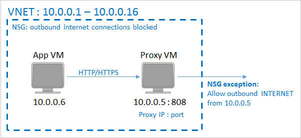
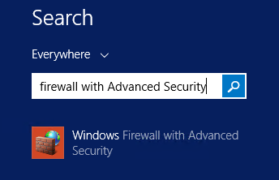

<properties
	pageTitle="进行备份 Azure 虚拟机所需的环境准备 | Microsoft Azure"
	description="确保进行备份 Azure 虚拟机所需的环境准备"
	services="backup"
	documentationCenter=""
	authors="Jim-Parker"
	manager="jwhit"
	editor=""/>

<tags
	ms.service="backup"
	ms.date="11/17/2015"
	wacn.date="01/26/2016"/>

# 进行备份 Azure 虚拟机所需的环境准备
备份 Azure 虚拟机 (VM) 之前，你需要符合这些先决条件才能对环境进行准备。如果已满足这些条件，则可以开始[备份你的 VM](/documentation/articles/backup-azure-vms)。否则请继续完成下面的步骤，确保你的环境已准备就绪。


## 1\.备份保管库


若要开始备份 Azure 虚拟机，你首先需要创建备份保管库。保管库是存储所有按时间创建的备份和恢复点的实体。保管库还包含将应用到要备份的虚拟机的备份策略。

下图显示了各种 Azure 备份实体之间的关系：


<a name="2-network-connectivity"></a>创建备份保管库的步骤：

1. 登录到[管理门户](http://manage.windowsazure.cn/)。

2. 单击“新建”->“数据服务”->“恢复服务”->“备份保管库”，然后选择“快速创建”。如果有多个订阅与你的组织帐户相关联，请选择要与备份保管库关联的正确订阅。在每个 Azure 订阅中，你可以使用多个备份保管库来组织受保护的虚拟机。

3. 在“名称”中，输入一个友好名称以标识此保管库。这必须是每个订阅的唯一名称。

4. 在“区域”中，为保管库选择地理区域。保管库必须与你要保护的虚拟机位于同一区域中。如果你的虚拟机位于不同的区域中，请在每个区域中创建一个保管库。无需指定存储帐户即可存储备份数据 — 备份保管库和 Azure 备份服务会自动处理这种情况。

    

5. 单击“创建保管库”。创建备份保管库可能需要一段时间。可以在门户底部监视状态通知。

    

6. 将出现一条消息来确认保管库已成功创建，并且将在“恢复服务”页上将保管库列出为“活动”保管库。确保在创建保管库后立即选择适当的存储冗余选项。阅读有关[在备份保管库中设置存储冗余选项](/documentation/articles/backup-configure-vault#azure-backup-storage-redundancy-options)的更多内容。

    

7. 单击备份保管库将转到“快速启动”页，其中会显示 Azure 虚拟机的备份说明。

    


## 2\.网络连接


备份扩展需要连接到 Azure 公共 IP 地址才能正常运行，因为它需要将命令发送到 Azure 存储终结点 (HTTP URL) 来管理 VM 的快照。没有正常的 Internet 连接，这些来自 VM 的 HTTP 请求就会超时，备份操作就会失败。

### NSG 的网络限制

如果你的部署设置了访问限制（例如，通过网络安全组 (NSG) 设置了访问限制），则需采取其他步骤来确保到备份保管库的备份流量不受影响。

可以通过两种方法来提供备份流量的路径：

1. 将 [Azure 数据中心 IP 范围](https://www.microsoft.com/en-in/download/details.aspx?id=41653)加入允许列表。
2. 部署 HTTP 代理以路由流量。

需要在可管理性、精细控制和成本之间进行平衡。

|选项|优点|缺点|
|------|----------|-------------|
|选项 1：将 IP 范围加入白名单| 无额外成本<br><br>若要在 NSG 中打开访问权限，请使用 <i>Set-AzureNetworkSecurityRule</i> cmdlet | 管理起来很复杂，因为受影响的 IP 范围会不断变化；<br>允许访问整个 Azure，而不只是存储空间。|
|选项 2：HTTP 代理| 通过允许的存储 URL 在代理中进行精细控制；<br>对 VM 进行单点 Internet 访问；<br>不受 Azure IP 地址变化的影响| 通过代理软件运行 VM 带来的额外成本。|

### 使用 HTTP 代理进行 VM 备份
对 VM 进行备份时，会使用 HTTPS API 将快照管理命令从备份扩展发送到 Azure 存储空间。此流量必须通过代理从扩展进行路由，因为只会将代理配置为允许访问公共 Internet。

>[AZURE.NOTE]至于应该使用何种代理软件，我们不提供任何建议。请确保你选取的代理可以进行下述配置步骤。

在以下示例中，需要对应用 VM 进行配置，以便将代理 VM 用于所有绑定到公共 Internet 的 HTTP 流量。需要将代理 VM 配置为允许来自虚拟网络中 VM 的传入流量。最后，NSG（也称 *NSG-lockdown*）需要一个新的安全规则，以便允许从代理 VM 流出的出站 Internet 流量。



**A) 允许传出网络连接：**

1. 对于 Windows 计算机，请在提升的命令提示符处运行以下命令：

	```
	netsh winhttp set proxy http://<proxy IP>:<proxy port>
	```

	这样就会设置计算机范围的代理配置，可以用于任何传出的 HTTP/HTTPS 流量。

2. 对于 Linux 计算机，可将以下代码行添加到 ```/etc/environment``` 文件：

 	```
 	http_proxy=http://<proxy IP>:<proxy port>
 	```

	将以下代码行添加到 ```/etc/waagent.conf``` 文件：

	```
	HttpProxy.Host=<proxy IP>
	HttpProxy.Port=<proxy port>
	```

**B) 在代理服务器上允许传入连接：**

1. 在代理服务器上打开 Windows 防火墙。右键单击“入站规则”，然后单击“新建规则...”。

	

	
2. 在“新建入站规则向导”中针对“规则类型”选择“自定义”选项，然后单击“下一步”。若要在页面上选择“程序”，可先选择“所有程序”，然后单击“下一步”。

3. 在“协议和端口”页面中，请使用下表中的输入，然后单击“下一步”：

	

| “输入”字段 | 值 |
| --- | --- |
| 协议类型 | TCP |
| 本地端口 | 在下拉列表中选择“特定端口”。在文本框中输入已配置的```<Proxy Port>```。 |
| 远程端口 | 在下拉列表中选择“所有端口”。 |

至于该向导的其余部分，可一路单击到最后，然后为此规则指定一个名称。

**C) 向 NSG 添加例外规则：**

在 Azure PowerShell 命令提示符处键入以下命令：

```
Get-AzureNetworkSecurityGroup -Name "NSG-lockdown" |
Set-AzureNetworkSecurityRule -Name "allow-proxy " -Action Allow -Protocol TCP -Type Outbound -Priority 200 -SourceAddressPrefix "10.0.0.5/32" -SourcePortRange "*" -DestinationAddressPrefix Internet -DestinationPortRange "80-443"
```

此命令会向 NSG 添加一个例外，允许从 10.0.0.5 上的任何端口流向端口 80 (HTTP) 或 443 (HTTPS) 上的任何 Internet 地址的 TCP 流量。如果你需要访问公共 Internet 中的特定端口，请确保也将它添加到 ```-DestinationPortRange```。

*确保使用与你的部署相对应的详细信息替换示例中的名称。*

## 3\.VM 代理


在备份 Azure 虚拟机之前，应确保 Azure VM 代理已正确安装到虚拟机上。由于创建虚拟机时 VM 代理是可选组件，因此请确保选中 VM 代理的复选框，然后才能对虚拟机进行预配。

### 手动安装和更新

VM 代理已存在于从 Azure 库创建的 VM 中。但是，从本地数据中心迁移的虚拟机上未安装 VM 代理。对于此类 VM，必须显式安装 VM 代理。阅读有关[在现有 VM 上安装 VM 代理](http://blogs.msdn.com/b/mast/archive/2014/04/08/install-the-vm-agent-on-an-existing-azure-vm.aspx)的详细信息。

| **操作** | **Windows** | **Linux** |
| --- | --- | --- |
| 安装 VM 代理 | <li>下载并安装[代理 MSI](http://go.microsoft.com/fwlink/?LinkID=394789&clcid=0x409)。你需要有管理员权限才能完成安装。<li>[更新 VM 属性](http://blogs.msdn.com/b/mast/archive/2014/04/08/install-the-vm-agent-on-an-existing-azure-vm.aspx)，指明已安装代理。 | <li>从 GitHub 安装最新的 [Linux 代理](https://github.com/Azure/WALinuxAgent)。你需要有管理员权限才能完成安装。<li>[更新 VM 属性](http://blogs.msdn.com/b/mast/archive/2014/04/08/install-the-vm-agent-on-an-existing-azure-vm.aspx)，指明已安装代理。 |
| 更新 VM 代理 | 更新 VM 代理与重新安装 [VM 代理二进制文件](http://go.microsoft.com/fwlink/?LinkID=394789&clcid=0x409)一样简单。<br><br>确保在更新 VM 代理时，没有任何正在运行的备份操作。 | 按照[更新 Linux VM 代理](/documentation/articles/virtual-machines-linux-update-agent)上的说明进行操作。<br><br>确保在更新 VM 代理时，没有任何正在运行的备份操作。 |
| 验证 VM 代理安装 | <li>导航到 Azure VM 中的 *C:\\WindowsAzure\\Packages* 文件夹。<li>你应会发现 WaAppAgent.exe 文件已存在。<li> 右键单击该文件，转到“属性”，然后选择“详细信息”选项卡。“产品版本”字段应为 2.6.1198.718 或更高。| - |


了解 [VM 代理](https://go.microsoft.com/fwLink/?LinkID=390493&clcid=0x409)以及[如何安装它](http://azure.microsoft.com/blog/2014/04/15/vm-agent-and-extensions-part-2/)。

### 备份扩展

为了备份虚拟机，Azure 备份服务会将扩展安装到 VM 代理上。Azure 备份服务会无缝地升级和修补备份扩展，不需用户进行额外的干预。

如果 VM 正在运行，则会安装备份扩展。VM 运行时，还很有可能会获得应用程序一致的恢复点。但是，即使 VM 已关闭并且无法安装扩展（即脱机 VM），Azure 备份服务也会继续备份 VM。在这种情况下，恢复点将是*崩溃一致性*恢复点，如上文所述。


## <a name="limitations"></a>限制

- 不支持备份基于 Azure 资源管理器（即 IaaS V2）的虚拟机。
- 不支持备份超过 16 个数据磁盘的虚拟机。
- 不支持备份使用高级存储的虚拟机。
- 不支持备份使用保留 IP 地址且未定义终结点的虚拟机。
- 不支持在恢复过程中替换现有虚拟机。首先删除现有虚拟机以及任何关联的磁盘，然后从备份恢复数据。
- 不支持跨区域备份和恢复。
- Azure 的所有公共区域都支持使用 Azure 备份服务来备份虚拟机（请参阅受支持区域的[清单](http://azure.microsoft.com/regions/#services)）。在创建保管库期间，如果你要寻找的区域目前不受支持，则不会在下拉列表中显示它。
- 只有特定的操作系统版本才支持使用 Azure 备份服务备份虚拟机。
  - **Linux**：请参阅 [Azure 认可的分发版列表](/documentation/articles/virtual-machines-linux-endorsed-distributions)。只要虚拟机上装有 VM 代理，其他自带的 Linux 分发版应该也能正常运行。
  - **Windows Server**：不支持低于 Windows Server 2008 R2 的版本。
- 仅支持通过 PowerShell 还原属于多 DC 配置的域控制器 (DC) VM。阅读有关[还原多 DC 域控制器](/documentation/articles/backup-azure-restore-vms#restoring-domain-controller-vms)的详细信息。
- 仅支持通过 PowerShell 还原采用以下特殊网络配置的虚拟机。还原操作完成后，在 UI 中使用还原工作流创建的虚拟机将不采用这些网络配置。若要了解详细信息，请参阅[还原采用特殊网络配置的 VM](/documentation/articles/backup-azure-restore-vms#restoring-vms-with-special-netwrok-configurations)。
	- 采用负载平衡器配置的虚拟机（内部和外部）
	- 使用多个保留 IP 地址的虚拟机
	- 使用多个网络适配器的虚拟机

## 后续步骤

- [计划 VM 备份基础结构](/documentation/articles/backup-azure-vms-introduction)
- [备份虚拟机](/documentation/articles/backup-azure-vms)
- [管理虚拟机备份](/documentation/articles/backup-azure-manage-vms)

<!---HONumber=Mooncake_0104_2016-->