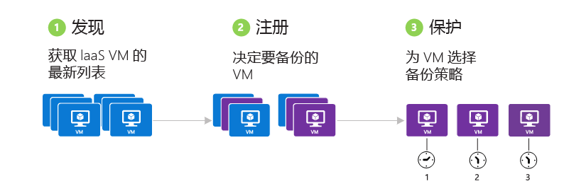
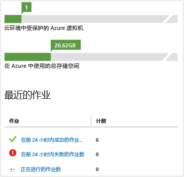

<properties
	pageTitle="Azure 虚拟机备份 - 备份"
	description="了解如何在注册后备份 Azure 虚拟机"
	services="backup"
	documentationCenter=""
	authors="aashishr"
	manager="shreeshd"
	editor=""/>

<tags
	ms.service="backup"
	
	ms.date="07/06/2015"
	wacn.date=""/>

# 备份 Azure 虚拟机
本文是有关备份 Azure 虚拟机的基本指南。在继续之前，请确定符合所有[先决条件](/documentation/articles/backup-azure-vms-introduction)。

备份 Azure 虚拟机的过程包括三个主要步骤：

## 1.发现 Azure 虚拟机
发现过程将在 Azure 上查询订阅中的虚拟机列表和其他信息，例如云服务名称、区域等。

> [AZURE.NOTE]始终应该先运行发现过程。这是为了确保识别任何已添加到订阅的新虚拟机。

### 触发发现过程

1. 导航到备份保管库（位于 Azure 门户的“恢复服务”下），然后单击“注册的项”选项卡。

2. 在下拉菜单中选择工作负荷类型“Azure 虚拟机”，然后单击“选择”按钮。
  

3. 单击页面底部的“发现”按钮。
  

4. 发现过程可能会运行几分钟，同时将以表格显示虚拟机。发现过程运行时，屏幕底部会出现 toast 通知。
  

5. 发现过程完成后，将出现 toast 通知。
  

##  2.注册 Azure 虚拟机
必须先向 Azure 备份服务注册虚拟机才能保护该虚拟机。注册过程有两个主要目标：

1. 将备份扩展外挂到虚拟机中的 VM 代理

2. 将虚拟机与 Azure 备份服务相关联

注册通常是一次性活动。Azure 备份服务将顺利处理备份扩展的升级和修补，完全不需要任何繁琐的用户干预。这可以减轻备份产品经常对用户造成的“代理管理开销”。

### 注册虚拟机

1. 导航到备份保管库（位于 Azure 门户的“恢复服务”下），单击“注册的项”选项卡

2. 在下拉菜单中选择工作负荷类型“Azure 虚拟机”，然后单击“选择”按钮。
  

3. 单击页面底部的“注册”按钮。
  

4. 在“注册项”弹出窗口中，选择你要注册的虚拟机。如果存在两个以上的同名虚拟机，请使用云服务来区别虚拟机。

    可以大规模执行**注册**操作，也就是说，可以一次选择多个要注册的虚拟机。这可以大幅减少每次为了准备要备份的虚拟机而投入的工作量。

    >[AZURE.NOTE]只显示未注册且与备份保管库位于相同区域的虚拟机。

5. 为每一个应该注册的虚拟机创建一个作业。toast 通知将显示此活动的状态。单击“查看作业”转到“作业”页。
  

6. 虚拟机还会出现在注册的项列表中，此外会显示注册操作的状态。
  

7. 操作完成后，门户中的状态会改变以反映已注册状态。
  

## 3.保护：备份 Azure 虚拟机
此步骤包括设置虚拟机的备份和保留策略。若要保护虚拟机，请执行以下步骤：

### 备份 Azure 虚拟机
1. 导航到备份保管库（位于 Azure 门户的“恢复服务”下），然后单击“注册的项”选项卡。
2. 在下拉菜单中选择工作负荷类型“Azure 虚拟机”，然后单击“选择”按钮。
  

3. 单击页面底部的“保护”按钮。

4. 此时将会打开“保护项”向导，让你选择要保护的虚拟机。如果存在两个以上的同名虚拟机，请使用云服务来区别虚拟机。

    可以大规模执行**保护**操作，也就是说，可以一次选择多个要注册的虚拟机。这可以大幅减少为了保护虚拟机而投入的工作量。

    >[AZURE.NOTE]这里只显示了已向 Azure 备份服务正确注册且与备份保管库位于相同区域的虚拟机。

5. 在“保护项”向导的第二个屏幕中，选择备份和保留策略来备份选定的虚拟机。从现有的一组策略中选择，或定义新的策略。

    >[AZURE.NOTE]在预览版中，支持最多 30 天的保留期和每天最多备份一次。

    每个备份保管库可以包含多个备份策略。策略反映了有关如何计划和保留备份的详细信息。例如，一个备份策略可能是每天上午 10:00 备份，另一个备份策略可能是每周上午 6:00 备份。使用多个备份策略可让虚拟机基础结构在计划备份时更有弹性。

    每个备份策略可有多个关联的虚拟机。无论何时，虚拟机只能与一个策略关联。

6. 为每个虚拟机创建一个作业，用于配置保护策略并将虚拟机关联到该策略。单击“作业”选项卡，并选择适当的筛选器来查看“配置保护”作业列表。
  

7. 完成后，虚拟机将受到策略的保护。只有在等到计划的备份时间过后，初始备份才会完成。现在，虚拟机将会出现在“受保护的项”选项卡下，其“保护状态”为“受保护”（等待初始备份）。
    >[AZURE.NOTE]目前无法在配置保护之后立即开始初始备份。

8. 到了计划的时间后，Azure 备份服务将为每个需要备份的虚拟机创建一个备份作业。单击“作业”选项卡查看“备份”作业列表。在执行备份操作的过程中，Azure 备份服务将向虚拟机中的备份扩展发出一条命令，以刷新所有写入并取得一致的快照。
  

9. 完成后，“受保护的项”选项卡中的虚拟机“保护状态”将显示为“受保护”。
  

## 查看备份状态和详细信息
虚拟机受保护后，“仪表板”页摘要中的虚拟机计数也会递增。此外，“仪表板”页还显示过去 24 小时内成功、失败和仍在进行的作业数目。单击任何一个类别可在“任务”页中深入查看该类别。
  

## 排查错误
你可以参考下表中所列的信息，排查使用 Azure 备份时遇到的错误。

| 备份操作 | 错误详细信息 | 解决方法 |
| -------- | -------- | -------|
| 发现 | 无法发现新项 - Microsoft Azure 备份发生内部错误。等候几分钟时间，然后重试操作。 | 在 15 分钟后重试发现过程。
| 发现 | 无法发现新项 - 另一个发现操作正在进行。请等到当前发现操作完成。 | 无 |
| 注册 | Azure VM 角色未处于可安装扩展的状态 - 请检查 VM 是否处于“正在运行”状态。Azure 发现服务扩展需要 VM 处于“正在运行”状态。 | 启动虚拟机，当它处于“正在运行”状态时，重试注册操作。|
| 注册 | 附加到虚拟机的数据磁盘数超过了支持的限制 - 请分离此虚拟机上的某些数据磁盘，然后重试操作。Azure 备份最多支持将 5 个数据磁盘附加到 Azure 虚拟机进行备份。 | 无 |
| 注册 | Microsoft Azure 备份遇到内部错误 - 等候几分钟，然后重试操作。如果问题持续出现，请联系 Microsoft 支持。 | 可能因为不支持以下其中一项配置而发生此错误：<ol><li>Premium LRS <li>多重 NIC <li>负载平衡器</ol> |
| 注册 | 找不到 VM 来宾代理证书 | 请遵循以下说明解决该错误：<ol><li>从[此处](http://go.microsoft.com/fwlink/?LinkID=394789&clcid=0x409)下载最新版本的 VM 代理。确保下载的代理版本为 2.6.1198.718 或更高。<li>在虚拟机中安装 VM 代理。</ol> [了解](#validating-vm-agent-installation)如何检查 VM 代理的版本。 |
| 注册 | 安装代理操作超时，注册失败 | 检查是否支持虚拟机的操作系统版本。 |
| 注册 | 命令执行失败 - 此项上正在进行另一项操作。等到前一项操作完成 | 无 |
| 备份 | 从备份保管库复制 VHD 超时 - 请在几分钟后重试操作。如果问题持续出现，请联系 Microsoft 支持。 | 要复制的数据太多时会发生此问题。请检查你的数据磁盘是否少于 6 个。 |
| 备份 | 快照 VM 子任务超时 - 请在几分钟后重试操作。如果问题持续出现，请联系 Microsoft 支持 | 如果 VM 代理出现问题，或以某种方式阻止了对 Azure 基础结构的网络访问，则会引发此错误。<ul><li>了解如何[调试 VM 代理问题](#Troubleshooting-vm-agent-related-issues) <li>了解如何[调试网络问题](#troubleshooting-networking-issues) </ul> |
| 备份 | 发生内部错误，备份失败 - 请在几分钟后重试操作。如果问题持续出现，请联系 Microsoft 支持 | 发生此错误的原因有 2 个：<ol><li>要复制的数据太多。请检查你的磁盘是否少于 6 个。<li>已删除原始 VM，因此无法进行备份。若要保留已删除 VM 的备份数据但要防止备份错误，请取消保护 VM 并选择保留数据。这样即可停止备份计划以及重复出现的错误消息。 |
| 备份 | 无法在选择的项上安装 Azure 恢复服务扩展 - VM 代理是 Azure 恢复服务扩展的必备组件。请安装 Azure VM 代理并重新启动注册操作 | <ol> <li>检查是否已正确安装 VM 代理。<li>确定已正确设置 VM 配置中的标志。</ol> [详细了解](#validating-vm-agent-installation)如何安装 VM 代理以及如何验证 VM 代理安装。 |
| 备份 | 命令执行失败 - 此项上当前正在进行另一项操作。请等到前一项操作完成，然后重试 | VM 的现有备份或还原作业正在运行，而当现有作业正在运行时，无法启动新的作业。  

### 排查 VM 代理相关问题

#### 设置 VM 代理
通常，VM 代理已存在于从 Azure 库创建的 VM 中。但是，从本地数据中心迁移的虚拟机上未安装 VM 代理。对于此类 VM，必须显式安装 VM 代理。阅读有关[在现有 VM 上安装 VM 代理](http://blogs.msdn.com/b/mast/archive/2014/04/08/install-the-vm-agent-on-an-existing-azure-vm.aspx)的详细信息。

对于 Windows VM：

- 下载并安装[代理 MSI](http://go.microsoft.com/fwlink/?LinkID=394789&clcid=0x409)。你需要有管理员权限才能完成安装。
- [更新 VM 属性](http://blogs.msdn.com/b/mast/archive/2014/04/08/install-the-vm-agent-on-an-existing-azure-vm.aspx)，指明已安装代理。

#### 更新 VM 代理
更新 VM 代理与重新安装 [VM 代理二进制文件](http://go.microsoft.com/fwlink/?LinkID=394789&clcid=0x409)一样简单。但是，需要确保在更新 VM 代理时，没有任何正在运行的备份作业。

#### 验证 VM 代理安装
如何检查 Windows VM 上的 VM 代理版本：

1. 登录 Azure 虚拟机并导航到 *C:\\WindowsAzure\\Packages* 文件夹。你应会发现 WaAppAgent.exe 文件已存在。
2. 右键单击该文件，转到“属性”，然后选择“详细信息”选项卡。“产品版本”字段应为 2.6.1198.718 或更高

### 排查网络问题
与所有扩展一样，备份扩展也需要访问公共 Internet 才能工作。无法访问公共 Internet 可能会出现以下各种情况：

- 扩展安装可能失败
- 备份操作（如磁盘快照）可能失败
- 显示备份操作状态可能失败

[此处](http://blogs.msdn.com/b/mast/archive/2014/06/18/azure-vm-provisioning-stuck-on-quot-installing-extensions-on-virtual-machine-quot.aspx)说明了在哪些情况下需要解析公共 Internet 地址。你需要检查 VNET 的 DNS 配置，并确保可以解析 Azure URI。

正确完成名称解析后，还需要提供对 Azure IP 的访问权限。若要取消阻止对 Azure 基础结构的访问，请执行以下步骤：

1. 获取要列入允许列表的 [Azure 数据中心 IP](https://msdn.microsoft.com/zh-cn/library/azure/dn175718.aspx)。
2. 使用 [New-NetRoute](https://technet.microsoft.com/library/hh826148.aspx) cmdlet 取消阻止 IP。在 Azure VM 上提升权限的 PowerShell 窗口中运行此 cmdlet（以管理员身份运行）。

## 恢复点的一致性
处理备份数据时，客户担心 VM 还原之后的行为。客户经常提出的问题包括：

- 虚拟机启动吗？
- 数据保留在磁盘上吗？会丢失任何数据吗？
- 应用程序能够读取数据吗？数据会损坏吗？
- 应用程序还可辨识数据吗？应用程序读取的数据仍保持自我一致吗？

下表解释了 Azure VM 备份和还原期间发生的一致性类型：

| 一致性 | 基于 VSS | 解释和详细信息 |
|-------------|-----------|---------|
| 应用程序一致性 | 是 | 这是 Microsoft 工作负荷的理想位置，因为可确保：<ol><li> VM *启动*、<li>*不损坏*、<li>*丢失数据*，以及<li>对于使用数据的应用程序，数据将保持一致，因为备份时会使用 VSS 将应用程序纳入考虑。</ol> 卷快照服务 (VSS) 可确保将数据正确写入存储。大多数 Microsoft 工作负荷都有 VSS 写入器，负责执行与数据一致性相关的工作负荷特定操作。例如，Microsoft SQL Server 的 VSS 写入器可确保正确写入事务日志文件和数据库。   对于 Azure VM 备份，获取应用程序一致恢复点意味着备份扩展可以调用 VSS 工作流，并在获取 VM 快照之前*正确*完成。当然，这也意味着会调用 Azure VM 中所有应用程序的 VSS 写入器。  了解 [VSS 的基础知识](http://blogs.technet.com/b/josebda/archive/2007/10/10/the-basics-of-the-volume-shadow-copy-service-vss.aspx)，并详细了解其[工作原理](https://technet.microsoft.com/zh-cn/library/cc785914%28v=ws.10%29.aspx)。 |
| 文件系统一致性 | 是 - 对于 Windows 计算机 | 在两种情况下，恢复点可以做到文件系统一致性：<ul><li>在 Azure 中备份 Linux VM，因为 Linux 没有相当于 VSS 的平台。<li>在 Azure 中备份 Windows VM 期间 VSS 失败。</li></ul> 在这两种情况下，最佳做法是确保：<ol><li>VM *启动*、<li>*不损坏*和<li>不*丢失数据*。</ol> 应用程序需要对还原的数据实施自己的“修复”机制。|
| 崩溃一致性 | 否 | 这种情况相当于计算机“崩溃”（通过软重置或硬重置）。这通常发生于 Azure 虚拟机在备份期间关闭时。对于 Azure 虚拟机备份，获取崩溃一致恢复点意味着 Azure 备份不保证存储媒体上的数据一致 - 无论从操作系统还是应用程序的观点来说都一样。备份时已存在磁盘上的数据才被捕获和备份。   尽管不会保证，但大多数情况下操作系统都会启动。随后通常是运行磁盘检查过程（如 chkdsk）以修复任何损坏错误。内存中任何未完全刷新到磁盘的数据或写入操作都将丢失。如果需要执行数据回滚，应用程序通常会接着执行其自身的验证机制。对于 Azure VM 备份，获取崩溃一致恢复点意味着 Azure 备份不保证存储上的数据一致 - 无论从 OS 还是应用程序的观点来说都一样。这通常发生在备份时 Azure VM 关闭。  例如，如果事务日志中的条目不在数据库中，则数据库软件将执行回滚，直到数据一致。在处理跨多个虚拟磁盘的数据时（例如跨区卷），崩溃一致恢复点不保证数据的正确性。|

## 后续步骤
若要了解有关如何开始使用 Azure 备份的详细信息，请参阅：

- [恢复虚拟机](/documentation/articles/backup-azure-restore-vms)
- [管理虚拟机](/documentation/articles/backup-azure-manage-vms)

<!---HONumber=66-->